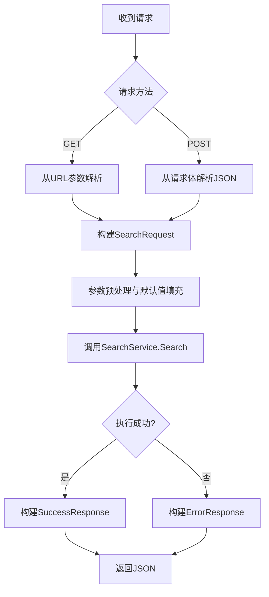

# MCP集成接口

<cite>
**本文档引用的文件**
- [mcp-config.json](file://mcp-config.json)
- [handler.go](file://api/handler.go)
- [config.go](file://config/config.go)
- [search_service.go](file://service/search_service.go)
- [plugin.go](file://plugin/plugin.go)
- [request.go](file://model/request.go)
- [response.go](file://model/response.go)
</cite>

## 目录
1. [简介](#简介)
2. [MCP配置说明](#mcp配置说明)
3. [服务端点与请求响应](#服务端点与请求响应)
4. [MCP客户端集成示例](#mcp客户端集成示例)
5. [请求处理逻辑分析](#请求处理逻辑分析)
6. [安全考虑](#安全考虑)
7. [结论](#结论)

## 简介
本文档详细说明了pansou项目中MCP（Model Context Protocol）集成接口的设计与实现。该接口旨在将pansou强大的搜索能力无缝集成到支持MCP协议的AI模型上下文中，使AI应用能够直接调用pansou的搜索服务，获取实时、准确的搜索结果。文档基于`mcp-config.json`配置文件，解释了关键配置项的含义和配置方法，并深入分析了服务端点、请求/响应格式、核心处理逻辑以及安全机制。

## MCP配置说明
`mcp-config.json`文件是MCP服务的核心配置文件，定义了服务的启动方式、环境变量和运行参数。

```json
{
  "mcpServers": {
    "pansou": {
      "command": "node",
      "args": [
        "C:\\full\\path\\to\\your\\project\\typescript\\dist\\index.js"
      ],
      "env": {
        "PANSOU_SERVER_URL": "http://localhost:8888",
        "REQUEST_TIMEOUT": "60",
        "MAX_RESULTS": "50",
        "DEFAULT_CLOUD_TYPES": "baidu,aliyun,quark,tianyi,uc,mobile,115,pikpak,xunlei,123,magnet,ed2k,others",
        "AUTO_START_BACKEND": "true",
        "DOCKER_MODE": "true",
        "BACKEND_SHUTDOWN_DELAY": "5000",
        "BACKEND_STARTUP_TIMEOUT": "30000",
        "IDLE_TIMEOUT": "300000",
        "ENABLE_IDLE_SHUTDOWN": "true",
        "PROJECT_ROOT_PATH": "C:\\full\\path\\to\\your\\project",
        "ENABLED_PLUGINS": "labi,zhizhen,shandian,duoduo,muou,wanou"
      }
    }
  }
}
```

**关键配置项说明：**

*   **`mcp_server_url`**: 此配置项在`env`对象中以`PANSOU_SERVER_URL`的形式存在。它指定了后端pansou服务的地址和端口。MCP客户端将通过此URL与pansou进行通信。默认值为`http://localhost:8888`，可根据实际部署环境修改。
*   **`mcp_operations`**: 虽然配置文件中没有直接名为`mcp_operations`的字段，但其功能由后端API的端点（如`/search`）和`SearchRequest`结构体中的`SourceType`、`Plugins`等参数共同定义。这些参数决定了MCP服务可以执行的操作类型，例如搜索所有来源、仅搜索Telegram或仅搜索特定插件。
*   **`ENABLED_PLUGINS`**: 这是一个至关重要的配置项，用于指定启用的插件列表。它是一个逗号分隔的字符串，如`"labi,zhizhen,shandian"`。只有在此列表中明确列出的插件才会被加载和使用。这允许用户根据需求定制搜索范围，提高效率和安全性。
*   **`DOCKER_MODE`**: 指定服务的部署模式。设置为`true`时强制使用Docker模式，`false`时使用源码模式。若未设置，则服务会自动检测部署环境。
*   **`AUTO_START_BACKEND`**: 决定是否自动启动后端服务。在开发或集成环境中，设置为`true`可以简化启动流程。
*   **`REQUEST_TIMEOUT`**: 定义了单个请求的超时时间（秒），防止请求无限期挂起。
*   **`MAX_RESULTS`**: 限制返回结果的最大数量，有助于控制响应大小和性能。

**配置方法：**
要修改MCP服务的行为，直接编辑`mcp-config.json`文件中的`env`对象。例如，要禁用所有插件，可将`ENABLED_PLUGINS`设置为空字符串。修改后，重启MCP服务以使配置生效。

**Section sources**
- [mcp-config.json](file://mcp-config.json)

## 服务端点与请求响应
MCP服务通过HTTP端点暴露其功能，主要的搜索端点为`/search`。

### 请求格式
`/search`端点支持GET和POST两种请求方法。

*   **GET请求**: 参数通过URL查询字符串传递。
    *   `kw`: (必填) 搜索关键词。
    *   `channels`: (可选) 指定搜索的Telegram频道，多个频道用逗号分隔。
    *   `plugins`: (可选) 指定搜索的插件列表，多个插件用逗号分隔。
    *   `src`: (可选) 数据来源类型，可选值为`all`（全部）、`tg`（仅Telegram）、`plugin`（仅插件）。
    *   其他参数如`conc`（并发数）、`refresh`（强制刷新）等。

*   **POST请求**: 参数通过JSON格式的请求体传递。
    ```json
    {
      "kw": "搜索关键词",
      "channels": ["channel1", "channel2"],
      "plugins": ["plugin1", "plugin2"],
      "src": "all"
    }
    ```

### 响应格式
服务返回统一的JSON响应格式。

```json
{
  "code": 200,
  "message": "success",
  "data": {
    "total": 10,
    "results": [
      {
        "title": "结果标题",
        "content": "结果内容摘要",
        "datetime": "2023-10-27T10:00:00Z",
        "links": [
          {
            "type": "baidu",
            "url": "https://pan.baidu.com/...",
            "password": "1234"
          }
        ]
      }
    ],
    "merged_by_type": {
      "baidu": [
        "https://pan.baidu.com/...",
        "https://pan.baidu.com/..."
      ],
      "quark": [
        "https://pan.quark.cn/..."
      ]
    }
  }
}
```
响应体中的`data`字段是一个`SearchResponse`对象，包含`total`（总数）、`results`（详细结果列表）和`merged_by_type`（按网盘类型分组的链接）。

### 与主搜索API的调用关系
MCP服务的`/search`端点是pansou主搜索API的前端。当MCP服务接收到请求后，会将其转换为内部的`SearchRequest`对象，并调用`SearchService.Search`方法。该方法会并行地从Telegram和启用的插件中获取数据，然后将结果合并、排序并返回给MCP客户端。

**Diagram sources**
- [handler.go](file://api/handler.go#L25-L206)
- [request.go](file://model/request.go#L3-L13)
- [response.go](file://model/response.go#L38-L42)

**Section sources**
- [handler.go](file://api/handler.go#L25-L206)
- [request.go](file://model/request.go#L3-L13)
- [response.go](file://model/response.go#L38-L42)

## MCP客户端集成示例
以下是一个在AI应用中集成pansou MCP服务的伪代码示例：

```python
# 1. 初始化MCP客户端
mcp_client = MCPClient(
    server_url="http://localhost:8888", # 对应 mcp_server_url
    timeout=60
)

# 2. 注册pansou工具
pansou_tool = MCPTool(
    name="pansou_search",
    description="使用pansou搜索引擎查找网盘资源",
    parameters={
        "type": "object",
        "properties": {
            "keyword": {"type": "string", "description": "搜索关键词"},
            "source_type": {"type": "string", "enum": ["all", "tg", "plugin"], "description": "数据来源"}
        },
        "required": ["keyword"]
    }
)
mcp_client.register_tool(pansou_tool)

# 3. 在AI模型中调用
user_query = "帮我找一下《流浪地球2》的百度网盘资源"
# AI模型决定调用pansou_search工具
tool_call = {
    "name": "pansou_search",
    "arguments": {"keyword": "流浪地球2", "source_type": "all"}
}

# 4. 执行调用并获取结果
try:
    response = mcp_client.execute_tool(tool_call)
    # 处理返回的SearchResponse数据
    if response.data.total > 0:
        print(f"找到 {response.data.total} 个结果")
        for result in response.data.results[:3]: # 只展示前3个
            print(f"- {result.title}")
            for link in result.links:
                print(f"  {link.type}: {link.url} (密码: {link.password})")
except Exception as e:
    print(f"搜索失败: {e}")
```

## 请求处理逻辑分析
`handler.go`文件中的`SearchHandler`函数是处理所有搜索请求的核心。



**核心逻辑步骤：**

1.  **参数解析**: 函数首先根据请求方法（GET或POST）解析参数。GET请求从查询字符串中提取，POST请求则解析JSON请求体。
2.  **请求构建**: 将解析出的参数组装成一个`model.SearchRequest`对象。
3.  **参数预处理**: 对请求参数进行标准化和默认值填充。例如，如果`SourceType`为空，则默认为`"all"`；如果`ResultType`为`"merge"`，则内部转换为`"merged_by_type"`以兼容处理逻辑。
4.  **互斥逻辑处理**: 实现了关键的参数互斥规则。当`src=tg`时，会忽略`plugins`参数；当`src=plugin`时，会忽略`channels`参数。这确保了请求的语义清晰。
5.  **服务调用**: 调用`searchService.Search`方法执行实际的搜索。该方法会根据`SourceType`和`Plugins`参数，决定是搜索Telegram、插件还是两者都搜索。
6.  **结果返回**: 将`SearchService`返回的结果封装成`model.SearchResponse`，并序列化为JSON返回给客户端。

**Diagram sources**
- [handler.go](file://api/handler.go#L25-L206)

**Section sources**
- [handler.go](file://api/handler.go#L25-L206)
- [search_service.go](file://service/search_service.go#L350-L509)

## 安全考虑
pansou的MCP集成在设计上考虑了以下安全方面：

*   **输入验证**: `SearchRequest`结构体使用了`binding:"required"`标签，确保`kw`（关键词）是必填项。`handler.go`中的代码也对`ext`等参数进行了JSON格式验证，防止注入攻击。
*   **配置隔离**: 通过`ENABLED_PLUGINS`配置项，系统管理员可以严格控制哪些插件是可用的。这限制了潜在的攻击面，防止恶意或不稳定的插件被调用。
*   **并发与超时控制**: `SearchService`使用`sync.WaitGroup`和goroutine来管理并发搜索，并设置了`PluginTimeout`和`AsyncResponseTimeout`，防止某个插件或请求长时间占用资源，导致服务拒绝。
*   **环境隔离**: `mcp-config.json`中的`DOCKER_MODE`和`AUTO_START_BACKEND`等配置允许服务在Docker容器等隔离环境中运行，增加了安全性。
*   **速率限制**: 虽然当前代码中未直接体现，但可以通过在`router.go`中集成`gin`的中间件（如`middleware.go`可能提供的）来实现基于IP或令牌的速率限制，防止滥用。

## 结论
pansou的MCP集成接口提供了一种强大而灵活的方式，将先进的搜索能力嵌入到AI应用中。通过清晰的`mcp-config.json`配置、标准化的HTTP API和健壮的后端处理逻辑，开发者可以轻松地在自己的AI模型上下文中集成pansou服务。本文档详细阐述了配置、集成和内部工作原理，为安全、高效地使用该接口提供了全面的指导。