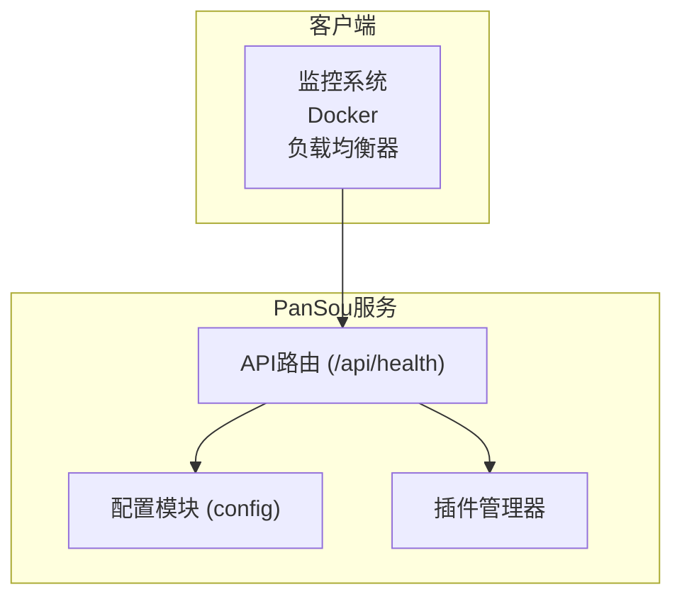
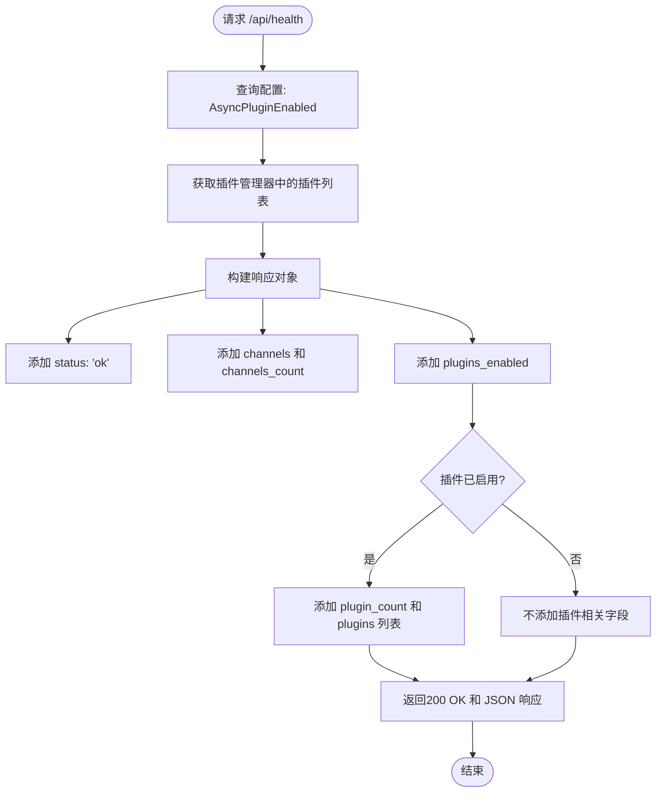
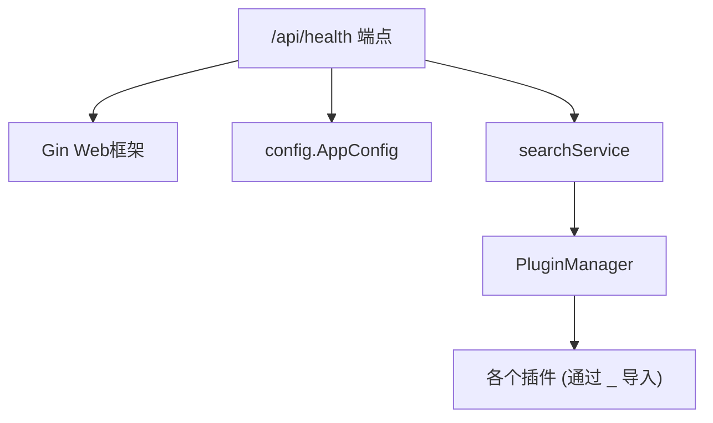

# 健康检查API

<cite>
**本文档中引用的文件**  
- [handler.go](file://api/handler.go)
- [router.go](file://api/router.go)
- [main.go](file://main.go)
- [config.go](file://config/config.go)
</cite>

## 目录
1. [简介](#简介)
2. [核心组件](#核心组件)
3. [架构概述](#架构概述)
4. [详细组件分析](#详细组件分析)
5. [依赖分析](#依赖分析)
6. [性能考虑](#性能考虑)
7. [故障排除指南](#故障排除指南)
8. [结论](#结论)

## 简介
本API文档详细说明了PanSou服务中`GET /api/health`端点的设计与实现。该接口用于监控服务的运行状态和可用性，是Docker容器健康检查和负载均衡器探活的核心机制。文档将深入解析其响应格式、典型应用场景、健康检查逻辑以及在异常情况下的错误处理机制。

## 核心组件
健康检查功能主要由API路由层和配置模块协同实现。`router.go`文件定义了`/api/health`端点的路由和处理逻辑，而`config.go`提供了判断插件是否启用的配置依据。

**Section sources**
- [router.go](file://api/router.go#L10-L69)
- [config.go](file://config/config.go)

## 架构概述
健康检查接口是PanSou服务对外暴露的一个轻量级、无状态的监控端点。它不依赖任何外部数据库或后端服务，仅查询内存中的配置和已注册的插件列表，确保了其高可用性和低延迟。

**Diagram sources**
- [router.go](file://api/router.go#L10-L69)
- [main.go](file://main.go#L10-L355)

## 详细组件分析

### 健康检查端点分析
`/api/health`端点在`router.go`中通过一个内联的Gin处理函数实现。该函数不进行任何复杂的健康检查（如数据库连接、外部API调用），而是返回一个预设的“ok”状态，表明Web服务器进程本身是健康的。

#### 响应格式与逻辑
该接口的响应格式为JSON，包含以下关键字段：
- `status`: 固定为`"ok"`，表示服务基本可用。
- `plugins_enabled`: 布尔值，表示异步插件功能是否在配置中启用。
- `channels`: 当前配置的默认TG频道列表。
- `channels_count`: 频道数量。
- **条件性字段**：只有当`plugins_enabled`为`true`时，才会包含`plugin_count`和`plugins`（已成功注册并启用的插件名称列表）。

此设计逻辑确保了响应的简洁性，同时提供了足够的信息供外部系统（如前端工具）判断服务的功能完整性。

**Diagram sources**
- [router.go](file://api/router.go#L46-L69)

**Section sources**
- [router.go](file://api/router.go#L46-L69)

### 健康检查逻辑分析
根据代码分析，当前的健康检查逻辑**并未检查任何后端依赖**（如缓存、网络连接或插件的运行时状态）。它的核心逻辑是：

1.  **进程存活检查**：只要Web服务器进程正在运行并能处理HTTP请求，就会返回200。
2.  **配置状态检查**：检查`config.AppConfig.AsyncPluginEnabled`标志，以确定插件功能是否被激活。
3.  **插件注册检查**：通过`searchService.GetPluginManager().GetPlugins()`获取当前已成功注册到插件管理器的插件列表。这依赖于`main.go`中通过`_`空导入触发的`init()`函数。

这意味着，即使某个插件在运行时出现故障，只要其`init()`函数成功执行并完成注册，它仍会出现在健康检查的响应列表中。真正的插件健康检查需要在插件内部实现。

**Section sources**
- [router.go](file://api/router.go#L46-L69)
- [main.go](file://main.go#L10-L355)

## 依赖分析
健康检查端点的实现依赖于以下核心组件：

**Diagram sources**
- [router.go](file://api/router.go#L10-L69)
- [main.go](file://main.go#L10-L355)

## 性能考虑
由于健康检查接口不进行任何I/O操作或复杂计算，其响应时间极短，对系统性能影响微乎其微。这使其非常适合被频繁调用的监控场景。

## 故障排除指南
目前，该健康检查接口**不会返回非200状态码**。无论系统处于何种状态（即使关键组件初始化失败），只要Web服务器进程启动成功，`/api/health`端点就会返回200 OK。

*   **如果接口无法访问**：这通常意味着Web服务器进程未启动、端口被占用或防火墙阻止了连接。应检查`main.go`中的服务器启动日志。
*   **如果`status`不是`ok`**：根据当前代码，`status`字段是硬编码的`"ok"`，因此不会出现其他值。如果未来需要扩展，应在此处说明。
*   **如果插件未出现在列表中**：检查`main.go`中的空导入语句是否包含了目标插件，并确认`ENABLED_PLUGINS`环境变量的配置是否正确。

**Section sources**
- [router.go](file://api/router.go#L46-L69)
- [main.go](file://main.go#L145-L190)

## 结论
`GET /api/health`端点是一个简单而有效的服务存活探针。它通过返回一个包含基本服务信息和功能状态的JSON响应，为Docker和负载均衡器提供了可靠的健康判断依据。虽然当前逻辑不检查后端依赖，但其轻量级的特性保证了高可用性。未来的改进可以考虑增加对关键依赖（如主缓存）的简单检查，以提供更全面的健康视图。