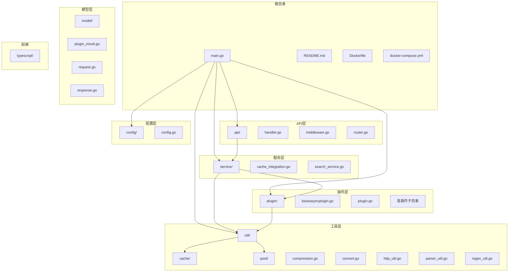
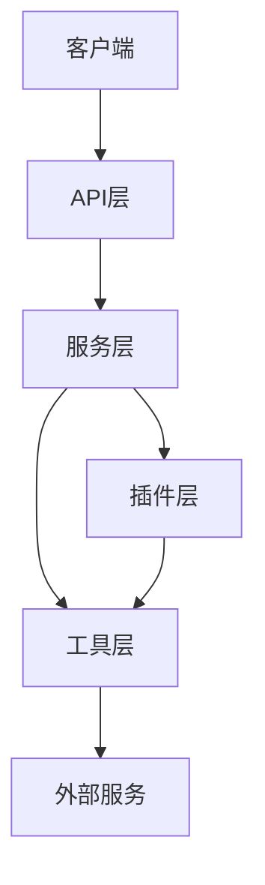
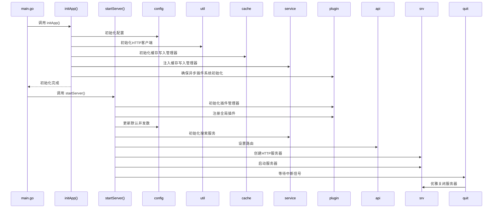
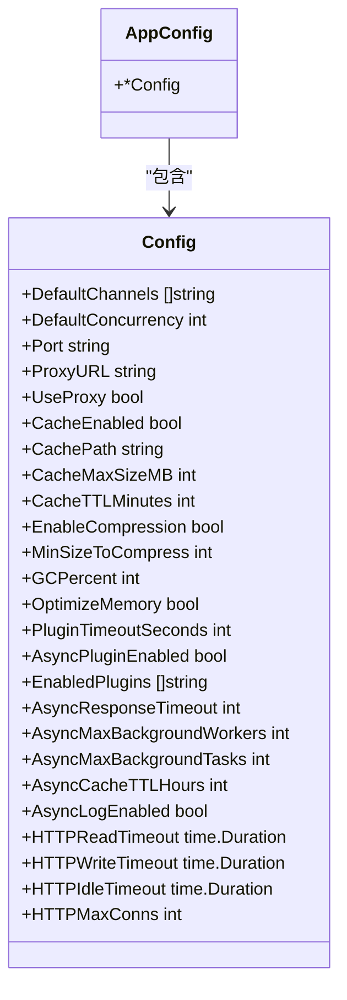
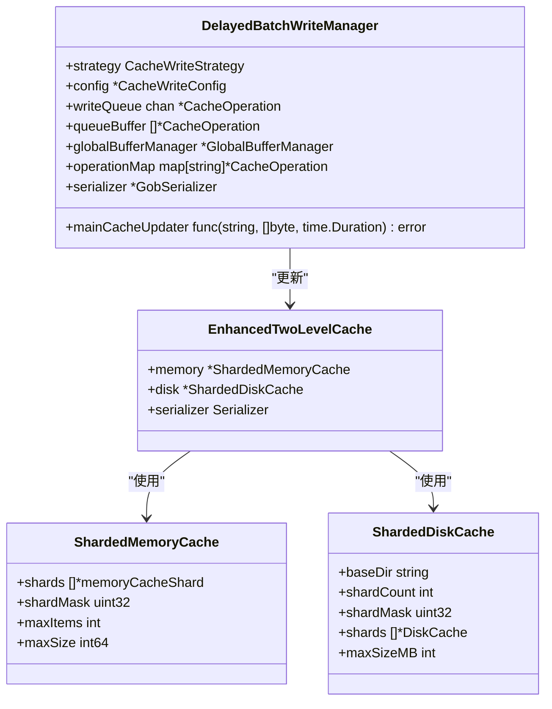
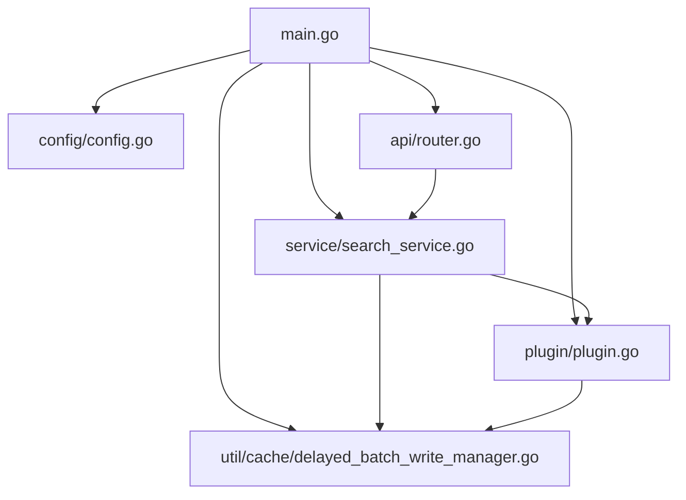

# 开发者指南

<cite>
**本文档引用的文件**   
- [main.go](file://main.go)
- [README.md](file://README.md)
- [config/config.go](file://config/config.go)
- [api/router.go](file://api/router.go)
- [service/search_service.go](file://service/search_service.go)
- [plugin/plugin.go](file://plugin/plugin.go)
- [plugin/baseasyncplugin.go](file://plugin/baseasyncplugin.go)
- [util/cache/delayed_batch_write_manager.go](file://util/cache/delayed_batch_write_manager.go)
- [util/cache/enhanced_two_level_cache.go](file://util/cache/enhanced_two_level_cache.go)
</cite>

## 目录
1. [简介](#简介)
2. [项目结构](#项目结构)
3. [核心组件](#核心组件)
4. [架构概述](#架构概述)
5. [详细组件分析](#详细组件分析)
6. [依赖分析](#依赖分析)
7. [性能考虑](#性能考虑)
8. [故障排除指南](#故障排除指南)
9. [结论](#结论)
10. [附录](#附录)（如有必要）

## 简介
PanSou 是一个高性能的网盘资源搜索 API 服务，支持 Telegram 搜索和自定义插件搜索。本指南旨在为贡献者提供全面的开发指导，涵盖本地开发环境搭建、测试运行、代码调试、项目结构理解、启动流程解析、调试技巧以及代码风格规范等方面。

## 项目结构
该项目采用模块化设计，各目录职责明确，便于开发者快速定位关键文件。

**图源**
- [main.go](file://main.go#L1-L355)
- [api/router.go](file://api/router.go#L1-L70)
- [service/search_service.go](file://service/search_service.go#L1-L799)
- [plugin/plugin.go](file://plugin/plugin.go#L1-L175)
- [util/cache/delayed_batch_write_manager.go](file://util/cache/delayed_batch_write_manager.go#L1-L980)

**本节来源**
- [main.go](file://main.go#L1-L355)
- [README.md](file://README.md#L1-L407)

## 核心组件
项目的核心组件包括主应用入口 `main.go`、配置管理 `config.go`、API 路由 `router.go`、搜索服务 `search_service.go` 以及插件系统 `plugin.go` 和 `baseasyncplugin.go`。这些组件协同工作，实现了高性能的搜索功能。

**本节来源**
- [main.go](file://main.go#L1-L355)
- [config/config.go](file://config/config.go#L1-L515)
- [api/router.go](file://api/router.go#L1-L70)
- [service/search_service.go](file://service/search_service.go#L1-L799)
- [plugin/plugin.go](file://plugin/plugin.go#L1-L175)

## 架构概述
PanSou 采用分层架构，从上至下分为 API 层、服务层、插件层和工具层。API 层负责接收请求和返回响应，服务层处理核心业务逻辑，插件层提供可扩展的搜索来源，工具层提供通用功能支持。

**图源**
- [main.go](file://main.go#L1-L355)
- [api/router.go](file://api/router.go#L1-L70)
- [service/search_service.go](file://service/search_service.go#L1-L799)
- [plugin/plugin.go](file://plugin/plugin.go#L1-L175)

## 详细组件分析

### 主应用启动流程分析
`main.go` 文件是应用的入口点，其启动流程包括初始化应用和启动服务器两个主要步骤。

**图源**
- [main.go](file://main.go#L1-L355)

**本节来源**
- [main.go](file://main.go#L1-L355)

### 配置管理分析
`config/config.go` 文件负责管理应用的所有配置项，包括端口、代理、缓存、压缩、GC、插件等。配置项可以通过环境变量进行覆盖。

**图源**
- [config/config.go](file://config/config.go#L1-L515)

**本节来源**
- [config/config.go](file://config/config.go#L1-L515)

### 缓存系统分析
项目采用两级缓存机制，包括内存缓存和磁盘缓存，以提升性能和数据持久性。

**图源**
- [util/cache/enhanced_two_level_cache.go](file://util/cache/enhanced_two_level_cache.go#L1-L164)
- [util/cache/sharded_memory_cache.go](file://util/cache/sharded_memory_cache.go#L1-L389)
- [util/cache/sharded_disk_cache.go](file://util/cache/sharded_disk_cache.go#L1-L177)
- [util/cache/delayed_batch_write_manager.go](file://util/cache/delayed_batch_write_manager.go#L1-L980)

**本节来源**
- [util/cache/enhanced_two_level_cache.go](file://util/cache/enhanced_two_level_cache.go#L1-L164)
- [util/cache/delayed_batch_write_manager.go](file://util/cache/delayed_batch_write_manager.go#L1-L980)

## 依赖分析
项目依赖关系清晰，`main.go` 作为入口依赖所有其他模块，各模块之间通过接口和函数调用进行通信。

**图源**
- [main.go](file://main.go#L1-L355)
- [api/router.go](file://api/router.go#L1-L70)
- [service/search_service.go](file://service/search_service.go#L1-L799)
- [plugin/plugin.go](file://plugin/plugin.go#L1-L175)
- [util/cache/delayed_batch_write_manager.go](file://util/cache/delayed_batch_write_manager.go#L1-L980)

**本节来源**
- [main.go](file://main.go#L1-L355)

## 性能考虑
项目在设计时充分考虑了性能优化，包括并发搜索、工作池管理、二级缓存、延迟批量写入等机制。通过合理配置环境变量，可以进一步优化性能。

## 故障排除指南
当遇到问题时，首先检查 `README.md` 中的配置说明和常见问题。可以通过查看日志输出、使用调试工具、检查环境变量等方式进行排查。

**本节来源**
- [README.md](file://README.md#L1-L407)

## 结论
PanSou 项目结构清晰，组件职责明确，具备良好的可扩展性和高性能。通过遵循本指南，开发者可以快速上手并贡献代码。

## 附录
### 环境变量参考
| 环境变量 | 描述 | 默认值 |
|----------|------|--------|
| PORT | 服务端口 | 8888 |
| PROXY | SOCKS5代理 | 无 |
| CHANNELS | 默认搜索的TG频道 | tgsearchers3 |
| ENABLED_PLUGINS | 指定启用插件 | 无 |
| CONCURRENCY | 并发搜索数 | 自动计算 |
| CACHE_TTL | 缓存有效期（分钟） | 60 |
| CACHE_MAX_SIZE | 最大缓存大小(MB) | 100 |
| PLUGIN_TIMEOUT | 插件超时时间(秒) | 30 |
| ASYNC_RESPONSE_TIMEOUT | 快速响应超时(秒) | 4 |