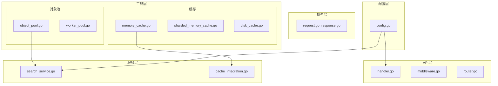
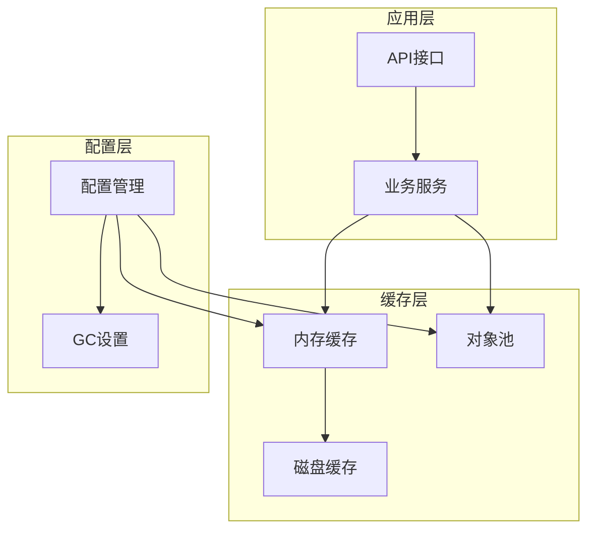
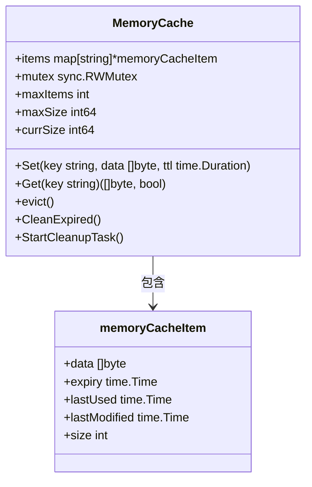
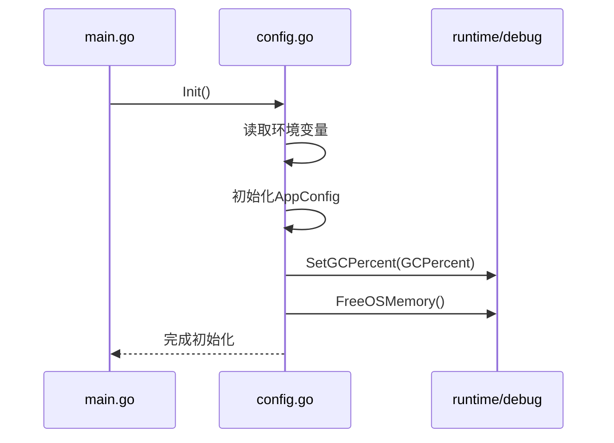
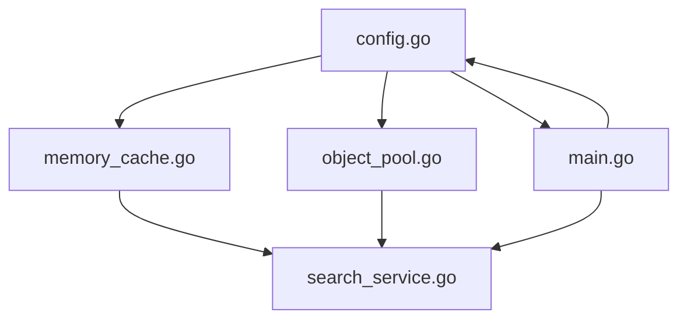

# GC调优与内存管理

<cite>
**本文档引用的文件**   
- [memory_cache.go](file://util/cache/memory_cache.go)
- [object_pool.go](file://util/pool/object_pool.go)
- [config.go](file://config/config.go)
- [main.go](file://main.go)
</cite>

## 目录
1. [引言](#引言)
2. [项目结构](#项目结构)
3. [核心组件](#核心组件)
4. [架构概述](#架构概述)
5. [详细组件分析](#详细组件分析)
6. [依赖分析](#依赖分析)
7. [性能考量](#性能考量)
8. [故障排除指南](#故障排除指南)
9. [结论](#结论)

## 引言
本文档系统性地探讨Go运行时GC对服务性能的影响，结合项目中缓存和对象池的实现，说明如何通过减少堆分配来降低GC频率和停顿时间。分析GOGC环境变量与config.go中内存相关参数的联动效应。提供基于pprof的内存剖析方法，指导开发者识别内存热点和潜在泄漏点。给出生产环境下的GC调优实践建议，包括监控指标（如GC pause time、heap size）的采集与告警设置。

## 项目结构
本项目采用分层架构设计，主要分为API层、配置层、模型层、插件层、服务层和工具层。其中，内存管理相关的核心组件位于`util/cache`和`util/pool`目录下，配置管理位于`config`目录下。



**图示来源**
- [memory_cache.go](file://util/cache/memory_cache.go)
- [object_pool.go](file://util/pool/object_pool.go)
- [config.go](file://config/config.go)

**本节来源**
- [memory_cache.go](file://util/cache/memory_cache.go)
- [object_pool.go](file://util/pool/object_pool.go)
- [config.go](file://config/config.go)

## 核心组件
项目中的核心内存管理组件包括内存缓存（MemoryCache）和对象池（Object Pool）。MemoryCache通过LRU驱逐策略和定期清理过期项来管理内存使用，而Object Pool通过复用对象来减少内存分配和GC压力。

**本节来源**
- [memory_cache.go](file://util/cache/memory_cache.go#L17-L23)
- [object_pool.go](file://util/pool/object_pool.go#L9-L13)

## 架构概述
系统采用两级缓存架构，结合内存缓存和磁盘缓存，通过对象池减少频繁的对象创建和销毁。配置系统通过环境变量动态调整GC行为和缓存参数，实现灵活的内存管理。



**图示来源**
- [memory_cache.go](file://util/cache/memory_cache.go)
- [object_pool.go](file://util/pool/object_pool.go)
- [config.go](file://config/config.go)

## 详细组件分析

### 内存缓存分析
MemoryCache组件通过限制最大项数和最大内存大小来控制内存使用，并采用LRU策略驱逐最久未使用的项。定期清理任务每5分钟执行一次，清除过期的缓存项。



**图示来源**
- [memory_cache.go](file://util/cache/memory_cache.go#L17-L23)

**本节来源**
- [memory_cache.go](file://util/cache/memory_cache.go#L17-L23)

### 对象池分析
对象池组件通过sync.Pool实现，为Link、SearchResult和MergedLink等频繁使用的对象提供复用机制。获取对象时从池中取出并重置状态，释放时清空字段后放回池中。

```mermaid
classDiagram
class LinkPool {
+New func() interface{}
}
class SearchResultPool {
+New func() interface{}
}
class MergedLinkPool {
+New func() interface{}
}
class Link {
+Type string
+URL string
+Password string
}
class SearchResult {
+MessageID string
+Channel string
+Title string
+Content string
+Links []Link
+Tags []string
}
class MergedLink {
+URL string
+Password string
+Note string
}
LinkPool --> Link : 创建
SearchResultPool --> SearchResult : 创建
MergedLinkPool --> MergedLink : 创建
```

**图示来源**
- [object_pool.go](file://util/pool/object_pool.go#L9-L13)

**本节来源**
- [object_pool.go](file://util/pool/object_pool.go#L9-L13)

### 配置管理分析
配置系统通过环境变量初始化各项参数，包括GC百分比、缓存大小、连接数等。GC设置在应用启动时通过debug.SetGCPercent应用，并可根据需要释放操作系统内存。



**图示来源**
- [config.go](file://config/config.go#L54-L98)

**本节来源**
- [config.go](file://config/config.go#L54-L98)

## 依赖分析
各组件之间的依赖关系清晰，配置系统为其他组件提供参数支持，缓存和对象池被业务服务层直接使用。通过合理的依赖管理，实现了组件间的松耦合。



**图示来源**
- [config.go](file://config/config.go)
- [memory_cache.go](file://util/cache/memory_cache.go)
- [object_pool.go](file://util/pool/object_pool.go)

**本节来源**
- [config.go](file://config/config.go)
- [memory_cache.go](file://util/cache/memory_cache.go)
- [object_pool.go](file://util/pool/object_pool.go)

## 性能考量
通过合理配置GC百分比和使用对象池，可以显著降低GC频率和停顿时间。建议在生产环境中监控GC pause time和heap size等指标，并设置相应的告警阈值。

**本节来源**
- [config.go](file://config/config.go#L504-L513)
- [object_pool.go](file://util/pool/object_pool.go#L38-L43)

## 故障排除指南
当遇到内存问题时，可使用pprof工具进行内存剖析，识别内存热点和潜在泄漏点。重点关注内存分配频繁的函数和长时间存活的对象。

**本节来源**
- [main.go](file://main.go#L86-L118)
- [config.go](file://config/config.go#L504-L513)

## 结论
通过结合使用内存缓存、对象池和合理的GC配置，可以有效优化Go应用的内存使用，降低GC对服务性能的影响。建议根据实际负载情况动态调整相关参数，并持续监控关键性能指标。