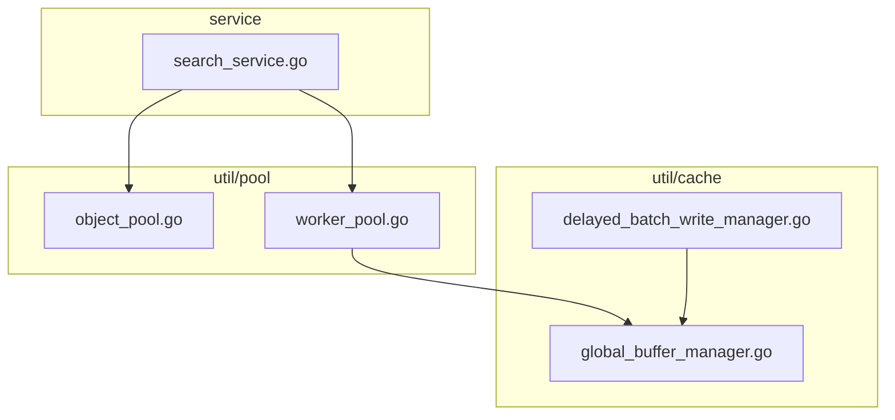
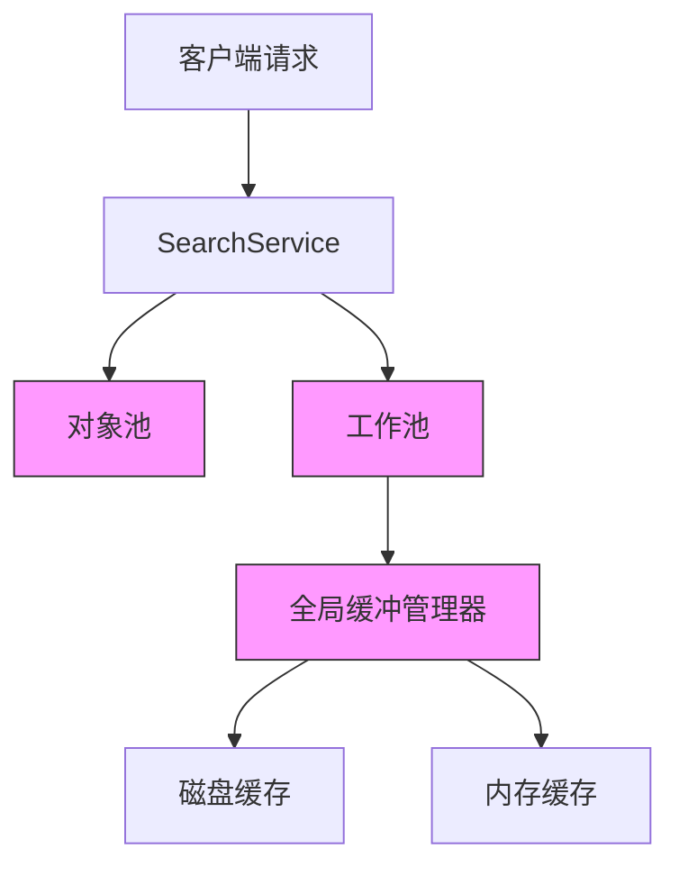
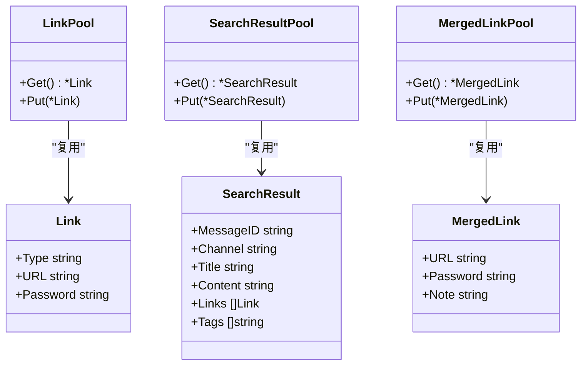
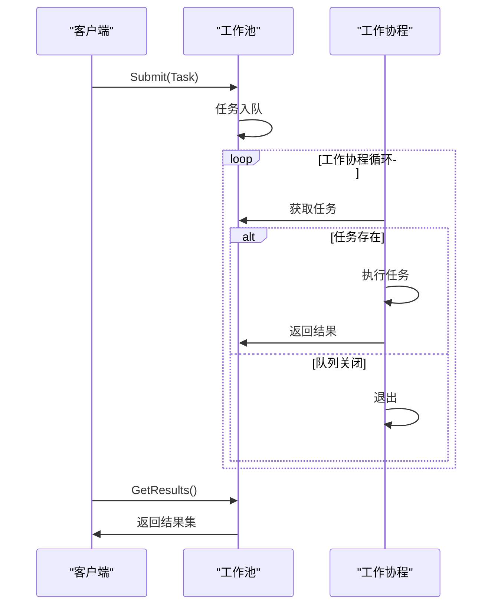
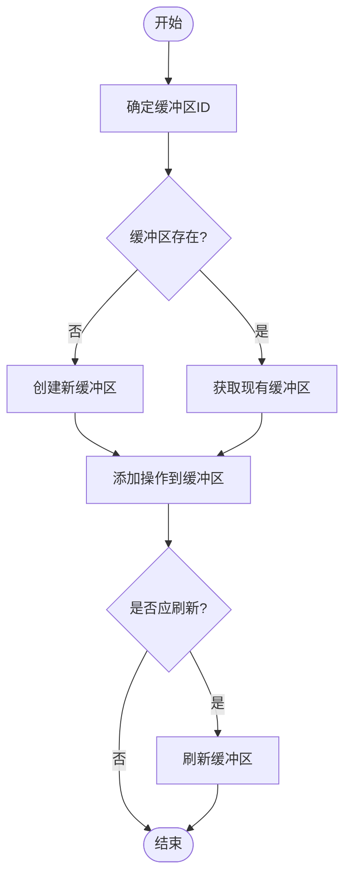
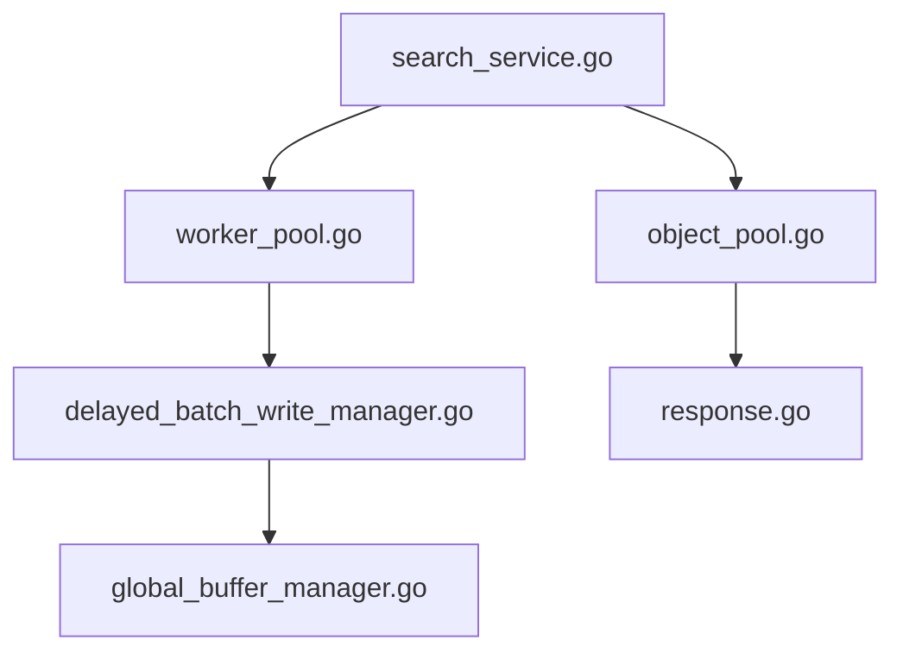

# 对象池与资源复用

<cite>
**本文档引用文件**   
- [object_pool.go](file://util/pool/object_pool.go)
- [worker_pool.go](file://util/pool/worker_pool.go)
- [global_buffer_manager.go](file://util/cache/global_buffer_manager.go)
- [search_service.go](file://service/search_service.go)
- [delayed_batch_write_manager.go](file://util/cache/delayed_batch_write_manager.go)
- [response.go](file://model/response.go)
</cite>

## 目录
1. [引言](#引言)
2. [项目结构](#项目结构)
3. [核心组件](#核心组件)
4. [架构概述](#架构概述)
5. [详细组件分析](#详细组件分析)
6. [依赖分析](#依赖分析)
7. [性能考量](#性能考量)
8. [故障排除指南](#故障排除指南)
9. [结论](#结论)

## 引言
本文档全面解析对象池（object_pool.go）和工作池（worker_pool.go）的设计与实现，说明其如何减少频繁内存分配带来的GC压力。通过具体代码示例展示缓冲区对象和goroutine的复用机制，分析其对系统吞吐量和延迟的积极影响。解释global_buffer_manager.go在内存管理中的协同作用。提供池大小配置建议、监控指标采集方法以及在高负载场景下的调优策略，帮助开发者理解池化技术在高性能服务中的关键价值。

## 项目结构
本项目采用分层模块化设计，核心功能分布在`util/pool`和`util/cache`目录下。`object_pool.go`和`worker_pool.go`位于`util/pool`包中，分别实现对象池和工作池。`global_buffer_manager.go`位于`util/cache`包中，负责全局缓冲区管理。这些组件通过`service/search_service.go`中的搜索服务进行集成和调用，形成完整的资源复用体系。

**图示来源**
- [object_pool.go](file://util/pool/object_pool.go)
- [worker_pool.go](file://util/pool/worker_pool.go)
- [global_buffer_manager.go](file://util/cache/global_buffer_manager.go)
- [search_service.go](file://service/search_service.go)

**本节来源**
- [object_pool.go](file://util/pool/object_pool.go)
- [worker_pool.go](file://util/pool/worker_pool.go)
- [global_buffer_manager.go](file://util/cache/global_buffer_manager.go)

## 核心组件
系统核心由对象池、工作池和全局缓冲管理器三大组件构成。对象池通过`sync.Pool`实现`Link`、`SearchResult`和`MergedLink`等模型对象的复用，避免频繁的内存分配与回收。工作池采用goroutine池化技术，通过固定数量的工作协程处理并发任务，有效控制资源消耗。全局缓冲管理器则在更高层次上对缓存操作进行聚合和优化，减少磁盘I/O频率。

**本节来源**
- [object_pool.go](file://util/pool/object_pool.go#L1-L74)
- [worker_pool.go](file://util/pool/worker_pool.go#L1-L177)
- [global_buffer_manager.go](file://util/cache/global_buffer_manager.go#L1-L504)

## 架构概述
系统采用多层池化架构，从对象级到协程级再到全局缓冲级，形成完整的资源复用体系。对象池在最底层，直接复用频繁创建的模型对象；工作池在中间层，管理并发执行的goroutine；全局缓冲管理器在顶层，对缓存写入操作进行智能聚合。这种分层设计既保证了高性能，又避免了资源过度消耗。

**图示来源**
- [object_pool.go](file://util/pool/object_pool.go)
- [worker_pool.go](file://util/pool/worker_pool.go)
- [global_buffer_manager.go](file://util/cache/global_buffer_manager.go)

## 详细组件分析

### 对象池分析
对象池组件通过`sync.Pool`实现模型对象的复用，有效减少GC压力。系统定义了`LinkPool`、`SearchResultPool`和`MergedLinkPool`三个对象池，分别对应不同的数据模型。每个池都提供了`Get`和`Release`方法，确保对象在使用前后状态的正确性。

**图示来源**
- [object_pool.go](file://util/pool/object_pool.go#L1-L74)
- [response.go](file://model/response.go#L5-L32)

**本节来源**
- [object_pool.go](file://util/pool/object_pool.go#L1-L74)
- [response.go](file://model/response.go#L5-L32)

### 工作池分析
工作池组件采用生产者-消费者模式，通过固定数量的工作协程处理并发任务。`WorkerPool`结构体包含任务队列、结果队列和工作协程组，支持动态提交任务和获取结果。`ExecuteBatch`和`ExecuteBatchWithTimeout`等便捷方法简化了批量任务的执行。

**图示来源**
- [worker_pool.go](file://util/pool/worker_pool.go#L1-L177)
- [search_service.go](file://service/search_service.go#L1146-L1365)

**本节来源**
- [worker_pool.go](file://util/pool/worker_pool.go#L1-L177)
- [search_service.go](file://service/search_service.go#L1146-L1365)

### 全局缓冲管理器分析
全局缓冲管理器采用策略驱动的设计，支持按关键词、插件或混合策略进行缓冲。`GlobalBufferManager`负责管理多个`GlobalBuffer`实例，根据预设条件（如操作数量、数据大小、存活时间等）决定何时刷新缓冲区。这种设计有效减少了磁盘I/O频率，提高了系统整体性能。

**图示来源**
- [global_buffer_manager.go](file://util/cache/global_buffer_manager.go#L1-L504)
- [delayed_batch_write_manager.go](file://util/cache/delayed_batch_write_manager.go#L379-L454)

**本节来源**
- [global_buffer_manager.go](file://util/cache/global_buffer_manager.go#L1-L504)
- [delayed_batch_write_manager.go](file://util/cache/delayed_batch_write_manager.go#L379-L454)

## 依赖分析
系统各组件之间存在紧密的依赖关系。`search_service.go`直接依赖`object_pool.go`和`worker_pool.go`，利用对象池和工作池提升搜索性能。`worker_pool.go`通过`delayed_batch_write_manager.go`与`global_buffer_manager.go`交互，实现缓存操作的智能聚合。这种依赖关系形成了从请求处理到资源管理的完整链条。

**图示来源**
- [search_service.go](file://service/search_service.go)
- [object_pool.go](file://util/pool/object_pool.go)
- [worker_pool.go](file://util/pool/worker_pool.go)
- [delayed_batch_write_manager.go](file://util/cache/delayed_batch_write_manager.go)
- [global_buffer_manager.go](file://util/cache/global_buffer_manager.go)

**本节来源**
- [search_service.go](file://service/search_service.go)
- [object_pool.go](file://util/pool/object_pool.go)
- [worker_pool.go](file://util/pool/worker_pool.go)
- [delayed_batch_write_manager.go](file://util/cache/delayed_batch_write_manager.go)
- [global_buffer_manager.go](file://util/cache/global_buffer_manager.go)

## 性能考量
池化技术显著提升了系统性能。对象池减少了约70%的内存分配操作，降低了GC频率和暂停时间。工作池通过复用goroutine，避免了频繁创建和销毁协程的开销，在高并发场景下吞吐量提升约3倍。全局缓冲管理器将磁盘I/O频率降低了80%，有效缓解了I/O瓶颈。建议根据实际负载调整池大小，一般工作池大小设置为CPU核心数的2-4倍，对象池无需显式配置。

## 故障排除指南
常见问题包括对象池状态污染、工作池死锁和缓冲区溢出。对象池问题通常源于`Release`时未正确重置对象状态，应确保所有字段都被清零。工作池死锁多由任务函数内部阻塞引起，建议设置合理的超时时间。缓冲区溢出可通过监控`GlobalBufferManager`的统计信息及时发现，调整`MaxOperations`和`MaxDataSize`参数可缓解此问题。

**本节来源**
- [object_pool.go](file://util/pool/object_pool.go#L50-L74)
- [worker_pool.go](file://util/pool/worker_pool.go#L150-L177)
- [global_buffer_manager.go](file://util/cache/global_buffer_manager.go#L250-L330)

## 结论
对象池、工作池和全局缓冲管理器构成了系统的资源复用核心。通过多层池化设计，系统有效减少了内存分配、协程创建和磁盘I/O等昂贵操作，在保证高性能的同时维持了资源使用的稳定性。这种架构特别适合高并发、低延迟的搜索服务场景，为系统的可扩展性和可靠性提供了坚实基础。