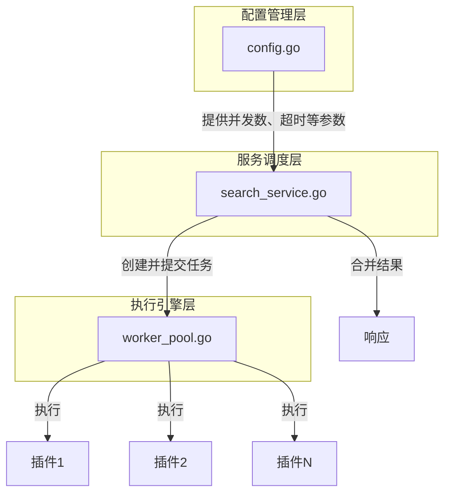
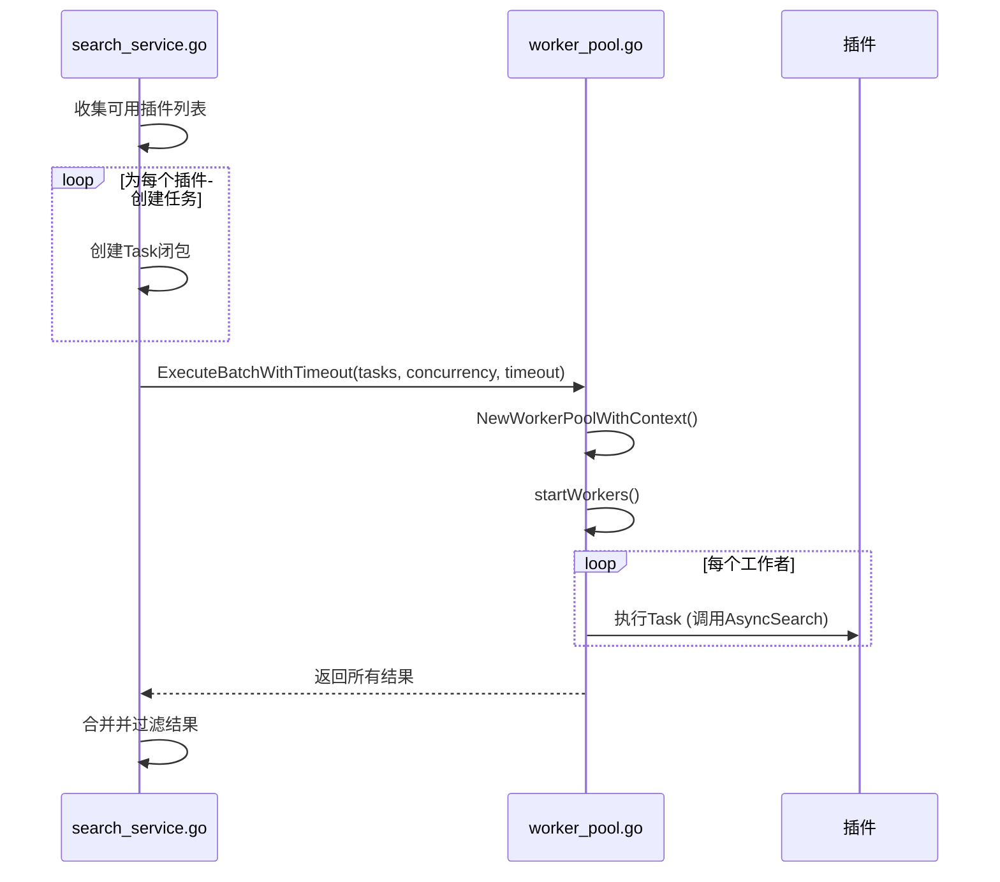

# 并发控制

<cite>
**本文档引用的文件**
- [search_service.go](file://service/search_service.go)
- [worker_pool.go](file://util/pool/worker_pool.go)
- [config.go](file://config/config.go)
</cite>

## 目录
1. [引言](#引言)
2. [并发控制架构概览](#并发控制架构概览)
3. [核心并发机制分析](#核心并发机制分析)
4. [配置参数与系统稳定性](#配置参数与系统稳定性)
5. [高并发场景调优建议](#高并发场景调优建议)
6. [并发模式最佳实践](#并发模式最佳实践)
7. [性能对比与总结](#性能对比与总结)

## 引言
PanSou 项目通过精心设计的并发控制机制，实现了在高并发场景下的高效、稳定搜索服务。本文档深入分析其核心组件，重点探讨 `search_service.go` 中如何利用 `errgroup` 模式并发调用多个搜索插件，以及 `worker_pool.go` 实现的 goroutine 池如何有效控制并发数量，防止资源耗尽。同时，结合 `config.go` 中的 `MaxGoroutines` 等配置参数，阐述其对系统稳定性和响应延迟的影响，并提供高并发场景下的调优建议。

## 并发控制架构概览
PanSou 的并发控制体系由三个核心部分构成：**配置管理层**、**工作池执行层**和**服务调度层**。`config.go` 定义了系统级的并发策略和资源限制，为整个系统提供安全边界。`worker_pool.go` 实现了一个可复用的、带超时控制的 goroutine 池，作为底层的并发执行引擎。`search_service.go` 则是调度中心，它根据配置动态创建工作池，将搜索任务（如调用不同插件）提交到池中并行执行，最终合并结果。



**Diagram sources**
- [search_service.go](file://service/search_service.go#L350-L509)
- [worker_pool.go](file://util/pool/worker_pool.go#L146-L177)
- [config.go](file://config/config.go#L13-L48)

## 核心并发机制分析

### search_service.go 中的并发调用
`search_service.go` 文件中的 `SearchService.searchPlugins` 方法是并发调用的核心。它不直接使用 `errgroup`，而是巧妙地利用了 `worker_pool.go` 提供的 `ExecuteBatchWithTimeout` 函数，实现了类似 `errgroup` 的功能，即批量执行任务并等待所有结果。

该方法首先根据传入的插件列表创建一系列 `pool.Task`。每个 `Task` 都是一个闭包函数，封装了对单个插件的 `AsyncSearch` 调用。这些任务被收集到一个切片中，然后一次性提交给 `ExecuteBatchWithTimeout` 函数。此函数内部会创建一个 `WorkerPool`，将所有任务并行分发给池中的工作者（goroutine）执行。通过这种方式，多个插件的搜索请求得以同时发起，极大地缩短了总响应时间。



**Diagram sources**
- [search_service.go](file://service/search_service.go#L1218-L1365)
- [worker_pool.go](file://util/pool/worker_pool.go#L146-L177)

### worker_pool.go 中的 goroutine 池实现
`worker_pool.go` 实现了一个高效且安全的 goroutine 池。其核心结构体 `WorkerPool` 包含一个固定大小的工作者集合（由 `maxWorkers` 控制）、一个任务队列（`taskQueue`）和一个结果队列（`results`）。`startWorkers` 方法会启动 `maxWorkers` 个 goroutine，这些 goroutine 持续监听任务队列，一旦有任务到达，便立即执行并将结果发送到结果队列。

这种设计的关键优势在于**资源控制**。通过限制 `maxWorkers` 的数量，系统可以精确地控制最大并发的 goroutine 数量，避免了因创建过多 goroutine 而导致的内存耗尽和调度开销。`ExecuteBatchWithTimeout` 函数还引入了 `context.WithTimeout`，为整个批处理任务设置了超时，确保即使某个插件响应缓慢，也不会导致整个搜索请求无限期阻塞。

```mermaid
classDiagram
class WorkerPool {
-maxWorkers int
-taskQueue chan Task
-results chan interface{}
-wg sync.WaitGroup
-ctx context.Context
-cancel context.CancelFunc
+NewWorkerPool(maxWorkers int) *WorkerPool
+NewWorkerPoolWithContext(ctx context.Context, maxWorkers int) *WorkerPool
+Submit(task Task)
+GetResults(count int) []interface{}
+Close()
}
class Task {
<<function>>
}
WorkerPool --> Task : 包含
```

**Diagram sources**
- [worker_pool.go](file://util/pool/worker_pool.go#L12-L19)

## 配置参数与系统稳定性
系统的并发行为和稳定性高度依赖于 `config.go` 中定义的配置参数。`AppConfig` 结构体中的 `DefaultConcurrency` 和 `AsyncMaxBackgroundWorkers` 是控制并发的核心。

`DefaultConcurrency` 决定了 `searchPlugins` 方法中 `ExecuteBatchWithTimeout` 的 `maxWorkers` 参数，即一次搜索请求最多能并发调用多少个插件。`AsyncMaxBackgroundWorkers` 则用于计算 `DefaultConcurrency` 的默认值，它基于 CPU 核心数自动计算（CPU核心数 * 5），确保了配置的可移植性和资源利用率。

此外，`PluginTimeout` 和 `AsyncResponseTimeout` 等超时参数为并发操作提供了安全保障。它们确保了单个插件或整个搜索请求不会因网络问题或服务故障而长时间挂起，从而保证了服务的整体响应延迟和可用性。HTTP 服务器的 `HTTPMaxConns` 参数则从另一个维度限制了系统总连接数，防止了外部请求洪峰对系统造成冲击。

**Section sources**
- [config.go](file://config/config.go#L13-L48)
- [main.go](file://main.go#L200-L250)

## 高并发场景调优建议
在高并发场景下，为确保系统稳定，建议采取以下措施：

1.  **合理设置并发数**：避免将 `DefaultConcurrency` 设置得过高。应根据服务器的 CPU、内存和网络带宽进行压力测试，找到性能和资源消耗的最佳平衡点。
2.  **强化超时控制**：确保 `PluginTimeout` 和 `AsyncResponseTimeout` 设置合理。过长的超时会阻塞资源，过短的超时可能导致正常请求被误判为失败。
3.  **防范 goroutine 泄漏**：`worker_pool.go` 的设计通过 `context` 和 `defer wg.Done()` 有效防止了泄漏。在使用时，应始终确保调用 `Close()` 方法来清理资源。
4.  **错误传播与处理**：`ExecuteBatchWithTimeout` 会收集所有任务的结果，即使部分任务失败。上层服务（如 `searchPlugins`）需要遍历结果，检查 `nil` 值来识别失败的任务，并进行相应的错误处理或日志记录。

## 并发模式最佳实践
PanSou 的并发模式体现了 Go 语言的最佳实践：

-   **复用与池化**：通过 `WorkerPool` 复用 goroutine，避免了频繁创建和销毁的开销。
-   **上下文管理**：使用 `context` 进行超时控制和取消操作，实现了优雅的错误处理和资源清理。
-   **配置驱动**：将并发参数外部化，通过配置文件或环境变量管理，提高了系统的灵活性和可维护性。
-   **分层设计**：将并发执行逻辑（`worker_pool`）与业务逻辑（`search_service`）分离，降低了代码耦合度。

## 性能对比与总结
相较于简单的 `go func()` 模式，PanSou 采用的 goroutine 池方案在高负载下表现更优。简单模式在请求量激增时会创建海量 goroutine，导致内存暴涨和调度延迟。而 goroutine 池通过限制并发数，使系统资源消耗保持在可控范围内，响应时间更加稳定。

总结而言，PanSou 通过 `config.go`、`worker_pool.go` 和 `search_service.go` 的协同工作，构建了一套健壮、高效且可配置的并发控制体系。这套体系不仅满足了搜索服务对低延迟的要求，也确保了系统在高并发下的长期稳定运行。