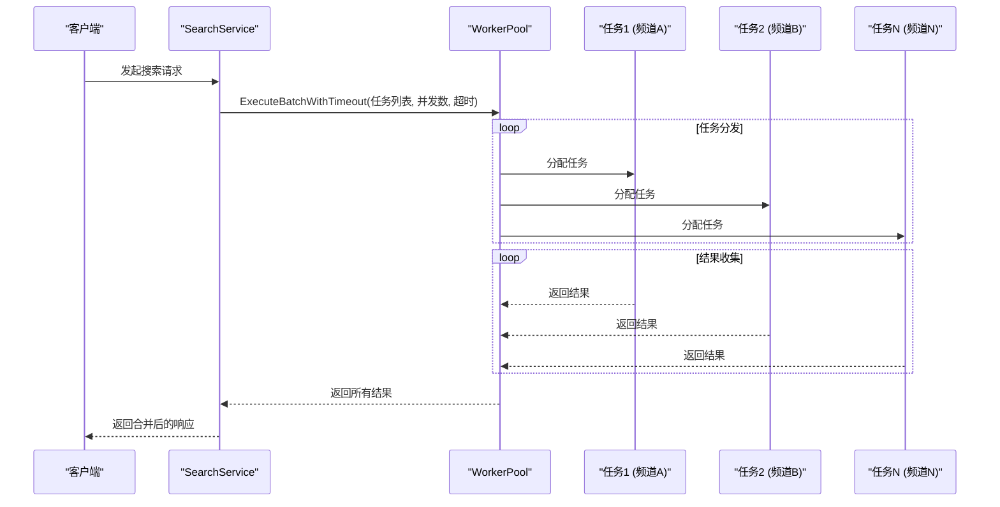
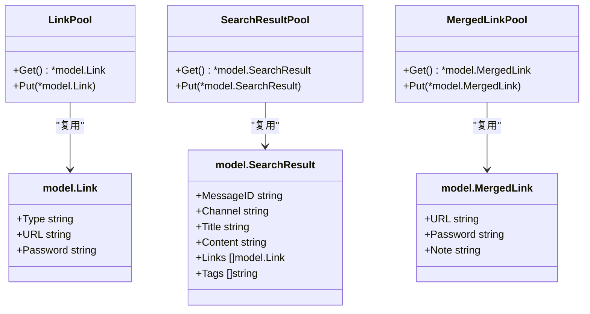
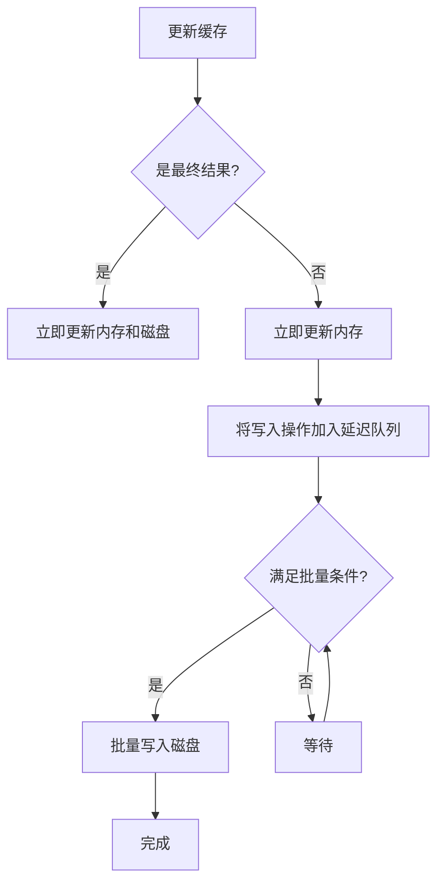

# 性能优化

<cite>
**本文档引用的文件**
- [worker_pool.go](file://util/pool/worker_pool.go)
- [object_pool.go](file://util/pool/object_pool.go)
- [search_service.go](file://service/search_service.go)
- [config.go](file://config/config.go)
- [enhanced_two_level_cache.go](file://util/cache/enhanced_two_level_cache.go)
- [delayed_batch_write_manager.go](file://util/cache/delayed_batch_write_manager.go)
- [main.go](file://main.go)
</cite>

## 目录
1. [引言](#引言)
2. [并发控制与Worker Pool](#并发控制与worker-pool)
3. [对象池与内存分配优化](#对象池与内存分配优化)
4. [缓存层级设计与延迟优化](#缓存层级设计与延迟优化)
5. [基于errgroup的并发搜索效率](#基于errgroup的并发搜索效率)
6. [配置参数调优建议](#配置参数调优建议)
7. [性能基准测试与监控](#性能基准测试与监控)
8. [结论](#结论)

## 引言
PanSou系统通过多种性能优化策略，显著提升了搜索响应速度、降低了内存消耗和GC压力。本文档系统性地总结了其在并发控制、缓存利用、对象池和GC调优等方面的核心技术实现，重点分析`worker_pool.go`、`object_pool.go`和`search_service.go`等关键模块，并结合`config.go`中的参数提供调优建议。

## 并发控制与Worker Pool

PanSou通过`util/pool/worker_pool.go`实现了一个高效的工作池（Worker Pool）机制，用于管理并发任务的执行。该机制通过复用Goroutine，避免了频繁创建和销毁Goroutine带来的开销，有效控制了并发度，防止系统资源耗尽。

工作池的核心功能包括：
- **批量任务处理**：`ExecuteBatch`和`ExecuteBatchWithTimeout`方法允许一次性提交多个任务，并行执行后统一返回结果。
- **超时控制**：`ExecuteBatchWithTimeout`方法利用`context.WithTimeout`为整个任务批次设置超时，确保搜索请求不会无限期阻塞。
- **并发限制**：通过`maxWorkers`参数限制同时运行的Goroutine数量，实现对系统资源的保护。

在`search_service.go`中，`searchTG`和`searchPlugins`方法均使用`pool.ExecuteBatchWithTimeout`来并行执行对多个频道或插件的搜索任务，极大地缩短了整体响应时间。

**图例来源**
- [worker_pool.go](file://util/pool/worker_pool.go#L146-L177)
- [search_service.go](file://service/search_service.go#L1146-L1365)

**本节来源**
- [worker_pool.go](file://util/pool/worker_pool.go#L1-L177)
- [search_service.go](file://service/search_service.go#L1146-L1365)

## 对象池与内存分配优化

为了减少内存分配和GC压力，PanSou在`util/pool/object_pool.go`中实现了多个`sync.Pool`对象池，用于复用频繁创建和销毁的对象。

系统定义了三个主要的对象池：
- **LinkPool**：用于复用`model.Link`对象。
- **SearchResultPool**：用于复用`model.SearchResult`对象，其内部的`Links`和`Tags`切片在释放时通过`[:0]`操作清空，保留底层数组以供复用。
- **MergedLinkPool**：用于复用`model.MergedLink`对象。

通过`GetLink`、`GetSearchResult`、`GetMergedLink`等函数从池中获取对象，使用完毕后通过`ReleaseLink`、`ReleaseSearchResult`、`ReleaseMergedLink`等函数将对象重置并归还到池中。这种对象复用模式显著减少了短生命周期对象的分配，从而降低了GC的频率和停顿时间。

**图例来源**
- [object_pool.go](file://util/pool/object_pool.go#L1-L74)
- [model/link.go](file://model/plugin_result.go)

**本节来源**
- [object_pool.go](file://util/pool/object_pool.go#L1-L74)

## 缓存层级设计与延迟优化

PanSou采用了一套复杂的两级缓存架构，结合内存缓存和磁盘缓存，以最大化响应速度并保证数据的持久性。

### 缓存层级
缓存系统由`util/cache/enhanced_two_level_cache.go`中的`EnhancedTwoLevelCache`实现，包含：
- **内存缓存** (`ShardedMemoryCache`)：基于分片的内存缓存，访问速度极快。
- **磁盘缓存** (`ShardedDiskCache`)：将数据持久化到磁盘，重启后不丢失。

当读取缓存时，系统首先查询内存缓存，若命中则直接返回；若未命中，则查询磁盘缓存，若磁盘命中，则将数据回填到内存缓存中，以加速后续访问。

### 延迟批量写入
为了优化磁盘I/O性能，系统引入了`DelayedBatchWriteManager`（`delayed_batch_write_manager.go`）。该组件采用延迟批量写入策略，将多个缓存更新操作合并成一个批次，然后一次性写入磁盘。这极大地减少了磁盘I/O次数，提高了写入效率。

其工作流程如下：
1.  当需要更新缓存时，`DelayedBatchWriteManager`首先立即更新内存缓存，保证数据的即时可见性。
2.  然后，将磁盘写入操作放入一个队列中。
3.  当满足以下任一条件时，触发批量写入：
    - 达到最大时间间隔
    - 队列中的操作数量达到阈值
    - 队列中的数据大小达到阈值
4.  将队列中的所有操作合并并批量写入磁盘。

这种设计在保证数据一致性的同时，显著降低了磁盘I/O负载，从而改善了系统的整体响应延迟。

**图例来源**
- [enhanced_two_level_cache.go](file://util/cache/enhanced_two_level_cache.go#L19-L44)
- [delayed_batch_write_manager.go](file://util/cache/delayed_batch_write_manager.go#L311-L340)

**本节来源**
- [enhanced_two_level_cache.go](file://util/cache/enhanced_two_level_cache.go#L1-L164)
- [delayed_batch_write_manager.go](file://util/cache/delayed_batch_write_manager.go#L1-L799)

## 基于errgroup的并发搜索效率

虽然代码中未直接使用`errgroup`，但其`worker_pool`机制实现了类似`errgroup`的功能。`search_service.go`中的`searchTG`和`searchPlugins`方法通过`worker_pool`并行执行多个搜索任务，其效率优势体现在：

1.  **并行化**：对多个Telegram频道或多个搜索插件的请求是并行发出的，而不是串行等待，总耗时由最慢的单个请求决定，而非所有请求时间之和。
2.  **错误隔离**：单个频道或插件的搜索失败不会影响其他任务的执行，提高了系统的容错能力。
3.  **资源可控**：通过`concurrency`参数和`worker_pool`的`maxWorkers`，可以精确控制并发度，避免因并发过高导致系统崩溃或被目标网站封禁。

## 配置参数调优建议

系统性能与`config.go`中的多个参数紧密相关。根据不同的负载场景，建议进行如下调优：

| 参数 | 低负载场景建议 | 高负载场景建议 | 说明 |
| :--- | :--- | :--- | :--- |
| `MaxGoroutines` (`AsyncMaxBackgroundWorkers`) | `cpu * 5` (默认) | `cpu * 8` | 增加工作者数量以处理更多并发请求，但需注意内存消耗。 |
| `CacheSize` (`CacheMaxSizeMB`) | `100` | `500` 或更高 | 增大缓存容量以提高缓存命中率，减少后端请求。 |
| `DefaultConcurrency` | `频道数 + 插件数 + 10` | `频道数 + 插件数 + 20` | 提高并发度以缩短响应时间，但需确保`MaxGoroutines`足够。 |
| `GCPercent` | `50` | `30` | 降低GC触发阈值，使GC更频繁但每次停顿更短，适合高吞吐场景。 |
| `HTTPMaxConns` | `100` | `1000` | 增加HTTP连接池大小，支持更多并发的外部请求。 |

**本节来源**
- [config.go](file://config/config.go#L1-L515)

## 性能基准测试与监控

### 基准测试方法
1.  **工具**：使用`wrk`或`ab`等HTTP基准测试工具。
2.  **指标**：测量QPS（每秒查询率）、平均延迟、P95/P99延迟、错误率。
3.  **场景**：
    -  **冷启动**：清空缓存后进行测试，评估最坏情况下的性能。
    -  **热启动**：缓存预热后进行测试，评估最佳情况下的性能。
    -  **高并发**：模拟大量用户同时搜索，评估系统稳定性。

### 监控指标采集
系统应采集以下关键指标进行监控：
- **缓存命中率**：`内存命中率` = `内存命中次数` / `总查询次数`，`磁盘命中率` = `磁盘命中次数` / `内存未命中次数`。
- **GC统计**：通过`runtime.ReadMemStats`获取`PauseTotalNs`、`NumGC`等，监控GC对性能的影响。
- **Goroutine数量**：`runtime.NumGoroutine()`，监控并发负载。
- **缓存写入延迟**：记录`DelayedBatchWriteManager`的批量写入耗时。
- **HTTP请求延迟**：记录每个API请求的处理时间。

**本节来源**
- [config.go](file://config/config.go#L1-L515)
- [delayed_batch_write_manager.go](file://util/cache/delayed_batch_write_manager.go#L1-L799)

## 结论
PanSou通过`worker_pool`实现高效的并发控制，通过`object_pool`减少内存分配和GC压力，通过两级缓存和延迟批量写入优化I/O性能。这些策略共同作用，构建了一个高性能、低延迟的搜索服务。通过合理调整`config.go`中的各项参数，可以针对不同负载场景进行精细化调优，确保系统在各种条件下都能稳定高效地运行。