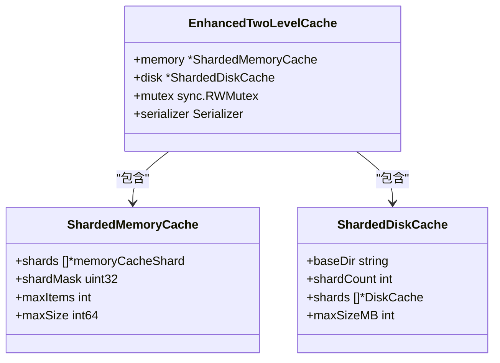
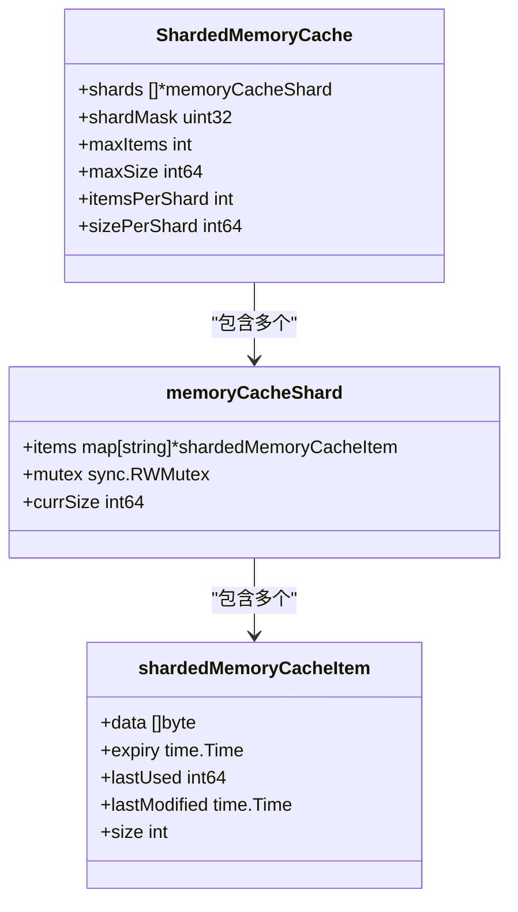
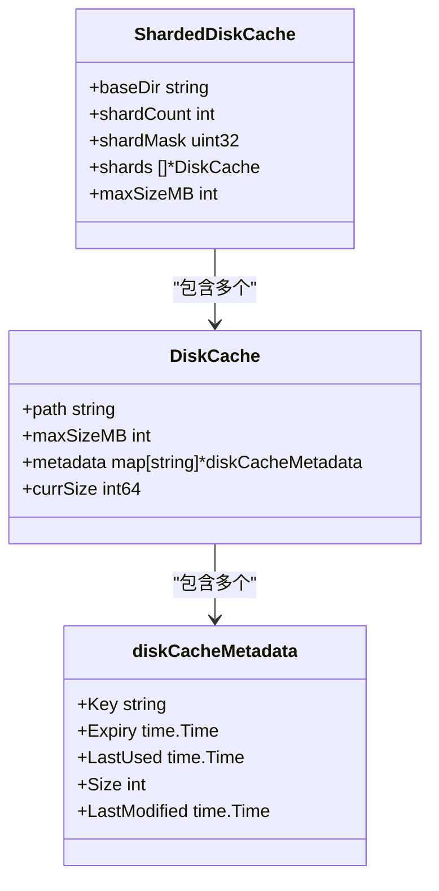
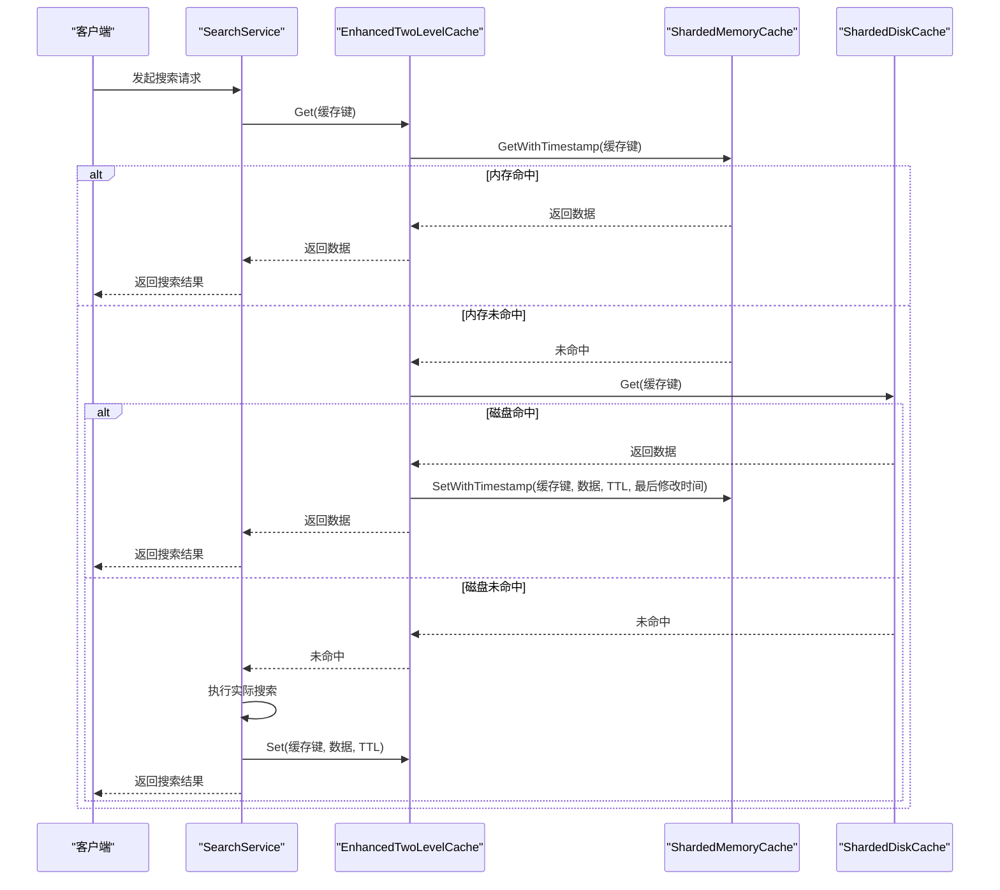

# 缓存优化

<cite>
**本文档引用的文件**   
- [enhanced_two_level_cache.go](file://util/cache/enhanced_two_level_cache.go)
- [sharded_memory_cache.go](file://util/cache/sharded_memory_cache.go)
- [sharded_disk_cache.go](file://util/cache/sharded_disk_cache.go)
- [search_service.go](file://service/search_service.go)
- [config.go](file://config/config.go)
- [cache_key.go](file://util/cache/cache_key.go)
- [serializer.go](file://util/cache/serializer.go)
- [delayed_batch_write_manager.go](file://util/cache/delayed_batch_write_manager.go)
- [global_buffer_manager.go](file://util/cache/global_buffer_manager.go)
</cite>

## 目录
1. [两级缓存架构概述](#两级缓存架构概述)
2. [核心组件分析](#核心组件分析)
3. [缓存读写流程与命中率优化](#缓存读写流程与命中率优化)
4. [缓存键生成与序列化机制](#缓存键生成与序列化机制)
5. [分片设计与性能影响](#分片设计与性能影响)
6. [配置参数与数据规模建议](#配置参数与数据规模建议)
7. [缓存预热与失效策略](#缓存预热与失效策略)
8. [性能监控与指标](#性能监控与指标)

## 两级缓存架构概述

本系统采用内存+磁盘的两级缓存架构，旨在通过分层存储策略显著降低后端负载并提升响应速度。该架构的核心是`EnhancedTwoLevelCache`结构体，它整合了内存缓存和磁盘缓存两个层次，实现了高效的数据访问和持久化存储。

内存缓存层由`ShardedMemoryCache`实现，提供极低延迟的读写操作。该层采用分片设计，将缓存数据分散到多个独立的分片中，有效避免了单点锁竞争，提升了并发性能。内存缓存主要用于存储热点数据，确保高频访问的请求能够快速响应。

磁盘缓存层由`ShardedDiskCache`实现，提供大容量的持久化存储。该层同样采用分片设计，将数据分散存储在不同的文件夹中，避免了单个目录下文件过多导致的性能下降。磁盘缓存主要用于存储冷数据和作为内存缓存的持久化备份，确保数据在系统重启后不会丢失。

两级缓存的协同工作模式如下：当数据写入时，系统会先同步更新内存缓存，然后异步写入磁盘缓存，确保快速响应的同时保证数据的持久性。当数据读取时，系统会优先从内存缓存中查找，如果命中则直接返回；如果未命中，则尝试从磁盘缓存中读取，一旦磁盘缓存命中，系统会将数据重新加载到内存缓存中，为后续访问提供加速。

**Section sources**
- [enhanced_two_level_cache.go](file://util/cache/enhanced_two_level_cache.go#L11-L16)
- [sharded_memory_cache.go](file://util/cache/sharded_memory_cache.go#L40-L49)
- [sharded_disk_cache.go](file://util/cache/sharded_disk_cache.go#L38-L46)

## 核心组件分析

### EnhancedTwoLevelCache 结构体

`EnhancedTwoLevelCache`是两级缓存架构的核心组件，它封装了内存缓存和磁盘缓存的交互逻辑。该结构体包含四个主要字段：`memory`指向内存缓存实例，`disk`指向磁盘缓存实例，`mutex`用于保护序列化器的并发访问，`serializer`用于数据的序列化和反序列化。



**Diagram sources **
- [enhanced_two_level_cache.go](file://util/cache/enhanced_two_level_cache.go#L11-L16)
- [sharded_memory_cache.go](file://util/cache/sharded_memory_cache.go#L40-L49)
- [sharded_disk_cache.go](file://util/cache/sharded_disk_cache.go#L38-L46)

### ShardedMemoryCache 分片内存缓存

`ShardedMemoryCache`实现了分片内存缓存，通过将数据分散到多个分片中来提升并发性能。每个分片都有独立的锁，避免了全局锁的竞争。分片数量根据CPU核心数动态确定，通常为CPU核心数的2倍，但至少4个，最多64个，并确保为2的幂，便于使用位掩码进行快速取模运算。



**Diagram sources **
- [sharded_memory_cache.go](file://util/cache/sharded_memory_cache.go#L40-L49)
- [sharded_memory_cache.go](file://util/cache/sharded_memory_cache.go#L24-L32)

### ShardedDiskCache 分片磁盘缓存

`ShardedDiskCache`实现了分片磁盘缓存，通过将数据分散到多个子目录中来避免单个目录下文件过多。每个分片对应一个子目录，分片数量同样根据CPU核心数动态确定，但上限为32个，以避免过多的文件夹。这种设计有效提升了文件系统的I/O性能。



**Diagram sources **
- [sharded_disk_cache.go](file://util/cache/sharded_disk_cache.go#L38-L46)
- [disk_cache.go](file://util/cache/disk_cache.go#L48-L56)

**Section sources**
- [enhanced_two_level_cache.go](file://util/cache/enhanced_two_level_cache.go#L11-L16)
- [sharded_memory_cache.go](file://util/cache/sharded_memory_cache.go#L40-L49)
- [sharded_disk_cache.go](file://util/cache/sharded_disk_cache.go#L38-L46)

## 缓存读写流程与命中率优化

### 缓存读取流程

缓存读取流程是提升响应速度的关键环节。当系统收到一个搜索请求时，首先会根据请求参数生成一个唯一的缓存键，然后尝试从两级缓存中读取数据。读取流程遵循"内存优先，磁盘后备"的原则。



**Diagram sources **
- [enhanced_two_level_cache.go](file://util/cache/enhanced_two_level_cache.go#L94-L113)
- [search_service.go](file://service/search_service.go#L1146-L1215)

### 缓存写入流程

缓存写入流程设计为异步和批量处理，以降低对主流程的性能影响。当搜索结果生成后，系统会先更新内存缓存，确保后续请求能立即看到最新数据，然后通过`DelayedBatchWriteManager`将写入操作加入队列，进行批量处理。

```mermaid
sequenceDiagram
    participant Service as "SearchService"
    participant Cache as "EnhancedTwoLevelCache"
    participant Memory as "ShardedMemoryCache"
    participant Disk as "ShardedDiskCache"
    participant Manager as "DelayedBatchWriteManager"
    
    Service->>Cache: Set(缓存键, 数据, TTL)
    Cache->>Memory: SetWithTimestamp(缓存键, 数据, TTL, 当前时间)
    Cache->>Manager: HandleCacheOperation(操作)
    Manager->>Manager: updateMemoryCache(