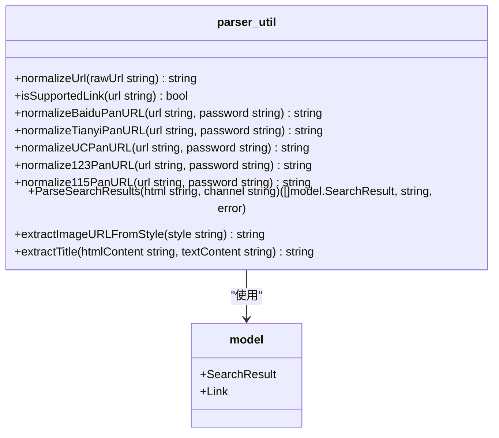
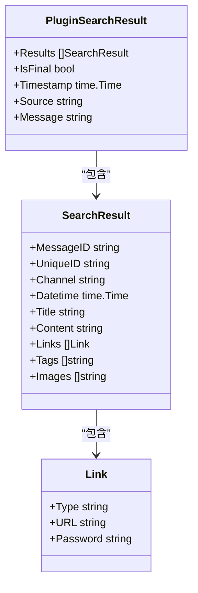
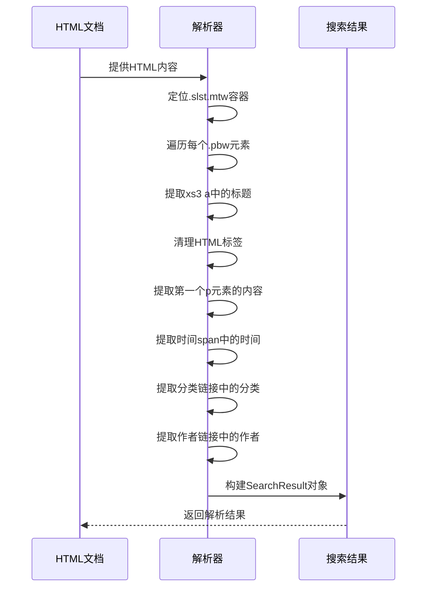

# HTML/JSON解析逻辑实现

<cite>
**本文档引用文件**  
- [parser_util.go](file://util/parser_util.go)
- [hdr4k.go](file://plugin/hdr4k/hdr4k.go)
- [susu.go](file://plugin/susu/susu.go)
- [miaoso.go](file://plugin/miaoso/miaoso.go)
- [wanou.go](file://plugin/wanou/wanou.go)
- [html结构分析.md](file://plugin/hdr4k/html结构分析.md)
- [html结构分析.md](file://plugin/susu/html结构分析.md)
- [json结构分析.md](file://plugin/miaoso/json结构分析.md)
- [json结构分析.md](file://plugin/wanou/json结构分析.md)
- [plugin_result.go](file://model/plugin_result.go)
- [response.go](file://model/response.go)
</cite>

## 目录
1. [引言](#引言)
2. [解析工具概述](#解析工具概述)
3. [HTML解析实现](#html解析实现)
4. [JSON解析实现](#json解析实现)
5. [解析模式与最佳实践](#解析模式与最佳实践)
6. [错误处理与容错机制](#错误处理与容错机制)
7. [性能优化策略](#性能优化策略)
8. [总结](#总结)

## 引言

本文档深入讲解PanSou系统中网页内容的解析逻辑，涵盖HTML和JSON两种主要格式的解析实现。通过分析`parser_util.go`提供的工具函数，详细说明如何使用GoQuery进行HTML选择器提取，以及如何使用`encoding/json`进行JSON反序列化。文档以hdr4k和susu插件的HTML结构分析文档作为案例，展示从原始HTML中提取标题、链接、大小、时间等字段的完整流程。对于JSON接口类插件如miaoso和wanou，说明如何解析响应结构并映射到统一的SearchResult模型。同时提供常见解析模式的代码片段，包括多页处理、动态加载内容识别和字段清洗等关键技术。

**本节来源**
- [parser_util.go](file://util/parser_util.go#L1-L10)
- [html结构分析.md](file://plugin/hdr4k/html结构分析.md#L1-L20)
- [json结构分析.md](file://plugin/miaoso/json结构分析.md#L1-L20)

## 解析工具概述

### 工具函数库

PanSou系统在`util/parser_util.go`中提供了核心的解析工具函数，这些函数构成了HTML和JSON解析的基础。工具库主要包含以下功能模块：

- **URL标准化**：`normalizeUrl`函数用于将URL编码的中文部分解码为中文，便于去重处理
- **链接识别**：`isSupportedLink`函数检查链接是否为支持的网盘链接，支持百度、天翼、UC、123、夸克、迅雷、115等多种网盘类型
- **链接标准化**：针对不同网盘类型提供专门的标准化函数，如`normalizeBaiduPanURL`、`normalizeTianyiPanURL`等，确保链接格式正确
- **内容解析**：`ParseSearchResults`函数是核心解析函数，负责从HTML内容中提取完整的搜索结果



**图示来源**
- [parser_util.go](file://util/parser_util.go#L12-L127)
- [response.go](file://model/response.go#L5-L22)

### 数据模型定义

系统定义了统一的数据模型来表示搜索结果，确保不同插件的解析结果可以被统一处理。核心数据结构包括：

- **SearchResult**：搜索结果主结构，包含消息ID、唯一ID、频道、时间、标题、内容、链接、标签和图片等字段
- **Link**：网盘链接结构，包含类型、URL和密码三个字段
- **PluginSearchResult**：插件搜索结果包装结构，包含结果列表、是否为最终结果、时间戳、来源和消息等字段



**图示来源**
- [response.go](file://model/response.go#L5-L22)
- [plugin_result.go](file://model/plugin_result.go#L5-L15)

## HTML解析实现

### GoQuery基础用法

GoQuery是PanSou系统中HTML解析的核心工具，它提供了类似jQuery的语法来操作HTML文档。`ParseSearchResults`函数展示了GoQuery的基本用法：

1. **文档创建**：使用`goquery.NewDocumentFromReader`从HTML字符串创建文档对象
2. **元素选择**：使用`Find`方法通过CSS选择器查找元素
3. **属性提取**：使用`Attr`方法提取元素属性
4. **文本获取**：使用`Text`方法获取元素文本内容
5. **HTML内容获取**：使用`Html`方法获取元素的HTML内容

```go
doc, err := goquery.NewDocumentFromReader(strings.NewReader(html))
if err != nil {
    return nil, "", err
}

// 查找消息块
doc.Find(".tgme_widget_message_wrap").Each(func(i int, s *goquery.Selection) {
    // 提取消息ID
    dataPost, exists := messageDiv.Attr("data-post")
    if !exists {
        return
    }
    
    // 获取消息文本
    messageText := messageTextElem.Text()
    
    // 提取时间
    timeStr, exists := messageDiv.Find(".tgme_widget_message_date time").Attr("datetime")
})
```

**代码来源**
- [parser_util.go](file://util/parser_util.go#L128-L150)

### hdr4k插件HTML解析

hdr4k插件的HTML解析展示了如何从复杂的HTML结构中提取所需信息。根据`html结构分析.md`文档，解析流程如下：

1. **搜索结果定位**：在`.slst.mtw`元素内查找每个`<li class="pbw">`元素作为单个搜索结果
2. **标题提取**：从`.xs3 a`元素中提取标题，并清理HTML标签
3. **内容描述提取**：从h3下方的第一个`<p>`元素中提取内容描述
4. **时间提取**：从最后一个`<p>`元素的第一个`<span>`中提取日期时间
5. **分类提取**：从最后一个`<p>`元素的最后一个链接中提取分类信息
6. **作者提取**：从日期和分类之间的链接中提取作者信息



**图示来源**
- [html结构分析.md](file://plugin/hdr4k/html结构分析.md#L1-L100)
- [hdr4k.go](file://plugin/hdr4k/hdr4k.go#L100-L139)

### susu插件HTML解析

susu插件的HTML解析展示了另一种结构的处理方式。根据`html结构分析.md`文档，其解析特点如下：

1. **结果定位**：在`.post-1.post-list.post-item-1`元素内查找每个`.post-list-item.item-post-style-1`元素
2. **标题提取**：从`.post-info h2 a`元素中提取标题
3. **内容提取**：从`.post-excerpt`元素中提取内容描述
4. **时间提取**：从`.list-footer time.b2timeago`元素的`datetime`属性中提取时间
5. **分类提取**：从`.post-list-cat-item`元素中提取分类标签

```go
func (p *SusuAsyncPlugin) doSearch(client *http.Client, keyword string, ext map[string]interface{}) ([]model.SearchResult, error) {
    // 构建请求
    req, err := http.NewRequest("GET", fmt.Sprintf(SearchURL, url.QueryEscape(keyword)), nil)
    if err != nil {
        return nil, err
    }
    
    // 设置请求头
    p.setRequestHeaders(req)
    
    // 发送请求
    resp, err := client.Do(req)
    if err != nil {
        return nil, err
    }
    defer resp.Body.Close()
    
    // 解析HTML
    doc, err := goquery.NewDocumentFromReader(resp.Body)
    if err != nil {
        return nil, err
    }
    
    var results []model.SearchResult
    doc.Find(".post-list-item.item-post-style-1").Each(func(i int, s *goquery.Selection) {
        // 提取标题
        title := s.Find(".post-info h2 a").Text()
        
        // 提取内容
        content := s.Find(".post-excerpt").Text()
        
        // 提取时间
        datetimeStr, _ := s.Find(".list-footer time.b2timeago").Attr("datetime")
        datetime, _ := time.Parse("2006-01-02 15:04:05", datetimeStr)
        
        // 提取分类
        var tags []string
        s.Find(".post-list-cat-item").Each(func(i int, tag *goquery.Selection) {
            tags = append(tags, tag.Text())
        })
        
        // 构建结果
        results = append(results, model.SearchResult{
            Title:    title,
            Content:  content,
            Datetime: datetime,
            Tags:     tags,
        })
    })
    
    return results, nil
}
```

**代码来源**
- [html结构分析.md](file://plugin/susu/html结构分析.md#L1-L50)
- [susu.go](file://plugin/susu/susu.go#L55-L95)

### HTML标签清理

HTML解析过程中需要处理各种HTML标签和特殊字符。`hdr4k.go`中的`cleanHTML`函数展示了完整的清理流程：

1. **替换HTML标签**：将`<strong>`、`</strong>`、`<font>`、`</font>`等标签替换为空字符串
2. **替换换行符**：将`<br>`、`<br/>`、`<br />`替换为换行符`\n`
3. **替换特殊字符**：将`&nbsp;`替换为空格，`&hellip;`替换为省略号
4. **移除其他HTML标签**：使用正则表达式`<[^>]*>`移除所有其他HTML标签
5. **清理空白字符**：使用正则表达式`\s+`将多个空白字符替换为单个空格

```go
func (p *Hdr4kAsyncPlugin) cleanHTML(html string) string {
    replacements := map[string]string{
        "<strong>":                     "",
        "</strong>":                    "",
        "<font color=\"#ff0000\">":     "",
        "</font>":                      "",
        "<br>":                         "\n",
        "<br/>":                        "\n",
        "<br />":                       "\n",
        "&nbsp;":                       " ",
        "&hellip;":                     "...",
    }
    
    result := html
    for old, new := range replacements {
        result = strings.ReplaceAll(result, old, new)
    }
    
    // 移除其他HTML标签
    re := regexp.MustCompile(`<[^>]*>`)
    result = re.ReplaceAllString(result, "")
    
    // 清理多余的空白字符
    re = regexp.MustCompile(`\s+`)
    result = re.ReplaceAllString(result, " ")
    
    return strings.TrimSpace(result)
}
```

**代码来源**
- [hdr4k.go](file://plugin/hdr4k/hdr4k.go#L626-L681)

## JSON解析实现

### miaoso插件JSON解析

miaoso插件通过RESTful API获取JSON格式的搜索结果。根据`json结构分析.md`文档，其解析流程如下：

1. **API请求**：向`https://miaosou.fun/api/secendsearch`发送GET请求，包含`name`（搜索关键词）和`pageNo`（页码）参数
2. **响应结构**：解析顶层响应结构，包含`code`、`msg`和`data`字段
3. **数据提取**：从`data.list`数组中提取每个搜索结果项
4. **字段映射**：将Miaoso字段映射到PanSou的SearchResult模型

```mermaid
classDiagram
    class MiaosouResponse {
        +Code int
        +Msg string
        +Data MiaosouData
    }
    
    class MiaosouData {
        +Total int
        +List []MiaosouItem
    }
    
    class MiaosouItem {
        +ID string
        +Name string
        +URL string
        +From string
        +GmtShare string
        +FileInfos []MiaosouFileInfo
    }
    
    class MiaosouFileInfo {
        +FileID string
        +FileName string
    }
    
    class SearchResult {
        +UniqueID string
        +Title string
        +Datetime time.Time
        +Links []Link
    }
    
    MiaosouResponse --> MiaosouData
    MiaosouData --> MiaosouItem
    MiaosouItem --> MiaosouFileInfo
    MiaosouItem --> SearchResult : "映