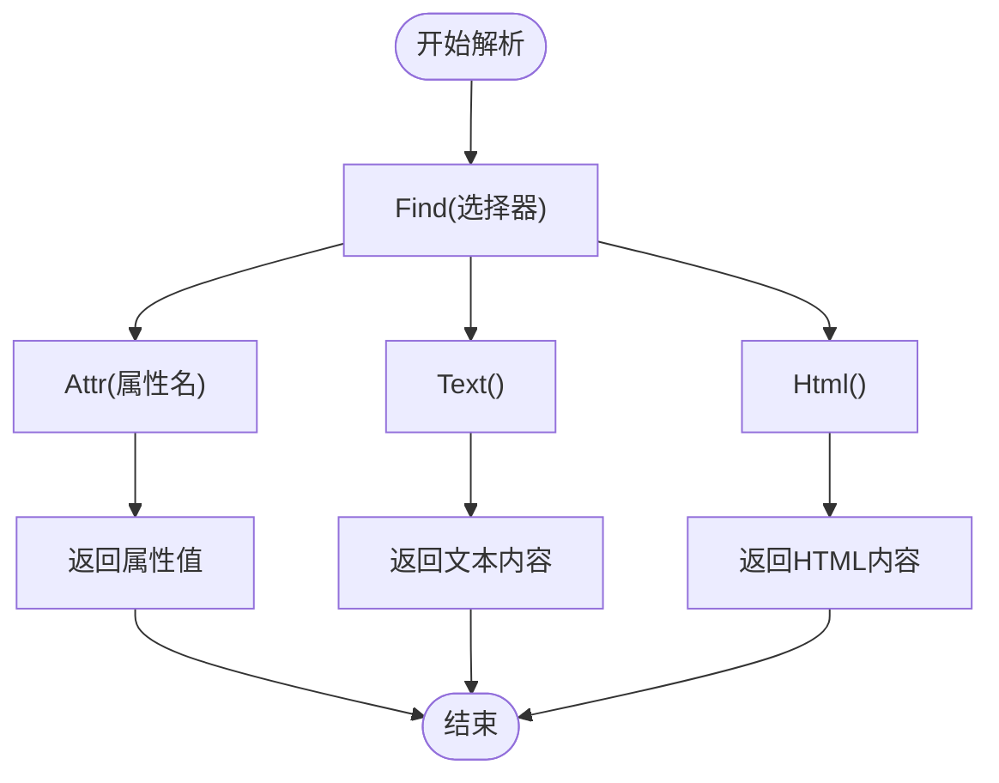

# CSS选择器策略设计

<cite>
**本文档引用文件**   
- [parser_util.go](file://util/parser_util.go)
- [hdr4k.go](file://plugin/hdr4k/hdr4k.go)
- [susu.go](file://plugin/susu/susu.go)
- [html结构分析.md](file://plugin/hdr4k/html结构分析.md)
- [html结构分析.md](file://plugin/susu/html结构分析.md)
- [设计文档.md](file://plugin/hdr4k/设计文档.md)
- [susu插件设计文档.md](file://plugin/susu/susu插件设计文档.md)
</cite>

## 目录
1. [引言](#引言)
2. [CSS选择器设计原则](#css选择器设计原则)
3. [解析工具与核心方法](#解析工具与核心方法)
4. [不同网页布局的提取策略](#不同网页布局的提取策略)
5. [实际案例分析：hdr4k插件](#实际案例分析：hdr4k插件)
6. [实际案例分析：susu插件](#实际案例分析：susu插件)
7. [复杂场景处理技巧](#复杂场景处理技巧)
8. [选择器维护与稳定性保障](#选择器维护与稳定性保障)
9. [结论](#结论)

## 引言

在现代网络爬虫和数据抓取系统中，准确、高效地从目标网站的HTML结构中提取关键信息是核心任务。本项目通过`parser_util.go`提供的解析工具，结合`hdr4k`和`susu`等具体插件的实现，形成了一套完整的CSS选择器设计与实践方法。本文档旨在详细阐述这一策略，指导开发者如何针对不同网页布局，设计稳定、高效的CSS选择器，以提取标题、链接、文件大小、上传时间等关键字段。

## CSS选择器设计原则

设计CSS选择器时，应遵循以下核心原则，以确保选择器的健壮性和可维护性：

1.  **优先使用稳定属性**：应优先选择那些不易随网站改版而变化的属性，如语义化的类名（`class`）、`id`、`data-*`属性等。避免依赖位置索引（如`:nth-child()`），因为页面结构的微小调整就会导致选择器失效。
2.  **避免过度依赖动态ID**：许多现代网站使用JavaScript生成动态ID（如`item-12345`），这些ID在每次加载时都可能变化。应尽量避免直接使用这些ID，转而使用其父级或兄弟元素的稳定类名进行定位。
3.  **层级定位与属性匹配结合**：采用“从外到内”的层级定位策略，先定位到一个稳定的父容器，再在其内部使用更精确的选择器。同时，结合属性选择器（如`[href^="https://pan.baidu.com"]`）可以更精准地匹配目标元素。
4.  **利用伪类选择器**：伪类选择器（如`:first`, `:last`, `:contains()`）在goquery中非常有用，可以简化选择器并提高灵活性。例如，`.post-info h2 a`可以定位到标题链接，而`p span:first`可以定位到时间信息。
5.  **选择器的简洁性与可读性**：在保证准确性的前提下，选择器应尽可能简洁。过长、过于复杂的选择器不仅难以维护，也更容易因页面微调而失效。

## 解析工具与核心方法

项目中的`util/parser_util.go`文件提供了基于`goquery`库的解析工具，是实现数据提取的核心。`goquery`的API设计模仿了jQuery，使得开发者可以使用熟悉的语法进行DOM操作。

### 核心方法详解

以下是在`parser_util.go`和各插件中频繁使用的核心方法：



**图解来源**
- [parser_util.go](file://util/parser_util.go#L128-L540)

**核心方法说明**：

- **`Find(选择器)`**：这是最基础也是最重要的方法。它接收一个CSS选择器字符串，返回一个`*goquery.Selection`对象，该对象包含了所有匹配的DOM元素。例如，在`hdr4k`插件中，`doc.Find(".slst.mtw ul li.pbw")`用于定位所有搜索结果项。
- **`Attr(属性名)`**：用于获取匹配元素的指定HTML属性值。它返回一个布尔值表示属性是否存在，以及属性的值。例如，`s.Attr("id")`用于提取帖子的ID。
- **`Text()`**：提取匹配元素及其所有子元素的纯文本内容，自动去除HTML标签。这是获取标题、描述等文本信息的主要方法。
- **`Html()`**：获取匹配元素的内部HTML内容（不包括元素本身）。这在需要保留部分HTML结构时非常有用。

## 不同网页布局的提取策略

不同的网站采用不同的布局方式，如表格、列表、卡片式等。针对每种布局，应采用相应的提取策略。

### 表格布局

虽然本项目中的`hdr4k`和`susu`主要采用列表和卡片式布局，但表格布局在其他数据密集型网站中很常见。对于表格，应使用`tr`和`td`标签进行定位。例如，`table.data tr`选择所有数据行，然后通过`td:nth-child(2)`等选择器定位到特定列。

### 列表布局

`hdr4k`网站的搜索结果采用了典型的列表布局，其结构为`<ul>`包裹多个`<li>`项。

**提取策略**：
1.  **定位容器**：首先使用`doc.Find(".slst.mtw ul")`定位到列表容器。
2.  **遍历项**：使用`.Each()`方法遍历每个`<li class="pbw">`项。
3.  **提取字段**：
    -   **标题**：在`h3.xs3 a`中使用`Text()`方法提取。
    -   **时间**：在`p span`中使用`Text()`方法提取，并通过`parseDateTime`函数解析为`time.Time`对象。
    -   **链接**：在`a`标签中使用`Attr("href")`提取URL。

### 卡片式布局

`susu`网站的搜索结果采用了卡片式布局，每个结果项是一个独立的视觉卡片。

**提取策略**：
1.  **定位容器**：使用`doc.Find(".post-1.post-list")`定位到卡片容器。
2.  **遍历卡片**：遍历每个`.post-list-item`。
3.  **提取字段**：
    -   **标题**：在`.post-info h2 a`中提取。
    -   **描述**：在`.post-excerpt`中提取。
    -   **时间**：在`.list-footer time.b2timeago`的`datetime`属性中提取。
    -   **分类标签**：遍历所有`.post-list-cat-item`元素，提取其文本内容。

## 实际案例分析：hdr4k插件

`hdr4k`插件是应用CSS选择器策略的典范，其`doSearch`方法完整展示了从HTML解析到数据提取的全过程。

### HTML结构分析

根据`html结构分析.md`文档，`hdr4k`的搜索结果HTML结构清晰：
- 每个结果项的`<li>`标签的`id`属性即为帖子ID。
- 标题位于`h3.xs3 a`内，但可能包含`<strong>`和`<font>`标签用于高亮关键词。
- 时间信息位于`p`标签内的第一个`span`中。

### 选择器实现与代码逻辑

```go
// 1. 定位所有搜索结果项
doc.Find(".slst.mtw ul li.pbw").Each(func(i int, s *goquery.Selection) {
    // 2. 提取帖子ID
    postID, exists := s.Attr("id")
    if !exists || postID == "" { return }
    
    // 3. 提取并清理标题
    titleElement := s.Find("h3.xs3 a")
    title := p.cleanHTML(titleElement.Text()) // 清理HTML标签
    
    // 4. 提取时间
    dateStr := s.Find("p span").First().Text()
    datetime, err := p.parseDateTime(dateStr)
})
```

**关键点**：
- **`cleanHTML`方法**：由于标题中可能包含高亮标签，直接使用`Text()`会得到不干净的文本。`cleanHTML`方法通过字符串替换和正则表达式，移除了`<strong>`、`<font>`等标签，确保了标题的纯净。
- **`parseDateTime`方法**：将`"2025-4-9 19:55"`这样的字符串解析为Go的`time.Time`类型，便于后续处理和排序。

**代码来源**
- [hdr4k.go](file://plugin/hdr4k/hdr4k.go#L123-L317)
- [html结构分析.md](file://plugin/hdr4k/html结构分析.md#L1-L217)

## 实际案例分析：susu插件

`susu`插件的实现展示了如何处理更复杂的异步加载和数据结构。

### HTML结构分析

`susu`的布局相对简单，但其数据获取方式更为复杂：
- 帖子ID不直接在`id`属性中，而是隐藏在详情页链接`href="https://susuifa.com/18892.html"`中。
- 网盘链接并非直接在搜索结果页，而是需要通过API调用获取。

### 选择器实现与代码逻辑

```go
// 1. 定位所有搜索结果项
doc.Find(".post-list-item").Each(func(i int, s *goquery.Selection) {
    // 2. 提取标题
    title := s.Find(".post-info h2 a").Text()
    
    // 3. 提取时间
    datetimeStr := s.Find(".list-footer time.b2timeago").AttrOr("datetime", "")
    
    // 4. 提取分类标签
    s.Find(".post-list-cat-item").Each(func(i int, t *goquery.Selection) {
        tags = append(tags, strings.TrimSpace(t.Text()))
    })
})
```

**关键点**：
- **`extractPostID`方法**：由于ID不在`id`属性中，该方法首先尝试从`id="item-18892"`中提取，如果失败则使用正则表达式从`href`中提取。这体现了对多种可能性的容错处理。
- **`getLinks`方法**：此方法不依赖于HTML选择器，而是通过向`ButtonListURL`和`ButtonDetailURL`发送HTTP请求来获取链接。这说明了当数据不在初始HTML中时，需要结合API调用。

**代码来源**
- [susu.go](file://plugin/susu/susu.go#L120-L273)
- [html结构分析.md](file://plugin/susu/html结构分析.md#L1-L68)

## 复杂场景处理技巧

在实际开发中，经常会遇到动态ID、混淆类名、嵌套结构等复杂场景。

### 动态ID与混淆类名

如`susu`的`item-18892`，ID是动态的。解决方案是**不直接使用ID，而是使用其父级或兄弟元素的稳定类名**。例如，`.post-list-item`是一个稳定的类名，可以作为所有操作的起点。

### 嵌套结构

当目标元素嵌套较深时，应避免写出过长的选择器。可以采用分步提取的方式：
```go
// 错误：过长且脆弱
content := s.Find("div.container > div.content > p.description").Text()

// 正确：分步提取，更清晰
container := s.Find("div.container")
content := container.Find("p.description").Text()
```

### 处理JavaScript生成的内容

对于`susu`的网盘链接，内容由JavaScript动态生成。此时，直接解析初始HTML是无效的。必须分析网络请求，找到提供数据的API端点（如`getDownloadData`），然后模拟请求来获取数据。这要求开发者使用浏览器的开发者工具来监控网络流量。

## 选择器维护与稳定性保障

选择器的稳定性是长期维护的关键。为此，项目采用了以下策略：

### 优先使用稳定属性

如前所述，`hdr4k`使用`.slst.mtw`和`.pbw`这类语义化的类名，而非`div:nth-child(2)`。这些类名通常与网站的设计主题相关，不易更改。

### 避免过度依赖位置索引

在`susu`和`hdr4k`的代码中，几乎看不到`:nth-child()`的使用。取而代之的是通过属性或类名进行精确定位，这大大提高了选择器的鲁棒性。

### 日志记录

在`hdr4k`的`设计文档.md`中提到了关键日志点，如记录搜索开始、完成、错误和缓存状态。这些日志对于监控选择器的运行状况和快速定位问题至关重要。

### 单元测试

`susu插件设计文档.md`中详细描述了单元测试策略，包括：
- **核心功能测试**：测试HTML清理、求片帖过滤等功能。
- **并发安全测试**：确保在多goroutine环境下插件能正常工作。
- **端到端测试**：模拟真实搜索，验证结果的完整性和准确性。

通过这些测试，可以在代码变更后快速验证选择器是否仍然有效，从而保障系统的稳定性。

**文档来源**
- [设计文档.md](file://plugin/hdr4k/设计文档.md#L844-L862)
- [susu插件设计文档.md](file://plugin/susu/susu插件设计文档.md#L1055-L1062)

## 结论

本文档通过分析`parser_util.go`中的解析工具和`hdr4k`、`susu`两个具体插件的实现，系统地阐述了基于目标网站HTML结构的CSS选择器设计原则与实践方法。核心在于理解目标网站的布局，优先使用稳定属性，结合层级定位与属性匹配，并通过日志和单元测试来保障选择器的长期稳定性。面对动态和混淆的HTML，开发者需要灵活运用分步提取、API调用等技巧。这套策略不仅适用于当前项目，也为未来开发新的数据抓取插件提供了坚实的基础和指导方针。