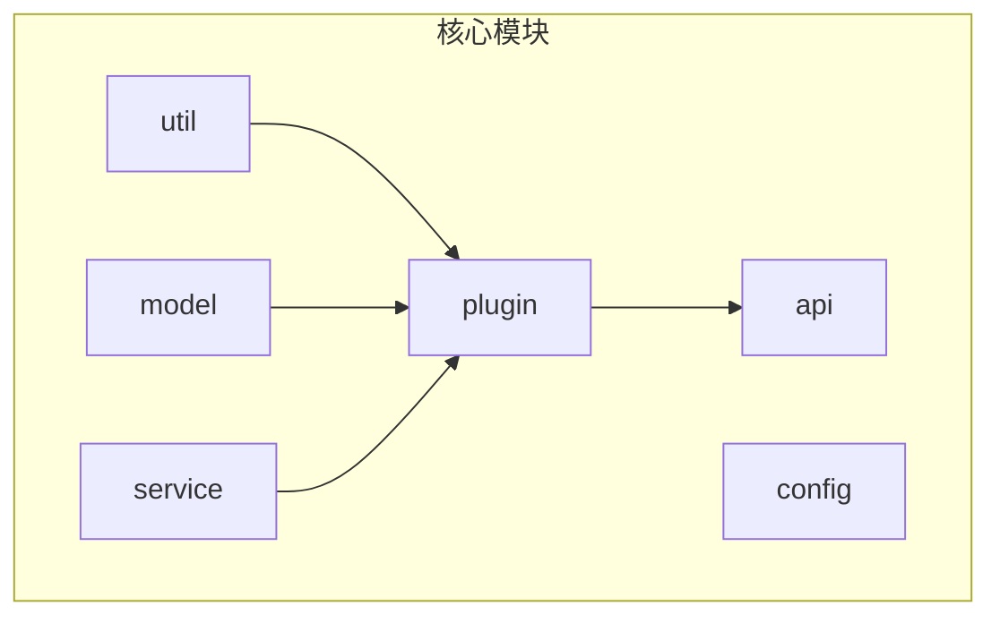
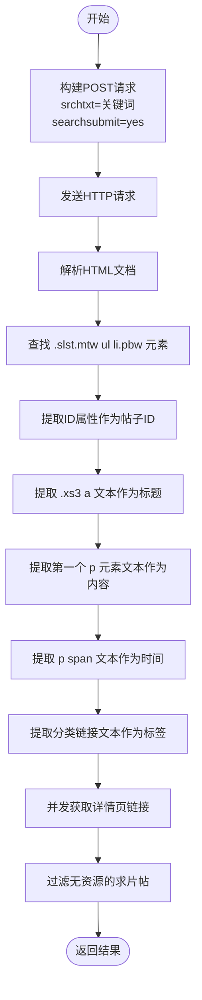
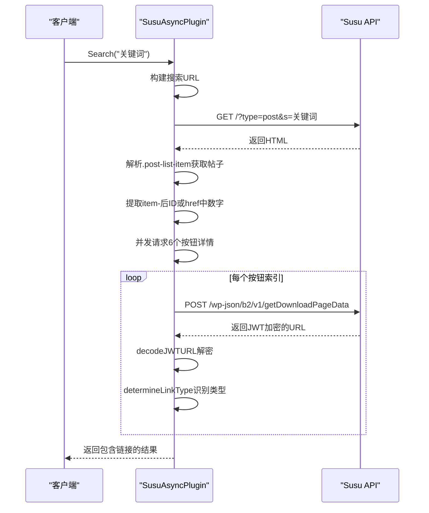
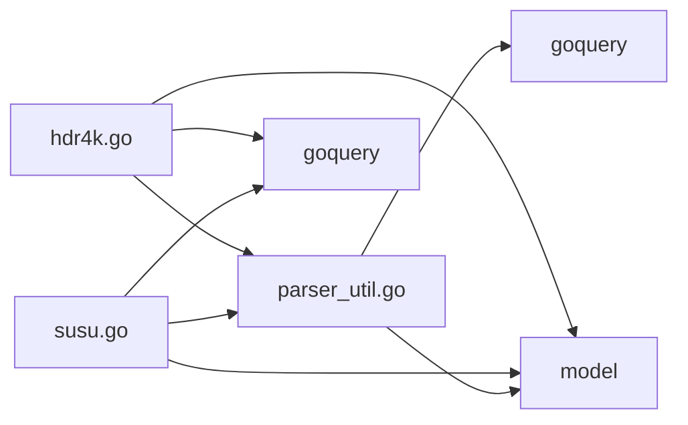

# HTML解析逻辑实现

<cite>
**本文档引用的文件**
- [parser_util.go](file://util/parser_util.go)
- [hdr4k.go](file://plugin/hdr4k/hdr4k.go)
- [susu.go](file://plugin/susu/susu.go)
- [html结构分析.md](file://plugin/hdr4k/html结构分析.md)
- [susu插件设计文档.md](file://plugin/susu/susu插件设计文档.md)
</cite>

## 目录
1. [引言](#引言)
2. [项目结构](#项目结构)
3. [核心组件](#核心组件)
4. [架构概述](#架构概述)
5. [详细组件分析](#详细组件分析)
6. [依赖分析](#依赖分析)
7. [性能考虑](#性能考虑)
8. [故障排除指南](#故障排除指南)
9. [结论](#结论)

## 引言
本文档深入讲解基于GoQuery的HTML内容解析机制，结合`parser_util.go`中的工具函数，详细说明如何通过CSS选择器从网页中提取标题、链接、文件大小、上传时间等关键字段。以`hdr4k`和`susu`插件为例，展示HTML结构分析文档如何指导选择器编写，包括列表页解析、分页处理、动态加载内容识别等场景。提供实际代码片段演示如何处理嵌套结构、属性提取和文本清洗，并解释常见问题如选择器失效、编码问题、空值处理的解决方案。

## 项目结构
本项目采用模块化设计，主要分为API层、配置层、模型层、插件层、服务层和工具层。其中，插件层包含多个独立的爬虫插件，每个插件负责特定网站的数据抓取。工具层的`util/parser_util.go`提供了通用的HTML解析和数据清洗功能，被多个插件复用。



**图示来源**
- [parser_util.go](file://util/parser_util.go)
- [hdr4k.go](file://plugin/hdr4k/hdr4k.go)

**本节来源**
- [parser_util.go](file://util/parser_util.go)
- [hdr4k.go](file://plugin/hdr4k/hdr4k.go)

## 核心组件
系统的核心组件包括基于GoQuery的HTML解析器、通用解析工具函数库、缓存机制和插件化架构。`parser_util.go`文件提供了标准化URL、提取链接、清洗HTML标签等基础功能，而各插件则基于这些工具实现具体的网页解析逻辑。

**本节来源**
- [parser_util.go](file://util/parser_util.go#L1-L627)
- [hdr4k.go](file://plugin/hdr4k/hdr4k.go#L1-L682)

## 架构概述
系统采用插件化架构，每个插件独立实现特定网站的爬取逻辑。通过`BaseAsyncPlugin`基类提供统一的异步搜索接口，各插件继承并实现`doSearch`方法。HTML解析主要依赖GoQuery库，通过CSS选择器定位DOM元素，结合正则表达式和字符串处理完成数据提取。

```mermaid
classDiagram
class BaseAsyncPlugin {
+Search(keyword string, ext map[string]interface{}) ([]SearchResult, error)
+SearchWithResult(keyword string, ext map[string]interface{}) (PluginSearchResult, error)
+AsyncSearchWithResult(keyword string, searchFunc SearchFunc, cacheKey string, ext map[string]interface{}) (PluginSearchResult, error)
}
class Hdr4kAsyncPlugin {
+doSearch(client *http.Client, keyword string, ext map[string]interface{}) ([]SearchResult, error)
+getLinksFromDetail(client *http.Client, postID string) ([]Link, string, error)
+determineLinkType(url, name string) string
}
class SusuAsyncPlugin {
+doSearch(client *http.Client, keyword string, ext map[string]interface{}) ([]SearchResult, error)
+getLinks(client *http.Client, postID string) ([]Link, error)
+getButtonDetail(client *http.Client, postID string, index int) (Link, error)
+decodeJWTURL(jwtToken string) (string, error)
}
BaseAsyncPlugin <|-- Hdr4kAsyncPlugin
BaseAsyncPlugin <|-- SusuAsyncPlugin
Hdr4kAsyncPlugin --> "uses" goquery
SusuAsyncPlugin --> "uses" goquery
Hdr4kAsyncPlugin --> "uses" parser_util
SusuAsyncPlugin --> "uses" parser_util
```

**图示来源**
- [hdr4k.go](file://plugin/hdr4k/hdr4k.go#L1-L682)
- [susu.go](file://plugin/susu/susu.go#L1-L592)

**本节来源**
- [hdr4k.go](file://plugin/hdr4k/hdr4k.go#L1-L682)
- [susu.go](file://plugin/susu/susu.go#L1-L592)

## 详细组件分析

### HDR4K插件分析
HDR4K插件通过POST请求提交搜索关键词，解析返回的HTML页面。使用GoQuery的`.Find()`方法结合CSS选择器定位关键元素，如`.slst.mtw ul li.pbw`选择搜索结果项，`.xs3 a`选择标题，`p span`选择时间信息。

#### 列表页解析流程


**图示来源**
- [hdr4k.go](file://plugin/hdr4k/hdr4k.go#L150-L300)
- [html结构分析.md](file://plugin/hdr4k/html结构分析.md)

**本节来源**
- [hdr4k.go](file://plugin/hdr4k/hdr4k.go#L1-L682)
- [html结构分析.md](file://plugin/hdr4k/html结构分析.md)

### SUSU插件分析
SUSU插件采用不同的数据获取策略，搜索结果页仅包含基本信息，网盘链接存储在独立的API中。插件首先解析列表页获取帖子ID，然后并发请求`getDownloadData`和`getDownloadPageData`接口获取真实链接。

#### 动态链接解析流程


**图示来源**
- [susu.go](file://plugin/susu/susu.go#L1-L592)
- [susu插件设计文档.md](file://plugin/susu/susu插件设计文档.md)

**本节来源**
- [susu.go](file://plugin/susu/susu.go#L1-L592)
- [susu插件设计文档.md](file://plugin/susu/susu插件设计文档.md)

### 解析工具函数分析
`parser_util.go`提供了通用的HTML解析和数据清洗功能，被多个插件复用。核心功能包括链接提取、密码识别、HTML清理和标题提取。

#### 文本清洗与链接提取
```mermaid
flowchart TD
Start([函数入口]) --> CheckHTML["检查HTML中<br>标签位置"]
CheckHTML --> HasBR{"包含<br>标签?"}
HasBR --> |是| ExtractFirstLine["提取<br>前HTML内容"]
ExtractFirstLine --> ParseHTML["解析HTML片段"]
ParseHTML --> HasName{"以\"名称：\"开头?"}
HasName --> |是| ExtractAfterColon["提取冒号后内容"]
HasName --> |否| UseFirstLine["使用第一行文本"]
HasBR --> |否| SplitText["按换行符分割文本"]
SplitText --> GetFirstLine["获取第一行"]
GetFirstLine --> HasName2{"以\"名称：\"开头?"}
HasName2 --> |是| ExtractAfterColon2["提取冒号后内容"]
HasName2 --> |否| UseLine["使用该行文本"]
ExtractAfterColon --> End([返回标题])
UseFirstLine --> End
ExtractAfterColon2 --> End
UseLine --> End
```

**图示来源**
- [parser_util.go](file://util/parser_util.go#L300-L350)

**本节来源**
- [parser_util.go](file://util/parser_util.go#L1-L627)

## 依赖分析
系统依赖关系清晰，各组件耦合度低。`parser_util.go`作为基础工具被所有插件依赖，提供统一的解析接口。`goquery`库是HTML解析的核心依赖，通过CSS选择器实现精准的DOM元素定位。插件之间通过`plugin.RegisterGlobalPlugin()`注册机制实现动态加载。



**图示来源**
- [parser_util.go](file://util/parser_util.go)
- [hdr4k.go](file://plugin/hdr4k/hdr4k.go)
- [susu.go](file://plugin/susu/susu.go)

**本节来源**
- [parser_util.go](file://util/parser_util.go#L1-L627)
- [hdr4k.go](file://plugin/hdr4k/hdr4k.go#L1-L682)
- [susu.go](file://plugin/susu/susu.go#L1-L592)

## 性能考虑
系统通过多种机制优化解析性能。首先，使用`sync.Map`实现内存缓存，避免重复请求相同页面。其次，采用并发goroutine处理多个搜索结果项，提高处理效率。最后，通过指数退避算法实现智能重试，平衡请求成功率和系统负载。

**本节来源**
- [hdr4k.go](file://plugin/hdr4k/hdr4k.go#L50-L80)
- [susu.go](file://plugin/susu/susu.go#L50-L80)

## 故障排除指南
常见问题及解决方案：

1. **选择器失效**：网站HTML结构变更导致选择器不匹配。解决方案：更新HTML结构分析文档，调整CSS选择器。
2. **编码问题**：中文字符显示乱码。解决方案：确保使用UTF-8编码解析，使用`url.QueryUnescape()`解码URL。
3. **空值处理**：某些字段可能为空。解决方案：添加空值检查，使用默认值或跳过该记录。
4. **动态内容**：部分数据通过JavaScript动态加载。解决方案：分析网络请求，直接调用数据接口。
5. **反爬虫机制**：IP被封禁。解决方案：使用随机User-Agent，添加请求间隔，使用代理IP池。

**本节来源**
- [parser_util.go](file://util/parser_util.go#L10-L50)
- [hdr4k.go](file://plugin/hdr4k/hdr4k.go#L400-L450)
- [susu.go](file://plugin/susu/susu.go#L400-L450)

## 结论
本文档详细分析了基于GoQuery的HTML内容解析机制，展示了如何通过CSS选择器从网页中提取关键字段。通过`hdr4k`和`susu`插件的实例，说明了不同网站结构下的解析策略。系统通过插件化设计和通用工具函数实现了高可维护性和可扩展性，为后续新增爬虫插件提供了清晰的指导。