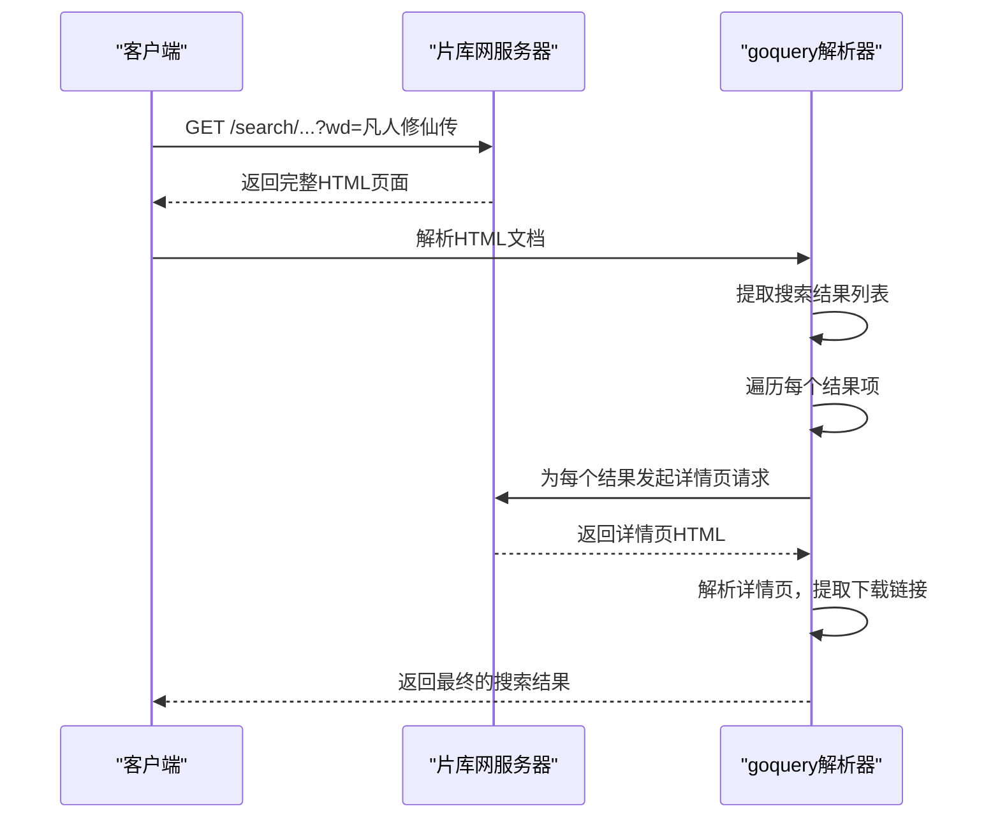
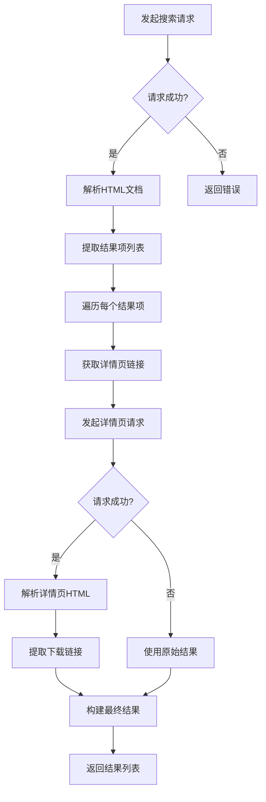
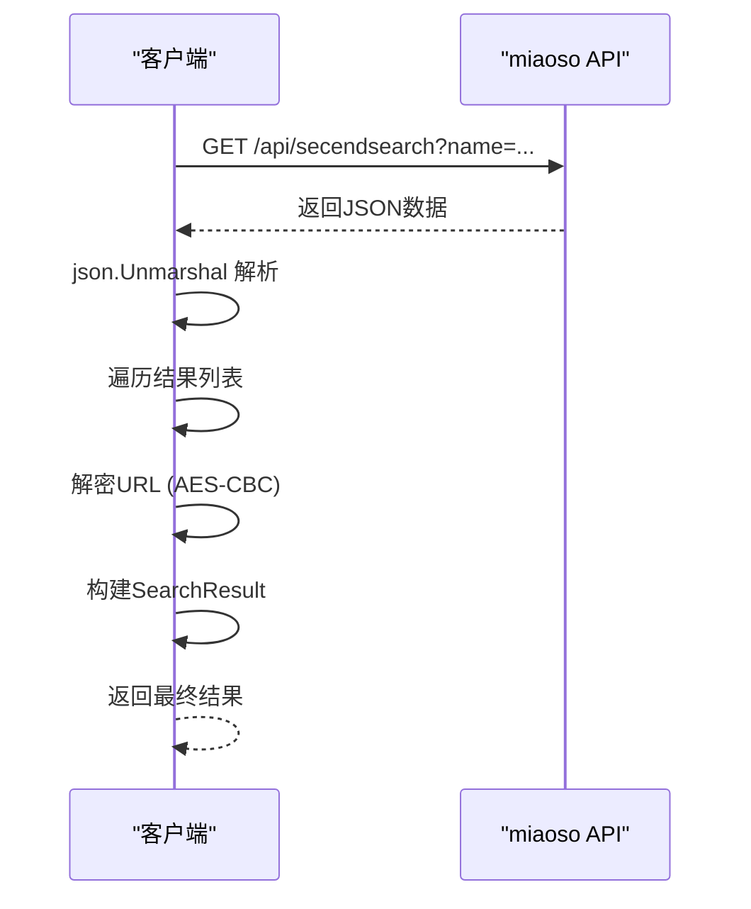

# 动态加载内容处理

<cite>
**本文档引用文件**   
- [pianku.go](file://plugin\pianku\pianku.go)
- [jutoushe.go](file://plugin\jutoushe\jutoushe.go)
- [html结构分析.md](file://plugin\pianku\html结构分析.md)
- [html结构分析.md](file://plugin\jutoushe\html结构分析.md)
- [miaoso.go](file://plugin\miaoso\miaoso.go)
- [json结构分析.md](file://plugin\miaoso\json结构分析.md)
- [huban.go](file://plugin\huban\huban.go)
- [json结构分析.md](file://plugin\huban\json结构分析.md)
- [ouge.go](file://plugin\ouge\ouge.go)
- [json结构分析.md](file://plugin\ouge\json结构分析.md)
</cite>

## 目录
1. [引言](#引言)
2. [片库网（pianku）动态内容处理](#片库网pianku动态内容处理)
3. [剧透社（jutoushe）动态内容处理](#剧透社jutoushe动态内容处理)
4. [API驱动型数据源分析](#api驱动型数据源分析)
5. [反爬策略与请求头构造](#反爬策略与请求头构造)
6. [从HTML解析到API调用的迁移路径](#从html解析到api调用的迁移路径)
7. [无法绕过前端渲染时的备选方案](#无法绕过前端渲染时的备选方案)
8. [总结](#总结)

## 引言

本文档深入探讨了在网页搜索场景中，如何识别和处理由JavaScript动态渲染的内容，特别是针对使用Ajax或前端框架异步加载搜索结果的网站。以“片库网”（pianku）和“剧透社”（jutoushe）等站点为例，分析其前端渲染特征和数据加载模式。文档结合实际的Go语言插件代码，阐述了如何通过抓包分析确定真实的数据源，将原本依赖HTML解析的逻辑转换为直接调用内部API获取JSON数据。内容涵盖请求头构造、反爬策略应对、分页参数推导等关键技术细节，并提供从传统HTML解析降级到高效API调用的完整迁移路径。

## 片库网（pianku）动态内容处理

### 请求特征与数据接口模式

片库网（btnull.pro）的搜索功能采用传统的服务器端渲染（SSR）模式，而非现代的Ajax异步加载。其搜索请求是通过构造一个包含关键词参数的GET请求直接访问搜索结果页面URL来完成的。请求URL的格式为`https://btnull.pro/search/-------------.html?wd={关键词}`。这表明，搜索结果并非通过独立的JSON API返回，而是作为完整的HTML页面的一部分由服务器直接生成并返回。

尽管其渲染方式并非动态JavaScript加载，但其数据获取模式仍可被视为一种“静态API”调用。通过分析其`pianku.go`插件代码，可以发现其`searchImpl`函数通过`http.NewRequestWithContext`发起请求，并使用`goquery`库解析返回的HTML文档。这与直接调用JSON API相比，效率较低，因为需要下载和解析整个HTML页面，而不仅仅是所需的数据。

**图示来源**
- [pianku.go](file://plugin\pianku\pianku.go#L150-L250)
- [html结构分析.md](file://plugin\pianku\html结构分析.md)

### 从HTML解析到API调用的迁移分析

对于片库网这类站点，由于其后端并未暴露独立的JSON API，因此无法直接将其HTML解析逻辑“迁移”为API调用。其`pianku.go`插件的实现方式是当前最直接和有效的方法。然而，这种模式存在明显的性能瓶颈：需要为每个搜索结果项额外发起一次HTTP请求来获取详情页的下载链接，这导致了“N+1查询”问题。

理论上，如果片库网提供了类似`/api/search`的JSON接口，迁移路径将非常清晰：移除`goquery`依赖，直接使用`json.Unmarshal`解析响应。但目前，这种迁移是不可行的。因此，对于此类站点，优化重点应放在请求头模拟、重试机制和缓存策略上，而非改变数据获取的根本模式。

**本节来源**
- [pianku.go](file://plugin\pianku\pianku.go)
- [html结构分析.md](file://plugin\pianku\html结构分析.md)

## 剧透社（jutoushe）动态内容处理

### 请求特征与数据接口模式

剧透社（1.star2.cn）的搜索机制与片库网类似，同样采用服务器端渲染。其搜索请求通过`https://1.star2.cn/search/?keyword={关键词}`的GET请求完成。`jutoushe.go`插件的`searchImpl`函数同样使用`http.NewRequestWithContext`发起请求，并通过`goquery`解析返回的HTML。

其HTML结构分析文档明确指出，搜索结果以列表形式展示，每个结果项包含标题、链接和发布时间。插件通过`doc.Find("ul.erx-list li.item")`选择器定位结果项，并从中提取信息。与片库网不同的是，剧透社的详情页包含了直接的下载链接，因此插件需要为每个结果项发起一次详情页请求来获取这些链接。

**图示来源**
- [jutoushe.go](file://plugin\jutoushe\jutoushe.go#L80-L150)
- [html结构分析.md](file://plugin\jutoushe\html结构分析.md)

### 反爬策略应对

剧透社的反爬策略相对基础。`jutoushe.go`插件通过在`searchImpl`函数中设置特定的请求头来模拟真实浏览器，以避免被识别为爬虫。关键的请求头包括：
- **User-Agent**: 模拟Chrome浏览器。
- **Accept**: 声明可接受的响应类型。
- **Accept-Language**: 声明语言偏好。
- **Referer**: 设置为站点的根目录`https://1.star2.cn/`，模拟用户从首页发起搜索。

此外，插件还实现了`doRequestWithRetry`函数，采用指数退避算法进行重试，以应对网络波动或临时的服务器错误。这种策略对于处理不稳定的网络环境非常有效。

**本节来源**
- [jutoushe.go](file://plugin\jutoushe\jutoushe.go)

## API驱动型数据源分析

### 直接调用内部API获取JSON数据

与上述两个站点不同，`miaoso`、`huban`和`ouge`等插件展示了如何直接与后端API交互，获取结构化的JSON数据。这是一种更高效、更现代的数据获取方式。

以`miaoso.go`为例，其`searchImpl`函数请求的URL为`https://miaosou.fun/api/secendsearch?name={关键词}&pageNo=1`。服务器返回的是纯JSON数据，插件通过`json.Unmarshal`直接将其反序列化为Go结构体`MiaosouResponse`。这种方式避免了HTML解析的开销，数据结构清晰，易于处理。

**图示来源**
- [miaoso.go](file://plugin\miaoso\miaoso.go#L120-L180)
- [json结构分析.md](file://plugin\miaoso\json结构分析.md)

### 分页参数推导

对于支持分页的API，如`miaoso`，分页参数通常通过查询字符串传递。`miaoso.go`中的`pageNo=1`参数明确指示了请求第一页的数据。要获取后续页面，只需递增`pageNo`的值即可。这种模式简单直接，易于在代码中实现循环遍历。

相比之下，`huban`和`ouge`插件虽然也使用JSON API，但其响应中包含了`page`、`pagecount`和`total`等字段，这为实现更智能的分页逻辑（如根据总页数决定是否继续请求）提供了可能。

**本节来源**
- [miaoso.go](file://plugin\miaoso\miaoso.go)
- [huban.go](file://plugin\huban\huban.go)
- [ouge.go](file://plugin\ouge\ouge.go)

## 反爬策略与请求头构造

### 请求头构造

所有插件都通过`setRequestHeaders`或类似函数精心构造请求头，以模拟真实用户。通用的请求头包括：
- **User-Agent**: 模拟主流浏览器。
- **Accept**: 声明可接受的媒体类型。
- **Accept-Language**: 声明语言偏好。
- **Connection**: 保持连接。

特定站点可能有额外要求：
- **Referer**: `pianku.go`和`jutoushe.go`都设置了`Referer`头，指向站点根目录，这是防止直接链接访问的常见反爬手段。
- **自定义头**: `miaoso.go`设置了一个名为`satoken`的自定义头，其值为一个固定的令牌`503eb9c9-a07f-485c-a659-6c99facbb67f`。这表明该API需要某种形式的身份验证或会话令牌，这是更高级的反爬策略。

### 数据加密与解密

`miaoso.go`插件揭示了一种更复杂的反爬机制：数据加密。其API返回的`url`字段是经过AES-CBC加密的Base64字符串。插件必须使用预定义的密钥（`AESKey = "4OToScUFOaeVTrHE"`）和IV（`AESIV = "9CLGao1vHKqm17Oz"`）进行解密，才能得到真实的网盘链接。这增加了逆向工程的难度。

**本节来源**
- [pianku.go](file://plugin\pianku\pianku.go#L270-L280)
- [jutoushe.go](file://plugin\jutoushe\jutoushe.go#L100-L110)
- [miaoso.go](file://plugin\miaoso\miaoso.go#L230-L240)

## 从HTML解析到API调用的迁移路径

### 迁移的可行性与步骤

将HTML解析逻辑迁移为API调用，其可行性完全取决于目标站点是否暴露了可用的内部API。对于`pianku`和`jutoushe`，由于其后端未提供此类接口，迁移不可行。而对于`miaoso`，其插件本身就是基于API调用的，无需迁移。

迁移路径通常遵循以下步骤：
1.  **抓包分析**: 使用浏览器开发者工具的“网络”面板，监控搜索操作期间发出的所有HTTP请求。
2.  **识别真实数据源**: 在众多请求中，寻找返回JSON数据的请求，其URL通常包含`/api/`、`/json/`或`/data/`等路径。
3.  **分析请求参数**: 确定API调用所需的参数（如`keyword`、`page`）、请求方法（GET/POST）和必要的请求头（如`Referer`、`User-Agent`、自定义认证头）。
4.  **实现API调用**: 在代码中使用HTTP客户端直接请求该API端点，替代原有的HTML页面请求。
5.  **解析JSON响应**: 使用JSON解析库（如Go的`encoding/json`）将响应体反序列化为程序内的数据结构。
6.  **移除HTML解析逻辑**: 删除所有与`goquery`或类似HTML解析库相关的代码。

### 性能与可靠性对比

| 特性 | HTML解析 | API调用 |
| :--- | :--- | :--- |
| **数据量** | 大（整个HTML页面） | 小（仅所需数据） |
| **解析开销** | 高（DOM解析） | 低（JSON反序列化） |
| **网络延迟** | 较高 | 较低 |
| **可靠性** | 低（依赖HTML结构稳定） | 高（依赖API契约稳定） |
| **反爬难度** | 低（易被检测） | 高（更难区分） |

**本节来源**
- [miaoso.go](file://plugin\miaoso\miaoso.go)
- [pianku.go](file://plugin\pianku\pianku.go)

## 无法绕过前端渲染时的备选方案

当目标站点完全依赖前端JavaScript渲染，且无法通过抓包找到可用的API时，集成Headless浏览器成为唯一可行的备选方案。

### Headless浏览器的可行性

Headless浏览器（如Puppeteer、Playwright或Selenium）可以启动一个无界面的浏览器实例，完全模拟真实用户的行为。它可以：
- 执行页面上的所有JavaScript代码。
- 等待动态内容加载完成。
- 与页面进行交互（如点击、输入）。
- 最终获取到完全渲染后的DOM。

对于`pianku`和`jutoushe`这类站点，虽然当前可通过直接请求HTML页面获取数据，但如果它们未来升级为单页应用（SPA），则必须使用Headless浏览器。

### 性能权衡

集成Headless浏览器的性能开销巨大：
- **资源消耗**: 每个浏览器实例都占用大量内存和CPU。
- **启动时间**: 启动一个浏览器实例需要数秒时间。
- **执行速度**: 执行JavaScript和渲染页面比直接HTTP请求慢几个数量级。

因此，Headless浏览器应作为最后的手段。在可能的情况下，应优先尝试通过抓包分析找到隐藏的API，或分析JavaScript代码以模拟其请求逻辑。

**本节来源**
- [pianku.go](file://plugin\pianku\pianku.go)
- [jutoushe.go](file://plugin\jutoushe\jutoushe.go)

## 总结

本文档通过分析多个实际插件代码，系统性地探讨了处理动态加载内容的策略。核心结论是：**直接调用内部API是获取数据的最优方案**，它高效、可靠且易于维护。对于无法直接调用API的站点，应通过抓包分析尽可能模拟其请求，构造正确的请求头以应对基础反爬策略。当所有其他方法都失效时，集成Headless浏览器是最终的备选方案，但其高昂的性能代价要求我们谨慎使用。开发者应始终优先考虑效率和可维护性，将资源消耗巨大的方案作为最后的选择。