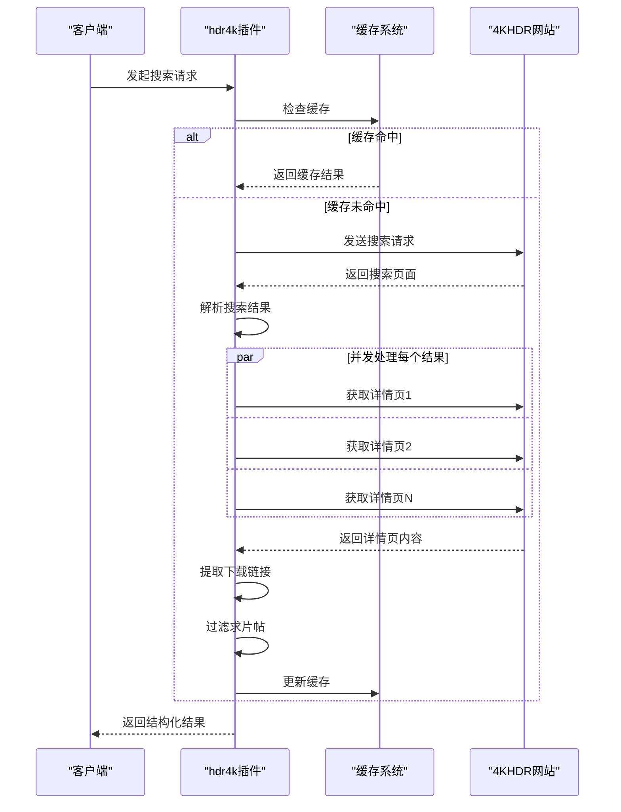
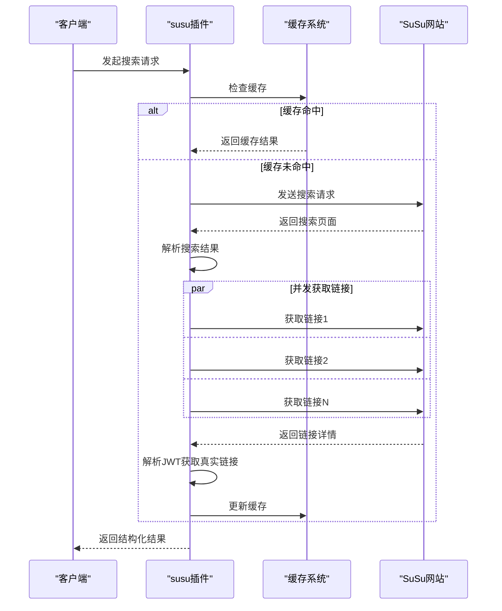

# 解析异常与容错机制

<cite>
**本文档引用文件**   
- [parser_util.go](file://util/parser_util.go)
- [hdr4k.go](file://plugin/hdr4k/hdr4k.go)
- [susu.go](file://plugin/susu/susu.go)
- [设计文档.md](file://plugin/hdr4k/设计文档.md)
- [susu插件设计文档.md](file://plugin/susu/susu插件设计文档.md)
</cite>

## 目录
1. [引言](#引言)
2. [HTML解析常见异常类型](#html解析常见异常类型)
3. [错误捕获与恢复机制](#错误捕获与恢复机制)
4. [优雅降级实现](#优雅降级实现)
5. [缓存机制与稳定性保障](#缓存机制与稳定性保障)
6. [总结](#总结)

## 引言
在网页数据抓取系统中，HTML解析过程常常面临各种异常情况，如网页结构变更、字符编码不一致、网络传输中断等。这些异常可能导致解析失败或数据丢失，影响搜索服务的稳定性。本文档系统性地描述了HTML解析过程中常见的异常类型及其应对策略，重点分析了`parser_util.go`中的错误捕获与恢复机制，并以`hdr4k`和`susu`插件为例，展示如何通过多种技术手段提升插件的鲁棒性。

## HTML解析常见异常类型

### 网页结构变更导致的选择器失效
当目标网站更新其HTML结构时，原有的CSS选择器可能无法匹配到预期的元素，导致数据提取失败。例如，在`hdr4k`插件中，如果网站将帖子标题的CSS类名从`.xs3 a`更改为其他名称，`doSearch`方法中的`titleElement := s.Find("h3.xs3 a")`将无法正确提取标题。

### 字符编码不一致引发的乱码问题
不同网站可能使用不同的字符编码（如UTF-8、GBK等），如果解析时未正确处理编码，会导致中文等非ASCII字符显示为乱码。虽然Go语言的`goquery`库通常能自动处理UTF-8编码，但在某些特殊情况下仍可能出现编码问题。

### 空值或缺失字段的处理
在解析过程中，某些字段可能为空或缺失。例如，在`susu`插件中，`extractPostID`方法尝试从HTML中提取帖子ID，但如果HTML结构发生变化，可能导致`itemID`或`href`属性不存在，从而返回空字符串。

### 网络传输中断
网络请求可能因各种原因中断，如连接超时、服务器拒绝连接、网络不稳定等。这些中断会导致HTTP请求失败，无法获取目标网页内容。

## 错误捕获与恢复机制

### defer+recover模式
Go语言中的`defer`和`recover`机制可以用于捕获和处理运行时恐慌（panic），实现错误恢复。虽然在提供的代码中未直接使用`recover`，但通过`defer`语句确保资源的正确释放，如在`susu`插件中使用`defer resp.Body.Close()`确保HTTP响应体被关闭，避免资源泄漏。

### 默认值填充
在某些情况下，当无法获取有效数据时，可以使用默认值填充。例如，在`hdr4k`插件的`getLinksFromDetail`方法中，即使获取链接失败，仍然返回一个空的`links`切片，而不是完全失败。

### 多备选选择器链
虽然在提供的代码中未直接体现多备选选择器链，但可以通过扩展`goquery`的选择器来实现。例如，可以尝试多个可能的CSS类名来提取标题，确保在其中一个选择器失效时仍能获取数据。

## 优雅降级实现

### hdr4k插件的优雅降级
在`hdr4k`插件中，`doSearch`方法通过并发处理每个搜索结果项，并在获取详情页链接时使用缓存机制。如果获取链接失败，仍然返回结果，但没有链接。这种设计确保了即使部分数据无法获取，整体搜索结果仍能返回。



**图解来源**
- [hdr4k.go](file://plugin/hdr4k/hdr4k.go#L200-L400)
- [设计文档.md](file://plugin/hdr4k/设计文档.md#L131-L188)

### susu插件的优雅降级
在`susu`插件中，`getLinks`方法通过并发发送多个请求来获取网盘链接。如果某个请求失败，仍然尝试其他请求，确保尽可能多地获取有效链接。此外，插件使用缓存机制，避免重复请求。



**图解来源**
- [susu.go](file://plugin/susu/susu.go#L200-L400)
- [susu插件设计文档.md](file://plugin/susu/susu插件设计文档.md#L878-L936)

## 缓存机制与稳定性保障

### 缓存策略
`hdr4k`和`susu`插件均使用`sync.Map`作为内存缓存，存储搜索结果、详情页内容和链接类型等信息。缓存的有效期为1小时，定期清理过期数据，避免内存泄漏。

```go
var (
    detailPageCache   = sync.Map{}  // 详情页缓存
    searchResultCache = sync.Map{}  // 搜索结果缓存
    linkTypeCache     = sync.Map{}  // 链接类型缓存
)
```

### 缓存更新策略
缓存更新采用时间过期（TTL）和定期清理相结合的策略。每次访问缓存时检查是否过期，若未过期则直接返回缓存数据；否则重新请求并更新缓存。

```go
func startCacheCleaner() {
    ticker := time.NewTicker(1 * time.Hour)
    defer ticker.Stop()
    
    for range ticker.C {
        // 清空所有缓存
        detailPageCache = sync.Map{}
        searchResultCache = sync.Map{}
        linkTypeCache = sync.Map{}
    }
}
```

### 网络请求重试机制
为了应对网络波动，插件实现了重试机制。在`hdr4k`和`susu`插件中，`doRequestWithRetry`方法使用指数退避算法进行重试，最大重试次数为2次，避免对服务器造成过大压力。

```go
func (p *Hdr4kAsyncPlugin) doRequestWithRetry(client *http.Client, req *http.Request, maxRetries int) (*http.Response, error) {
    var resp *http.Response
    var err error
    
    for i := 0; i <= maxRetries; i++ {
        if i > 0 {
            backoff := time.Duration(1<<uint(i-1)) * 500 * time.Millisecond
            if backoff > 5*time.Second {
                backoff = 5 * time.Second
            }
            time.Sleep(backoff)
        }
        
        resp, err = client.Do(req)
        if err == nil || !p.isRetriableError(err) {
            break
        }
    }
    
    return resp, err
}
```

## 总结
通过分析`hdr4k`和`susu`插件的实现，可以看出系统在处理HTML解析异常时采用了多种策略，包括错误捕获与恢复、优雅降级、缓存机制和重试机制。这些策略共同保障了搜索服务的稳定性和可靠性，即使在面对各种异常情况时，仍能提供尽可能完整和准确的搜索结果。

**文档来源**
- [parser_util.go](file://util/parser_util.go)
- [hdr4k.go](file://plugin/hdr4k/hdr4k.go)
- [susu.go](file://plugin/susu/susu.go)
- [设计文档.md](file://plugin/hdr4k/设计文档.md)
- [susu插件设计文档.md](file://plugin/susu/susu插件设计文档.md)