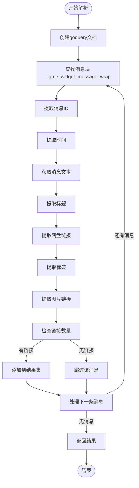
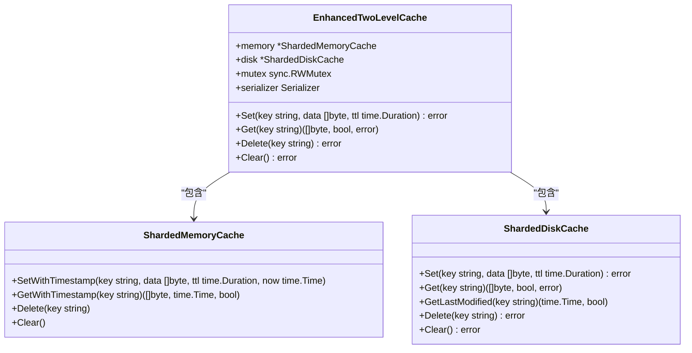

# 解析性能优化策略

<cite>
**本文档引用的文件**   
- [parser_util.go](file://util/parser_util.go)
- [enhanced_two_level_cache.go](file://util/cache/enhanced_two_level_cache.go)
- [baseasyncplugin.go](file://plugin/baseasyncplugin.go)
</cite>

## 目录
1. [引言](#引言)
2. [HTML解析性能瓶颈分析](#html解析性能瓶颈分析)
3. [解析范围与遍历优化](#解析范围与遍历优化)
4. [两级缓存机制](#两级缓存机制)
5. [异步插件执行模型](#异步插件执行模型)
6. [性能测试方法论](#性能测试方法论)
7. [典型优化案例](#典型优化案例)
8. [结论](#结论)

## 引言
本文档全面讲解HTML解析性能瓶颈的识别与优化手段，重点分析GoQuery解析大型HTML文档时的内存占用与CPU消耗问题。通过深入分析`parser_util.go`、`enhanced_two_level_cache.go`和`baseasyncplugin.go`等核心文件，阐述如何通过限制解析范围、提前终止遍历、批量提取字段等方式提升解析效率。同时，探讨两级缓存机制在解析结果缓存中的应用，以及异步插件执行模型如何通过并发控制与资源池管理最大化解析吞吐量。最后，提供性能测试方法论和典型优化案例，为系统性能优化提供全面指导。

## HTML解析性能瓶颈分析

在处理大型HTML文档时，使用GoQuery进行解析会面临显著的性能瓶颈，主要体现在内存占用和CPU消耗两个方面。通过对`parser_util.go`文件的分析，可以识别出具体的性能瓶颈点。



**图示来源**
- [parser_util.go](file://util/parser_util.go#L128-L540)

**本节来源**
- [parser_util.go](file://util/parser_util.go#L1-L627)

## 解析范围与遍历优化

为了提升解析效率，`parser_util.go`中的`ParseSearchResults`函数采用了多种优化手段，包括限制解析范围、提前终止遍历和批量提取字段。

### 限制解析范围
通过精确的CSS选择器，将解析范围限制在必要的消息块内，避免对整个HTML文档进行不必要的遍历。

### 提前终止遍历
在遍历过程中，一旦发现必要信息缺失（如消息ID、时间等），立即终止当前消息的处理，避免无效的后续操作。

### 批量提取字段
将多个字段的提取操作合并，减少DOM遍历次数，提高解析效率。

**本节来源**
- [parser_util.go](file://util/parser_util.go#L128-L540)

## 两级缓存机制

`enhanced_two_level_cache.go`文件实现了一个改进的两级缓存机制，通过内存和磁盘的组合使用，有效减少重复解析开销。

### 缓存结构


**图示来源**
- [enhanced_two_level_cache.go](file://util/cache/enhanced_two_level_cache.go#L11-L16)

### 缓存策略
- **内存缓存**：作为一级缓存，提供快速访问。
- **磁盘缓存**：作为二级缓存，持久化存储，防止重启后数据丢失。
- **异步写入**：设置缓存时，先写入内存，再异步写入磁盘，避免阻塞调用者。

**本节来源**
- [enhanced_two_level_cache.go](file://util/cache/enhanced_two_level_cache.go#L1-L164)

## 异步插件执行模型

`baseasyncplugin.go`文件定义了异步插件执行模型，通过并发控制与资源池管理最大化解析吞吐量。

### 工作池与资源管理
```mermaid
classDiagram
class BaseAsyncPlugin {
+name string
+priority int
+client *http.Client
+backgroundClient *http.Client
+cacheTTL time.Duration
+mainCacheUpdater func(string, []model.SearchResult, time.Duration, bool, string) error
+MainCacheKey string
+currentKeyword string
+finalUpdateTracker map[string]bool
+finalUpdateMutex sync.RWMutex
+skipServiceFilter bool
+AsyncSearch(keyword string, searchFunc func(*http.Client, string, map[string]interface{}) ([]model.SearchResult, error), mainCacheKey string, ext map[string]interface{}) ([]model.SearchResult, error)
+AsyncSearchWithResult(keyword string, searchFunc func(*http.Client, string, map[string]interface{}) ([]model.SearchResult, error), mainCacheKey string, ext map[string]interface{}) (model.PluginSearchResult, error)
}
class cachedResponse {
+Results []model.SearchResult
+Timestamp time.Time
+Complete bool
+LastAccess time.Time
+AccessCount int
}
BaseAsyncPlugin --> cachedResponse : "使用"
```

**图示来源**
- [baseasyncplugin.go](file://plugin/baseasyncplugin.go#L199-L211)

### 并发控制
- **工作池**：通过`backgroundWorkerPool`限制并发任务数量，防止资源耗尽。
- **超时控制**：区分短超时和长超时客户端，确保快速响应和完整处理的平衡。
- **缓存更新**：通过`mainCacheUpdater`函数，将解析结果更新到主缓存，支持最终结果标记。

**本节来源**
- [baseasyncplugin.go](file://plugin/baseasyncplugin.go#L1-L799)

## 性能测试方法论

为了评估和优化系统性能，需要建立一套完整的性能测试方法论，包括基准测试编写和pprof性能分析工具使用。

### 基准测试
编写基准测试用例，测量关键函数的执行时间和内存分配，如`BenchmarkSearch`。

### pprof性能分析
使用pprof工具进行CPU和内存分析，识别性能瓶颈和内存泄漏。

**本节来源**
- [susu插件设计文档.md](file://plugin/susu/susu插件设计文档.md#L1055-L1152)

## 典型优化案例

### 减少DOM遍历次数
通过合并多个选择器操作，减少DOM遍历次数，提高解析效率。

### 复用选择器编译结果
预编译正则表达式和CSS选择器，避免重复编译开销。

**本节来源**
- [panta插件设计文档.md](file://plugin/panta/panta插件设计文档.md#L462-L476)

## 结论
通过对HTML解析性能瓶颈的深入分析，结合解析范围与遍历优化、两级缓存机制和异步插件执行模型，可以显著提升系统的解析效率和吞吐量。同时，建立完善的性能测试方法论，有助于持续优化系统性能，为用户提供更快速、更稳定的服务。