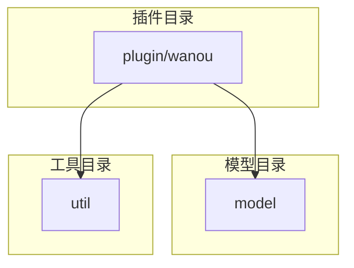
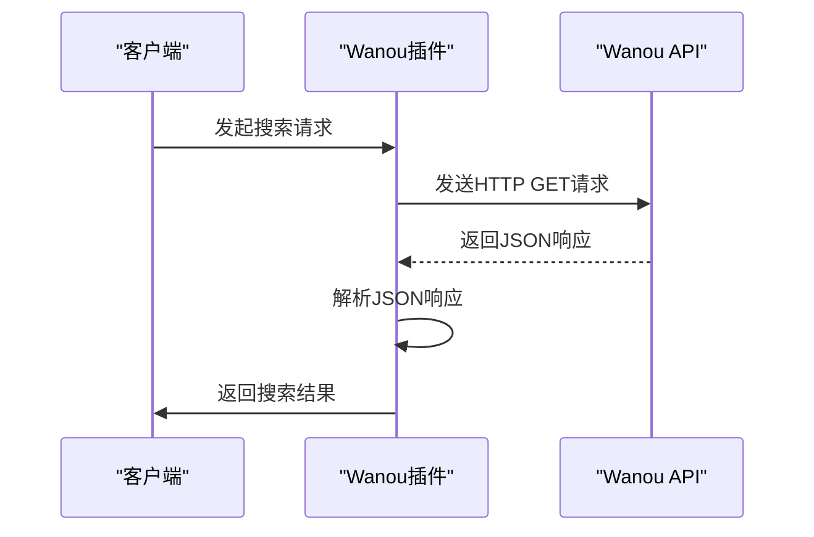
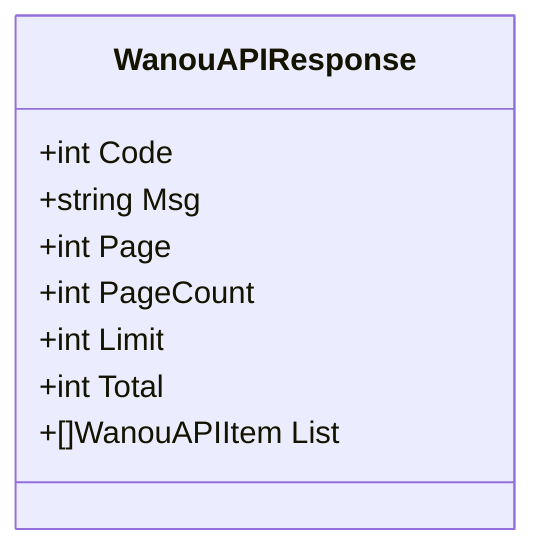
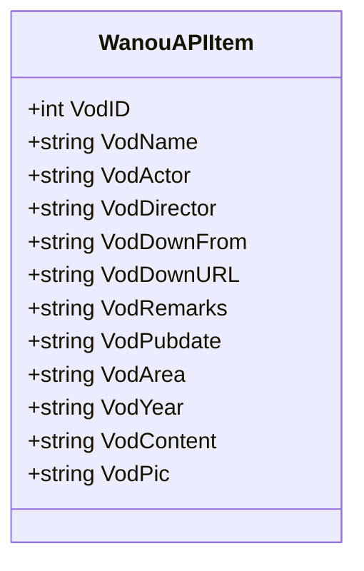
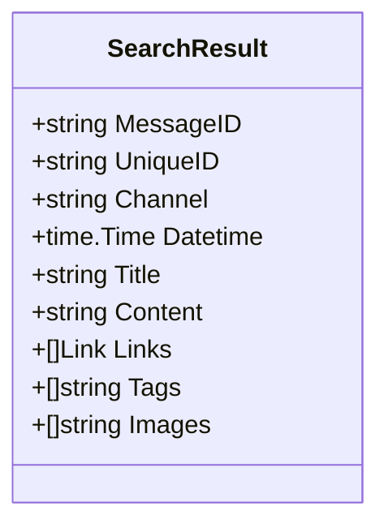
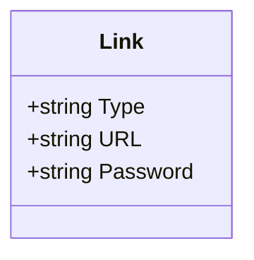
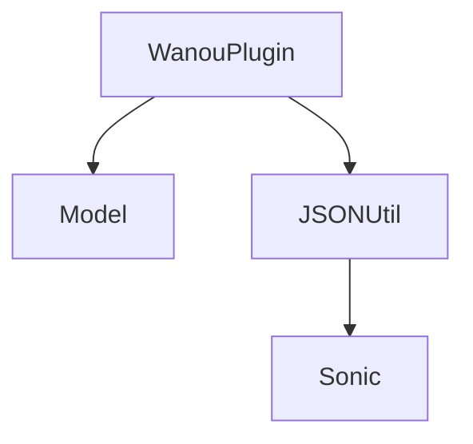

# JSON字段类型处理

<cite>
**本文档引用的文件**
- [wanou.go](file://plugin/wanou/wanou.go)
- [json结构分析.md](file://plugin/wanou/json结构分析.md)
- [response.go](file://model/response.go)
- [json.go](file://util/json/json.go)
</cite>

## 目录
1. [引言](#引言)
2. [项目结构](#项目结构)
3. [核心组件](#核心组件)
4. [架构概述](#架构概述)
5. [详细组件分析](#详细组件分析)
6. [依赖分析](#依赖分析)
7. [性能考虑](#性能考虑)
8. [故障排除指南](#故障排除指南)
9. [结论](#结论)

## 引言
本文档深入探讨在处理Wanou插件API响应时遇到的JSON字段类型转换问题。Wanou插件通过JSON API获取影视资源数据，其响应中包含多种数据类型，如字符串、数字、布尔值以及时间戳等。由于API响应可能存在不规范的情况，例如字段类型不一致或混合类型，因此需要实现健壮的类型解析方案。本文将重点介绍如何使用自定义类型和`UnmarshalJSON`接口来处理这些不规范的API响应，确保解析过程的稳定性和可靠性。

## 项目结构
Wanou插件位于`plugin/wanou`目录下，主要包含两个文件：`wanou.go`和`json结构分析.md`。`wanou.go`是插件的主要实现文件，定义了插件的结构、方法和逻辑。`json结构分析.md`文件详细描述了Wanou API的响应结构，包括顶层结构、单个视频对象结构、下载链接解析规则等。此外，`model/response.go`文件定义了搜索结果和链接的结构，而`util/json/json.go`文件提供了JSON序列化和反序列化的工具。

**Diagram sources**
- [wanou.go](file://plugin/wanou/wanou.go)
- [response.go](file://model/response.go)
- [json.go](file://util/json/json.go)

**Section sources**
- [wanou.go](file://plugin/wanou/wanou.go)
- [json结构分析.md](file://plugin/wanou/json结构分析.md)

## 核心组件
Wanou插件的核心组件包括`WanouAsyncPlugin`结构体、`WanouAPIResponse`和`WanouAPIItem`结构体。`WanouAsyncPlugin`是插件的主要实现，负责发起HTTP请求、解析API响应并生成搜索结果。`WanouAPIResponse`和`WanouAPIItem`结构体分别定义了API响应的顶层结构和单个视频对象的结构。

**Section sources**
- [wanou.go](file://plugin/wanou/wanou.go#L173-L197)

## 架构概述
Wanou插件的架构基于异步搜索模式，通过HTTP客户端与Wanou API进行通信。插件首先构建搜索URL，然后发送HTTP GET请求，接收JSON响应，并使用`json.Unmarshal`方法将响应数据反序列化为Go结构体。解析后的数据被转换为`model.SearchResult`结构体，最终返回给调用者。

**Diagram sources**
- [wanou.go](file://plugin/wanou/wanou.go#L104-L170)

## 详细组件分析

### WanouAPIResponse 结构体分析
`WanouAPIResponse`结构体定义了API响应的顶层结构，包含状态码、消息、分页信息和数据列表。状态码`Code`用于判断API响应是否成功，`List`字段包含具体的视频数据。

**Diagram sources**
- [wanou.go](file://plugin/wanou/wanou.go#L173-L181)

### WanouAPIItem 结构体分析
`WanouAPIItem`结构体定义了单个视频对象的结构，包含视频ID、名称、演员、导演、下载链接等信息。这些字段在解析时需要进行类型转换和验证，以确保数据的完整性和正确性。

**Diagram sources**
- [wanou.go](file://plugin/wanou/wanou.go#L184-L197)

### SearchResult 结构体分析
`SearchResult`结构体定义了搜索结果的格式，包含唯一ID、标题、内容、链接、标签等字段。`Datetime`字段使用`time.Time`类型，需要从API响应中的字符串格式转换而来。

**Diagram sources**
- [response.go](file://model/response.go#L12-L22)

### Link 结构体分析
`Link`结构体定义了网盘链接的格式，包含链接类型、URL和密码。链接类型通过正则表达式匹配确定，密码从URL参数中提取。

**Diagram sources**
- [response.go](file://model/response.go#L5-L9)

**Section sources**
- [wanou.go](file://plugin/wanou/wanou.go#L200-L250)
- [wanou.go](file://plugin/wanou/wanou.go#L253-L294)
- [wanou.go](file://plugin/wanou/wanou.go#L301-L383)
- [wanou.go](file://plugin/wanou/wanou.go#L418-L424)

## 依赖分析
Wanou插件依赖于`model`和`util/json`包。`model`包提供了`SearchResult`和`Link`结构体，用于表示搜索结果和链接。`util/json`包提供了JSON序列化和反序列化的工具，使用`sonic`库进行高效的数据处理。

**Diagram sources**
- [wanou.go](file://plugin/wanou/wanou.go)
- [response.go](file://model/response.go)
- [json.go](file://util/json/json.go)

**Section sources**
- [wanou.go](file://plugin/wanou/wanou.go)
- [response.go](file://model/response.go)
- [json.go](file://util/json/json.go)

## 性能考虑
Wanou插件通过优化HTTP客户端配置和使用连接池来提高性能。插件设置了合理的超时时间和连接池参数，避免了频繁创建和销毁连接的开销。此外，插件还实现了重试机制，以应对网络波动和API响应不稳定的情况。

## 故障排除指南
在使用Wanou插件时，可能会遇到API响应错误、JSON解析失败等问题。建议检查API URL是否正确、网络连接是否稳定、API响应格式是否符合预期。如果问题持续存在，可以查看插件的日志输出，定位具体错误原因。

**Section sources**
- [wanou.go](file://plugin/wanou/wanou.go#L104-L170)

## 结论
本文档详细介绍了Wanou插件在处理JSON字段类型转换时的实现方案。通过使用自定义类型和`UnmarshalJSON`接口，插件能够有效处理不规范的API响应，确保解析过程的稳定性和可靠性。未来可以进一步优化类型转换逻辑，支持更多数据类型和格式。