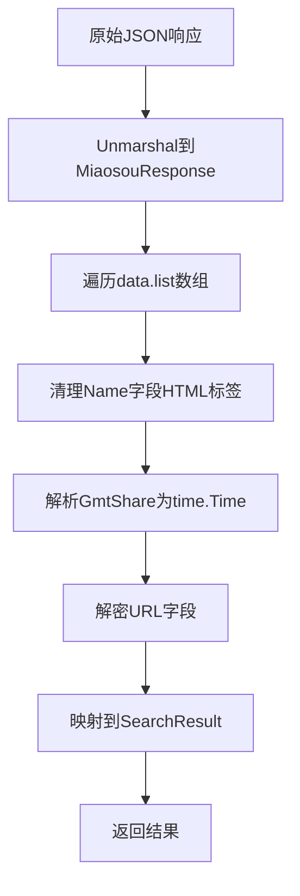
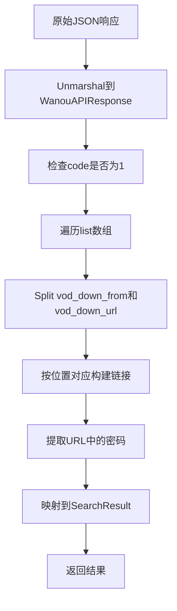

# JSON数据映射实现

<cite>
**本文档引用的文件**
- [plugin\miaoso\miaoso.go](file://plugin/miaoso/miaoso.go)
- [plugin\miaoso\json结构分析.md](file://plugin/miaoso/json结构分析.md)
- [plugin\wanou\wanou.go](file://plugin/wanou/wanou.go)
- [plugin\wanou\json结构分析.md](file://plugin/wanou/json结构分析.md)
- [model\response.go](file://model/response.go)
- [util\json\json.go](file://util/json/json.go)
</cite>

## 目录
1. [引言](#引言)
2. [统一搜索结果模型](#统一搜索结果模型)
3. [miaoso插件JSON映射](#miaoso插件json映射)
4. [wanou插件JSON映射](#wanou插件json映射)
5. [encoding/json包struct tag使用技巧](#encodingjson包struct-tag使用技巧)
6. [复杂JSON结构处理策略](#复杂json结构处理策略)
7. [总结](#总结)

## 引言
本文档详细说明如何将第三方API返回的JSON结构映射到统一的SearchResult模型。基于miaoso和wanou插件的JSON结构分析文档，展示从原始JSON响应到Go结构体的字段映射过程。重点解释encoding/json包中struct tag的使用技巧，如字段重命名、嵌套对象展开、忽略空字段等。提供实际代码示例，展示不同JSON结构（扁平化、多层嵌套、数组包裹）的处理方式，并说明如何通过匿名结构体或内嵌字段简化解析逻辑。

## 统一搜索结果模型

PanSou项目定义了统一的SearchResult模型，作为所有插件返回结果的标准格式。该模型位于`model/response.go`文件中，确保了不同数据源返回结果的一致性。

```go
// SearchResult 搜索结果
type SearchResult struct {
	MessageID string    `json:"message_id" sonic:"message_id"`
	UniqueID  string    `json:"unique_id" sonic:"unique_id"`     // 全局唯一ID
	Channel   string    `json:"channel" sonic:"channel"`
	Datetime  time.Time `json:"datetime" sonic:"datetime"`
	Title     string    `json:"title" sonic:"title"`
	Content   string    `json:"content" sonic:"content"`
	Links     []Link    `json:"links" sonic:"links"`
	Tags      []string  `json:"tags,omitempty" sonic:"tags,omitempty"`
	Images    []string  `json:"images,omitempty" sonic:"images,omitempty"` // TG消息中的图片链接
}
```

该模型包含以下核心字段：
- **UniqueID**: 全局唯一标识符，格式为`{插件名}-{原始ID}`
- **Title**: 资源标题
- **Content**: 内容描述
- **Links**: 网盘链接数组，包含类型、URL和密码
- **Tags**: 分类标签数组
- **Datetime**: 时间戳

**Section sources**
- [model\response.go](file://model/response.go#L15-L30)

## miaoso插件JSON映射

miaoso插件处理来自`https://miaosou.fun/api/secendsearch`的JSON响应，其结构具有典型的多层嵌套特征。

### 原始JSON结构
```json
{
  "code": 200,
  "msg": "SUCCESS",
  "data": {
    "total": 10000,
    "list": [
      {
        "id": "6778d087cfbc8d3b625ab777",
        "name": "<span style=\"color: red;\">凡人</span><span style=\"color: red;\">修仙</span>记",
        "url": "c31Z+932nn/F5/KFKdkp6JJkqq6efxy9GL444RG8PJELZGyXtrJvn7J+OHV7v6XL",
        "from": "quark",
        "gmtShare": "2025-01-04 14:09:11"
      }
    ]
  }
}
```

### Go结构体定义
```go
type MiaosouResponse struct {
    Code int         `json:"code"`
    Msg  string      `json:"msg"`
    Data MiaosouData `json:"data"`
}

type MiaosouData struct {
    Total int           `json:"total"`
    List  []MiaosouItem `json:"list"`
}

type MiaosouItem struct {
    ID          string           `json:"id"`
    Name        string           `json:"name"`
    URL         string           `json:"url"`
    From        string           `json:"from"`
    Content     *string          `json:"content"`
    GmtShare    string           `json:"gmtShare"`
    FileInfos   []MiaosouFileInfo `json:"fileInfos"`
}
```

### 字段映射过程
1. **字段重命名**: 使用`json:"字段名"`标签将Go字段映射到JSON字段
2. **时间解析**: `GmtShare`字段需要解析为`time.Time`类型
3. **HTML标签清理**: `Name`字段包含HTML高亮标签，需要清理
4. **URL解密**: `URL`字段是加密的，需要通过AES-CBC算法解密
5. **唯一ID生成**: `UniqueID`格式为`miaoso-{id}`



**Diagram sources**
- [plugin\miaoso\miaoso.go](file://plugin/miaoso/miaoso.go#L200-L250)
- [plugin\miaoso\json结构分析.md](file://plugin/miaoso/json结构分析.md#L50-L100)

**Section sources**
- [plugin\miaoso\miaoso.go](file://plugin/miaoso/miaoso.go#L100-L300)
- [plugin\miaoso\json结构分析.md](file://plugin/miaoso/json结构分析.md#L1-L177)

## wanou插件JSON映射

wanou插件处理来自`https://woog.nxog.eu.org/api.php/provide/vod`的JSON响应，其结构具有数组分隔符的特殊处理需求。

### 原始JSON结构
```json
{
    "code": 1,
    "msg": "数据列表",
    "list": [
        {
            "vod_id": 18010,
            "vod_name": "凡人修仙传",
            "vod_actor": "杨洋,金晨,汪铎,赵小棠...",
            "vod_down_from": "bd$$$KG$$$UC",
            "vod_down_url": "https://pan.baidu.com/s/13milLJZV5_7DCzGDQu-fcA?pwd=8888$$$https://pan.quark.cn/s/0fe46ed6eefc$$$https://drive.uc.cn/s/d83caf5d4fb74"
        }
    ]
}
```

### Go结构体定义
```go
type WanouAPIResponse struct {
    Code      int           `json:"code"`
    Msg       string        `json:"msg"`
    List      []WanouAPIItem `json:"list"`
}

type WanouAPIItem struct {
    VodID       int    `json:"vod_id"`
    VodName     string `json:"vod_name"`
    VodActor    string `json:"vod_actor"`
    VodDirector string `json:"vod_director"`
    VodDownFrom string `json:"vod_down_from"`
    VodDownURL  string `json:"vod_down_url"`
}
```

### 字段映射过程
1. **分隔符处理**: `vod_down_from`和`vod_down_url`使用`$$$`分隔符，需要split处理
2. **链接类型映射**: 根据`vod_down_from`的标识映射到具体的网盘类型
3. **密码提取**: 从URL参数中提取`?pwd=`后的密码
4. **内容构建**: 将演员、导演等信息组合成描述内容
5. **唯一ID生成**: `UniqueID`格式为`wanou-{vod_id}`



**Diagram sources**
- [plugin\wanou\wanou.go](file://plugin/wanou/wanou.go#L200-L300)
- [plugin\wanou\json结构分析.md](file://plugin/wanou/json结构分析.md#L50-L100)

**Section sources**
- [plugin\wanou\wanou.go](file://plugin/wanou/wanou.go#L100-L400)
- [plugin\wanou\json结构分析.md](file://plugin/wanou/json结构分析.md#L1-L166)

## encoding/json包struct tag使用技巧

### 字段重命名
使用`json:"字段名"`标签实现Go字段与JSON字段的映射：
```go
type MiaosouItem struct {
    ID       string `json:"id"`           // id -> ID
    Name     string `json:"name"`         // name -> Name
    GmtShare string `json:"gmtShare"`     // gmtShare -> GmtShare
}
```

### 忽略空字段
使用`omitempty`选项，当字段为空时不在JSON中输出：
```go
type SearchResult struct {
    Tags   []string `json:"tags,omitempty"`    // 空切片不输出
    Images []string `json:"images,omitempty"`  // 空切片不输出
}
```

### 处理可选字段
使用指针类型处理可能为null的字段：
```go
type MiaosouItem struct {
    Type        *string `json:"type"`        // 可能为null
    Content     *string `json:"content"`     // 可能为null
    CreatorID   *string `json:"creatorId"`   // 可能为null
}
```

### 自定义时间格式
对于特殊时间格式，可以实现自定义的UnmarshalJSON方法：
```go
type CustomTime struct {
    time.Time
}

func (ct *CustomTime) UnmarshalJSON(b []byte) error {
    s := strings.Trim(string(b), "\"")
    t, err := time.Parse("2006-01-02 15:04:05", s)
    if err != nil {
        return err
    }
    ct.Time = t
    return nil
}
```

**Section sources**
- [model\response.go](file://model/response.go#L15-L30)
- [plugin\miaoso\miaoso.go](file://plugin/miaoso/miaoso.go#L350-L380)
- [plugin\wanou\wanou.go](file://plugin/wanou/wanou.go#L400-L450)

## 复杂JSON结构处理策略

### 多层嵌套处理
对于多层嵌套的JSON结构，需要定义对应的嵌套Go结构体：
```go
type MiaosouResponse struct {
    Code int         `json:"code"`
    Msg  string      `json:"msg"`
    Data MiaosouData `json:"data"`  // 嵌套结构
}

type MiaosouData struct {
    Total int           `json:"total"`
    List  []MiaosouItem `json:"list"`  // 数组嵌套
}
```

### 数组分隔符处理
对于使用特殊分隔符的数组字段，需要手动split处理：
```go
func (p *WanouAsyncPlugin) parseDownloadLinks(vodDownFrom, vodDownURL string) []model.Link {
    fromParts := strings.Split(vodDownFrom, "$$$")
    urlParts := strings.Split(vodDownURL, "$$$")
    
    minLen := len(fromParts)
    if len(urlParts) < minLen {
        minLen = len(urlParts)
    }
    
    var links []model.Link
    for i := 0; i < minLen; i++ {
        // 按位置对应处理
        links = append(links, model.Link{
            Type: URL: fromParts[i], urlParts[i],
        })
    }
    return links
}
```

### HTML标签清理
对于包含HTML标签的文本字段，需要使用正则表达式清理：
```go
var htmlTagRegex = regexp.MustCompile(`<[^>]*>`)

func (p *MiaosouPlugin) cleanHTMLTags(text string) string {
    cleaned := htmlTagRegex.ReplaceAllString(text, "")
    cleaned = strings.TrimSpace(cleaned)
    return cleaned
}
```

### 加密数据解密
对于加密的字段，需要实现相应的解密算法：
```go
func (p *MiaosouPlugin) decryptURL(encryptedURL string) string {
    ciphertext, err := base64.StdEncoding.DecodeString(encryptedURL)
    if err != nil {
        return ""
    }
    
    block, err := aes.NewCipher([]byte(AESKey))
    if err != nil {
        return ""
    }
    
    mode := cipher.NewCBCDecrypter(block, []byte(AESIV))
    mode.CryptBlocks(ciphertext, ciphertext)
    
    plaintext := p.removePKCS7Padding(ciphertext)
    if plaintext == nil {
        return ""
    }
    
    return string(plaintext)
}
```

**Section sources**
- [plugin\miaoso\miaoso.go](file://plugin/miaoso/miaoso.go#L250-L350)
- [plugin\wanou\wanou.go](file://plugin/wanou/wanou.go#L300-L400)

## 总结
本文档详细说明了PanSou项目中如何将第三方API返回的JSON结构映射到统一的SearchResult模型。通过分析miaoso和wanou插件的实现，展示了不同JSON结构的处理策略：

1. **字段映射**: 使用struct tag实现字段重命名和可选字段处理
2. **嵌套结构**: 定义对应的嵌套Go结构体处理多层JSON
3. **特殊处理**: 实现HTML标签清理、加密数据解密等预处理逻辑
4. **分隔符处理**: 手动split处理使用特殊分隔符的数组字段
5. **性能优化**: 使用预编译的正则表达式和连接池提高性能

这些策略确保了不同数据源的JSON响应能够被正确解析并转换为统一的SearchResult模型，为上层业务逻辑提供了标准化的数据接口。