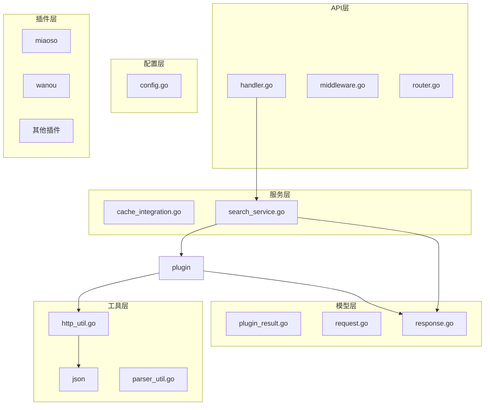
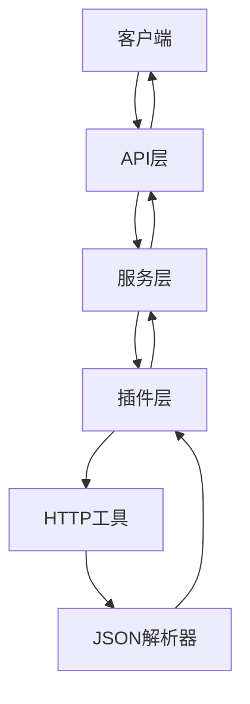
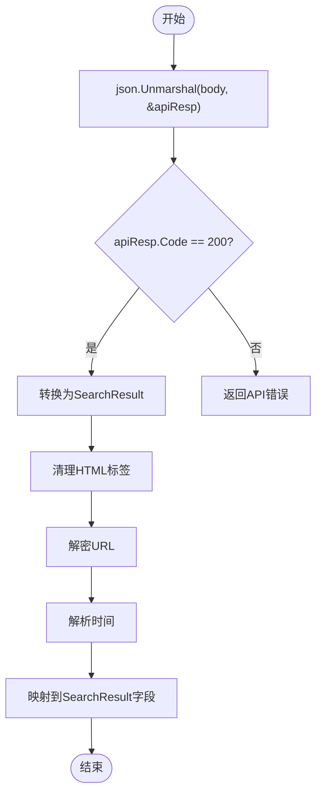
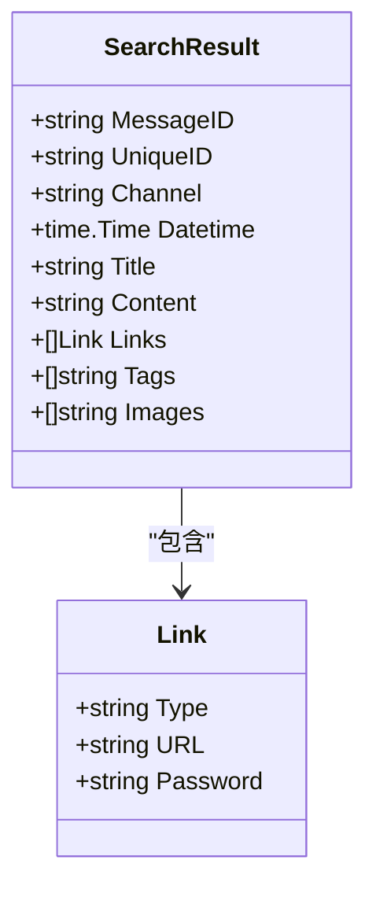
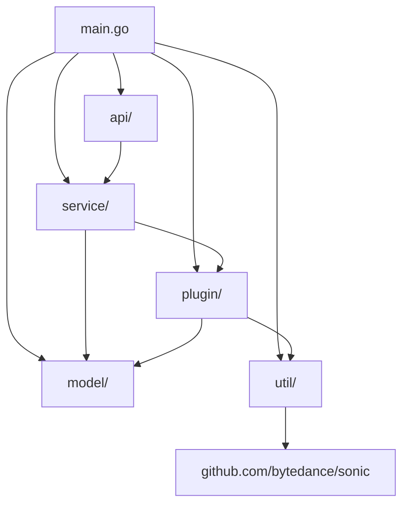

# JSON解析逻辑实现

<cite>
**本文档引用的文件**
- [miaoso.go](file://plugin/miaoso/miaoso.go)
- [wanou.go](file://plugin/wanou/wanou.go)
- [json结构分析.md](file://plugin/miaoso/json结构分析.md)
- [json结构分析.md](file://plugin/wanou/json结构分析.md)
- [response.go](file://model/response.go)
- [json.go](file://util/json/json.go)
</cite>

## 目录
1. [引言](#引言)
2. [项目结构](#项目结构)
3. [核心组件](#核心组件)
4. [架构概述](#架构概述)
5. [详细组件分析](#详细组件分析)
6. [依赖分析](#依赖分析)
7. [性能考虑](#性能考虑)
8. [故障排除指南](#故障排除指南)
9. [结论](#结论)

## 引言
本文档详细阐述了基于`encoding/json`包实现的JSON响应数据解析流程，结合miaoso和wanou插件的JSON结构分析文档，说明如何将第三方API返回的JSON结构映射到统一的`SearchResult`模型。涵盖嵌套JSON解析、字段类型转换、可选字段处理、错误容错机制等关键技术点。提供结构体定义示例和Unmarshal技巧，包括使用tag标签、自定义UnmarshalJSON方法等。分析常见问题如字段缺失、类型不匹配、时间格式转换等，并给出健壮性处理建议。

## 项目结构
项目采用模块化设计，主要分为API层、配置层、模型层、插件层、服务层和工具层。插件层包含多个第三方搜索源的实现，每个插件负责与特定API通信并解析响应数据。模型层定义了统一的数据结构，用于在系统各组件间传递搜索结果。工具层提供了JSON处理、HTTP请求等通用功能。



**Diagram sources**
- [main.go](file://main.go#L1-L20)
- [model/response.go](file://model/response.go#L1-L67)

**Section sources**
- [main.go](file://main.go#L1-L50)
- [go.mod](file://go.mod#L1-L10)

## 核心组件
核心组件包括JSON解析器、搜索结果模型和插件系统。JSON解析器基于`sonic`库实现，提供高性能的序列化和反序列化功能。搜索结果模型定义了统一的数据结构，确保不同来源的数据能够被一致处理。插件系统允许灵活扩展，支持多种第三方API。

**Section sources**
- [json.go](file://util/json/json.go#L1-L48)
- [response.go](file://model/response.go#L1-L67)
- [miaoso.go](file://plugin/miaoso/miaoso.go#L1-L380)
- [wanou.go](file://plugin/wanou/wanou.go#L1-L468)

## 架构概述
系统架构采用分层设计，从上到下分别为API层、服务层、插件层和工具层。API层接收外部请求并返回响应，服务层协调搜索流程，插件层与第三方API交互，工具层提供基础功能支持。数据流从API层开始，经过服务层调度到相应插件，插件获取并解析JSON响应，最终将标准化的搜索结果返回给API层。



**Diagram sources**
- [api/handler.go](file://api/handler.go#L1-L50)
- [service/search_service.go](file://service/search_service.go#L1-L30)
- [plugin/miaoso/miaoso.go](file://plugin/miaoso/miaoso.go#L1-L380)
- [plugin/wanou/wanou.go](file://plugin/wanou/wanou.go#L1-L468)

## 详细组件分析
### miaoso插件分析
miaoso插件通过GET请求访问`https://miaosou.fun/api/secendsearch`接口，获取JSON格式的搜索结果。响应数据包含代码、消息和数据三个字段，其中数据字段包含总数和结果列表。每个结果项包含ID、名称、加密URL、来源平台、内容、创建时间、分享时间等信息。

#### JSON解析流程


**Diagram sources**
- [miaoso.go](file://plugin/miaoso/miaoso.go#L150-L250)
- [json结构分析.md](file://plugin/miaoso/json结构分析.md#L1-L178)

**Section sources**
- [miaoso.go](file://plugin/miaoso/miaoso.go#L1-L380)
- [json结构分析.md](file://plugin/miaoso/json结构分析.md#L1-L178)

### wanou插件分析
wanou插件通过GET请求访问`https://woog.nxog.eu.org/api.php/provide/vod`接口，获取JSON格式的影视资源数据。响应数据包含状态码、消息、分页信息和数据列表。每个数据项包含视频ID、名称、演员、导演、下载链接等信息。

#### 下载链接解析
```mermaid
flowchart TD
Start([开始]) --> Split["split(vodDownFrom, \"$$$\")"]
Split --> Loop["遍历每个下载源"]
Loop --> ExtractPassword["提取密码"]
Loop --> DetermineType["确定链接类型"]
DetermineType --> CreateLink["创建Link对象"]
CreateLink --> AddToLinks["添加到links数组"]
Loop --> |完成| End([结束])
```

**Diagram sources**
- [wanou.go](file://plugin/wanou/wanou.go#L250-L350)
- [json结构分析.md](file://plugin/wanou/json结构分析.md#L1-L167)

**Section sources**
- [wanou.go](file://plugin/wanou/wanou.go#L1-L468)
- [json结构分析.md](file://plugin/wanou/json结构分析.md#L1-L167)

### 统一搜索结果模型
所有插件最终都将第三方API的响应数据转换为统一的`SearchResult`模型，确保数据的一致性和可处理性。



**Diagram sources**
- [response.go](file://model/response.go#L5-L22)
- [miaoso.go](file://plugin/miaoso/miaoso.go#L346-L350)
- [wanou.go](file://plugin/wanou/wanou.go#L173-L181)

**Section sources**
- [response.go](file://model/response.go#L1-L67)

## 依赖分析
系统依赖主要分为内部依赖和外部依赖。内部依赖包括各模块间的调用关系，外部依赖包括`sonic`库用于JSON处理，`http`库用于网络请求。



**Diagram sources**
- [go.mod](file://go.mod#L1-L20)
- [main.go](file://main.go#L1-L15)

**Section sources**
- [go.mod](file://go.mod#L1-L30)
- [go.sum](file://go.sum#L1-L50)

## 性能考虑
JSON解析性能是系统关键指标之一。系统采用`sonic`库替代标准库，提供更快的序列化和反序列化速度。同时，通过连接池复用HTTP连接，减少网络开销。插件实现中采用指数退避重试机制，平衡请求成功率和响应时间。

**Section sources**
- [json.go](file://util/json/json.go#L1-L48)
- [wanou.go](file://plugin/wanou/wanou.go#L50-L100)

## 故障排除指南
### 常见问题及解决方案
1. **JSON解析失败**：检查响应数据格式是否符合预期，确认字段名称和类型匹配。
2. **链接解密失败**：验证密钥和IV是否正确，检查填充方式。
3. **时间解析失败**：确认时间格式字符串正确，处理空值情况。
4. **网络请求超时**：调整超时时间，检查网络连接。

**Section sources**
- [miaoso.go](file://plugin/miaoso/miaoso.go#L200-L250)
- [wanou.go](file://plugin/wanou/wanou.go#L400-L450)

## 结论
本文档详细阐述了JSON响应数据的解析流程，基于`encoding/json`包实现反序列化，结合miaoso和wanou插件的JSON结构分析文档，说明了如何将第三方API返回的JSON结构映射到统一的`SearchResult`模型。涵盖了嵌套JSON解析、字段类型转换、可选字段处理、错误容错机制等关键技术点。通过使用tag标签、自定义UnmarshalJSON方法等技巧，实现了高效、健壮的JSON解析。针对字段缺失、类型不匹配、时间格式转换等常见问题，提供了具体的处理建议，确保系统在各种情况下都能稳定运行。