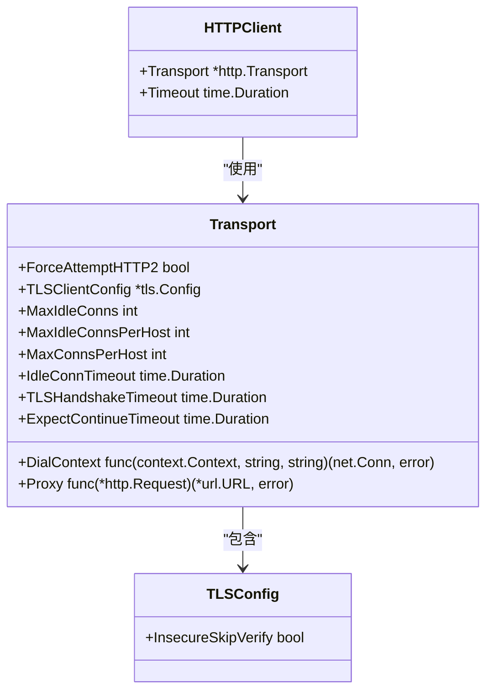
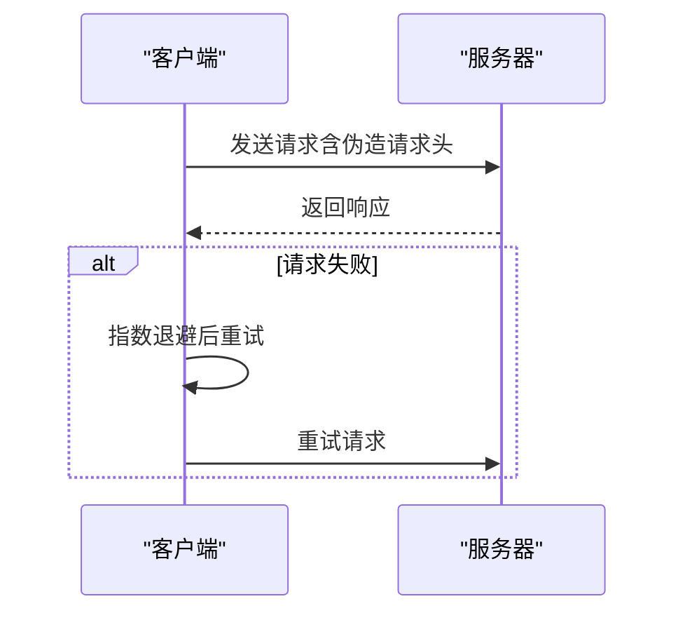
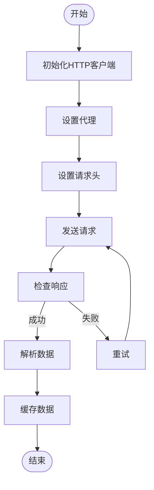

# 反爬虫机制应对策略

<cite>
**本文档引用的文件**
- [http_util.go](file://util/http_util.go)
- [config.go](file://config/config.go)
- [hdr4k.go](file://plugin/hdr4k/hdr4k.go)
- [susu.go](file://plugin/susu/susu.go)
- [baseasyncplugin.go](file://plugin/baseasyncplugin.go)
</cite>

## 目录
1. [引言](#引言)
2. [HTTP客户端配置与管理](#http客户端配置与管理)
3. [反爬虫机制应对技术](#反爬虫机制应对技术)
4. [插件实现分析](#插件实现分析)
5. [配置建议](#配置建议)
6. [结论](#结论)

## 引言
在插件开发中，面对目标网站的反爬虫机制是常见的挑战。这些机制包括但不限于User-Agent检测、请求频率限制、IP封锁等。本文档系统性地介绍如何在插件开发中应对这些常见的反爬虫机制，重点分析基于`http_util.go`的HTTP客户端配置，以及`hdr4k`和`susu`插件如何通过模拟浏览器行为绕过基础防护。通过合理设置请求频率、使用会话保持和处理验证码的通用思路，开发者可以有效提升爬虫的稳定性和效率。

## HTTP客户端配置与管理
HTTP客户端的配置是应对反爬虫机制的基础。通过`http_util.go`文件中的`InitHTTPClient`函数，可以初始化一个优化的HTTP客户端，该客户端支持HTTP/2、连接池优化和代理配置。

**图表来源**
- [http_util.go](file://util/http_util.go#L1-L125)

**本节来源**
- [http_util.go](file://util/http_util.go#L1-L125)

## 反爬虫机制应对技术
### User-Agent轮换
User-Agent轮换是模拟不同浏览器访问的有效手段。`hdr4k`和`susu`插件中都定义了多个User-Agent，并通过`getRandomUA`函数随机选择一个使用，以减少被识别为爬虫的风险。

### 请求间隔控制
通过设置合理的请求间隔，可以避免因请求过于频繁而被封禁。`hdr4k`插件中的`doRequestWithRetry`函数实现了指数退避算法，确保在请求失败时能够适当延迟重试。

### IP代理配置
利用`golang.org/x/net/proxy`包，可以在HTTP客户端中配置SOCKS5或HTTP代理，从而改变请求的来源IP。`http_util.go`中的`InitHTTPClient`函数检查配置文件中的代理设置，并相应地配置传输层。

### 请求头伪造
除了User-Agent，还可以伪造其他请求头，如`Accept`、`Accept-Language`、`Referer`等，以更真实地模拟浏览器行为。`FetchHTML`函数中设置了多个请求头，以提高请求的成功率。

**图表来源**
- [http_util.go](file://util/http_util.go#L1-L125)
- [hdr4k.go](file://plugin/hdr4k/hdr4k.go#L1-L682)

**本节来源**
- [http_util.go](file://util/http_util.go#L1-L125)
- [hdr4k.go](file://plugin/hdr4k/hdr4k.go#L1-L682)

## 插件实现分析
### hdr4k插件
`hdr4k`插件通过POST请求发送搜索关键词，并在请求头中设置随机User-Agent和Referer。插件还实现了缓存机制，以减少重复请求，提高响应速度。

### susu插件
`susu`插件通过GET请求获取搜索结果，并进一步请求网盘按钮详情。插件使用JWT token解析真实链接，并通过缓存机制减少重复请求。

**图表来源**
- [hdr4k.go](file://plugin/hdr4k/hdr4k.go#L1-L682)
- [susu.go](file://plugin/susu/susu.go#L1-L592)

**本节来源**
- [hdr4k.go](file://plugin/hdr4k/hdr4k.go#L1-L682)
- [susu.go](file://plugin/susu/susu.go#L1-L592)

## 配置建议
- **合理设置请求频率**：避免过于频繁的请求，建议使用指数退避算法进行重试。
- **使用会话保持**：通过设置Cookie和保持连接，模拟真实用户的浏览行为。
- **处理验证码**：对于需要验证码的网站，可以考虑使用第三方服务或手动输入。
- **监控和日志**：记录请求和响应的详细信息，便于调试和优化。

## 结论
通过合理配置HTTP客户端、轮换User-Agent、控制请求间隔、配置IP代理和伪造请求头，可以有效应对常见的反爬虫机制。`hdr4k`和`susu`插件的实现提供了具体的参考，开发者可以根据具体需求进行调整和优化。