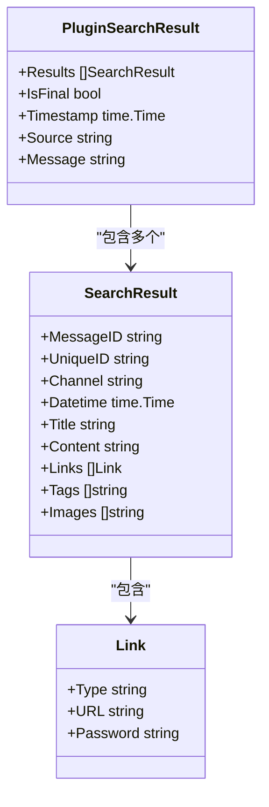
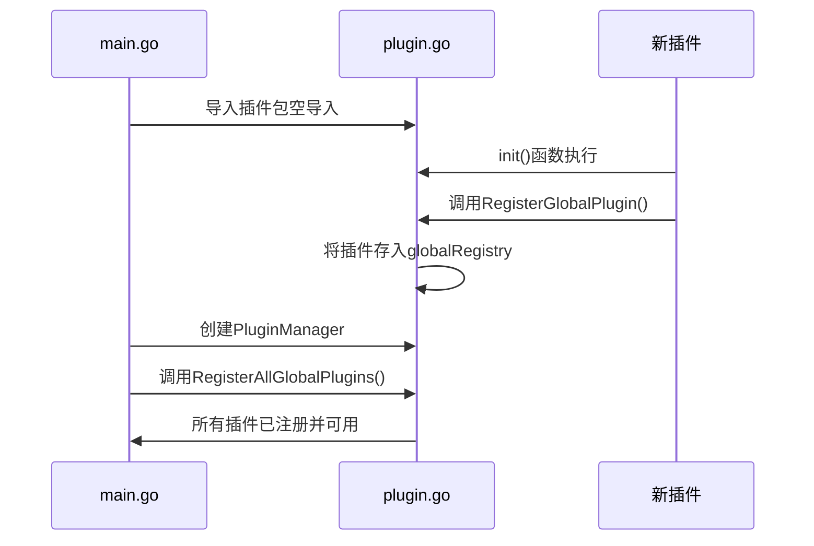
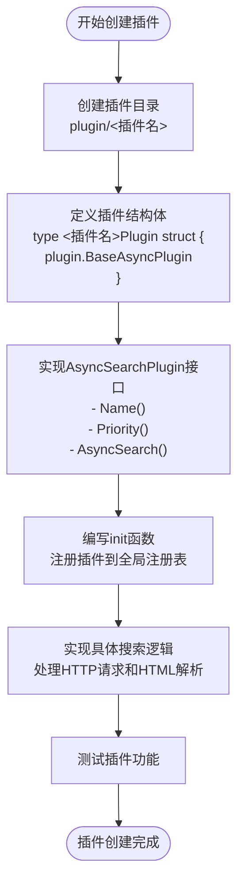

# 插件创建与注册

<cite>
**本文档引用的文件**  
- [baseasyncplugin.go](file://plugin/baseasyncplugin.go)
- [plugin.go](file://plugin/plugin.go)
- [request.go](file://model/request.go)
- [plugin_result.go](file://model/plugin_result.go)
- [response.go](file://model/response.go)
</cite>

## 目录
1. [引言](#引言)
2. [插件接口定义](#插件接口定义)
3. [搜索请求与结果结构](#搜索请求与结果结构)
4. [插件注册机制](#插件注册机制)
5. [创建新插件的完整流程](#创建新插件的完整流程)
6. [示例：创建exampleplugin插件](#示例：创建exampleplugin插件)
7. [最佳实践与注意事项](#最佳实践与注意事项)

## 引言
本文档详细说明如何在当前项目中创建一个新的搜索插件。基于`baseasyncplugin.go`中的`AsyncSearchPlugin`接口，阐述插件的结构定义、`Search`方法的实现要求、输入输出参数的规范，以及通过`init`函数实现自动注册的机制。同时提供从零开始创建名为`exampleplugin`的完整示例，涵盖文件创建、包结构、命名规范和初始化逻辑。

## 插件接口定义

`AsyncSearchPlugin`接口定义了所有异步搜索插件必须实现的方法。该接口位于`plugin/plugin.go`中，是创建新插件的基础。

```mermaid
classDiagram
class AsyncSearchPlugin {
<<interface>>
+Name() string
+Priority() int
+AsyncSearch(keyword string, searchFunc func(*http.Client, string, map[string]interface{}) []model.SearchResult, error), mainCacheKey string, ext map[string]interface{}) []model.SearchResult, error)
+SetMainCacheKey(key string)
+SetCurrentKeyword(keyword string)
+Search(keyword string, ext map[string]interface{}) []model.SearchResult, error)
+SkipServiceFilter() bool
}
```

**图示来源**  
- [plugin.go](file://plugin/plugin.go#L17-L39)

**本节来源**  
- [plugin.go](file://plugin/plugin.go#L17-L39)

### 接口方法说明
- `Name()`：返回插件的唯一标识名称，用于注册和调用。
- `Priority()`：返回插件优先级，数值越大优先级越高。
- `AsyncSearch()`：核心异步搜索方法，执行实际的搜索逻辑。
- `SetMainCacheKey()`：设置主缓存键，用于结果缓存。
- `SetCurrentKeyword()`：设置当前搜索关键词，用于日志显示。
- `Search()`：兼容性方法，通常内部调用`AsyncSearch`。
- `SkipServiceFilter()`：指示是否跳过服务层的关键词过滤。

## 搜索请求与结果结构

### 搜索请求结构
`SearchRequest`结构体定义了客户端发起搜索请求时的参数格式。

```mermaid
classDiagram
class SearchRequest {
+Keyword string
+Channels []string
+Concurrency int
+ForceRefresh bool
+ResultType string
+SourceType string
+Plugins []string
+Ext map[string]interface{}
+CloudTypes []string
}
```

**图示来源**  
- [request.go](file://model/request.go#L4-L13)

**本节来源**  
- [request.go](file://model/request.go#L4-L13)

#### 关键字段说明
- `Keyword`：搜索关键词，必填项。
- `Plugins`：指定要使用的插件列表，为空则使用所有注册插件。
- `Ext`：扩展参数，可传递给插件的自定义参数。
- `ForceRefresh`：是否强制刷新，忽略缓存。

### 搜索结果结构
`SearchResult`和`PluginSearchResult`定义了搜索结果的数据格式。



**图示来源**  
- [response.go](file://model/response.go#L8-L66)
- [plugin_result.go](file://model/plugin_result.go#L7-L31)

**本节来源**  
- [response.go](file://model/response.go#L8-L66)
- [plugin_result.go](file://model/plugin_result.go#L7-L31)

#### 关键字段说明
- `UniqueID`：全局唯一标识符，确保结果不重复。
- `Links`：包含网盘链接及其密码。
- `IsFinal`：在`PluginSearchResult`中表示结果是否为最终完整结果。
- `Source`：标识结果来源插件名称。

## 插件注册机制

插件系统采用全局注册表模式，通过`init`函数和空导入实现自动发现与加载。



**图示来源**  
- [plugin.go](file://plugin/plugin.go#L42-L175)
- [baseasyncplugin.go](file://plugin/baseasyncplugin.go#L0-L799)

**本节来源**  
- [plugin.go](file://plugin/plugin.go#L42-L175)

### 核心注册函数
- `RegisterGlobalPlugin(plugin AsyncSearchPlugin)`：将插件注册到全局注册表。
- `GetRegisteredPlugins()`：获取所有已注册的插件列表。
- `PluginManager.RegisterAllGlobalPlugins()`：将全局注册表中的所有插件注册到管理器。

### 自动发现原理
利用Go语言的`init`函数特性：当一个包被导入时，其`init`函数会自动执行。通过在主程序中空导入插件包（如`_ "pansou/plugin/exampleplugin"`），触发插件的`init`函数，从而完成自动注册。

## 创建新插件的完整流程

创建一个新插件需要以下步骤：

1. **创建插件目录**：在`plugin/`目录下创建新插件的专属文件夹。
2. **实现插件结构体**：定义一个结构体，嵌入`BaseAsyncPlugin`以继承基础功能。
3. **实现AsyncSearchPlugin接口**：实现所有必需的方法，特别是`AsyncSearch`。
4. **编写init函数**：在`init`函数中调用`RegisterGlobalPlugin`完成注册。
5. **实现具体搜索逻辑**：在`AsyncSearch`方法中实现实际的网络请求和数据解析。



**图示来源**  
- [baseasyncplugin.go](file://plugin/baseasyncplugin.go#L312-L566)
- [plugin.go](file://plugin/plugin.go#L42-L56)

**本节来源**  
- [baseasyncplugin.go](file://plugin/baseasyncplugin.go#L312-L566)
- [plugin.go](file://plugin/plugin.go#L42-L56)

## 示例：创建exampleplugin插件

以下是如何创建一个名为`exampleplugin`的完整示例。

### 1. 文件创建
在`plugin/`目录下创建`exampleplugin`文件夹，并创建`exampleplugin.go`文件。

### 2. 包结构与导入
```go
package exampleplugin

import (
	"net/http"
	"pansou/model"
	"pansou/plugin"
)
```

### 3. 结构体定义
```go
type ExamplePlugin struct {
	plugin.BaseAsyncPlugin
}
```

### 4. 构造函数
```go
func NewExamplePlugin() *ExamplePlugin {
	return &ExamplePlugin{
		BaseAsyncPlugin: *plugin.NewBaseAsyncPlugin("exampleplugin", 100),
	}
}
```

### 5. 实现接口方法
```go
func (p *ExamplePlugin) Name() string {
	return "exampleplugin"
}

func (p *ExamplePlugin) Priority() int {
	return 100
}

func (p *ExamplePlugin) AsyncSearch(
	keyword string,
	searchFunc func(*http.Client, string, map[string]interface{}) ([]model.SearchResult, error),
	mainCacheKey string,
	ext map[string]interface{},
) ([]model.SearchResult, error) {
	// 实现具体的搜索逻辑
	// 例如：发起HTTP请求，解析响应，构建SearchResult
	p.SetMainCacheKey(mainCacheKey)
	p.SetCurrentKeyword(keyword)
	
	// 调用searchFunc执行实际搜索
	return searchFunc(p.Client(), keyword, ext)
}
```

### 6. 自动注册（init函数）
```go
func init() {
	plugin.RegisterGlobalPlugin(NewExamplePlugin())
}
```

**本节来源**  
- [baseasyncplugin.go](file://plugin/baseasyncplugin.go#L312-L566)
- [plugin.go](file://plugin/plugin.go#L42-L56)

## 最佳实践与注意事项

### 命名规范
- **插件目录名**：使用小写字母，单词间用连字符分隔（如`bixin`、`cldi`）。
- **插件名称**：`Name()`方法返回的字符串应与目录名一致。
- **结构体命名**：采用`<插件名>Plugin`格式，如`BixinPlugin`。

### 性能与缓存
- **合理设置优先级**：根据数据质量和响应速度设置`Priority`。
- **利用缓存机制**：`BaseAsyncPlugin`已内置内存缓存，避免重复请求。
- **处理超时**：`AsyncSearch`需在规定时间内响应，否则会返回部分结果。

### 错误处理
- **优雅降级**：网络请求失败时应返回空结果而非错误，保证搜索流程不中断。
- **日志记录**：在关键步骤添加日志，便于调试和监控。

### 扩展性
- **使用Ext参数**：通过`ext`参数传递自定义配置，提高插件灵活性。
- **跳过过滤**：对于需要宽泛结果的插件（如磁力搜索），实现`SkipServiceFilter()`返回`true`。

**本节来源**  
- [baseasyncplugin.go](file://plugin/baseasyncplugin.go#L312-L566)
- [plugin.go](file://plugin/plugin.go#L42-L56)