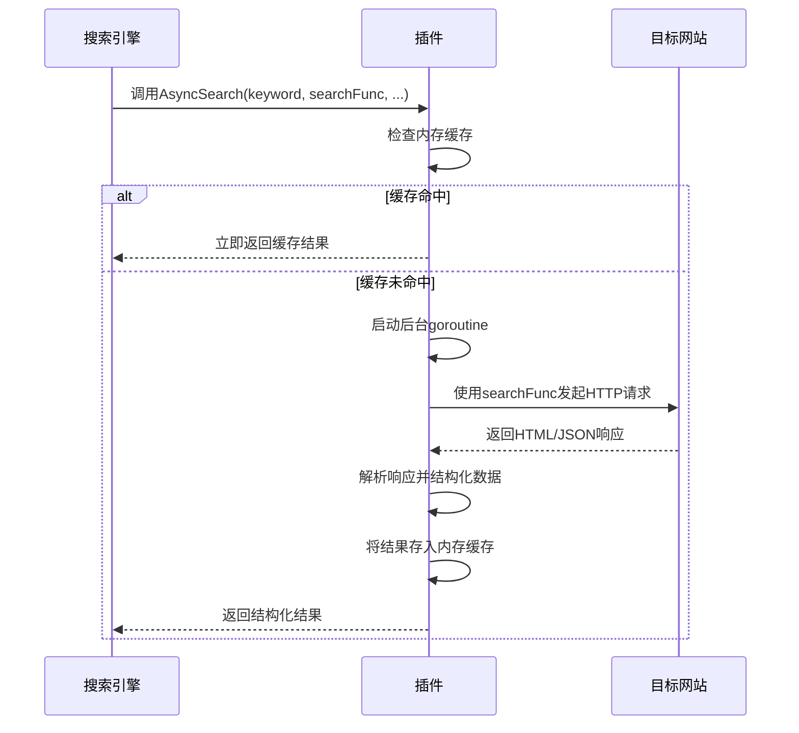
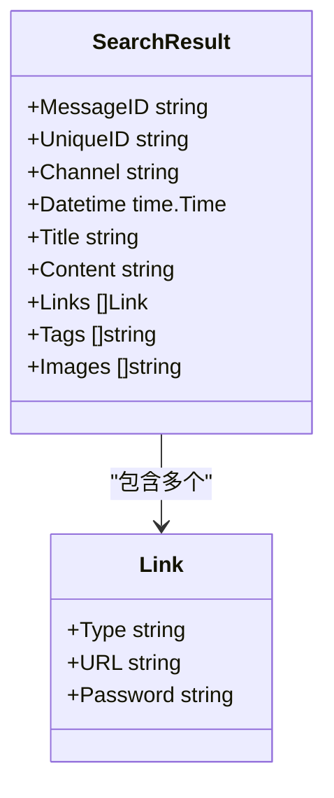
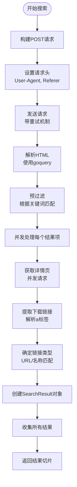
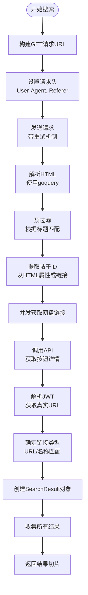
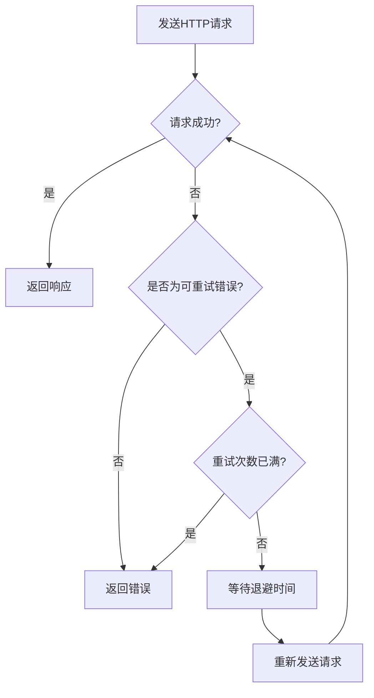
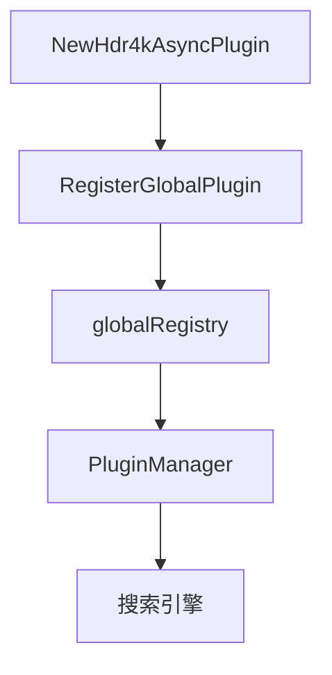

# 插件开发指南

<cite>
**本文档引用的文件**   
- [baseasyncplugin.go](file://plugin/baseasyncplugin.go)
- [hdr4k.go](file://plugin/hdr4k/hdr4k.go)
- [hdr4k/设计文档.md](file://plugin/hdr4k/设计文档.md)
- [susu.go](file://plugin/susu/susu.go)
- [susu/susu插件设计文档.md](file://plugin/susu/susu插件设计文档.md)
- [parser_util.go](file://util/parser_util.go)
- [plugin.go](file://plugin/plugin.go)
- [request.go](file://model/request.go)
- [response.go](file://model/response.go)
</cite>

## 目录

1. [引言](#引言)
2. [基础异步插件](#基础异步插件)
3. [核心数据结构](#核心数据结构)
4. [插件实现案例](#插件实现案例)
5. [HTML解析与选择器](#html解析与选择器)
6. [反爬虫与请求管理](#反爬虫与请求管理)
7. [插件注册与测试](#插件注册与测试)
8. [调试与验证](#调试与验证)
9. [总结](#总结)

## 引言

本文档旨在为开发者提供一份详尽的指南，指导如何为PanSou搜索引擎创建自定义搜索插件。我们将基于`baseasyncplugin.go`中的抽象基类，详细说明插件开发的各个关键环节。通过分析`hdr4k`和`susu`两个插件的设计与实现，我们将展示从HTML解析、选择器提取到结果结构化的完整流程。此外，文档还将涵盖处理反爬虫机制、设置User-Agent、管理请求频率等最佳实践，并提供调试和测试插件的实用技巧。

**Section sources**
- [baseasyncplugin.go](file://plugin/baseasyncplugin.go#L1-L50)
- [hdr4k/设计文档.md](file://plugin/hdr4k/设计文档.md#L1-L50)
- [susu/susu插件设计文档.md](file://plugin/susu/susu插件设计文档.md#L1-L50)

## 基础异步插件

`BaseAsyncPlugin`是所有自定义搜索插件的基石，它提供了一个异步、可缓存、可监控的搜索框架。开发者通过继承此类，可以专注于网站特定的搜索逻辑，而无需关心并发、缓存和超时等复杂问题。

### 必须实现的Search方法

`BaseAsyncPlugin`定义了`AsyncSearch`和`AsyncSearchWithResult`两个核心方法，它们是插件与搜索引擎交互的入口。开发者需要实现一个`searchFunc`函数，并将其作为参数传递给这些方法。



**Diagram sources **
- [baseasyncplugin.go](file://plugin/baseasyncplugin.go#L312-L566)

`AsyncSearch`方法的签名如下：
```go
func (p *BaseAsyncPlugin) AsyncSearch(
    keyword string,
    searchFunc func(*http.Client, string, map[string]interface{}) ([]model.SearchResult, error),
    mainCacheKey string,
    ext map[string]interface{},
) ([]model.SearchResult, error)
```

其中，`searchFunc`是开发者必须实现的核心函数。它接收一个`*http.Client`、搜索关键词和扩展参数`ext`，并返回一个`[]model.SearchResult`和一个`error`。`BaseAsyncPlugin`会根据配置决定使用短超时的`client`还是长超时的`backgroundClient`来调用此函数。

**Section sources**
- [baseasyncplugin.go](file://plugin/baseasyncplugin.go#L312-L566)

## 核心数据结构

理解`model`包中的核心数据结构是开发插件的基础。这些结构定义了搜索结果的统一格式。

### SearchResult 结构

`SearchResult`是搜索结果的核心结构，它包含了从目标网站提取的所有信息。



**Diagram sources **
- [response.go](file://model/response.go#L12-L22)
- [response.go](file://model/response.go#L5-L9)

- **UniqueID**: 全局唯一ID，通常由插件名和网站的ID拼接而成（如`hdr4k-12345`）。
- **Title**: 搜索结果的标题。
- **Content**: 搜索结果的描述或内容摘要。
- **Datetime**: 结果的发布时间。
- **Links**: 一个`Link`对象的切片，包含了所有提取到的网盘下载链接。
- **Tags**: 与结果相关的标签列表。

### Link 结构

`Link`结构用于表示一个具体的下载链接。

- **Type**: 链接类型，如`baidu`（百度网盘）、`aliyun`（阿里云盘）、`magnet`（磁力链接）等。
- **URL**: 下载链接的完整URL。
- **Password**: 提取码，如果有的话。

**Section sources**
- [response.go](file://model/response.go#L5-L22)

## 插件实现案例

我们将通过分析`hdr4k`和`susu`两个插件，来展示完整的插件开发流程。

### hdr4k 插件分析

`hdr4k`插件用于搜索4KHDR.CN网站。其核心实现位于`doSearch`方法中。



**Diagram sources **
- [hdr4k.go](file://plugin/hdr4k/hdr4k.go#L123-L317)

**关键步骤**:
1.  **请求构建**: 使用`POST`方法向`https://www.4khdr.cn/search.php?mod=forum`发送搜索请求。
2.  **HTML解析**: 使用`goquery`库解析返回的HTML。
3.  **预过滤**: 在发起详情页请求前，先在搜索结果页根据关键词过滤掉不相关的帖子，以减少不必要的网络请求。
4.  **并发处理**: 使用`goroutine`和`sync.WaitGroup`并发处理每个搜索结果项，极大地提高了效率。
5.  **详情页处理**: 对于每个帖子，通过`getLinksFromDetail`方法获取其详情页，以提取更完整的下载链接和内容。
6.  **链接类型判断**: `determineLinkType`方法根据URL和链接名称判断网盘类型。

**Section sources**
- [hdr4k.go](file://plugin/hdr4k/hdr4k.go#L123-L317)
- [hdr4k.go](file://plugin/hdr4k/hdr4k.go#L371-L486)
- [hdr4k.go](file://plugin/hdr4k/hdr4k.go#L489-L573)

### susu 插件分析

`susu`插件用于搜索susuifa.com网站。与`hdr4k`不同，`susu`的链接信息存储在后端API中，需要通过API调用获取。



**Diagram sources **
- [susu.go](file://plugin/susu/susu.go#L120-L273)

**关键步骤**:
1.  **API调用**: `susu`网站的网盘链接被加密在JWT中。插件需要调用`https://susuifa.com/wp-json/b2/v1/getDownloadPageData`等API来获取加密的链接。
2.  **JWT解码**: `decodeJWTURL`方法负责解码JWT token，提取出真实的下载链接。
3.  **帖子ID提取**: `extractPostID`方法从搜索结果的HTML中提取帖子的唯一ID，这是调用API的关键参数。

**Section sources**
- [susu.go](file://plugin/susu/susu.go#L120-L273)
- [susu.go](file://plugin/susu/susu.go#L360-L428)
- [susu.go](file://plugin/susu/susu.go#L466-L534)
- [susu.go](file://plugin/susu/susu.go#L431-L463)

## HTML解析与选择器

`parser_util.go`文件提供了一些通用的HTML解析工具，这些工具可以被多个插件复用。

### 通用解析函数

`ParseSearchResults`函数是一个强大的通用解析器，它能够从Telegram风格的HTML中提取网盘链接。虽然`hdr4k`和`susu`没有直接使用它，但它展示了如何系统地处理HTML解析。

**核心逻辑**:
1.  **提取链接**: 使用正则表达式`ExtractNetDiskLinks`从纯文本中提取链接，并使用`goquery`从`<a>`标签中提取链接。
2.  **去重与标准化**: 使用`normalizeUrl`函数对URL进行解码和标准化，避免重复。
3.  **密码提取**: `ExtractPassword`函数从文本中提取与链接对应的提取码。
4.  **链接类型判断**: `GetLinkType`函数根据URL中的域名判断链接类型。

```mermaid
flowchart TD
A[输入HTML] --> B[使用goquery解析]
B --> C[查找.tgme_widget_message_wrap]
C --> D[遍历每个消息块]
D --> E[提取消息ID和时间]
D --> F[提取消息文本和HTML]
F --> G[使用ExtractNetDiskLinks提取文本中的链接]
F --> H[使用Find('a')提取a标签中的链接]
G & H --> I[合并链接列表]
I --> J[使用GetLinkType判断每个链接的类型]
I --> K[使用ExtractPassword提取密码]
J & K --> L[使用normalizeBaiduPanURL等函数标准化链接]
L --> M[去重并创建Link对象]
M --> N[创建SearchResult对象]
N --> O[返回结果列表]
```

**Diagram sources **
- [parser_util.go](file://util/parser_util.go#L128-L540)
- [regex_util.go](file://util/regex_util.go#L570-L796)
- [regex_util.go](file://util/regex_util.go#L35-L92)

**Section sources**
- [parser_util.go](file://util/parser_util.go#L128-L540)

## 反爬虫与请求管理

为了确保插件的稳定性和避免被目标网站封禁，必须妥善处理反爬虫机制。

### User-Agent轮换

两个插件都实现了User-Agent轮换。它们维护了一个`userAgents`字符串切片，并通过`getRandomUA()`函数随机选择一个UA。

```go
var userAgents = []string{
    "Mozilla/5.0 (Macintosh; Intel Mac OS X 10_15_7) AppleWebKit/537.36 (KHTML, like Gecko) Chrome/138.0.0.0 Safari/537.36",
    "Mozilla/5.0 (Windows NT 10.0; Win64; x64) AppleWebKit/537.36 (KHTML, like Gecko) Chrome/138.0.0.0 Safari/537.36",
    // ... 更多UA
}

func getRandomUA() string {
    return userAgents[rand.Intn(len(userAgents))]
}
```

在发送请求时，将随机的UA设置到请求头中：
```go
req.Header.Set("User-Agent", getRandomUA())
```

### 请求重试与指数退避

`doRequestWithRetry`方法实现了智能的重试机制。当网络请求失败时，它会根据错误类型决定是否重试。



**Diagram sources **
- [hdr4k.go](file://plugin/hdr4k/hdr4k.go#L576-L642)
- [susu.go](file://plugin/susu/susu.go#L498-L558)

**关键点**:
- **可重试错误**: 包括网络超时、连接被拒绝、连接重置等临时性错误。
- **指数退避**: 重试间隔时间呈指数增长（500ms, 1s, 2s...），最大不超过5秒，避免对服务器造成过大压力。

### 请求频率管理

`BaseAsyncPlugin`通过`backgroundWorkerPool`通道来限制并发的后台任务数量，防止对目标网站发起过多请求。开发者可以通过`MaxConcurrency`常量来控制单个插件的并发数。

**Section sources**
- [hdr4k.go](file://plugin/hdr4k/hdr4k.go#L576-L642)
- [susu.go](file://plugin/susu/susu.go#L498-L558)
- [baseasyncplugin.go](file://plugin/baseasyncplugin.go#L150-L170)

## 插件注册与测试

### 插件注册

新插件必须在`init()`函数中进行注册，才能被搜索引擎发现和调用。

```go
func init() {
    // 注册插件
    plugin.RegisterGlobalPlugin(NewHdr4kAsyncPlugin())
    
    // 启动缓存清理
    go startCacheCleaner()
}
```

`RegisterGlobalPlugin`函数将插件实例添加到一个全局的注册表中。



**Diagram sources **
- [plugin.go](file://plugin/plugin.go#L42-L56)

**Section sources**
- [hdr4k.go](file://plugin/hdr4k/hdr4k.go#L100-L105)
- [plugin.go](file://plugin/plugin.go#L42-L56)

### 测试验证

插件的测试验证工作流如下：
1.  **单元测试**: 测试核心函数，如`determineLinkType`、`decodeJWTURL`、`cleanHTML`等。
2.  **集成测试**: 编写端到端测试，模拟真实的搜索请求，验证返回结果的正确性。
3.  **性能测试**: 使用`wrk`等工具进行压力测试，评估插件的响应时间和吞吐量。
4.  **部署验证**: 将插件部署到开发环境，通过API接口进行实际搜索，检查结果的完整性和准确性。

## 调试与验证

### 模拟请求

在开发过程中，可以使用`curl`或Postman等工具模拟插件发出的HTTP请求，直接查看目标网站返回的原始HTML或JSON，这有助于编写和调试选择器。

### 验证解析准确性

- **日志输出**: 在关键步骤添加`fmt.Printf`语句，输出解析过程中的中间变量。
- **断点调试**: 使用GoLand等IDE进行断点调试，逐步跟踪代码执行流程。
- **结果比对**: 将插件返回的`SearchResult`与目标网站上的实际内容进行人工比对，确保信息准确无误。

## 总结

本文档详细阐述了为PanSou创建自定义搜索插件的完整流程。开发者应首先继承`BaseAsyncPlugin`，实现`searchFunc`函数。该函数的核心任务是发送HTTP请求、解析HTML或调用API、提取并结构化数据。通过`hdr4k`和`susu`两个案例，我们展示了处理静态HTML和动态API两种不同场景的策略。同时，必须重视反爬虫措施