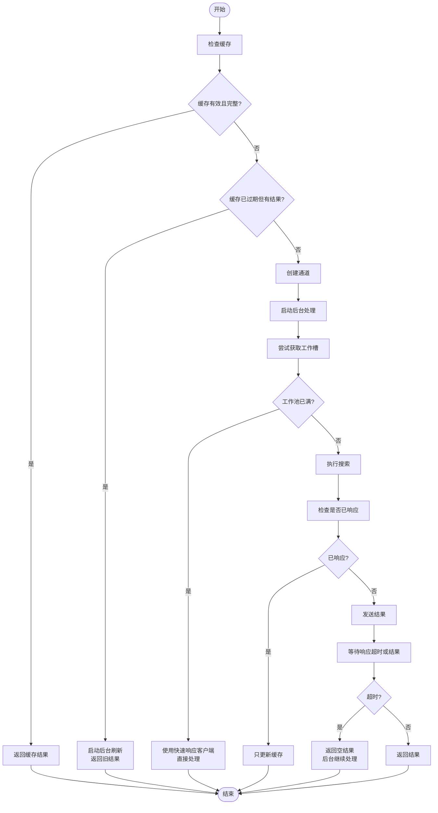
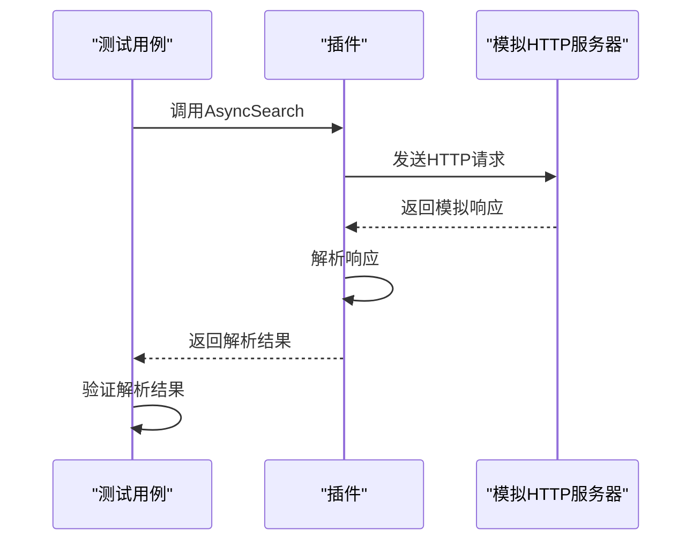
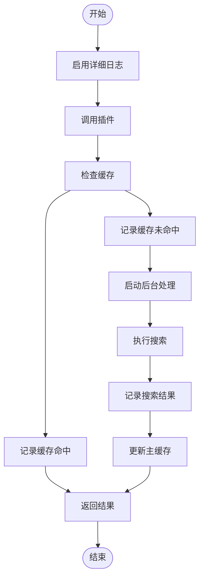
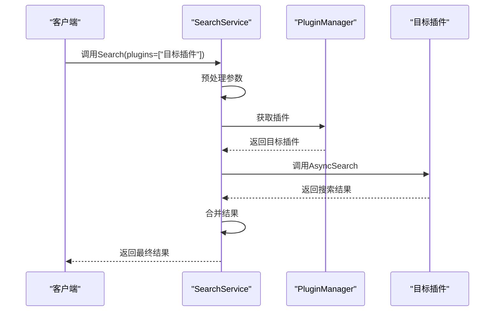

# 插件调试与测试验证

<cite>
**本文档引用文件**   
- [baseasyncplugin.go](file://plugin/baseasyncplugin.go)
- [search_service.go](file://service/search_service.go)
- [plugin.go](file://plugin/plugin.go)
- [response.go](file://model/response.go)
</cite>

## 目录
1. [引言](#引言)
2. [插件调试方法论](#插件调试方法论)
3. [单元测试与独立运行](#单元测试与独立运行)
4. [日志输出与请求追踪](#日志输出与请求追踪)
5. [本地环境隔离测试](#本地环境隔离测试)
6. [常见问题排查清单](#常见问题排查清单)
7. [优化建议](#优化建议)
8. [结论](#结论)

## 引言
本文档旨在为开发者提供一套完整的插件调试方法论，帮助快速验证插件功能。通过分析 `search_service.go` 中的插件调用逻辑，结合 `baseasyncplugin.go` 的异步搜索机制，指导开发者如何通过单元测试或独立运行方式调试插件，构造测试用例，模拟HTTP响应，并验证解析准确性。同时，说明如何启用详细日志输出以追踪请求与响应过程，结合本地环境隔离测试单个插件，并提供常见问题的排查清单与解决方案。

**Section sources**
- [search_service.go](file://service/search_service.go#L350-L509)
- [baseasyncplugin.go](file://plugin/baseasyncplugin.go#L312-L566)

## 插件调试方法论
插件调试的核心在于理解其异步执行流程与缓存机制。`BaseAsyncPlugin` 提供了统一的异步搜索框架，通过 `AsyncSearch` 方法实现插件的异步调用。该方法首先检查内存缓存，若命中则直接返回结果；若未命中，则启动后台任务执行搜索，并在指定超时时间内等待结果。若超时，则返回空结果，后台继续处理。

插件的执行流程如下：
1. 检查插件特定缓存（`pluginSpecificCacheKey`）。
2. 若缓存有效且完整，直接返回结果。
3. 若缓存已过期但有结果，启动后台刷新，同时返回旧结果。
4. 若缓存未命中，创建通道并启动后台处理。
5. 后台处理尝试获取工作槽，若工作池已满，则使用快速响应客户端直接处理。
6. 执行搜索函数，检查是否已响应，若已响应则只更新缓存，否则发送结果。
7. 等待响应超时或结果，若超时则返回空结果，后台继续处理。

**Diagram sources**
- [baseasyncplugin.go](file://plugin/baseasyncplugin.go#L312-L566)

**Section sources**
- [baseasyncplugin.go](file://plugin/baseasyncplugin.go#L312-L566)

## 单元测试与独立运行
为了验证插件功能，开发者可以通过单元测试或独立运行方式调试插件。构造测试用例时，应模拟不同的HTTP响应，包括正常响应、错误响应、超时响应等，以验证插件的解析准确性。

### 构造测试用例
1. **正常响应**：构造包含有效搜索结果的HTTP响应，验证插件能否正确解析并返回结果。
2. **错误响应**：构造包含错误信息的HTTP响应，验证插件能否正确处理错误并返回相应的错误信息。
3. **超时响应**：模拟HTTP请求超时，验证插件能否在超时后返回空结果，并在后台继续处理。

### 模拟HTTP响应
通过模拟HTTP响应，可以验证插件的解析逻辑。例如，对于JSON结构的插件，可以构造包含不同字段的JSON响应，验证插件能否正确解析；对于HTML结构的插件，可以构造包含不同标签的HTML响应，验证插件能否正确提取信息。

### 验证解析准确性
通过对比插件解析结果与预期结果，验证解析的准确性。可以使用断言（assert）来验证解析结果的字段是否正确，例如标题、链接、时间等。

**Diagram sources**
- [baseasyncplugin.go](file://plugin/baseasyncplugin.go#L312-L566)

**Section sources**
- [baseasyncplugin.go](file://plugin/baseasyncplugin.go#L312-L566)

## 日志输出与请求追踪
启用详细日志输出是追踪请求与响应过程的关键。通过日志，可以了解插件的执行流程、缓存命中情况、错误信息等。

### 启用详细日志
在 `config.AppConfig` 中启用 `AsyncLogEnabled`，可以输出详细的日志信息。日志信息包括缓存命中、缓存未命中、后台刷新、主缓存更新等。

### 日志信息分析
1. **缓存命中**：日志中会显示 `[插件名] 命中缓存 结果数: X`，表示缓存命中，返回了X个结果。
2. **缓存未命中**：日志中会显示 `[插件名] 缓存未命中`，表示缓存未命中，需要执行搜索。
3. **后台刷新**：日志中会显示 `[插件名] 缓存已过期，后台刷新中: X (已过期: Y)`，表示缓存已过期，启动后台刷新。
4. **主缓存更新**：日志中会显示 `❌ [插件名] 主缓存更新失败: X | 错误: Y`，表示主缓存更新失败，需要检查错误信息。

### 请求与响应追踪
通过日志可以追踪请求与响应的全过程。从插件调用开始，到缓存检查、后台处理、搜索执行、结果返回，每一步都有相应的日志记录。通过分析日志，可以定位问题所在，例如是缓存问题、网络问题还是解析问题。

**Diagram sources**
- [baseasyncplugin.go](file://plugin/baseasyncplugin.go#L312-L566)

**Section sources**
- [baseasyncplugin.go](file://plugin/baseasyncplugin.go#L312-L566)

## 本地环境隔离测试
在本地环境中隔离测试单个插件，可以避免其他插件的影响，更准确地定位问题。

### 隔离测试步骤
1. **禁用其他插件**：在 `config.AppConfig` 中设置 `AsyncPluginEnabled` 为 `false`，禁用所有插件。
2. **注册目标插件**：在 `pluginManager` 中注册目标插件，确保只有目标插件被加载。
3. **调用目标插件**：通过 `SearchService.Search` 方法调用目标插件，传入特定的 `plugins` 参数，指定只搜索目标插件。
4. **分析结果**：分析目标插件的执行结果，验证其功能是否正常。

### 结合search_service.go逻辑
`search_service.go` 中的 `Search` 方法负责调用插件。通过分析该方法的逻辑，可以理解插件的调用流程。`Search` 方法首先预处理参数，然后并行获取TG搜索和插件搜索结果，最后合并结果并返回。在隔离测试时，可以修改 `plugins` 参数，指定只搜索目标插件，从而实现隔离测试。

**Diagram sources**
- [search_service.go](file://service/search_service.go#L350-L509)

**Section sources**
- [search_service.go](file://service/search_service.go#L350-L509)

## 常见问题排查清单
### 空结果
- **问题描述**：插件返回空结果。
- **可能原因**：
  - HTTP请求超时。
  - 搜索结果为空。
  - 缓存未命中且后台处理未完成。
- **解决方案**：
  - 检查网络连接。
  - 增加超时时间。
  - 检查搜索关键词是否正确。
  - 检查插件解析逻辑是否正确。

### 解析失败
- **问题描述**：插件解析失败，返回错误信息。
- **可能原因**：
  - HTTP响应格式不符合预期。
  - 解析逻辑有误。
  - 网络问题导致响应不完整。
- **解决方案**：
  - 检查HTTP响应格式。
  - 调试解析逻辑，使用断言验证解析结果。
  - 检查网络连接。

### 超时
- **问题描述**：插件响应超时。
- **可能原因**：
  - 网络延迟高。
  - 插件执行时间过长。
  - 工作池已满。
- **解决方案**：
  - 增加超时时间。
  - 优化插件执行逻辑。
  - 增加工作池大小。

**Section sources**
- [baseasyncplugin.go](file://plugin/baseasyncplugin.go#L312-L566)
- [search_service.go](file://service/search_service.go#L350-L509)

## 优化建议
1. **增加超时时间**：对于执行时间较长的插件，可以增加超时时间，避免因超时而返回空结果。
2. **优化解析逻辑**：优化插件的解析逻辑，提高解析效率，减少执行时间。
3. **增加工作池大小**：增加工作池大小，提高并发处理能力，减少因工作池已满而导致的直接处理。
4. **缓存策略优化**：优化缓存策略，提高缓存命中率，减少重复搜索。

**Section sources**
- [baseasyncplugin.go](file://plugin/baseasyncplugin.go#L312-L566)

## 结论
本文档提供了一套完整的插件调试方法论，帮助开发者快速验证插件功能。通过单元测试或独立运行方式调试插件，构造测试用例，模拟HTTP响应，并验证解析准确性。启用详细日志输出以追踪请求与响应过程，结合 `search_service.go` 中的插件调用逻辑，解释如何在本地环境中隔离测试单个插件。提供常见问题排查清单，如空结果、解析失败、超时等，并给出对应的解决方案和优化建议。希望本文档能帮助开发者更高效地调试和优化插件。