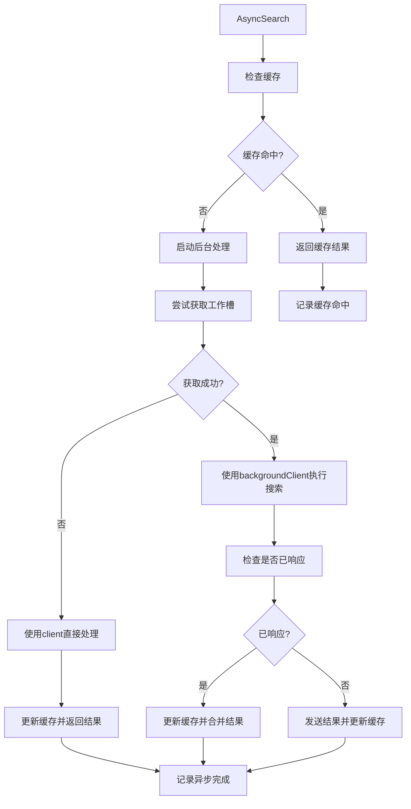
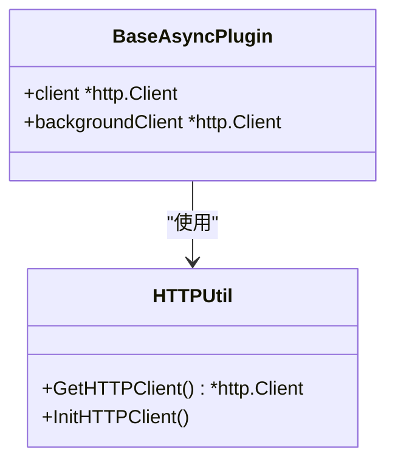
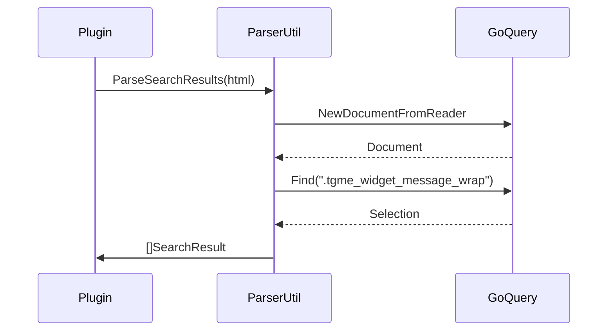
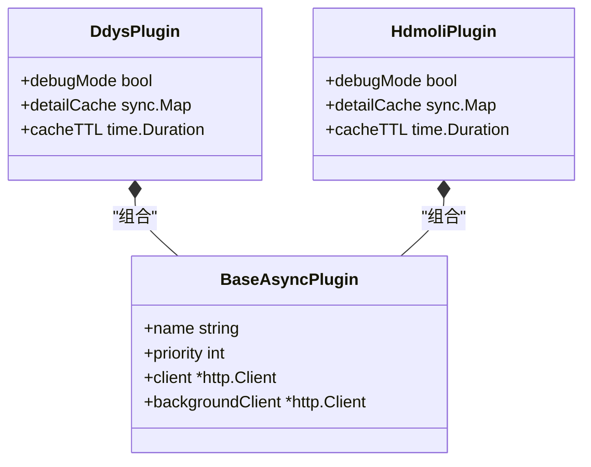

# 基础功能封装

<cite>
**本文档引用文件**   
- [baseasyncplugin.go](file://plugin/baseasyncplugin.go)
- [http_util.go](file://util/http_util.go)
- [parser_util.go](file://util/parser_util.go)
- [ddys.go](file://plugin/ddys/ddys.go)
- [hdmoli.go](file://plugin/hdmoli/hdmoli.go)
</cite>

## 目录
1. [结构体字段映射表](#结构体字段映射表)
2. [方法调用链分析](#方法调用链分析)
3. [并发控制与错误恢复](#并发控制与错误恢复)
4. [日志追踪与超时管理](#日志追踪与超时管理)
5. [HTTP客户端工具与代理支持集成](#http客户端工具与代理支持集成)
6. [HTML/JSON解析功能集成](#htmljson解析功能集成)
7. [调试与缓存一致性](#调试与缓存一致性)
8. [继承与组合设计模式应用](#继承与组合设计模式应用)

## 结构体字段映射表

| 字段名 | 类型 | 说明 |
|--------|------|------|
| name | string | 插件名称 |
| priority | int | 插件优先级 |
| client | *http.Client | 用于短超时的HTTP客户端 |
| backgroundClient | *http.Client | 用于长超时的HTTP客户端 |
| cacheTTL | time.Duration | 内存缓存有效期 |
| mainCacheUpdater | func(string, []model.SearchResult, time.Duration, bool, string) error | 主缓存更新函数 |
| MainCacheKey | string | 主缓存键，导出字段 |
| currentKeyword | string | 当前搜索的关键词，用于日志显示 |
| finalUpdateTracker | map[string]bool | 追踪已更新的最终结果缓存 |
| finalUpdateMutex | sync.RWMutex | 保护finalUpdateTracker的并发访问 |
| skipServiceFilter | bool | 是否跳过Service层的关键词过滤 |

**Section sources**
- [baseasyncplugin.go](file://plugin/baseasyncplugin.go#L199-L211)

## 方法调用链分析

**Diagram sources **
- [baseasyncplugin.go](file://plugin/baseasyncplugin.go#L312-L566)

## 并发控制与错误恢复

`BaseAsyncPlugin`通过工作池机制实现并发控制，使用`acquireWorkerSlot`和`releaseWorkerSlot`函数管理并发任务。当工作池满时，会使用短超时客户端直接处理请求，避免阻塞。错误恢复通过重试机制和后台刷新实现，确保在部分失败时仍能提供结果。

**Section sources**
- [baseasyncplugin.go](file://plugin/baseasyncplugin.go#L150-L158)

## 日志追踪与超时管理

插件通过`SetCurrentKeyword`方法设置当前搜索关键词，用于日志显示。超时管理通过两个HTTP客户端实现：`client`用于短超时响应，`backgroundClient`用于长超时后台处理。`AsyncSearch`方法使用`time.After`实现响应超时控制。

**Section sources**
- [baseasyncplugin.go](file://plugin/baseasyncplugin.go#L287-L289)

## HTTP客户端工具与代理支持集成

`BaseAsyncPlugin`集成`util/http_util.go`中的HTTP客户端工具，通过`GetHTTPClient`获取配置好的客户端。代理支持通过`x/net/proxy`实现，当配置启用代理时，会根据代理类型设置相应的拨号器或传输代理。

**Diagram sources **
- [baseasyncplugin.go](file://plugin/baseasyncplugin.go#L202-L203)
- [http_util.go](file://util/http_util.go#L24-L75)

## HTML/JSON解析功能集成

插件通过`util/parser_util.go`中的`ParseSearchResults`函数进行HTML解析，提取搜索结果。该函数使用`goquery`库解析HTML文档，提取标题、内容、链接等信息，并通过正则表达式匹配网盘链接。

**Diagram sources **
- [baseasyncplugin.go](file://plugin/baseasyncplugin.go#L312-L566)
- [parser_util.go](file://util/parser_util.go#L100-L200)

## 调试与缓存一致性

`SetCurrentKeyword`和`SetMainCacheKey`方法在调试与缓存一致性中起关键作用。`SetCurrentKeyword`设置当前搜索关键词，用于日志追踪和调试。`SetMainCacheKey`设置主缓存键，确保缓存的一致性和正确性。通过`mainCacheUpdater`函数更新主缓存，保证数据一致性。

**Section sources**
- [baseasyncplugin.go](file://plugin/baseasyncplugin.go#L282-L284)
- [baseasyncplugin.go](file://plugin/baseasyncplugin.go#L287-L289)

## 继承与组合设计模式应用

实际插件如`ddys.go`和`hdmoli.go`通过嵌入`BaseAsyncPlugin`实现继承与组合。子类通过组合方式添加特定功能，如`DdysPlugin`添加了`detailCache`和`cacheTTL`字段，同时继承了`BaseAsyncPlugin`的通用能力。

**Diagram sources **
- [ddys.go](file://plugin/ddys/ddys.go#L31-L36)
- [hdmoli.go](file://plugin/hdmoli/hdmoli.go#L31-L36)
- [baseasyncplugin.go](file://plugin/baseasyncplugin.go#L199-L211)