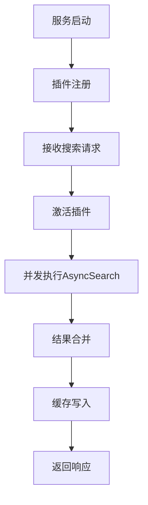
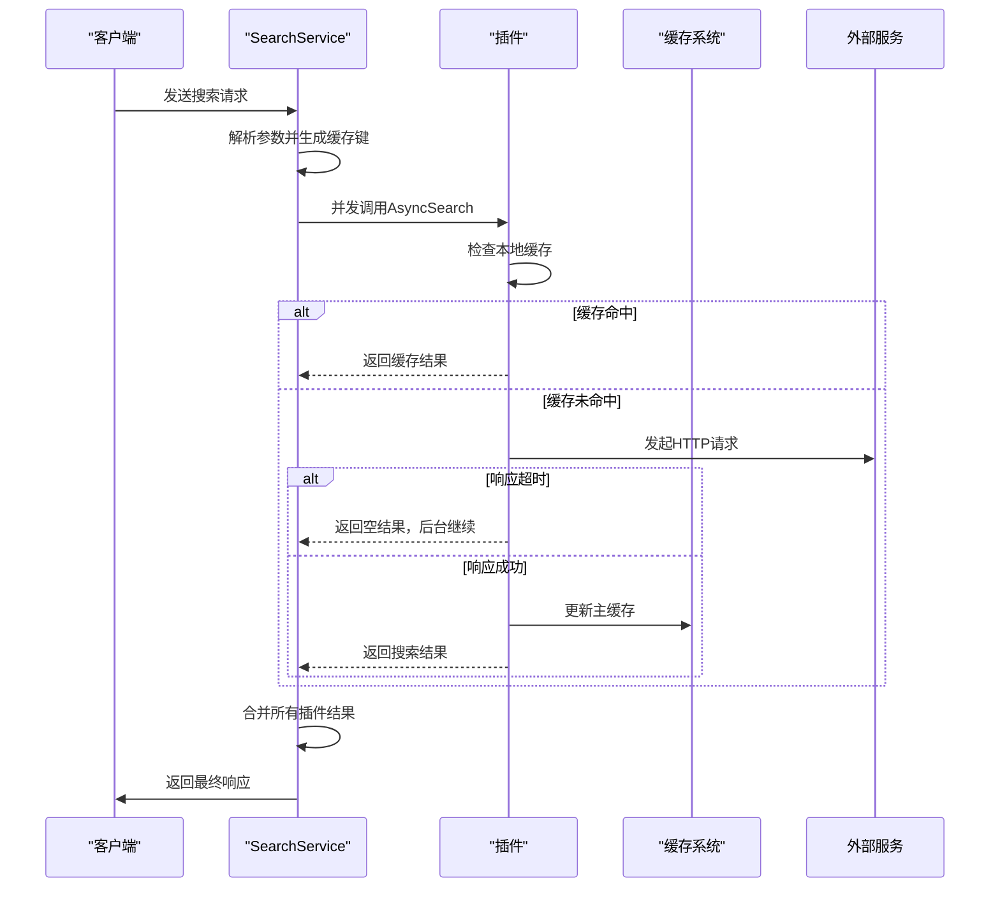
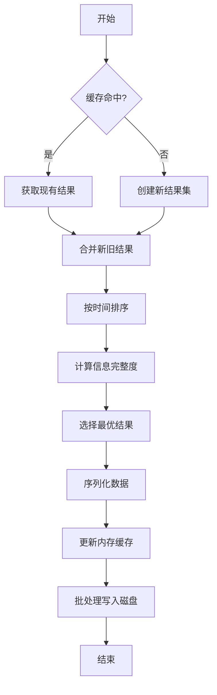
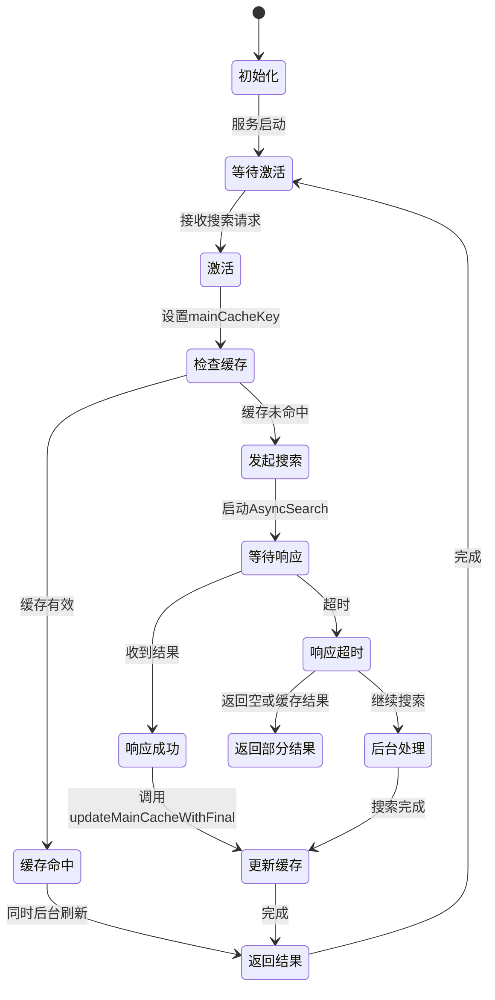

# 插件执行生命周期

<cite>
**本文档引用的文件**  
- [search_service.go](file://service/search_service.go)
- [baseasyncplugin.go](file://plugin/baseasyncplugin.go)
- [plugin.go](file://plugin/plugin.go)
- [cache_key.go](file://util/cache/cache_key.go)
- [enhanced_two_level_cache.go](file://util/cache/enhanced_two_level_cache.go)
- [delayed_batch_write_manager.go](file://util/cache/delayed_batch_write_manager.go)
- [request.go](file://model/request.go)
- [response.go](file://model/response.go)
</cite>

## 目录
1. [引言](#引言)
2. [插件生命周期概述](#插件生命周期概述)
3. [服务启动与注册阶段](#服务启动与注册阶段)
4. [搜索请求激活阶段](#搜索请求激活阶段)
5. [并发执行与错误处理](#并发执行与错误处理)
6. [结果合并与缓存写入](#结果合并与缓存写入)
7. [主缓存键的作用](#主缓存键的作用)
8. [关键词过滤逻辑](#关键词过滤逻辑)
9. [生命周期状态机图](#生命周期状态机图)
10. [关键事件时间轴](#关键事件时间轴)
11. [结论](#结论)

## 引言
本文档全面描述了插件从初始化到结果返回的完整生命周期。重点分析了服务启动时的注册机制、搜索请求的激活流程、`AsyncSearch`方法的并发执行策略、结果合并与缓存写入机制。结合`search_service.go`中的`ExecuteSearch`方法，详细说明如何通过`errgroup.WithContext`启动多个插件并行执行，并处理超时与错误。同时阐述主缓存键（mainCacheKey）在跨插件结果去重与缓存命中判断中的关键作用，以及`SkipServiceFilter`标志位如何影响关键词过滤逻辑。

## 插件生命周期概述
插件的完整生命周期可分为四个主要阶段：**注册阶段**、**激活阶段**、**执行阶段**和**结果处理阶段**。整个流程由`SearchService`驱动，通过`PluginManager`管理插件实例，并利用两级缓存系统优化性能。插件执行采用异步非阻塞模式，支持并发搜索和超时控制，确保系统响应性和稳定性。

**插件生命周期概览**

**Diagram sources**  
- [search_service.go](file://service/search_service.go#L350-L509)
- [baseasyncplugin.go](file://plugin/baseasyncplugin.go#L312-L566)

## 服务启动与注册阶段
在服务启动时，所有插件通过`RegisterGlobalPlugin`函数注册到全局注册表中。`PluginManager`负责管理这些插件实例，并在`NewSearchService`初始化时注入主缓存系统。注册过程确保了插件能够访问统一的缓存更新机制和序列化器。

插件注册的核心是`PluginManager.RegisterPlugin`方法，它将插件实例添加到内部插件列表中。同时，`injectMainCacheToAsyncPlugins`函数会遍历所有插件，为每个插件设置主缓存更新函数，实现缓存系统的统一管理。

**Section sources**  
- [plugin.go](file://plugin/plugin.go#L93-L95)
- [search_service.go](file://service/search_service.go#L150-L200)

## 搜索请求激活阶段
当接收到搜索请求时，`SearchService.Search`方法首先解析请求参数，包括关键词、频道列表、并发数等。根据`SourceType`参数决定搜索范围（Telegram、插件或全部）。对于插件搜索，系统会调用`searchPlugins`方法，该方法负责激活所有相关插件。

在激活阶段，系统会为每个插件设置主缓存键（mainCacheKey）和当前关键词，然后通过工作池并行执行插件的`AsyncSearch`方法。这一过程使用`pool.ExecuteBatchWithTimeout`实现并发控制，确保不会超出系统资源限制。

**Section sources**  
- [search_service.go](file://service/search_service.go#L350-L509)
- [search_service.go](file://service/search_service.go#L1218-L1365)

## 并发执行与错误处理
插件的并发执行是通过`errgroup.WithContext`模式实现的。在`searchPlugins`方法中，系统为每个可用插件创建一个任务函数，该函数调用插件的`AsyncSearch`方法。这些任务被提交到工作池中，并发执行。

`AsyncSearch`方法内部实现了复杂的超时和错误处理机制：
- 使用`select`语句监听结果通道、错误通道和超时通道
- 响应超时后，后台继续处理，返回部分缓存结果
- 工作池满时，使用快速客户端直接处理
- 支持后台刷新过期缓存

错误处理策略确保了即使部分插件失败，系统仍能返回可用结果，提高了整体可用性。

**Diagram sources**  
- [baseasyncplugin.go](file://plugin/baseasyncplugin.go#L312-L566)
- [search_service.go](file://service/search_service.go#L1218-L1365)

## 结果合并与缓存写入
搜索结果的合并与缓存写入是保证数据一致性和性能的关键环节。系统采用智能合并策略，通过`mergeSearchResults`函数实现结果去重和信息完整性优化。

缓存写入采用两级策略：
1. **内存缓存**：立即更新，确保高并发下的快速访问
2. **磁盘缓存**：通过`DelayedBatchWriteManager`进行批处理写入，减少I/O压力

`injectMainCacheToAsyncPlugins`函数创建的缓存更新函数会先获取现有缓存数据，与新结果合并后再序列化写入。这种机制确保了跨插件搜索结果的去重和完整性。

**Diagram sources**  
- [search_service.go](file://service/search_service.go#L250-L300)
- [enhanced_two_level_cache.go](file://util/cache/enhanced_two_level_cache.go#L74-L82)
- [delayed_batch_write_manager.go](file://util/cache/delayed_batch_write_manager.go#L379-L397)

## 主缓存键的作用
主缓存键（mainCacheKey）在跨插件搜索中扮演着核心角色。它由`GeneratePluginCacheKey`函数生成，结合了关键词、插件列表等参数，确保了缓存的唯一性和准确性。

主缓存键的关键作用包括：
- **缓存命中判断**：作为缓存系统的查询键，决定是否返回缓存结果
- **结果去重**：通过统一的缓存键，确保不同插件返回的相同资源不会重复
- **并发控制**：多个插件共享同一缓存键，避免重复搜索
- **数据一致性**：确保所有插件看到的缓存状态一致

缓存键的生成策略采用MD5哈希，结合预计算优化，保证了高性能和低冲突率。

**Section sources**  
- [cache_key.go](file://util/cache/cache_key.go#L40-L80)
- [search_service.go](file://service/search_service.go#L1250-L1260)

## 关键词过滤逻辑
关键词过滤逻辑由`SkipServiceFilter`标志位控制，该标志位在`BaseAsyncPlugin`结构体中定义。当`SkipServiceFilter`为`true`时，插件返回的结果将跳过Service层的关键词过滤。

在`mergeResultsByType`方法中，系统会检查每个结果的`UniqueID`，提取插件名称，并查询该插件是否设置了`SkipServiceFilter`。如果未跳过过滤，则会检查链接标题是否包含搜索关键词。

这种设计允许特定插件（如磁力搜索插件）返回更宽泛的结果，而其他插件则保持严格的关键词匹配，实现了灵活的搜索策略。

**Section sources**  
- [baseasyncplugin.go](file://plugin/baseasyncplugin.go#L307-L309)
- [search_service.go](file://service/search_service.go#L1000-L1050)

## 生命周期状态机图
插件的执行过程可以用状态机来描述，清晰地展示各个状态之间的转换关系。

**Diagram sources**  
- [baseasyncplugin.go](file://plugin/baseasyncplugin.go#L312-L566)
- [search_service.go](file://service/search_service.go#L1218-L1365)

## 关键事件时间轴
以下是插件执行过程中的关键事件时间轴，展示了从请求接收到响应返回的完整流程。

```mermaid
gantt
title 插件执行关键事件时间轴
dateFormat X
axisFormat %s
section 请求处理
接收请求 :a1, 0, 1
参数预处理 :a2, after a1, 1
生成缓存键 :a3, after a2, 1
section 插件执行
激活插件 :b1, after a3, 1
并发执行AsyncSearch :b2, after b1, 4
响应超时 :b3, after b2, 1
section 结果处理
合并结果 :c1, after b2, 1
更新主缓存 :c2, after c1, 1
返回响应 :c3, after c2, 1
```

**Diagram sources**  
- [search_service.go](file://service/search_service.go#L350-L509)
- [baseasyncplugin.go](file://plugin/baseasyncplugin.go#L312-L566)

## 结论
本文档详细描述了插件从初始化到结果返回的完整生命周期。通过分析注册、激活、执行和结果处理四个阶段，揭示了系统如何实现高效、可靠的并发搜索。主缓存键的设计确保了跨插件搜索结果的一致性和去重，而`SkipServiceFilter`机制则提供了灵活的过滤策略。整个系统采用异步非阻塞架构，结合两级缓存和批处理写入，实现了高性能和高可用性的平衡。