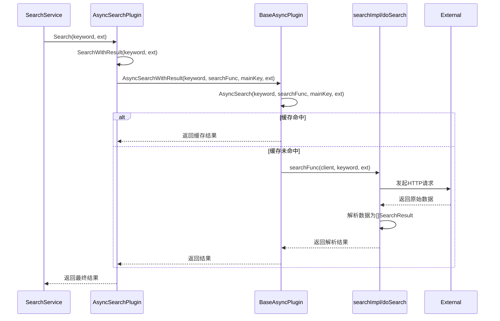

# 插件接口规范

<cite>
**本文档引用的文件**   
- [plugin.go](file://plugin/plugin.go)
- [baseasyncplugin.go](file://plugin/baseasyncplugin.go)
- [hdr4k.go](file://plugin/hdr4k/hdr4k.go)
- [miaoso.go](file://plugin/miaoso/miaoso.go)
</cite>

## 目录
1. [接口概述](#接口概述)
2. [方法契约详解](#方法契约详解)
3. [AsyncSearch方法与searchFunc参数机制](#asyncsearch方法与searchfunc参数机制)
4. [Search方法的兼容性设计](#search方法的兼容性设计)
5. [具体插件实现分析](#具体插件实现分析)
6. [接口调用时序图](#接口调用时序图)
7. [参数传递示例](#参数传递示例)

## 接口概述

`AsyncSearchPlugin` 接口定义了异步搜索插件的核心行为契约，是所有插件实现的基础。该接口通过标准化的方法集，确保了不同数据源插件在搜索行为、优先级管理、缓存控制和结果处理上的统一性。插件通过实现此接口，能够无缝集成到主搜索服务中，提供一致的搜索体验。

**Section sources**
- [plugin.go](file://plugin/plugin.go#L17-L39)

## 方法契约详解

### Name() 方法
返回插件的唯一标识名称，用于日志记录、缓存键生成和结果来源标识。该名称应为小写字母组成的字符串，确保全局唯一性。

**Section sources**
- [plugin.go](file://plugin/plugin.go#L19)
- [baseasyncplugin.go](file://plugin/baseasyncplugin.go#L297-L299)

### Priority() 方法
返回插件的优先级数值，用于在结果合并与排序时确定其权重。数值越小，优先级越高。高优先级插件的结果将被优先展示。

**Section sources**
- [plugin.go](file://plugin/plugin.go#L22)
- [baseasyncplugin.go](file://plugin/baseasyncplugin.go#L302-L304)

### AsyncSearch() 方法
核心异步搜索方法，定义了插件执行搜索的主逻辑。该方法接收关键词、一个用于发起HTTP请求的回调函数、主缓存键和扩展参数，并返回搜索结果和错误。

**Section sources**
- [plugin.go](file://plugin/plugin.go#L25)
- [baseasyncplugin.go](file://plugin/baseasyncplugin.go#L312-L566)

### SetMainCacheKey() 方法
设置主缓存键，该键用于跨插件协调结果缓存。插件在执行搜索前，会通过此方法接收一个由服务层生成的统一缓存键。

**Section sources**
- [plugin.go](file://plugin/plugin.go#L28)
- [baseasyncplugin.go](file://plugin/baseasyncplugin.go#L282-L284)

### SkipServiceFilter() 方法
返回一个布尔值，指示该插件的搜索结果是否应跳过服务层的关键词过滤。对于磁力链接等需要宽泛结果的插件，应返回 `true`。

**Section sources**
- [plugin.go](file://plugin/plugin.go#L38)
- [baseasyncplugin.go](file://plugin/baseasyncplugin.go#L307-L309)

### SetCurrentKeyword() 方法
设置当前搜索的关键词，主要用于日志输出和调试信息，帮助追踪插件的搜索行为。

**Section sources**
- [plugin.go](file://plugin/plugin.go#L31)
- [baseasyncplugin.go](file://plugin/baseasyncplugin.go#L287-L289)

## AsyncSearch方法与searchFunc参数机制

`AsyncSearch` 方法是插件接口的核心，其设计采用了依赖注入的思想，通过 `searchFunc` 参数将网络请求的执行权交给调用方，从而实现了统一的网络调用模式。

`searchFunc` 是一个函数类型参数，其定义为：
```go
func(*http.Client, string, map[string]interface{}) ([]model.SearchResult, error)
```
它接收三个参数：
1.  **`*http.Client`**: 由插件基类提供的HTTP客户端，该客户端已配置好超时等参数。
2.  **`string`**: 搜索关键词。
3.  **`map[string]interface{}`**: 扩展参数，可用于传递如英文标题等额外信息。

这种设计模式的优势在于：
- **统一性**：所有插件都使用相同的HTTP客户端和调用方式，保证了网络行为的一致性。
- **解耦**：插件的具体搜索逻辑（如构建URL、解析响应）与网络请求的执行分离。
- **可测试性**：在单元测试中，可以轻松地用模拟函数（mock）替换 `searchFunc`。

插件的 `AsyncSearch` 实现通常会调用基类 `BaseAsyncPlugin` 的同名方法，并将一个实现了具体搜索逻辑的内部函数作为 `searchFunc` 传入。

**Section sources**
- [plugin.go](file://plugin/plugin.go#L25)
- [baseasyncplugin.go](file://plugin/baseasyncplugin.go#L312-L566)

## Search方法的兼容性设计

`Search` 方法是一个同步包装器，其存在是为了保持与旧版插件接口的兼容性。它是一个非核心方法，所有插件通常都通过继承 `BaseAsyncPlugin` 来获得其默认实现。

该方法的典型实现模式是：
```go
func (p *SomePlugin) Search(keyword string, ext map[string]interface{}) ([]model.SearchResult, error) {
    result, err := p.SearchWithResult(keyword, ext)
    if err != nil {
        return nil, err
    }
    return result.Results, nil
}
```
它内部调用 `SearchWithResult` 方法，而 `SearchWithResult` 又会调用 `AsyncSearchWithResult`，最终触发 `AsyncSearch` 的执行。这种设计使得旧的同步调用代码无需修改即可继续工作，而新功能则集中在异步接口上。

**Section sources**
- [plugin.go](file://plugin/plugin.go#L34)
- [miaoso.go](file://plugin/miaoso/miaoso.go#L58-L63)
- [hdr4k.go](file://plugin/hdr4k/hdr4k.go#L120-L125)

## 具体插件实现分析

### hdr4k.go 插件实现
`hdr4k` 插件实现了 `AsyncSearchPlugin` 接口，其核心搜索逻辑在 `doSearch` 方法中。该方法构建POST请求，解析HTML响应，并使用 `goquery` 库提取帖子信息。它通过并发goroutine处理详情页，以获取更完整的下载链接。`doSearch` 方法被作为 `searchFunc` 传递给基类的 `AsyncSearch` 方法。

**Section sources**
- [hdr4k.go](file://plugin/hdr4k/hdr4k.go#L127-L485)

### miaoso.go 插件实现
`miaoso` 插件同样实现了接口，其核心逻辑在 `searchImpl` 方法中。该方法构建GET请求，调用API，并处理返回的JSON数据。值得注意的是，`miaoso` 的URL是加密的，因此 `searchImpl` 内部调用了 `decryptURL` 方法进行解密。`searchImpl` 方法作为 `searchFunc` 被传递。

**Section sources**
- [miaoso.go](file://plugin/miaoso/miaoso.go#L78-L245)

## 接口调用时序图



**Diagram sources**
- [plugin.go](file://plugin/plugin.go#L17-L39)
- [baseasyncplugin.go](file://plugin/baseasyncplugin.go#L312-L566)
- [hdr4k.go](file://plugin/hdr4k/hdr4k.go#L127-L485)
- [miaoso.go](file://plugin/miaoso/miaoso.go#L78-L245)

## 参数传递示例

当 `SearchService` 发起一次搜索时，参数传递流程如下：

1.  **服务层调用**:
    ```go
    results, err := plugin.Search("复仇者联盟", ext)
    ```
    `ext` 参数可能包含 `{"title_en": "Avengers"}`。

2.  **进入AsyncSearch**:
    基类 `BaseAsyncPlugin.AsyncSearch` 方法被调用，`searchFunc` 指向插件的 `searchImpl` 或 `doSearch`。

3.  **执行具体搜索**:
    ```go
    results, err := searchFunc(p.backgroundClient, "复仇者联盟", ext)
    ```
    在 `searchImpl` 或 `doSearch` 内部，可以读取 `ext["title_en"]` 来决定使用英文标题进行搜索。

4.  **结果返回**:
    解析后的 `[]model.SearchResult` 被逐层返回至服务层。

**Section sources**
- [service.go](file://service/search_service.go#L350-L509)
- [plugin.go](file://plugin/plugin.go#L25)
- [miaoso.go](file://plugin/miaoso/miaoso.go#L78-L245)