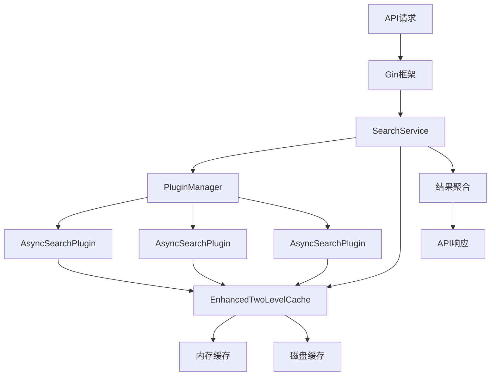
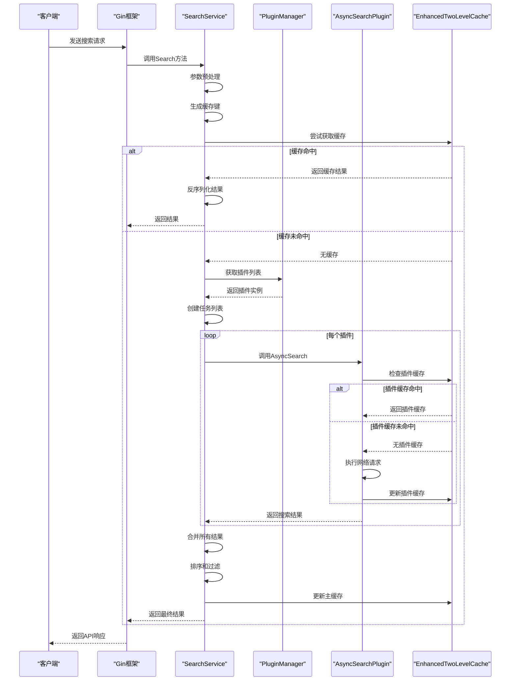

# 插件架构设计

<cite>
**本文档引用的文件**  
- [plugin.go](file://plugin/plugin.go)
- [search_service.go](file://service/search_service.go)
- [enhanced_two_level_cache.go](file://util/cache/enhanced_two_level_cache.go)
- [cache_key.go](file://util/cache/cache_key.go)
- [worker_pool.go](file://util/pool/worker_pool.go)
</cite>

## 目录
1. [系统架构概述](#系统架构概述)  
2. [核心组件分析](#核心组件分析)  
3. [微内核与插件接口设计](#微内核与插件接口设计)  
4. [搜索服务与并发控制](#搜索服务与并发控制)  
5. [缓存系统集成](#缓存系统集成)  
6. [组件交互流程](#组件交互流程)  
7. [性能与优化策略](#性能与优化策略)  
8. [总结](#总结)

## 系统架构概述

pansou插件系统采用微内核架构设计，通过定义统一的`AsyncSearchPlugin`接口，实现了对上百个第三方网站的可扩展支持。系统主服务通过`SearchService`协调各个插件，并利用Gin框架接收外部请求后，分发给多个插件执行异步搜索任务。

整个系统由以下核心组件构成：
- **主服务（Main Service）**：负责接收API请求，协调搜索流程
- **搜索服务（SearchService）**：核心协调者，管理插件调用与结果聚合
- **插件管理器（PluginManager）**：管理所有插件实例的生命周期
- **异步插件（AsyncSearchPlugin）**：实现具体网站搜索逻辑的可扩展组件
- **两级缓存系统（EnhancedTwoLevelCache）**：提升搜索性能的内存+磁盘缓存
- **工作池（WorkerPool）**：控制并发执行的任务池

该架构实现了高内聚、低耦合的设计原则，使得新插件的添加无需修改核心服务代码，只需实现标准接口即可接入系统。

**Section sources**
- [plugin.go](file://plugin/plugin.go#L17-L39)
- [search_service.go](file://service/search_service.go#L200-L202)

## 核心组件分析

### AsyncSearchPlugin 接口

`AsyncSearchPlugin`接口是整个插件系统的核心契约，定义了所有插件必须实现的方法：

```go
type AsyncSearchPlugin interface {
	Name() string
	Priority() int
	AsyncSearch(keyword string, searchFunc func(*http.Client, string, map[string]interface{}) ([]model.SearchResult, error), mainCacheKey string, ext map[string]interface{}) ([]model.SearchResult, error)
	SetMainCacheKey(key string)
	SetCurrentKeyword(keyword string)
	Search(keyword string, ext map[string]interface{}) ([]model.SearchResult, error)
	SkipServiceFilter() bool
}
```

该接口通过`AsyncSearch`方法实现了异步搜索能力，允许插件在后台执行耗时的网络请求。`Search`方法作为兼容性方法，内部调用`AsyncSearch`，确保了接口的向后兼容性。

**Section sources**
- [plugin.go](file://plugin/plugin.go#L17-L39)

### SearchService 搜索服务

`SearchService`是系统的核心协调组件，负责管理插件的调用流程和结果聚合：

```go
type SearchService struct {
	pluginManager *plugin.PluginManager
}
```

该服务通过`pluginManager`引用管理所有插件实例，并提供`Search`和`searchPlugins`等方法来协调搜索任务的执行。它实现了对Telegram搜索和插件搜索的并行处理，通过`sync.WaitGroup`确保所有任务完成后再返回结果。

**Section sources**
- [search_service.go](file://service/search_service.go#L200-L202)

## 微内核与插件接口设计

### 插件注册与管理

系统通过`PluginManager`管理所有插件实例，插件在初始化时注册到管理器中。`GetPlugins()`方法返回所有已注册的插件实例：

```go
func (pm *PluginManager) GetPlugins() []AsyncSearchPlugin {
	return pm.plugins
}
```

这种设计使得`SearchService`可以动态获取所有可用插件，而无需硬编码插件列表，实现了真正的可扩展性。

### 插件优先级机制

每个插件通过`Priority()`方法返回其优先级数值，系统在结果排序时会考虑插件等级。通过`getPluginLevelBySource`函数，系统可以动态获取插件的优先级：

```go
func getPluginLevelBySource(source string) int {
	// 尝试从缓存获取
	if level, ok := pluginLevelCache.Load(source); ok {
		return level.(int)
	}
	// ... 其他逻辑
}
```

这种设计允许系统根据插件质量动态调整结果排序，确保高质量插件的结果优先展示。

**Section sources**
- [plugin.go](file://plugin/plugin.go#L135-L137)
- [search_service.go](file://service/search_service.go#L1408-L1433)

## 搜索服务与并发控制

### 并发搜索执行

`SearchService`通过`searchPlugins`方法实现并发搜索，使用工作池模式控制并发数：

```go
func (s *SearchService) searchPlugins(keyword string, plugins []string, forceRefresh bool, concurrency int, ext map[string]interface{}) ([]model.SearchResult, error) {
	// ... 参数处理
	
	// 使用工作池执行并行搜索
	tasks := make([]pool.Task, 0, len(availablePlugins))
	for _, p := range availablePlugins {
		plugin := p
		tasks = append(tasks, func() interface{} {
			// 设置主缓存键和当前关键词
			plugin.SetMainCacheKey(cacheKey)
			plugin.SetCurrentKeyword(keyword)
			
			// 调用异步插件的AsyncSearch方法
			results, err := plugin.AsyncSearch(keyword, func(client *http.Client, kw string, extParams map[string]interface{}) ([]model.SearchResult, error) {
				return plugin.Search(kw, extParams)
			}, cacheKey, ext)
			
			if err != nil {
				return nil
			}
			return results
		})
	}
	
	// 执行搜索任务并获取结果
	results := pool.ExecuteBatchWithTimeout(tasks, concurrency, config.AppConfig.PluginTimeout)
	
	// 合并所有插件的结果
	// ...
}
```

### 超时机制实现

系统通过`ExecuteBatchWithTimeout`函数实现超时控制，确保搜索任务不会无限期等待：

```go
func ExecuteBatchWithTimeout(tasks []Task, maxWorkers int, timeout time.Duration) []interface{} {
	// 创建带超时的上下文
	ctx, cancel := context.WithTimeout(context.Background(), timeout)
	defer cancel()
	
	// 创建工作池
	pool := NewWorkerPoolWithContext(ctx, maxWorkers)
	defer pool.Close()
	
	// 提交所有任务
	for _, task := range tasks {
		select {
		case pool.taskQueue <- task:
			// 任务提交成功
		case <-ctx.Done():
			// 超时或取消，停止提交更多任务
			return pool.GetResults(len(tasks))
		}
	}
	
	// 获取所有结果
	return pool.GetResults(len(tasks))
}
```

这种设计确保了系统的响应性，即使某些插件响应缓慢或失败，也不会影响整体服务的可用性。

**Section sources**
- [search_service.go](file://service/search_service.go#L1218-L1365)
- [worker_pool.go](file://util/pool/worker_pool.go#L146-L177)

## 缓存系统集成

### 两级缓存设计

系统采用`EnhancedTwoLevelCache`实现内存+磁盘的两级缓存架构：

```go
type EnhancedTwoLevelCache struct {
	memory     *ShardedMemoryCache
	disk       *ShardedDiskCache
	mutex      sync.RWMutex
	serializer Serializer
}
```

该设计通过`NewEnhancedTwoLevelCache()`函数创建，内存缓存大小为磁盘缓存的60%，实现了性能与持久化的平衡。

### 缓存键生成

系统通过`GeneratePluginCacheKey`函数生成插件搜索的缓存键：

```go
func GeneratePluginCacheKey(keyword string, plugins []string) string {
	normalizedKeyword := strings.ToLower(strings.TrimSpace(keyword))
	pluginsHash := getPluginsHash(plugins)
	keyStr := fmt.Sprintf("plugin:%s:%s", normalizedKeyword, pluginsHash)
	hash := md5.Sum([]byte(keyStr))
	return hex.EncodeToString(hash[:])
}
```

这种设计确保了相同搜索条件的请求可以命中缓存，避免重复搜索。

### 缓存更新策略

系统采用智能缓存更新策略，通过`injectMainCacheToAsyncPlugins`函数将缓存更新能力注入到各个插件中：

```go
func injectMainCacheToAsyncPlugins(pluginManager *plugin.PluginManager, mainCache *cache.EnhancedTwoLevelCache) {
	// 创建缓存更新函数
	cacheUpdater := func(key string, newResults []model.SearchResult, ttl time.Duration, isFinal bool, keyword string, pluginName string) error {
		// 获取现有缓存数据进行合并
		var finalResults []model.SearchResult
		if existingData, hit, err := mainCache.Get(key); err == nil && hit {
			var existingResults []model.SearchResult
			if err := mainCache.GetSerializer().Deserialize(existingData, &existingResults); err == nil {
				// 合并新旧结果，去重保留最完整的数据
				finalResults = mergeSearchResults(existingResults, newResults)
			} else {
				finalResults = newResults
			}
		} else {
			finalResults = newResults
		}
		
		// 先更新内存缓存（立即可见）
		if err := mainCache.SetMemoryOnly(key, data, ttl); err != nil {
			return fmt.Errorf("内存缓存更新失败: %v", err)
		}
		
		// 使用缓存写入管理器处理磁盘写入（智能批处理）
		if cacheWriteManager := globalCacheWriteManager; cacheWriteManager != nil {
			operation := &cache.CacheOperation{
				Key:          key,
				Data:         finalResults,
				TTL:          ttl,
				IsFinal:      isFinal,
				PluginName:   pluginName,
				Keyword:      keyword,
				Priority:     2,
				Timestamp:    time.Now(),
				DataSize:     len(data),
			}
			
			// 根据是否为最终结果设置优先级
			if isFinal {
				operation.Priority = 1
			}
			
			return cacheWriteManager.HandleCacheOperation(operation)
		}
		
		// 兜底逻辑
		if isFinal {
			return mainCache.SetBothLevels(key, data, ttl)
		} else {
			return nil
		}
	}
	
	// 遍历所有插件，注入缓存更新函数
	for _, p := range plugins {
		if asyncPlugin, ok := p.(interface{ SetMainCacheUpdater(func(string, []model.SearchResult, time.Duration, bool, string) error) }); ok {
			pluginName := p.Name()
			pluginCacheUpdater := func(key string, newResults []model.SearchResult, ttl time.Duration, isFinal bool, keyword string) error {
				return cacheUpdater(key, newResults, ttl, isFinal, keyword, pluginName)
			}
			asyncPlugin.SetMainCacheUpdater(pluginCacheUpdater)
		}
	}
}
```

这种设计实现了缓存的智能更新，确保数据的一致性和完整性。

**Section sources**
- [enhanced_two_level_cache.go](file://util/cache/enhanced_two_level_cache.go#L0-L164)
- [cache_key.go](file://util/cache/cache_key.go#L63-L74)
- [search_service.go](file://service/search_service.go#L232-L347)

## 组件交互流程

### 系统上下文图



**Diagram sources**
- [search_service.go](file://service/search_service.go#L200-L202)
- [plugin.go](file://plugin/plugin.go#L17-L39)
- [enhanced_two_level_cache.go](file://util/cache/enhanced_two_level_cache.go#L0-L164)

### 组件交互序列图



**Diagram sources**
- [search_service.go](file://service/search_service.go#L350-L509)
- [search_service.go](file://service/search_service.go#L1218-L1365)
- [enhanced_two_level_cache.go](file://util/cache/enhanced_two_level_cache.go#L0-L164)

## 性能与优化策略

### 结果合并与去重

系统通过`mergeSearchResults`函数实现智能结果合并：

```go
func mergeSearchResults(existing []model.SearchResult, newResults []model.SearchResult) []model.SearchResult {
	resultMap := make(map[string]model.SearchResult)
	
	// 先添加现有结果
	for _, result := range existing {
		key := generateResultKey(result)
		resultMap[key] = result
	}
	
	// 合并新结果，如果UniqueID相同则选择信息更完整的
	for _, newResult := range newResults {
		key := generateResultKey(newResult)
		if existingResult, exists := resultMap[key]; exists {
			resultMap[key] = selectBetterResult(existingResult, newResult)
		} else {
			resultMap[key] = newResult
		}
	}
	
	// 按时间排序（最新的在前）
	sort.Slice(merged, func(i, j int) bool {
		return merged[i].Datetime.After(merged[j].Datetime)
	})
	
	return merged
}
```

### 综合排序算法

系统采用多维度的综合排序算法，通过`sortResultsByTimeAndKeywords`函数实现：

```go
func sortResultsByTimeAndKeywords(results []model.SearchResult) {
	scores := make([]ResultScore, len(results))
	
	for i, result := range results {
		source := getResultSource(result)
		
		scores[i] = ResultScore{
			Result:       result,
			TimeScore:    calculateTimeScore(result.Datetime),
			KeywordScore: getKeywordPriority(result.Title),
			PluginScore:  getPluginLevelScore(source),
			TotalScore:   0,
		}
		
		scores[i].TotalScore = scores[i].TimeScore + 
							  float64(scores[i].KeywordScore) + 
							  float64(scores[i].PluginScore)
	}
	
	// 按综合得分排序
	sort.Slice(scores, func(i, j int) bool {
		return scores[i].TotalScore > scores[j].TotalScore
	})
	
	// 更新原数组
	for i, score := range scores {
		results[i] = score.Result
	}
}
```

### 链接分组与过滤

系统通过`mergeResultsByType`函数实现链接按网盘类型分组：

```go
func mergeResultsByType(results []model.SearchResult, keyword string, cloudTypes []string) model.MergedLinks {
	// 创建合并结果的映射
	mergedLinks := make(model.MergedLinks, 12)
	
	// 用于去重的映射，键为URL
	uniqueLinks := make(map[string]model.MergedLink)
	
	// 遍历所有搜索结果
	for _, result := range results {
		// 提取消息中的链接-标题对应关系
		linkTitleMap := extractLinkTitlePairs(result.Content)
		
		// 处理每个链接
		for _, link := range result.Links {
			// 确定数据来源
			var source string
			if result.Channel != "" {
				source = "tg:" + result.Channel
			} else if result.UniqueID != "" && strings.Contains(result.UniqueID, "-") {
				parts := strings.SplitN(result.UniqueID, "-", 2)
				if len(parts) >= 1 {
					source = "plugin:" + parts[0]
				}
			} else {
				source = "unknown"
			}
			
			// 创建合并后的链接
			mergedLink := model.MergedLink{
				URL:      link.URL,
				Password: link.Password,
				Note:     title,
				Datetime: result.Datetime,
				Source:   source,
				Images:   result.Images,
			}
			
			// 检查是否已存在相同URL的链接
			if existingLink, exists := uniqueLinks[link.URL]; exists {
				if mergedLink.Datetime.After(existingLink.Datetime) {
					uniqueLinks[link.URL] = mergedLink
				}
			} else {
				uniqueLinks[link.URL] = mergedLink
			}
		}
	}
	
	// 按类型分组
	for _, mergedLink := range orderedLinks {
		linkType := linkTypeMap[mergedLink.URL]
		if linkType == "" {
			linkType = "unknown"
		}
		mergedLinks[linkType] = append(mergedLinks[linkType], mergedLink)
	}
	
	// 如果指定了cloudTypes，则过滤结果
	if len(cloudTypes) > 0 {
		// 创建过滤后的结果映射
		filteredLinks := make(model.MergedLinks)
		
		// 将cloudTypes转换为map以提高查找性能
		allowedTypes := make(map[string]bool)
		for _, cloudType := range cloudTypes {
			allowedTypes[strings.ToLower(strings.TrimSpace(cloudType))] = true
		}
		
		// 只保留指定类型的链接
		for linkType, links := range mergedLinks {
			if allowedTypes[strings.ToLower(linkType)] {
				filteredLinks[linkType] = links
			}
		}
		
		return filteredLinks
	}
	
	return mergedLinks
}
```

**Section sources**
- [search_service.go](file://service/search_service.go#L104-L138)
- [search_service.go](file://service/search_service.go#L541-L571)
- [search_service.go](file://service/search_service.go#L937-L1