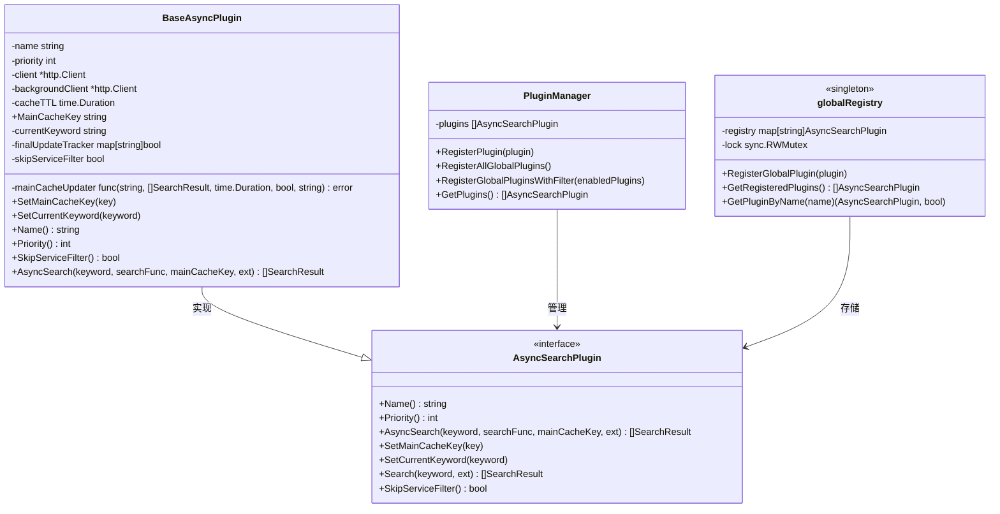
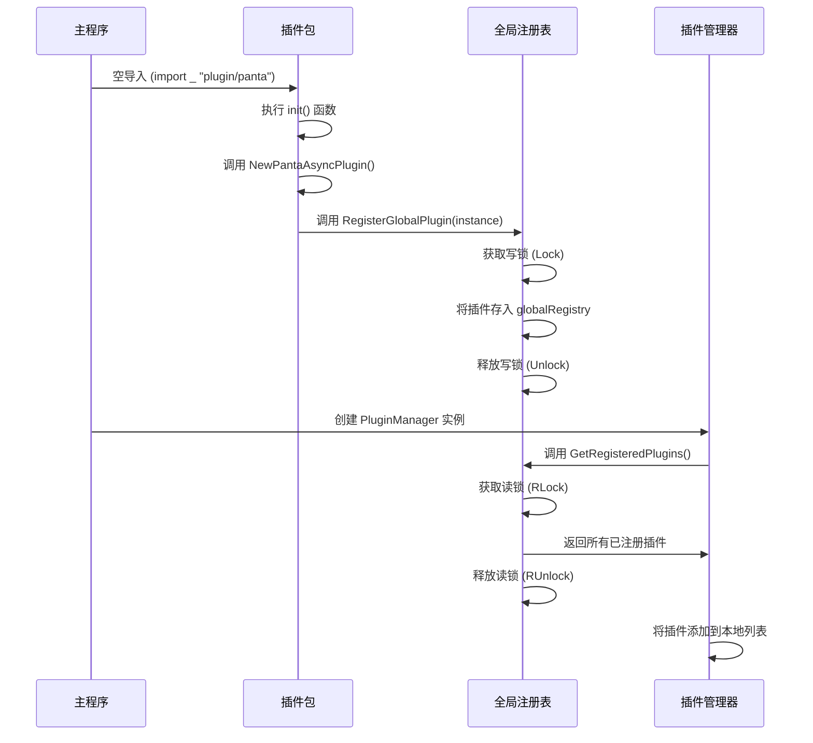

# 插件注册机制

<cite>
**本文档引用文件**  
- [plugin.go](file://plugin/plugin.go)
- [baseasyncplugin.go](file://plugin/baseasyncplugin.go)
- [panta/panta.go](file://plugin/panta/panta.go)
- [susu/susu.go](file://plugin/susu/susu.go)
</cite>

## 目录
1. [引言](#引言)
2. [插件注册机制概述](#插件注册机制概述)
3. [全局注册表设计与线程安全](#全局注册表设计与线程安全)
4. [基础插件初始化机制](#基础插件初始化机制)
5. [具体插件实现与注册流程](#具体插件实现与注册流程)
6. [注册时序图与内存模型](#注册时序图与内存模型)
7. [总结](#总结)

## 引言
本项目采用基于Go语言`init`函数特性的插件自动注册机制，实现异步搜索插件的动态加载与管理。通过空导入触发`init`函数执行，调用全局注册函数完成插件注册，避免了显式注册代码的冗余。该机制结合接口抽象、工厂模式与线程安全设计，构建了一个可扩展、高性能的插件系统。

## 插件注册机制概述
插件系统的自动注册机制依赖于Go语言的`init`函数特性。当插件包被导入（即使是空导入）时，其`init`函数会自动执行。在`init`函数中，通过调用`RegisterGlobalPlugin`函数将插件实例注册到全局注册表中。这一过程实现了插件的自动发现与注册，无需在主程序中显式编写注册代码。

该机制的核心优势在于：
- **自动化**：无需手动注册，降低维护成本
- **解耦**：插件实现与注册逻辑分离
- **可扩展性**：新增插件只需实现接口并编写`init`函数
- **延迟初始化**：`init`函数在包初始化时执行，确保环境准备就绪

**Section sources**
- [plugin.go](file://plugin/plugin.go#L42-L56)
- [panta/panta.go](file://plugin/panta/panta.go#L167-L170)
- [susu/susu.go](file://plugin/susu/susu.go#L49-L58)

## 全局注册表设计与线程安全
### 注册表结构设计
全局注册表在`plugin.go`中定义为：
```go
var (
	globalRegistry     = make(map[string]AsyncSearchPlugin)
	globalRegistryLock sync.RWMutex
)
```
其中：
- `globalRegistry`：以插件名称为键、插件实例为值的映射表
- `globalRegistryLock`：读写互斥锁，保障并发安全

注册表采用`map[string]AsyncSearchPlugin`结构，通过插件名称进行唯一标识，支持快速查找与遍历。

### 线程安全处理
注册表的线程安全通过`sync.RWMutex`实现：
- **写操作**（注册插件）：使用`Lock()`获取写锁，防止并发写入
- **读操作**（获取插件）：使用`RLock()`获取读锁，允许多个读操作并发执行

这种设计在保证数据一致性的同时，最大化了读操作的并发性能，符合插件系统"一次注册、多次读取"的使用模式。



**Diagram sources**
- [plugin.go](file://plugin/plugin.go#L12-L13)
- [plugin.go](file://plugin/plugin.go#L17-L39)

**Section sources**
- [plugin.go](file://plugin/plugin.go#L12-L13)
- [plugin.go](file://plugin/plugin.go#L17-L39)

## 基础插件初始化机制
### 工厂函数设计
`baseasyncplugin.go`中提供了`NewBaseAsyncPlugin`工厂函数，用于初始化基础插件的公共字段：

```go
func NewBaseAsyncPlugin(name string, priority int) *BaseAsyncPlugin {
	// 确保异步插件已初始化
	if !initialized {
		initAsyncPlugin()
	}
	
	// 确定超时和缓存时间
	responseTimeout := defaultAsyncResponseTimeout
	processingTimeout := defaultPluginTimeout
	cacheTTL := defaultCacheTTL
	
	// 如果配置已初始化，则使用配置中的值
	if config.AppConfig != nil {
		responseTimeout = config.AppConfig.AsyncResponseTimeoutDur
		processingTimeout = config.AppConfig.PluginTimeout
		cacheTTL = time.Duration(config.AppConfig.AsyncCacheTTLHours) * time.Hour
	}
	
	return &BaseAsyncPlugin{
		name:     name,
		priority: priority,
		client: &http.Client{
			Timeout: responseTimeout,
		},
		backgroundClient: &http.Client{
			Timeout: processingTimeout,
		},
		cacheTTL:           cacheTTL,
		finalUpdateTracker: make(map[string]bool),
		skipServiceFilter:  false,
	}
}
```

该函数初始化以下关键字段：
- `name`：插件名称
- `priority`：插件优先级
- `client`：短超时HTTP客户端（用于快速响应）
- `backgroundClient`：长超时HTTP客户端（用于后台处理）
- `cacheTTL`：缓存有效期
- `finalUpdateTracker`：最终结果更新追踪器

### 公共方法实现
基础插件还提供了两个关键的setter方法：

```go
func (p *BaseAsyncPlugin) SetMainCacheKey(key string) {
	p.MainCacheKey = key
}

func (p *BaseAsyncPlugin) SetCurrentKeyword(keyword string) {
	p.currentKeyword = keyword
}
```

- `SetMainCacheKey`：设置主缓存键，用于结果缓存
- `SetCurrentKeyword`：设置当前搜索关键词，用于日志显示

这些公共字段和方法为所有插件提供了统一的基础功能，确保了系统的一致性。

**Section sources**
- [baseasyncplugin.go](file://plugin/baseasyncplugin.go#L214-L245)
- [baseasyncplugin.go](file://plugin/baseasyncplugin.go#L282-L289)

## 具体插件实现与注册流程
### Panta插件实现
`panta/panta.go`中的`PantaAsyncPlugin`结构体继承了`BaseAsyncPlugin`：

```go
type PantaAsyncPlugin struct {
	*plugin.BaseAsyncPlugin
	// 并发控制字段
	maxConcurrency int
	currentConcurrency int
	// ...
}
```

其`init`函数实现了自动注册：
```go
func init() {
	plugin.RegisterGlobalPlugin(NewPantaAsyncPlugin())
}
```

`NewPantaAsyncPlugin`工厂函数初始化插件实例：
```go
func NewPantaAsyncPlugin() *PantaAsyncPlugin {
	p := &PantaAsyncPlugin{
		BaseAsyncPlugin:    plugin.NewBaseAsyncPlugin("panta", defaultPriority),
		maxConcurrency:     defaultConcurrency,
		currentConcurrency: defaultConcurrency,
		// ...
	}
	return p
}
```

### Susu插件实现
`susu/susu.go`中的`SusuAsyncPlugin`结构体同样继承了`BaseAsyncPlugin`：

```go
type SusuAsyncPlugin struct {
	*plugin.BaseAsyncPlugin
}
```

其`init`函数实现了自动注册：
```go
func init() {
	plugin.RegisterGlobalPlugin(NewSusuAsyncPlugin())
}
```

`NewSusuAsyncPlugin`工厂函数初始化插件实例：
```go
func NewSusuAsyncPlugin() *SusuAsyncPlugin {
	return &SusuAsyncPlugin{
		BaseAsyncPlugin: plugin.NewBaseAsyncPlugin("susu", 1),
	}
}
```

### 注册流程分析
1. **包导入**：主程序通过空导入引入插件包
2. **init执行**：Go运行时自动执行插件包的`init`函数
3. **实例创建**：调用`NewXXXAsyncPlugin`工厂函数创建插件实例
4. **注册调用**：通过`RegisterGlobalPlugin`将实例注册到全局注册表
5. **管理器加载**：插件管理器通过`RegisterAllGlobalPlugins`加载所有已注册插件



**Diagram sources**
- [panta/panta.go](file://plugin/panta/panta.go#L167-L170)
- [susu/susu.go](file://plugin/susu/susu.go#L49-L58)

**Section sources**
- [panta/panta.go](file://plugin/panta/panta.go#L150-L161)
- [panta/panta.go](file://plugin/panta/panta.go#L173-L187)
- [panta/panta.go](file://plugin/panta/panta.go#L209-L216)
- [susu/susu.go](file://plugin/susu/susu.go#L94-L96)
- [susu/susu.go](file://plugin/susu/susu.go#L99-L103)

## 注册时序图与内存模型
### 内存模型变化
在插件注册过程中，内存模型发生以下关键变化：

1. **全局注册表初始化**：
   - `globalRegistry`：创建空的`map[string]AsyncSearchPlugin`
   - `globalRegistryLock`：初始化为未锁定状态

2. **插件注册阶段**：
   - 调用`RegisterGlobalPlugin`时，获取写锁
   - 在`globalRegistry`中以插件名称为键存储插件实例
   - 释放写锁，允许其他读操作

3. **插件管理器加载**：
   - 调用`GetRegisteredPlugins`时，获取读锁
   - 遍历`globalRegistry`创建插件实例切片
   - 释放读锁

### 线程安全保证
该设计通过`sync.RWMutex`确保了内存模型的一致性：
- **写操作原子性**：注册插件时的写操作是原子的，防止数据竞争
- **读写隔离**：读操作不会阻塞其他读操作，提高并发性能
- **写写互斥**：多个写操作互斥执行，防止数据损坏

这种内存模型设计既保证了数据一致性，又最大化了系统性能，适用于高并发的搜索场景。

## 总结
本插件注册机制通过Go语言的`init`函数特性实现了自动化注册，结合接口抽象、工厂模式与线程安全设计，构建了一个高效、可扩展的插件系统。核心要点包括：
- 利用`init`函数实现空导入触发自动注册
- 通过`sync.RWMutex`保障全局注册表的线程安全
- 使用工厂函数统一初始化基础插件的公共字段
- 采用组合模式实现功能扩展与代码复用

该机制不仅简化了插件管理，还为系统的可维护性和可扩展性提供了坚实基础。