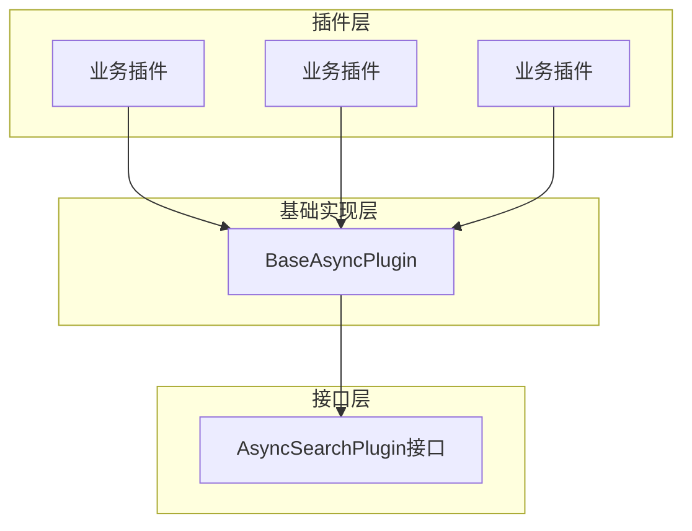
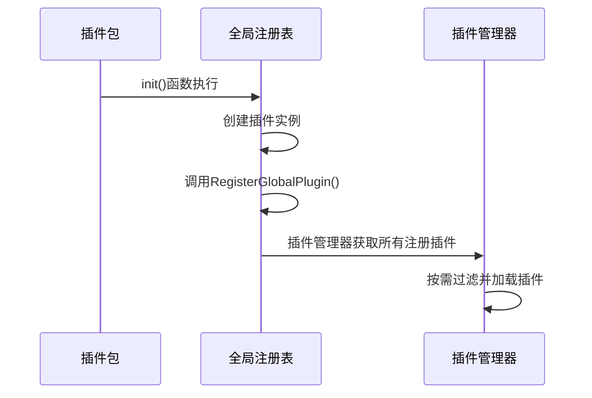
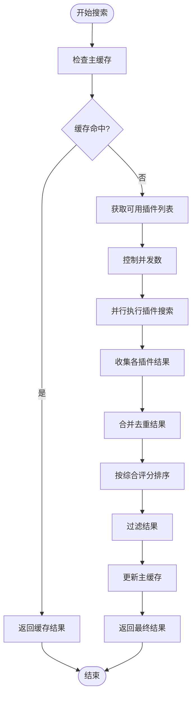
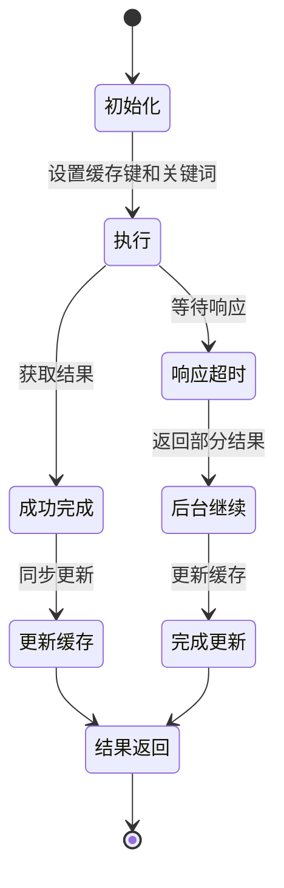

# 插件系统

<cite>
**本文档引用的文件**
- [plugin.go](file://plugin/plugin.go)
- [baseasyncplugin.go](file://plugin/baseasyncplugin.go)
- [search_service.go](file://service/search_service.go)
- [config.go](file://config/config.go)
</cite>

## 目录
1. [引言](#引言)
2. [插件架构设计](#插件架构设计)
3. [AsyncSearchPlugin接口定义](#asyncsearchplugin接口定义)
4. [插件注册机制](#插件注册机制)
5. [基础功能封装](#基础功能封装)
6. [服务层调用逻辑](#服务层调用逻辑)
7. [插件生命周期管理](#插件生命周期管理)
8. [总结](#总结)

## 引言
PanSou系统通过灵活的插件架构实现了对上百个第三方网站的可扩展支持。该架构采用异步搜索模式，结合并发控制、缓存管理和智能排序算法，确保了系统的高性能和可维护性。本文档深入阐述了插件系统的设计原理与实现细节。

## 插件架构设计
PanSou的插件架构采用接口驱动的设计模式，通过`AsyncSearchPlugin`接口定义统一的契约，使各个第三方网站的搜索逻辑能够以插件形式独立开发和维护。整个架构分为三层：接口层、基础实现层和业务插件层。



**Diagram sources**
- [plugin.go](file://plugin/plugin.go#L17-L39)
- [baseasyncplugin.go](file://plugin/baseasyncplugin.go#L214-L279)

**Section sources**
- [plugin.go](file://plugin/plugin.go#L1-L176)
- [baseasyncplugin.go](file://plugin/baseasyncplugin.go#L1-L976)

## AsyncSearchPlugin接口定义
`AsyncSearchPlugin`接口是整个插件系统的核心契约，定义了所有异步搜索插件必须实现的方法集合。该接口确保了插件行为的一致性和可预测性。

```mermaid
classDiagram
class AsyncSearchPlugin {
<<interface>>
+Name() string
+Priority() int
+AsyncSearch(keyword string, searchFunc func(*http.Client, string, map[string]interface{}) ([]model.SearchResult, error), mainCacheKey string, ext map[string]interface{}) ([]model.SearchResult, error)
+SetMainCacheKey(key string)
+SetCurrentKeyword(keyword string)
+Search(keyword string, ext map[string]interface{}) ([]model.SearchResult, error)
+SkipServiceFilter() bool
}
```

**Diagram sources**
- [plugin.go](file://plugin/plugin.go#L17-L39)

**Section sources**
- [plugin.go](file://plugin/plugin.go#L17-L39)

### 接口契约要求
- **Name()**: 返回插件唯一标识名称，用于注册和日志输出
- **Priority()**: 返回插件优先级数值，影响结果排序
- **AsyncSearch()**: 核心异步搜索方法，支持超时控制和缓存管理
- **SetMainCacheKey()**: 设置主缓存键，用于结果缓存
- **SetCurrentKeyword()**: 设置当前搜索关键词，用于日志显示
- **Search()**: 兼容性同步搜索方法，内部调用AsyncSearch
- **SkipServiceFilter()**: 是否跳过服务层关键词过滤，适用于磁力搜索等场景

## 插件注册机制
PanSou采用Go语言的`init`函数特性实现插件的自动注册机制。每个插件包在导入时通过`init`函数将自身实例注册到全局注册表中，实现了无需修改主程序代码即可扩展新插件的能力。



**Diagram sources**
- [plugin.go](file://plugin/plugin.go#L45-L65)
- [cyg.go](file://plugin/cyg/cyg.go#L79-L84)
- [xys.go](file://plugin/xys/xys.go#L55-L57)

**Section sources**
- [plugin.go](file://plugin/plugin.go#L45-L75)
- [cyg.go](file://plugin/cyg/cyg.go#L79-L84)
- [xys.go](file://plugin/xys/xys.go#L55-L57)

### 自动注册工作原理
1. 每个插件包包含一个`init`函数，在包初始化时自动执行
2. `init`函数创建插件实例并调用`RegisterGlobalPlugin`注册到全局注册表
3. 插件管理器通过`RegisterAllGlobalPlugins`或`RegisterGlobalPluginsWithFilter`方法批量获取已注册插件
4. 系统启动时完成所有插件的自动发现和加载

## 基础功能封装
`baseasyncplugin.go`文件提供了`BaseAsyncPlugin`结构体，封装了并发控制、错误处理、超时管理和缓存策略等通用功能，为具体插件实现提供了坚实的基础。

```mermaid
classDiagram
class BaseAsyncPlugin {
-name : string
-priority : int
-client : *http.Client
-backgroundClient : *http.Client
-cacheTTL : time.Duration
-mainCacheUpdater : func(string, []model.SearchResult, time.Duration, bool, string) error
-MainCacheKey : string
-currentKeyword : string
-finalUpdateTracker : map[string]bool
-skipServiceFilter : bool
+SetMainCacheKey(key string)
+SetCurrentKeyword(keyword string)
+SetMainCacheUpdater(updater func(string, []model.SearchResult, time.Duration, bool, string) error)
+Name() string
+Priority() int
+SkipServiceFilter() bool
+AsyncSearch(keyword string, searchFunc func(*http.Client, string, map[string]interface{}) ([]model.SearchResult, error), mainCacheKey string, ext map[string]interface{}) ([]model.SearchResult, error)
}
```

**Diagram sources**
- [baseasyncplugin.go](file://plugin/baseasyncplugin.go#L214-L279)

**Section sources**
- [baseasyncplugin.go](file://plugin/baseasyncplugin.go#L1-L976)

### 核心功能说明
- **并发控制**: 通过`backgroundWorkerPool`通道限制并发任务数，防止系统资源耗尽
- **错误处理**: 统一的错误捕获和处理机制，确保插件异常不会影响整体系统稳定性
- **超时管理**: 提供短超时客户端（默认4秒）和长超时客户端（默认30秒）两种HTTP客户端
- **缓存策略**: 内存缓存结合主缓存系统，支持缓存命中、过期刷新和后台更新
- **统计监控**: 内置缓存命中率、任务完成数等监控指标，便于性能分析

## 服务层调用逻辑
`search_service.go`中的服务层负责协调多个插件并行执行搜索任务，并对结果进行合并、排序和过滤。该过程体现了系统的高并发处理能力和智能结果整合能力。



**Diagram sources**
- [search_service.go](file://service/search_service.go#L1218-L1365)

**Section sources**
- [search_service.go](file://service/search_service.go#L1218-L1365)

### 协调执行流程
1. **缓存检查**: 首先检查主缓存中是否存在有效结果，提高响应速度
2. **插件筛选**: 根据请求参数筛选出需要执行的插件列表
3. **并发控制**: 使用工作池模式控制并发任务数量，避免系统过载
4. **并行执行**: 通过`pool.ExecuteBatchWithTimeout`方法并行调用各插件的`AsyncSearch`方法
5. **结果合并**: 使用`mergeSearchResults`函数合并所有插件的结果，去重并保留最完整的信息
6. **智能排序**: 根据插件等级、关键词匹配度和时间新鲜度进行综合评分排序
7. **缓存更新**: 将最终结果异步更新到主缓存系统，供后续请求使用

## 插件生命周期管理
插件的生命周期包括初始化、执行和结果返回三个主要阶段，每个阶段都有明确的职责和交互方式。



**Diagram sources**
- [baseasyncplugin.go](file://plugin/baseasyncplugin.go#L300-L600)
- [search_service.go](file://service/search_service.go#L1218-L1365)

**Section sources**
- [baseasyncplugin.go](file://plugin/baseasyncplugin.go#L300-L600)
- [search_service.go](file://service/search_service.go#L1218-L1365)

### 生命周期各阶段详解
- **初始化阶段**: 在`init`函数中创建插件实例并注册到全局注册表，设置基础配置如名称、优先级等
- **执行阶段**: 
  - 设置主缓存键和当前关键词
  - 尝试获取工作槽，控制并发
  - 执行搜索函数，支持短超时快速响应和长超时完整搜索
  - 处理超时情况，确保用户体验
- **结果返回阶段**:
  - 成功时返回完整结果并更新缓存
  - 超时时返回部分结果或空结果，后台继续处理
  - 错误时返回nil结果，不影响其他插件执行

## 总结
PanSou的插件架构通过清晰的接口定义、自动化的注册机制和强大的基础功能封装，实现了对上百个第三方网站的高效、可扩展支持。系统采用异步并发模式，结合智能缓存策略和结果合并算法，在保证高性能的同时提供了优质的搜索体验。这种设计模式不仅便于新插件的快速开发和集成，也为系统的持续优化和维护提供了良好的基础。