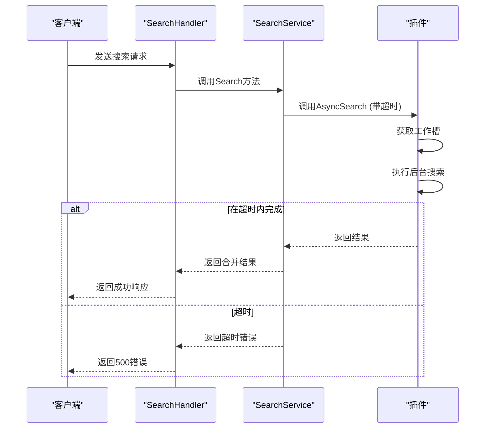

# 故障排除

<cite>
**本文档引用的文件**
- [handler.go](file://api/handler.go)
- [search_service.go](file://service/search_service.go)
- [baseasyncplugin.go](file://plugin/baseasyncplugin.go)
- [config.go](file://config/config.go)
- [hdr4k.go](file://plugin/hdr4k/hdr4k.go)
- [susu.go](file://plugin/susu/susu.go)
- [pansearch.go](file://plugin/pansearch/pansearch.go)
- [erxiao.go](file://plugin/erxiao/erxiao.go)
- [wanou.go](file://plugin/wanou/wanou.go)
- [bixin.go](file://plugin/bixin/bixin.go)
- [leijing.go](file://plugin/leijing/leijing.go)
- [duoduo.go](file://plugin/duoduo/duoduo.go)
- [pianku.go](file://plugin/pianku/pianku.go)
- [fox4k.go](file://plugin/fox4k/fox4k.go)
- [hdmoli.go](file://plugin/hdmoli/hdmoli.go)
- [jutoushe.go](file://plugin/jutoushe/jutoushe.go)
- [labi.go](file://plugin/labi/labi.go)
- [libvio.go](file://plugin/libvio/libvio.go)
- [muou.go](file://plugin/muou/muou.go)
- [thepiratebay.go](file://plugin/thepiratebay/thepiratebay.go)
- [xb6v.go](file://plugin/xb6v/xb6v.go)
- [xdyh.go](file://plugin/xdyh/xdyh.go)
- [xiaoji.go](file://plugin/xiaoji/xiaoji.go)
- [xiaozhang.go](file://plugin/xiaozhang/xiaozhang.go)
- [xuexizhinan.go](file://plugin/xuexizhinan/xuexizhinan.go)
- [xys.go](file://plugin/xys/xys.go)
- [yuhuage.go](file://plugin/yuhuage/yuhuage.go)
- [zhizhen.go](file://plugin/zhizhen/zhizhen.go)
- [html结构分析.md](file://plugin/bixin/html结构分析.md)
- [json结构分析.md](file://plugin/bixin/json结构分析.md)
- [设计文档.md](file://plugin/hdr4k/设计文档.md)
- [susu插件设计文档.md](file://plugin/susu/susu插件设计文档.md)
</cite>

## 目录
1. [简介](#简介)
2. [典型问题场景与根本原因分析](#典型问题场景与根本原因分析)
3. [日志分析技巧](#日志分析技巧)
4. [专项排查建议](#专项排查建议)
5. [问题隔离策略](#问题隔离策略)
6. [总结](#总结)

## 简介
本文档旨在为用户提供一份实用的故障排除指南，帮助诊断和解决在使用PanSou系统时可能遇到的常见问题。通过深入分析系统核心代码逻辑，特别是`handler.go`中的错误处理机制、`search_service.go`中的超时控制以及各插件的实现细节，我们将列举典型问题场景，提供日志分析技巧，并给出针对性的排查建议。本指南将帮助用户快速定位问题根源，恢复系统正常运行。

## 典型问题场景与根本原因分析

### 搜索无结果
**问题描述**：用户提交搜索请求后，返回结果为空，即使已知存在相关数据。

**根本原因分析**：
1.  **参数处理逻辑**：在`api/handler.go`中，`SearchHandler`函数对`plugins`和`channels`等参数的处理非常严格。如果请求中不存在`plugins`参数，则会将其设置为`nil`；如果参数为空字符串或仅包含空格，则会被忽略。这可能导致请求被错误地路由或过滤。
2.  **数据源互斥**：代码中实现了`src`（数据源）参数的互斥逻辑。当`src=tg`时，`plugins`参数会被忽略；当`src=plugin`时，`channels`参数会被忽略。如果用户配置错误，可能导致期望的数据源未被查询。
3.  **插件内部解析失败**：许多插件（如`hdr4k`、`susu`）依赖于特定的HTML结构来提取数据。如果目标网站的页面结构发生变化，插件的解析逻辑会失败，导致无法提取到任何结果。例如，`hdr4k.go`中的`getLinksFromDetail`函数如果解析失败，会返回空的链接列表。

**Section sources**
- [handler.go](file://api/handler.go#L1-L206)
- [hdr4k.go](file://plugin/hdr4k/hdr4k.go#L579-L629)
- [susu.go](file://plugin/susu/susu.go)

### 响应超时
**问题描述**：客户端在等待一段时间后收到超时错误，无法获取搜索结果。

**根本原因分析**：
1.  **异步响应超时**：系统采用异步架构，`search_service.go`中的`Search`方法会并行执行TG和插件搜索。每个插件的`AsyncSearch`调用都受到`AsyncResponseTimeoutDur`的限制（默认4秒）。如果插件在规定时间内未能返回结果，主服务将超时并返回错误。
2.  **插件处理超时**：插件本身使用`backgroundClient`进行长时间的后台处理，其超时时间由`PluginTimeout`配置。如果网络延迟或目标服务器响应慢，可能导致后台处理超时。
3.  **工作池饱和**：系统通过`backgroundWorkerPool`限制并发的后台任务数。如果所有工作槽都被占用，新的搜索请求将无法立即开始，只能等待，从而增加整体响应时间，最终可能导致超时。

**Diagram sources**
- [search_service.go](file://service/search_service.go#L218-L252)
- [baseasyncplugin.go](file://plugin/baseasyncplugin.go#L502-L546)

**Section sources**
- [search_service.go](file://service/search_service.go#L218-L252)
- [baseasyncplugin.go](file://plugin/baseasyncplugin.go#L502-L546)
- [config.go](file://config/config.go#L290-L337)

### 插件报错
**问题描述**：系统日志中频繁出现特定插件的错误信息。

**根本原因分析**：
1.  **网络连接错误**：插件在发起HTTP请求时可能遇到网络问题。`hdr4k.go`和`susu.go`中都实现了`isRetriableError`函数，用于判断错误是否可重试。常见的可重试错误包括网络超时（`net.Error.Timeout()`）、临时错误（`net.Error.Temporary()`）、连接被拒绝（`connection refused`）和连接重置（`connection reset`）。
2.  **解析错误**：当插件使用`goquery`解析HTML时，如果响应体不是有效的HTML，`NewDocumentFromReader`会返回错误。这通常意味着目标URL返回了非HTML内容（如JSON、500错误页面或重定向）。
3.  **数据提取失败**：即使HTML解析成功，如果页面结构与预期不符，使用`Find`或`Attr`等方法提取数据时可能返回空值。例如，`bixin.go`中提取链接时，如果页面中没有包含`caiyun.139.com`的文本，则无法提取到任何链接。

**Section sources**
- [hdr4k.go](file://plugin/hdr4k/hdr4k.go#L579-L629)
- [susu.go](file://plugin/susu/susu.go)
- [bixin.go](file://plugin/bixin/bixin.go)

### 缓存失效
**问题描述**：系统未能有效利用缓存，导致重复请求和性能下降。

**根本原因分析**：
1.  **缓存更新策略**：系统采用智能缓存策略。在`baseasyncplugin.go`中，只有当后台搜索完成并获得最终结果时，才会调用`updateMainCacheWithFinal`将数据写入主缓存。如果后台任务因超时或错误而中断，主缓存不会被更新。
2.  **缓存键生成**：缓存键的生成逻辑必须一致。如果插件在生成缓存键时使用了动态参数（如时间戳），会导致缓存命中率极低。
3.  **缓存清理**：系统会定期清理过期的API缓存。如果`defaultCacheTTL`设置过短，或者清理逻辑过于激进，可能导致有效缓存被过早删除。

**Section sources**
- [baseasyncplugin.go](file://plugin/baseasyncplugin.go#L502-L546)
- [baseasyncplugin.go](file://plugin/baseasyncplugin.go#L51-L98)

## 日志分析技巧
有效的日志分析是故障排除的关键。以下是定位关键错误信息的技巧：

1.  **关注错误级别**：优先查找`ERROR`和`WARN`级别的日志。这些日志通常直接指出了问题所在。
2.  **追踪请求ID**：如果系统实现了请求ID追踪，可以通过唯一的请求ID将分散在不同组件中的日志关联起来，形成完整的调用链。
3.  **识别关键日志点**：
    *   **搜索开始**：查找`开始搜索`或`[插件名] 开始搜索`的日志，确认请求已到达。
    *   **性能统计**：查找`搜索完成`或`耗时`的日志，判断是性能问题还是功能问题。
    *   **错误记录**：查找`解析HTML失败`、`HTTP状态码`、`连接被拒绝`等明确的错误信息。
    *   **缓存状态**：查找`缓存命中`、`缓存未命中`、`响应超时，返回部分缓存`等日志，判断缓存是否正常工作。
4.  **分析重试日志**：对于网络错误，系统会进行重试。查找`重试`或`指数退避`相关的日志，可以判断网络问题的严重程度和持续时间。

**Section sources**
- [hdr4k.go](file://plugin/hdr4k/hdr4k.go#L579-L629)
- [erxiao.go](file://plugin/erxiao/erxiao.go#L430-L464)
- [wanou.go](file://plugin/wanou/wanou.go#L430-L467)

## 专项排查建议
针对不同类型的插件，提供以下专项排查建议：

### 依赖特定HTML结构的插件
对于`hdr4k`、`susu`、`leijing`等依赖HTML结构的插件：
1.  **手动验证页面结构**：使用浏览器访问插件的目标搜索URL，检查页面的HTML结构是否与插件代码中的`html结构分析.md`文档描述一致。重点关注`goquery`选择器（如`.topicItem`、`.hl-item-title`）所定位的元素是否存在。
2.  **检查CSS选择器**：确认插件代码中使用的CSS选择器（如`doc.Find(".content .title")`）是否仍然有效。网站可能更改了CSS类名。
3.  **验证请求头**：某些网站会检查`User-Agent`或`Referer`。确保插件发送的请求头与`html结构分析.md`文档中建议的一致。

**Section sources**
- [hdr4k.go](file://plugin/hdr4k/hdr4k.go)
- [susu.go](file://plugin/susu/susu.go)
- [leijing.go](file://plugin/leijing/leijing.go)
- [html结构分析.md](file://plugin/hdr4k/html结构分析.md)

### 依赖JSON API的插件
对于`pansearch`、`bixin`等依赖JSON API的插件：
1.  **检查API端点**：手动访问插件调用的API URL，确认返回的JSON数据格式是否与预期一致。API可能已更改或下线。
2.  **验证认证信息**：如果API需要认证（如API Key、Cookie），检查插件的认证逻辑是否正确，认证信息是否有效。
3.  **分析响应数据**：使用`json结构分析.md`文档作为参考，检查返回的JSON数据中关键字段（如`buildId`、`__NEXT_DATA__`）是否存在。

**Section sources**
- [pansearch.go](file://plugin/pansearch/pansearch.go)
- [bixin.go](file://plugin/bixin/bixin.go)
- [json结构分析.md](file://plugin/bixin/json结构分析.md)

## 问题隔离策略
为了快速定位问题，建议采用以下策略进行问题隔离：

1.  **简化请求**：将复杂的搜索请求简化为最基本的请求。例如，只指定`kw`和`src=plugin`，不指定`plugins`、`channels`等参数。如果简化后的请求能成功，再逐步添加参数，以确定是哪个参数导致了问题。
2.  **关闭缓存**：通过在请求中添加`refresh=true`参数，强制刷新缓存，绕过缓存层。这可以帮助判断问题是出在数据获取阶段还是缓存阶段。
3.  **单插件测试**：在请求中明确指定`plugins=插件名`，只测试单个插件。这可以排除其他插件干扰，快速定位是哪个插件出现了问题。
4.  **检查环境变量**：确认`ENABLED_PLUGINS`、`ASYNC_PLUGIN_ENABLED`等关键环境变量的配置是否正确。错误的配置可能导致插件未被加载。

**Section sources**
- [handler.go](file://api/handler.go#L1-L206)
- [config.go](file://config/config.go#L290-L337)

## 总结
通过理解PanSou系统的架构和代码逻辑，用户可以更有效地进行故障排除。面对问题时，应首先检查日志以获取线索，然后根据问题类型（无结果、超时、报错、缓存失效）进行针对性分析。对于依赖外部网站的插件，应特别关注目标网站的结构变化。利用简化请求、关闭缓存和单插件测试等隔离策略，可以快速缩小问题范围，最终解决问题。