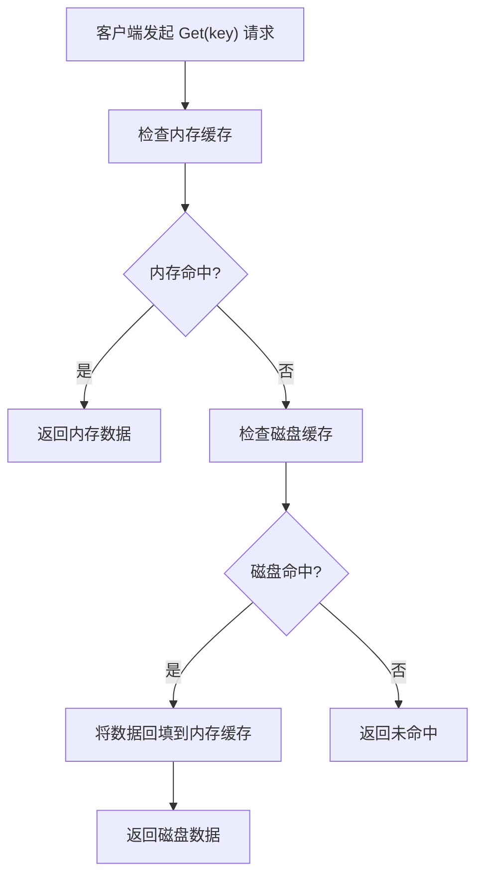
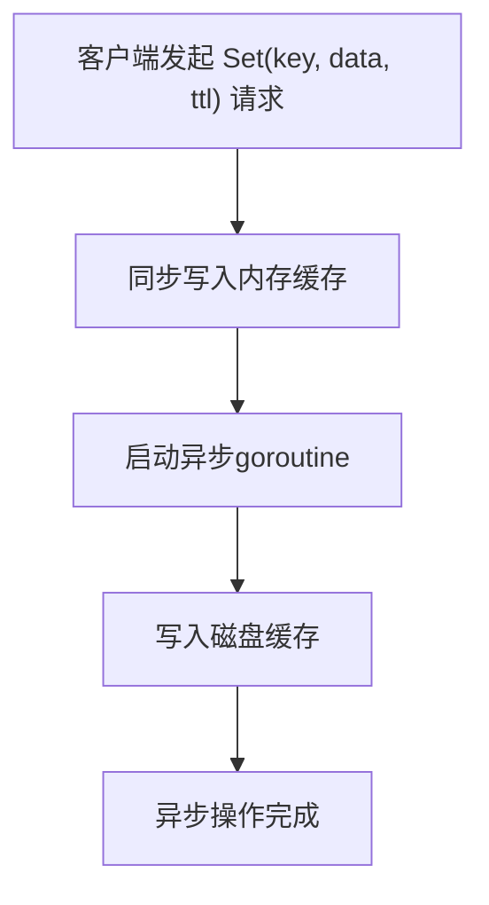
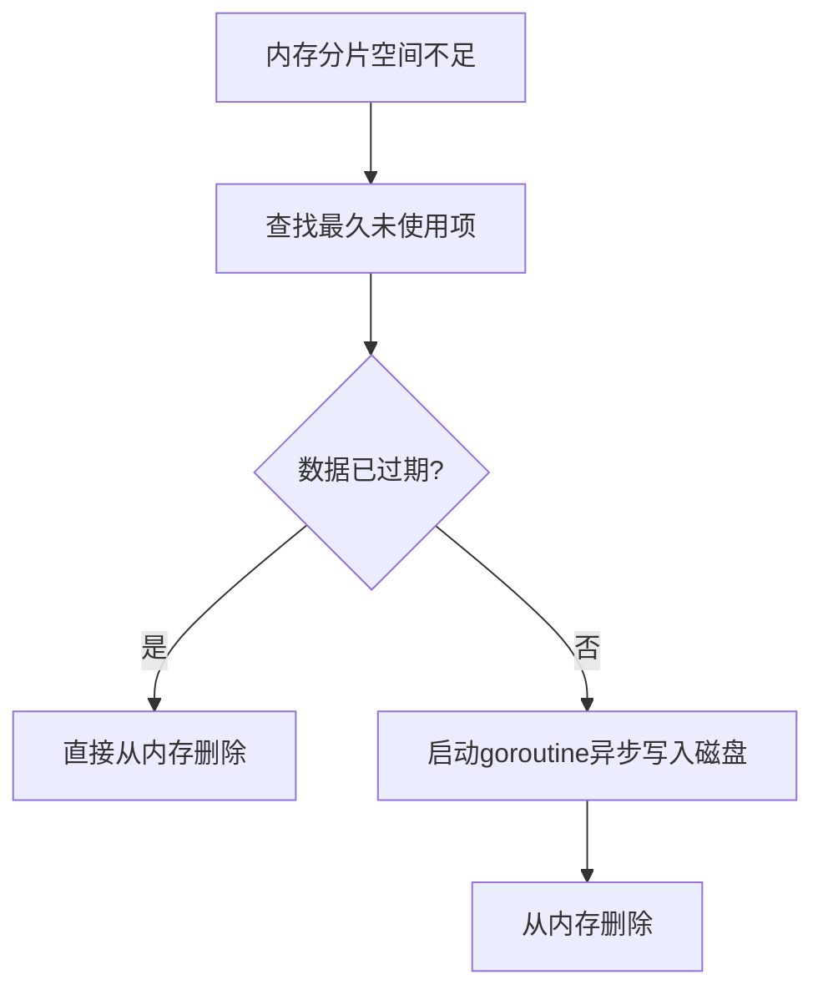
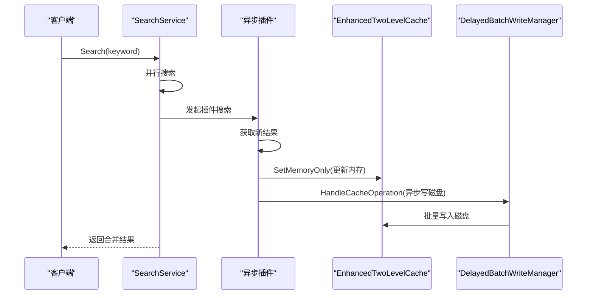

# 两级缓存架构

<cite>
**本文档引用的文件**
- [enhanced_two_level_cache.go](file://util/cache/enhanced_two_level_cache.go)
- [sharded_memory_cache.go](file://util/cache/sharded_memory_cache.go)
- [sharded_disk_cache.go](file://util/cache/sharded_disk_cache.go)
- [delayed_batch_write_manager.go](file://util/cache/delayed_batch_write_manager.go)
- [global_buffer_manager.go](file://util/cache/global_buffer_manager.go)
- [search_service.go](file://service/search_service.go)
- [cache_integration.go](file://service/cache_integration.go)
</cite>

## 目录
1. [架构概述](#架构概述)
2. [核心组件分析](#核心组件分析)
3. [读取流程](#读取流程)
4. [写入策略](#写入策略)
5. [缓存淘汰与持久化](#缓存淘汰与持久化)
6. [并发与分片设计](#并发与分片设计)
7. [缓存异常应对策略](#缓存异常应对策略)
8. [调用链路分析](#调用链路分析)
9. [性能优化与平衡](#性能优化与平衡)

## 架构概述

两级缓存架构是一种结合内存缓存和磁盘缓存的混合缓存系统，旨在平衡访问速度与数据持久性。该架构通过内存缓存提供极快的读取速度，同时利用磁盘缓存确保数据在系统重启后不会丢失，从而有效减少对后端数据库的直接访问压力。

在本实现中，`EnhancedTwoLevelCache` 结构体作为两级缓存的核心，封装了内存缓存（`ShardedMemoryCache`）和磁盘缓存（`ShardedDiskCache`）两个组件。内存缓存基于分片设计，使用 `sync.RWMutex` 实现并发安全，而磁盘缓存则通过文件系统存储数据，确保持久性。这种分层设计使得系统能够优先从内存中获取数据，仅在内存未命中时才访问较慢的磁盘，从而在保证性能的同时实现了数据的持久化。

**架构来源**
- [enhanced_two_level_cache.go](file://util/cache/enhanced_two_level_cache.go#L11-L16)
- [sharded_memory_cache.go](file://util/cache/sharded_memory_cache.go#L40-L49)
- [sharded_disk_cache.go](file://util/cache/sharded_disk_cache.go#L12-L19)

## 核心组件分析

两级缓存架构由多个核心组件协同工作，每个组件负责特定的功能。

`EnhancedTwoLevelCache` 是整个架构的入口，它通过 `NewEnhancedTwoLevelCache` 函数初始化。该函数首先创建内存缓存实例，其大小设置为磁盘缓存的60%，然后创建分片的磁盘缓存，并将磁盘缓存的引用注入到内存缓存中，以便在内存淘汰时能将数据备份到磁盘。最后，它创建一个序列化器用于数据的序列化和反序列化。

`ShardedMemoryCache` 实现了分片的内存缓存，通过 `runtime.NumCPU()` 动态确定分片数量，以充分利用多核CPU的性能。每个分片都有独立的互斥锁，减少了锁竞争。缓存项包含数据、过期时间、最后使用时间和大小等元数据，支持LRU（最近最少使用）淘汰策略。

`ShardedDiskCache` 负责将数据持久化到磁盘。它同样采用分片设计，将数据分散到多个子目录中，避免单个目录下文件过多导致的性能问题。分片数量也基于CPU核心数动态确定，但上限设置为32，以避免过多的文件夹。

**组件来源**
- [enhanced_two_level_cache.go](file://util/cache/enhanced_two_level_cache.go#L19-L44)
- [sharded_memory_cache.go](file://util/cache/sharded_memory_cache.go#L52-L84)
- [sharded_disk_cache.go](file://util/cache/sharded_disk_cache.go#L27-L41)

## 读取流程

两级缓存的读取流程遵循"先内存，后磁盘"的原则，以最大化读取性能。

当调用 `Get` 方法时，系统首先检查内存缓存。如果在内存中找到对应键的缓存项（`memHit` 为 `true`），则直接返回数据，整个过程非常快速。如果内存缓存未命中，系统会尝试从磁盘缓存中读取数据。如果磁盘缓存命中，系统不仅返回数据，还会将该数据重新写入内存缓存，以便后续的快速访问。这种"缓存穿透"（Cache Penetration）后的回填机制，能够有效提升缓存的命中率。

读取流程的关键在于 `GetWithTimestamp` 方法，它不仅能获取数据，还能获取数据的最后修改时间。这使得系统在将磁盘数据回填到内存时，能够保持数据的时间戳一致性。整个读取过程通过 `sync.RWMutex` 确保了并发安全，读操作使用读锁，避免了不必要的写锁开销。

**读取流程来源**
- [enhanced_two_level_cache.go](file://util/cache/enhanced_two_level_cache.go#L94-L113)
- [sharded_memory_cache.go](file://util/cache/sharded_memory_cache.go#L171-L194)
- [sharded_disk_cache.go](file://util/cache/sharded_disk_cache.go#L102-L105)

## 写入策略

两级缓存提供了多种写入策略，以适应不同的业务场景。

最基础的写入方法是 `Set`，它采用"写内存+异步写磁盘"的模式。首先，数据被同步写入内存缓存，这保证了写入操作的快速响应。然后，系统启动一个独立的goroutine，将数据异步写入磁盘。这种设计避免了慢速的磁盘I/O操作阻塞调用者，从而提高了系统的整体吞吐量。

对于需要强一致性的场景，提供了 `SetBothLevels` 方法。该方法会同步地将数据写入内存和磁盘，只有当两者都成功时才返回，确保了数据的即时持久化。

此外，`SetWithFinalFlag` 方法提供了一种智能写入策略。当 `isFinal` 参数为 `true` 时，调用 `SetBothLevels` 进行双写；否则，仅调用 `SetMemoryOnly` 更新内存缓存。这种策略常用于异步数据处理，例如在插件搜索中，中间结果只更新内存，而最终结果则进行双写以确保持久化。

**写入策略来源**
- [enhanced_two_level_cache.go](file://util/cache/enhanced_two_level_cache.go#L47-L61)
- [enhanced_two_level_cache.go](file://util/cache/enhanced_two_level_cache.go#L85-L91)
- [sharded_memory_cache.go](file://util/cache/sharded_memory_cache.go#L114-L142)
- [sharded_disk_cache.go](file://util/cache/sharded_disk_cache.go#L96-L99)

## 缓存淘汰与持久化

缓存淘汰和持久化是两级缓存架构中确保内存效率和数据安全的关键机制。

内存缓存的淘汰策略在 `evictFromShard` 方法中实现。当某个分片的空间不足时，系统会遍历该分片的所有项，找出"最久未使用"（Least Recently Used）的项进行淘汰。关键的优化在于，被淘汰的项在从内存中删除之前，会检查其是否已过期。如果数据尚未过期，系统会启动一个goroutine，将其异步写入磁盘缓存。这种"淘汰前刷盘"的策略，确保了有价值的数据不会因为内存压力而永久丢失。

持久化方面，除了写入时的异步刷盘，系统还提供了 `FlushMemoryToDisk` 方法，可以将内存缓存中的所有数据一次性刷新到磁盘。这通常在系统关闭前调用，以确保所有数据都被持久化。

**淘汰与持久化来源**
- [sharded_memory_cache.go](file://util/cache/sharded_memory_cache.go#L216-L248)
- [enhanced_two_level_cache.go](file://util/cache/enhanced_two_level_cache.go#L149-L164)
- [sharded_memory_cache.go](file://util/cache/sharded_memory_cache.go#L338-L342)

## 并发与分片设计

为了应对高并发场景，两级缓存架构在内存和磁盘层面都采用了分片（Sharding）设计。

内存缓存 `ShardedMemoryCache` 将数据分散到多个 `memoryCacheShard` 中。通过 `fnv` 哈希算法计算键的哈希值，并使用掩码（`shardMask`）进行快速取模，确定数据应存储在哪个分片。每个分片有独立的 `sync.RWMutex`，这样不同分片上的读写操作可以并行执行，极大地减少了锁竞争，提高了并发性能。

磁盘缓存 `ShardedDiskCache` 的分片策略类似，它将数据存储在不同的子目录（如 `shard_0`, `shard_1`）中。这不仅分散了I/O压力，还避免了单个目录下文件数量过多导致的文件系统性能下降。

**并发与分片来源**
- [sharded_memory_cache.go](file://util/cache/sharded_memory_cache.go#L100-L110)
- [sharded_disk_cache.go](file://util/cache/sharded_disk_cache.go#L78-L85)

## 缓存异常应对策略

该架构通过多种策略来应对缓存穿透、击穿和雪崩等常见问题。

**缓存穿透**：当查询一个在数据库中也不存在的键时，会导致每次查询都穿透到数据库。本架构通过在 `injectMainCacheToAsyncPlugins` 函数中处理空结果来缓解此问题。当插件搜索返回空结果时，系统仍会创建一个空的缓存项并写入内存，这样后续的相同查询可以直接返回空结果，而无需再次调用插件。

**缓存击穿**：当一个热点数据在缓存中过期时，大量并发请求会同时穿透到数据库。本架构通过 `DelayedBatchWriteManager` 的批量写入机制来缓解。即使多个请求同时触发了数据更新，写入操作也会被合并到一个批次中，减少了对数据库的冲击。

**缓存雪崩**：当大量缓存项在同一时间过期时，会导致数据库瞬间压力剧增。本架构通过动态的TTL（Time To Live）和随机过期时间来避免。虽然代码中未直接体现，但 `config.AppConfig.CacheTTLMinutes` 的配置为统一TTL，实际应用中可通过在TTL基础上增加随机偏移来实现。

**异常应对来源**
- [search_service.go](file://service/search_service.go#L232-L347)
- [delayed_batch_write_manager.go](file://util/cache/delayed_batch_write_manager.go#L379-L397)

## 调用链路分析

搜索请求与缓存层的交互是一个典型的调用链路，展示了两级缓存的实际应用。

当 `SearchService.Search` 方法被调用时，它会并行地从Telegram和插件获取搜索结果。对于插件搜索，`injectMainCacheToAsyncPlugins` 函数会将一个缓存更新函数注入到每个异步插件中。当插件获取到新的搜索结果时，它会调用这个更新函数。

该更新函数首先尝试从主缓存中获取现有数据，然后将新旧结果合并，去重并保留最完整的信息。接着，它将合并后的结果序列化，并调用 `mainCache.SetMemoryOnly` 立即更新内存缓存，确保新数据对后续请求可见。最后，它创建一个 `CacheOperation` 对象，并通过 `DelayedBatchWriteManager` 的 `HandleCacheOperation` 方法处理磁盘写入。这个管理器会根据策略（如混合策略 `hybrid`）决定是立即写入还是批量写入，从而实现了写入的智能调度。

**调用链路来源**
- [search_service.go](file://service/search_service.go#L350-L509)
- [search_service.go](file://service/search_service.go#L232-L347)
- [cache_integration.go](file://service/cache_integration.go#L55-L81)
- [delayed_batch_write_manager.go](file://util/cache/delayed_batch_write_manager.go#L379-L397)

## 性能优化与平衡

两级缓存架构通过多种机制实现了性能与持久性的平衡。

首先，通过分片设计和读写锁，内存缓存能够支持高并发读写。其次，异步写磁盘和批量写入显著降低了I/O开销。`DelayedBatchWriteManager` 会根据时间、数量、数据大小和系统负载等多种条件触发批量写入，避免了频繁的小I/O操作。

内存和磁盘的容量配比（60% vs 40%）也是一个重要的平衡点。较大的内存缓存提高了命中率，而足够的磁盘空间则保证了数据的持久化能力。此外，`GlobalBufferManager` 的引入，通过按插件或关键词对写入操作进行分组和缓冲，进一步优化了写入效率。

综上所述，该两级缓存架构通过精心设计的读写策略、淘汰机制和并发模型，成功地在高性能和高可靠性之间取得了良好的平衡，有效减轻了后端数据库的压力。

**性能优化来源**
- [enhanced_two_level_cache.go](file://util/cache/enhanced_two_level_cache.go#L22-L23)
- [delayed_batch_write_manager.go](file://util/cache/delayed_batch_write_manager.go#L720-L756)
- [global_buffer_manager.go](file://util/cache/global_buffer_manager.go#L149-L176)