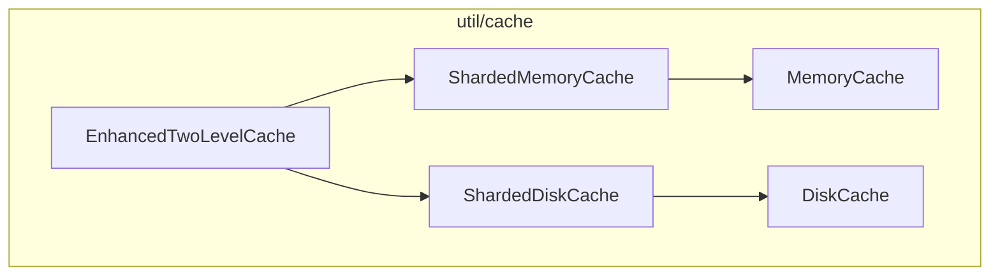
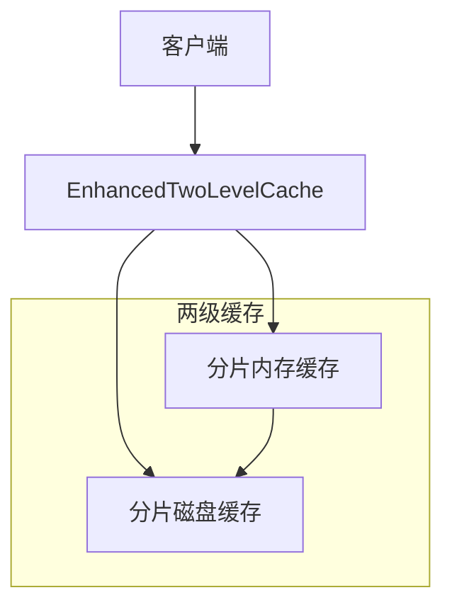
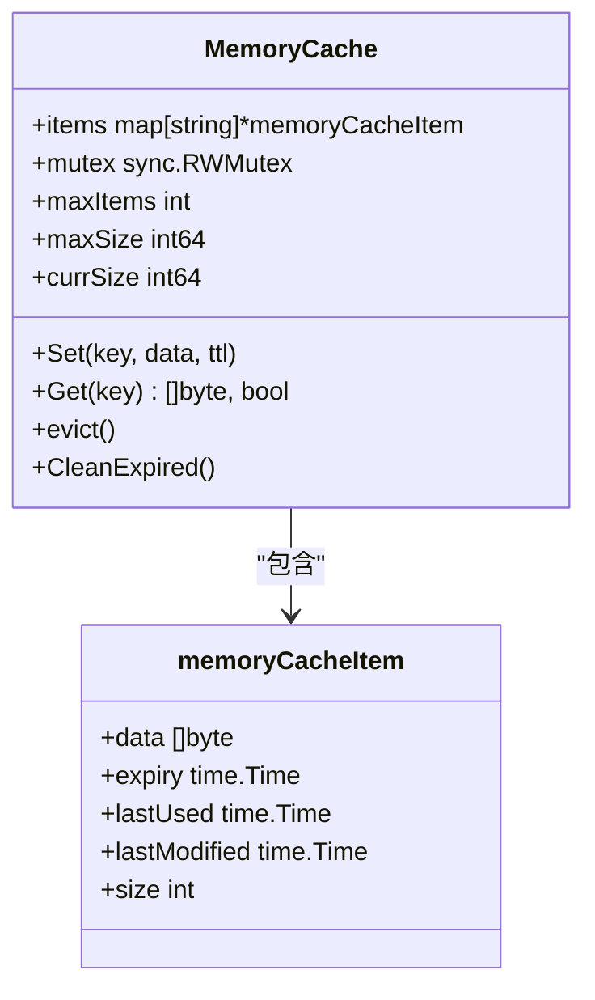
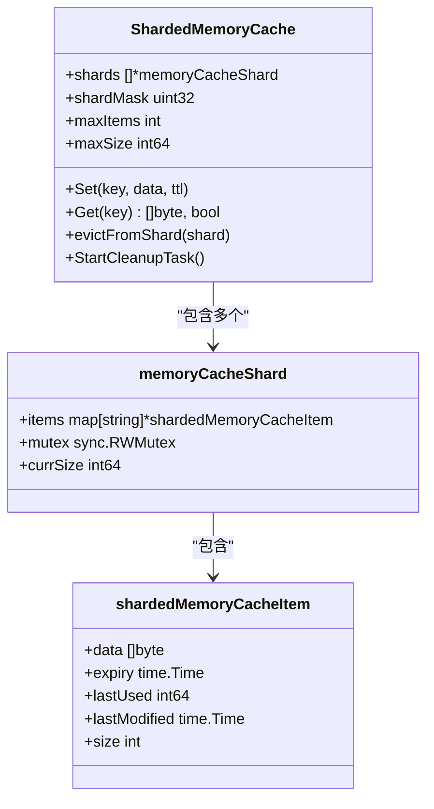
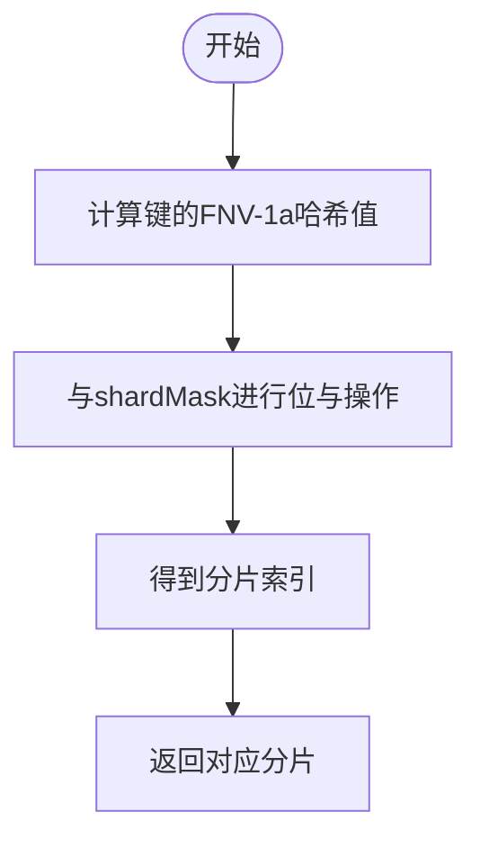
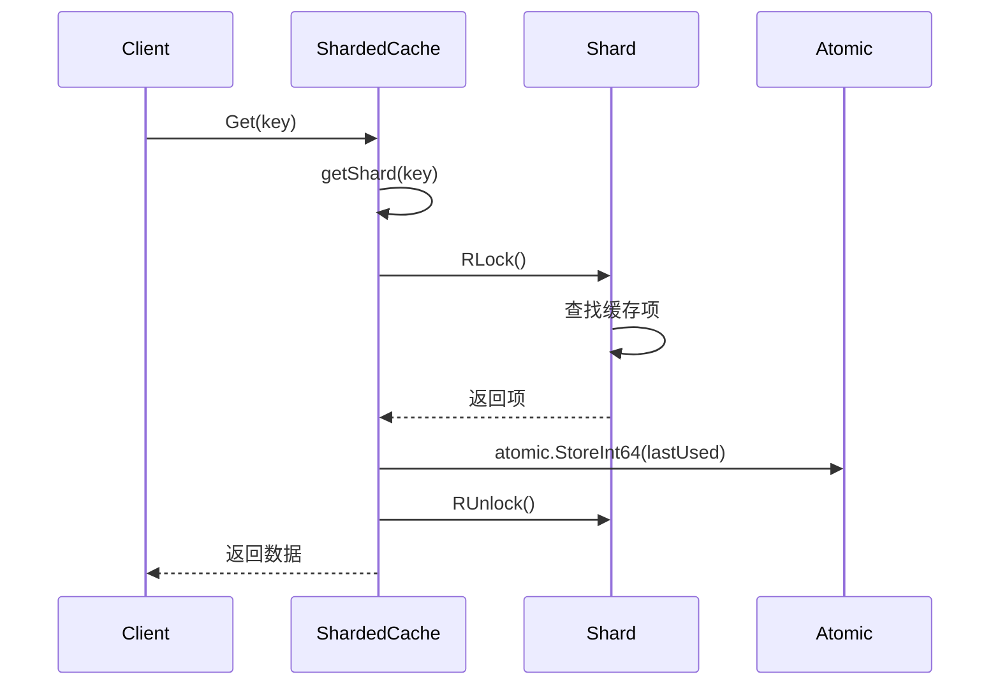
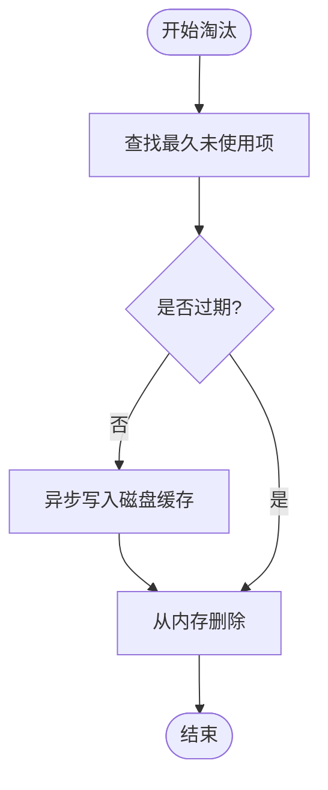

# 内存缓存实现

<cite>
**本文档中引用的文件**   
- [memory_cache.go](file://util/cache/memory_cache.go)
- [sharded_memory_cache.go](file://util/cache/sharded_memory_cache.go)
- [config.go](file://config/config.go)
</cite>

## 目录
1. [简介](#简介)
2. [项目结构](#项目结构)
3. [核心组件](#核心组件)
4. [架构概述](#架构概述)
5. [详细组件分析](#详细组件分析)
6. [依赖分析](#依赖分析)
7. [性能考虑](#性能考虑)
8. [故障排除指南](#故障排除指南)
9. [结论](#结论)

## 简介
本文档深入解析 `memory_cache.go` 和 `sharded_memory_cache.go` 中的内存缓存实现。重点分析基础内存缓存的数据结构（如 map + mutex）及其局限性，详细说明分片内存缓存在高并发场景下如何通过分片减少锁竞争以提升性能。结合代码片段展示分片哈希算法和并发访问控制机制，并分析其与 Go runtime 的 GC 行为交互，提供内存使用优化建议。

## 项目结构
项目中的内存缓存功能位于 `util/cache` 目录下，主要包括基础内存缓存、分片内存缓存、磁盘缓存及两级缓存集成。核心文件为 `memory_cache.go` 和 `sharded_memory_cache.go`，分别实现了单锁内存缓存和分片式并发优化缓存。



**Diagram sources**
- [memory_cache.go](file://util/cache/memory_cache.go#L1-L187)
- [sharded_memory_cache.go](file://util/cache/sharded_memory_cache.go#L1-L390)

**Section sources**
- [memory_cache.go](file://util/cache/memory_cache.go#L1-L187)
- [sharded_memory_cache.go](file://util/cache/sharded_memory_cache.go#L1-L390)

## 核心组件
本节分析 `MemoryCache` 和 `ShardedMemoryCache` 的核心结构与方法，包括缓存项定义、设置、获取、驱逐和清理机制。

**Section sources**
- [memory_cache.go](file://util/cache/memory_cache.go#L8-L187)
- [sharded_memory_cache.go](file://util/cache/sharded_memory_cache.go#L24-L390)

## 架构概述
系统采用分层缓存架构，`EnhancedTwoLevelCache` 集成分片内存缓存与分片磁盘缓存，形成两级缓存体系。内存缓存用于快速访问，磁盘缓存用于持久化和容量扩展。分片机制有效降低锁竞争，提升并发性能。



**Diagram sources**
- [enhanced_two_level_cache.go](file://util/cache/enhanced_two_level_cache.go#L11-L165)
- [sharded_memory_cache.go](file://util/cache/sharded_memory_cache.go#L40-L49)
- [sharded_disk_cache.go](file://util/cache/sharded_disk_cache.go#L12-L19)

## 详细组件分析
### 基础内存缓存分析
`MemoryCache` 使用 `map[string]*memoryCacheItem` 存储缓存项，通过 `sync.RWMutex` 实现读写锁控制。每个缓存项包含数据、过期时间、最后使用时间、最后修改时间和大小。支持基于 TTL 的设置与获取，采用 LRU 策略驱逐旧项，并定期清理过期条目。

#### 数据结构


**Diagram sources**
- [memory_cache.go](file://util/cache/memory_cache.go#L17-L23)
- [memory_cache.go](file://util/cache/memory_cache.go#L8-L14)

**Section sources**
- [memory_cache.go](file://util/cache/memory_cache.go#L35-L94)

### 分片内存缓存分析
`ShardedMemoryCache` 将缓存划分为多个分片（shard），每个分片独立管理自己的键值对和锁，从而显著减少锁竞争。分片数量基于 CPU 核心数动态确定，且为 2 的幂，便于使用位掩码进行快速哈希定位。

#### 分片机制


**Diagram sources**
- [sharded_memory_cache.go](file://util/cache/sharded_memory_cache.go#L40-L49)
- [sharded_memory_cache.go](file://util/cache/sharded_memory_cache.go#L33-L37)
- [sharded_memory_cache.go](file://util/cache/sharded_memory_cache.go#L24-L30)

**Section sources**
- [sharded_memory_cache.go](file://util/cache/sharded_memory_cache.go#L101-L168)

#### 分片哈希算法
分片通过 FNV-1a 哈希算法计算键的哈希值，并使用掩码 `shardMask` 进行快速取模，定位到具体分片。该方法避免了昂贵的除法运算，提升性能。



**Diagram sources**
- [sharded_memory_cache.go](file://util/cache/sharded_memory_cache.go#L101-L106)

**Section sources**
- [sharded_memory_cache.go](file://util/cache/sharded_memory_cache.go#L101-L106)

#### 并发访问控制
每个分片拥有独立的 `sync.RWMutex`，读写操作仅锁定对应分片，极大降低锁竞争。此外，`lastUsed` 字段使用 `int64` 存储纳秒时间戳，并通过 `atomic.StoreInt64` 原子更新，避免在 `Get` 操作中加锁，进一步提升读性能。



**Diagram sources**
- [sharded_memory_cache.go](file://util/cache/sharded_memory_cache.go#L145-L168)

**Section sources**
- [sharded_memory_cache.go](file://util/cache/sharded_memory_cache.go#L145-L168)

#### 淘汰与磁盘备份
当分片容量达到上限时，调用 `evictFromShard` 执行 LRU 淘汰。关键优化在于：淘汰前若数据未过期，则异步将其写入磁盘缓存（由 `diskCache` 引用），实现内存淘汰保护，提升缓存命中率。



**Diagram sources**
- [sharded_memory_cache.go](file://util/cache/sharded_memory_cache.go#L216-L248)

**Section sources**
- [sharded_memory_cache.go](file://util/cache/sharded_memory_cache.go#L216-L248)

## 依赖分析
`ShardedMemoryCache` 依赖 `ShardedDiskCache` 实现淘汰数据的磁盘备份，通过 `SetDiskCacheReference` 设置引用。全局清理任务采用单例模式，多个缓存实例注册到 `registeredCaches`，由 `globalCleanupTicker` 统一触发 `CleanExpired`，避免重复启动定时器。

```mermaid
graph TD
ShardedMemoryCache --> ShardedDiskCache : "可选依赖"
ShardedMemoryCache --> globalCleanupTicker : "注册清理"
ShardedDiskCache --> globalCleanupTicker : "注册清理"
```

**Diagram sources**
- [sharded_memory_cache.go](file://util/cache/sharded_memory_cache.go#L305-L335)
- [sharded_disk_cache.go](file://util/cache/sharded_disk_cache.go#L158-L162)

**Section sources**
- [sharded_memory_cache.go](file://util/cache/sharded_memory_cache.go#L305-L335)

## 性能考虑
- **分片优势**：将全局锁拆分为多个分片锁，显著提升高并发读写性能。
- **原子操作**：使用 `atomic` 更新 `lastUsed`，避免 `Get` 操作的写锁，提升读吞吐。
- **异步刷盘**：淘汰时异步写入磁盘，避免阻塞主线程。
- **哈希优化**：使用 FNV-1a 和位掩码实现快速分片定位。
- **GC 交互**：缓存对象长期存活，可能增加 GC 压力。建议合理设置 `maxSize` 并启用 `GCPercent` 调优。

**Section sources**
- [config.go](file://config/config.go#L27-L506)

## 故障排除指南
- **内存泄漏**：检查 `currSize` 是否正确更新，确保 `Set` 和 `evict` 中增减一致。
- **缓存击穿**：高并发下 `Get` 可能因过期检查和删除操作导致短暂不一致，建议业务层加锁或使用布隆过滤器。
- **清理任务未执行**：确认 `StartCleanupTask` 已调用，且 `globalCleanupTicker` 正常运行。
- **分片不均**：FNV 哈希通常分布均匀，若出现热点，可考虑更换哈希算法。

**Section sources**
- [memory_cache.go](file://util/cache/memory_cache.go#L170-L187)
- [sharded_memory_cache.go](file://util/cache/sharded_memory_cache.go#L251-L278)

## 结论
`ShardedMemoryCache` 通过分片机制有效解决了基础 `MemoryCache` 在高并发场景下的锁竞争问题，结合原子操作、异步刷盘和全局清理单例，实现了高性能、高可用的内存缓存。其与 `ShardedDiskCache` 的集成进一步提升了缓存的鲁棒性和容量。合理配置 GC 参数可优化内存使用，适用于大规模并发搜索服务的缓存需求。