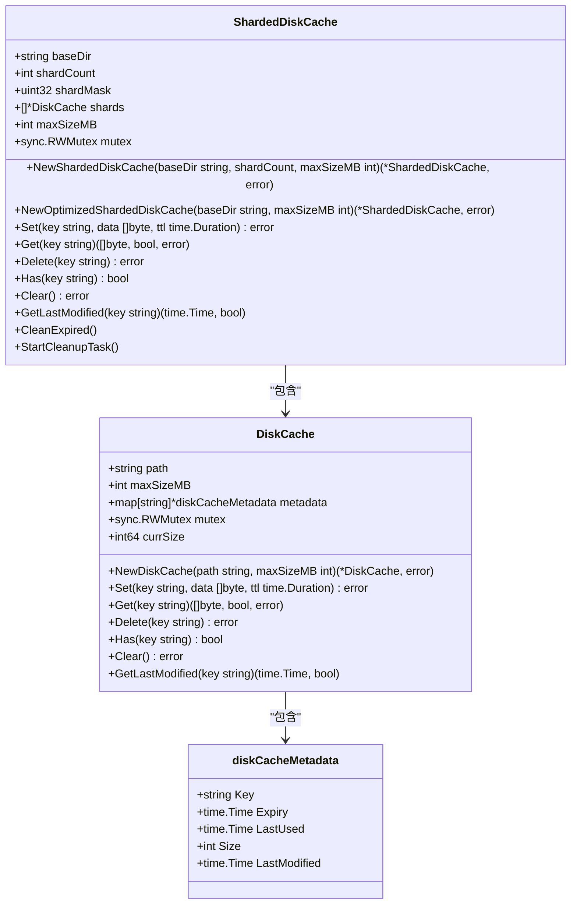
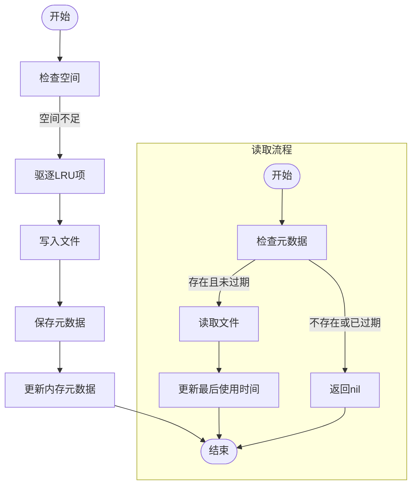
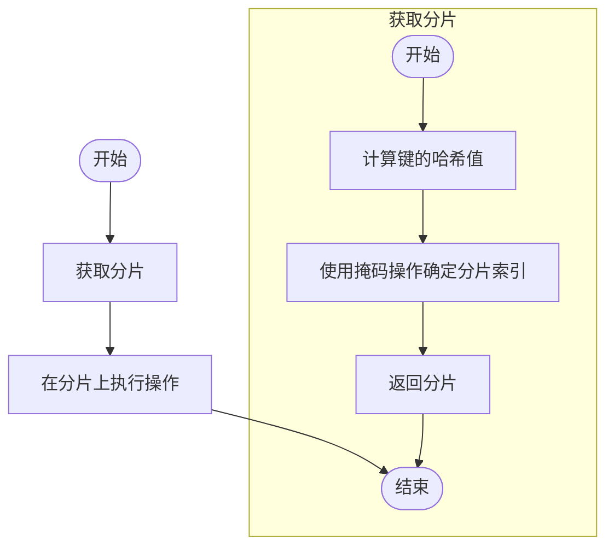
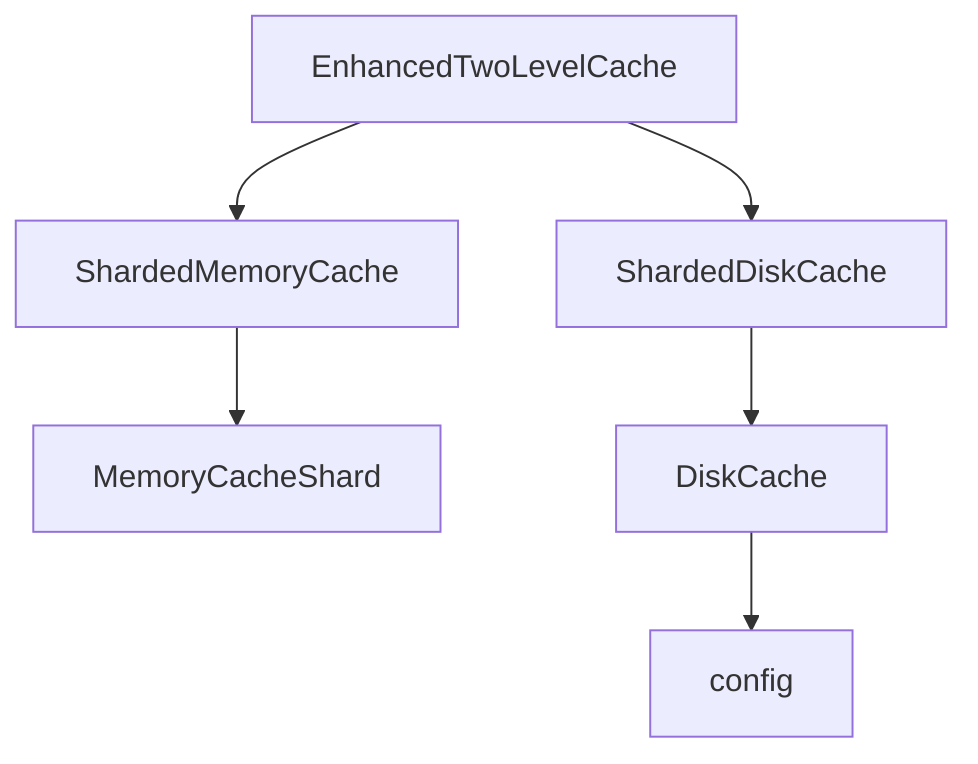

# 磁盘缓存实现

<cite>
**本文档中引用的文件**
- [disk_cache.go](file://util/cache/disk_cache.go)
- [sharded_disk_cache.go](file://util/cache/sharded_disk_cache.go)
- [config.go](file://config/config.go)
- [enhanced_two_level_cache.go](file://util/cache/enhanced_two_level_cache.go)
- [sharded_memory_cache.go](file://util/cache/sharded_memory_cache.go)
</cite>

## 目录
1. [引言](#引言)
2. [项目结构](#项目结构)
3. [核心组件](#核心组件)
4. [架构概述](#架构概述)
5. [详细组件分析](#详细组件分析)
6. [依赖分析](#依赖分析)
7. [性能考虑](#性能考虑)
8. [故障排除指南](#故障排除指南)
9. [结论](#结论)

## 引言
本文档详细说明了 `disk_cache.go` 和 `sharded_disk_cache.go` 中磁盘缓存的设计与实现。描述了基于文件系统的存储结构，包括缓存文件的组织方式、索引机制和读写性能优化。解释了分片磁盘缓存如何通过分散I/O压力提升吞吐量。说明了持久化策略、文件清理机制和磁盘空间管理。结合实际部署场景，讨论了SSD与HDD对性能的影响及配置建议。

## 项目结构
项目中的磁盘缓存功能主要位于 `util/cache` 目录下，核心文件包括 `disk_cache.go` 和 `sharded_disk_cache.go`。这些文件实现了基于文件系统的磁盘缓存和分片磁盘缓存。`config.go` 文件中定义了缓存相关的配置参数，如缓存路径、最大大小和TTL等。

```mermaid
graph TD
subgraph "util/cache"
disk_cache[disk_cache.go]
sharded_disk_cache[sharded_disk_cache.go]
enhanced_two_level_cache[enhanced_two_level_cache.go]
sharded_memory_cache[sharded_memory_cache.go]
end
subgraph "config"
config[config.go]
end
disk_cache --> config
sharded_disk_cache --> disk_cache
enhanced_two_level_cache --> sharded_disk_cache
enhanced_two_level_cache --> sharded_memory_cache
```

**图源**
- [disk_cache.go](file://util/cache/disk_cache.go)
- [sharded_disk_cache.go](file://util/cache/sharded_disk_cache.go)
- [enhanced_two_level_cache.go](file://util/cache/enhanced_two_level_cache.go)
- [sharded_memory_cache.go](file://util/cache/sharded_memory_cache.go)
- [config.go](file://config/config.go)

**节源**
- [disk_cache.go](file://util/cache/disk_cache.go)
- [sharded_disk_cache.go](file://util/cache/sharded_disk_cache.go)
- [config.go](file://config/config.go)

## 核心组件
磁盘缓存的核心组件包括 `DiskCache` 和 `ShardedDiskCache`。`DiskCache` 实现了基本的磁盘缓存功能，包括设置、获取、删除和清理过期项。`ShardedDiskCache` 则通过分片技术提升了缓存的吞吐量和并发性能。

**节源**
- [disk_cache.go](file://util/cache/disk_cache.go#L25-L31)
- [sharded_disk_cache.go](file://util/cache/sharded_disk_cache.go#L12-L19)

## 架构概述
磁盘缓存的架构设计旨在提供高效、可靠的缓存服务。`DiskCache` 类负责管理单个缓存目录中的文件和元数据，而 `ShardedDiskCache` 类通过将数据分散到多个分片中，减少了单个目录的I/O压力，提高了并发性能。



**图源**
- [disk_cache.go](file://util/cache/disk_cache.go#L25-L31)
- [sharded_disk_cache.go](file://util/cache/sharded_disk_cache.go#L12-L19)

## 详细组件分析

### DiskCache 分析
`DiskCache` 类实现了基本的磁盘缓存功能。它通过文件系统存储缓存数据，并使用元数据文件记录每个缓存项的过期时间、最后使用时间和大小等信息。

#### 存储结构
缓存数据存储在指定的目录中，每个缓存项对应一个数据文件和一个元数据文件。数据文件的名称是通过MD5哈希计算得到的，元数据文件的名称是数据文件名加上 `.meta` 后缀。

#### 索引机制
`DiskCache` 使用内存中的 `metadata` 字典来索引缓存项。字典的键是缓存项的键，值是 `diskCacheMetadata` 结构体，包含缓存项的元数据。

#### 读写性能优化
- **写入优化**：在写入新数据前，先检查是否有足够的空间。如果空间不足，会触发LRU（最近最少使用）驱逐策略，删除最久未使用的缓存项。
- **读取优化**：读取缓存项时，先检查内存中的元数据，确认缓存项未过期后再读取数据文件。读取成功后，会更新元数据中的最后使用时间。

#### 持久化策略
缓存数据和元数据都持久化到文件系统中。数据文件和元数据文件分别存储，确保数据的完整性和一致性。

#### 文件清理机制
- **过期清理**：定期检查并删除过期的缓存项。清理任务每10分钟执行一次。
- **空间清理**：当缓存空间不足时，触发LRU驱逐策略，删除最久未使用的缓存项，直到有足够的空间。

#### 磁盘空间管理
`DiskCache` 维护一个 `currSize` 变量，记录当前缓存占用的总大小。每次设置或删除缓存项时，都会更新 `currSize`。当 `currSize` 超过 `maxSizeMB` 时，会触发空间清理。



**图源**
- [disk_cache.go](file://util/cache/disk_cache.go#L113-L169)
- [disk_cache.go](file://util/cache/disk_cache.go#L172-L207)

**节源**
- [disk_cache.go](file://util/cache/disk_cache.go#L25-L31)

### ShardedDiskCache 分析
`ShardedDiskCache` 类通过分片技术提升了磁盘缓存的性能。它将数据分散到多个 `DiskCache` 实例中，每个实例管理一个独立的缓存目录。

#### 分片机制
- **分片数量**：分片数量可以通过 `NewShardedDiskCache` 函数显式指定，也可以通过 `NewOptimizedShardedDiskCache` 函数动态确定。动态分片数量基于CPU核心数，但限制在4到32之间。
- **分片选择**：使用FNV哈希算法计算键的哈希值，然后通过掩码操作确定分片索引。掩码操作确保分片数量是2的幂，从而提高取模运算的效率。

#### 读写性能优化
- **并发性能**：由于数据分散到多个分片中，多个并发请求可以同时访问不同的分片，减少了锁竞争，提高了并发性能。
- **I/O压力分散**：每个分片管理独立的缓存目录，I/O操作分散到多个目录中，减少了单个目录的I/O压力。

#### 持久化策略
每个分片的持久化策略与 `DiskCache` 相同，数据和元数据分别存储在各自的目录中。

#### 文件清理机制
- **过期清理**：每个分片独立执行过期清理任务，清理过期的缓存项。
- **空间清理**：每个分片独立执行空间清理任务，触发LRU驱逐策略。

#### 磁盘空间管理
`ShardedDiskCache` 维护一个 `maxSizeMB` 变量，表示所有分片的总最大大小。每个分片的大小是 `maxSizeMB` 除以分片数量。当某个分片的空间不足时，会触发该分片的LRU驱逐策略。



**图源**
- [sharded_disk_cache.go](file://util/cache/sharded_disk_cache.go#L87-L93)
- [sharded_disk_cache.go](file://util/cache/sharded_disk_cache.go#L96-L99)

**节源**
- [sharded_disk_cache.go](file://util/cache/sharded_disk_cache.go#L12-L19)

## 依赖分析
磁盘缓存组件依赖于配置文件 `config.go` 中的缓存路径、最大大小和TTL等参数。`EnhancedTwoLevelCache` 类通过 `ShardedDiskCache` 和 `ShardedMemoryCache` 实现了两级缓存，提供了更高的性能和可靠性。



**图源**
- [enhanced_two_level_cache.go](file://util/cache/enhanced_two_level_cache.go#L11-L16)
- [sharded_memory_cache.go](file://util/cache/sharded_memory_cache.go#L40-L49)
- [disk_cache.go](file://util/cache/disk_cache.go#L25-L31)
- [config.go](file://config/config.go)

**节源**
- [enhanced_two_level_cache.go](file://util/cache/enhanced_two_level_cache.go#L11-L16)
- [sharded_memory_cache.go](file://util/cache/sharded_memory_cache.go#L40-L49)
- [disk_cache.go](file://util/cache/disk_cache.go#L25-L31)
- [config.go](file://config/config.go)

## 性能考虑
- **SSD vs HDD**：SSD具有更快的读写速度和更低的延迟，适合高并发、高I/O的场景。HDD虽然成本较低，但读写速度较慢，适合低并发、低I/O的场景。
- **配置建议**：
  - **SSD**：建议使用 `NewOptimizedShardedDiskCache` 函数动态确定分片数量，充分利用SSD的高并发性能。
  - **HDD**：建议减少分片数量，避免过多的I/O操作导致性能下降。

## 故障排除指南
- **缓存未命中**：检查缓存项是否已过期或被删除。可以通过 `Has` 方法检查缓存项是否存在。
- **磁盘空间不足**：检查 `maxSizeMB` 配置是否合理，必要时增加缓存大小或优化缓存策略。
- **性能下降**：检查I/O操作是否集中在某个分片，考虑调整分片数量或优化分片选择算法。

**节源**
- [disk_cache.go](file://util/cache/disk_cache.go#L232-L249)
- [sharded_disk_cache.go](file://util/cache/sharded_disk_cache.go#L114-L117)

## 结论
本文档详细介绍了 `disk_cache.go` 和 `sharded_disk_cache.go` 中磁盘缓存的设计与实现。通过分片技术，`ShardedDiskCache` 提升了缓存的吞吐量和并发性能。结合实际部署场景，提供了SSD与HDD的性能对比和配置建议，帮助用户优化缓存性能。