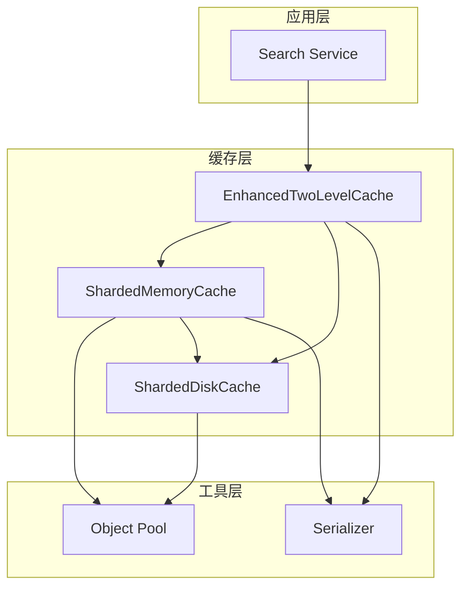
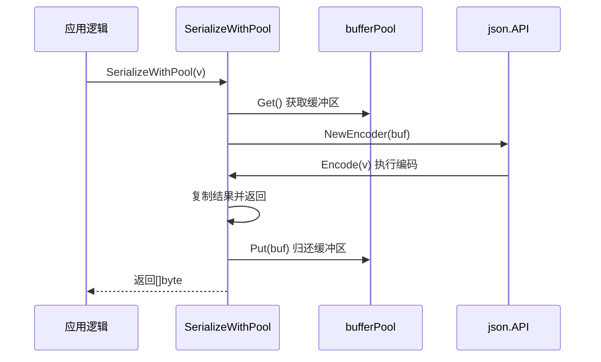
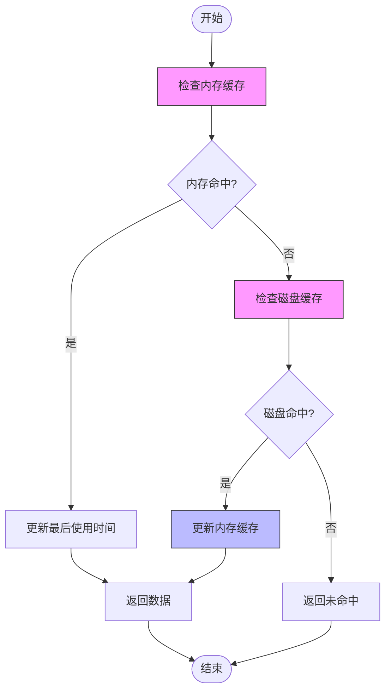
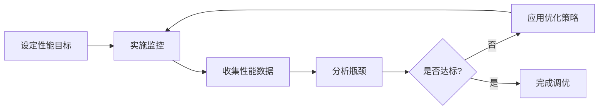

# 缓存性能监控与优化

<cite>
**本文档引用的文件**  
- [utils.go](file://util/cache/utils.go)
- [enhanced_two_level_cache.go](file://util/cache/enhanced_two_level_cache.go)
- [sharded_memory_cache.go](file://util/cache/sharded_memory_cache.go)
- [sharded_disk_cache.go](file://util/cache/sharded_disk_cache.go)
- [config.go](file://config/config.go)
</cite>

## 目录
1. [引言](#引言)
2. [缓存系统架构](#缓存系统架构)
3. [核心监控指标](#核心监控指标)
4. [性能数据收集方法](#性能数据收集方法)
5. [性能瓶颈分析与优化建议](#性能瓶颈分析与优化建议)
6. [压力测试与调优流程](#压力测试与调优流程)
7. [结论](#结论)

## 引言
本文档旨在为缓存系统的性能监控与优化提供实践指南。通过分析两级缓存架构中的关键组件，重点介绍如何有效收集和分析缓存命中率、读写延迟、内存/磁盘使用率等核心性能指标。结合 `utils.go` 中提供的序列化工具，深入探讨性能瓶颈的识别方法，并提出针对性的优化策略，包括缓存容量调整、序列化方式优化和分片策略改进。同时，介绍压力测试方法和性能调优的迭代流程，以确保系统在高负载下的稳定性和高效性。

## 缓存系统架构

本系统采用改进的两级缓存架构，结合分片技术以提升并发性能和可扩展性。整体架构由内存缓存和磁盘缓存两层组成，通过异步写入和LRU淘汰机制实现高效的数据管理。

**图示来源**  
- [enhanced_two_level_cache.go](file://util/cache/enhanced_two_level_cache.go#L11-L16)
- [sharded_memory_cache.go](file://util/cache/sharded_memory_cache.go#L40-L49)
- [sharded_disk_cache.go](file://util/cache/sharded_disk_cache.go#L12-L19)

**本节来源**  
- [enhanced_two_level_cache.go](file://util/cache/enhanced_two_level_cache.go#L11-L16)
- [sharded_memory_cache.go](file://util/cache/sharded_memory_cache.go#L40-L49)
- [sharded_disk_cache.go](file://util/cache/sharded_disk_cache.go#L12-L19)

## 核心监控指标

为了全面评估缓存系统的性能，需要监控以下关键指标：

| 指标类别 | 指标名称 | 说明 | 监控频率 |
| :--- | :--- | :--- | :--- |
| **命中率** | 内存缓存命中率 | 内存缓存成功响应的请求占总请求的比例 | 实时 |
| | 磁盘缓存命中率 | 磁盘缓存成功响应的请求占总请求的比例 | 实时 |
| | 整体缓存命中率 | (内存命中 + 磁盘命中) / 总请求次数 | 实时 |
| **延迟** | 内存读取延迟 | 从内存缓存获取数据的平均耗时 | 实时 |
| | 磁盘读取延迟 | 从磁盘缓存获取数据的平均耗时 | 实时 |
| | 写入延迟 | 数据写入内存和磁盘的平均耗时 | 实时 |
| **资源使用** | 内存使用率 | 当前内存缓存使用量占总配置容量的百分比 | 每5分钟 |
| | 磁盘使用率 | 当前磁盘缓存使用量占总配置容量的百分比 | 每5分钟 |
| | 分片负载均衡 | 各分片的负载是否均衡，避免热点分片 | 每小时 |

**本节来源**  
- [enhanced_two_level_cache.go](file://util/cache/enhanced_two_level_cache.go#L94-L113)
- [sharded_memory_cache.go](file://util/cache/sharded_memory_cache.go#L171-L194)
- [sharded_disk_cache.go](file://util/cache/sharded_disk_cache.go#L102-L105)

## 性能数据收集方法

### 利用工具函数进行序列化监控
`utils.go` 文件中提供了基于对象池的序列化工具，可有效减少GC压力，是监控序列化性能的关键。

**图示来源**  
- [utils.go](file://util/cache/utils.go#L17-L32)
- [utils.go](file://util/cache/utils.go#L35-L46)

### 缓存操作流程与监控点
通过分析 `EnhancedTwoLevelCache` 的 `Get` 和 `Set` 方法，可以确定关键的性能监控点。

**图示来源**  
- [enhanced_two_level_cache.go](file://util/cache/enhanced_two_level_cache.go#L94-L113)
- [sharded_memory_cache.go](file://util/cache/sharded_memory_cache.go#L171-L194)

**本节来源**  
- [utils.go](file://util/cache/utils.go#L17-L46)
- [enhanced_two_level_cache.go](file://util/cache/enhanced_two_level_cache.go#L47-L61)
- [enhanced_two_level_cache.go](file://util/cache/enhanced_two_level_cache.go#L94-L113)

## 性能瓶颈分析与优化建议

### 性能瓶颈分析
基于数据流分析，潜在的性能瓶颈包括：
1.  **序列化开销**：频繁的序列化/反序列化操作可能成为CPU瓶颈。
2.  **磁盘I/O延迟**：异步写入磁盘时，磁盘I/O速度直接影响数据持久化效率。
3.  **分片不均**：哈希分布不均可能导致某些分片成为热点，影响整体性能。
4.  **内存淘汰开销**：在高负载下，频繁的LRU淘汰操作可能消耗大量CPU资源。

### 优化建议
针对上述瓶颈，提出以下优化建议：

1.  **调整缓存大小**：
    - 根据 `config.AppConfig.CacheMaxSizeMB` 动态调整内存和磁盘缓存的大小比例。
    - 内存缓存大小建议为磁盘缓存的60%，以平衡性能和成本。

2.  **优化序列化方式**：
    - 使用 `SerializeWithPool` 和 `DeserializeWithPool` 函数，利用 `bufferPool` 减少内存分配。
    - 考虑使用更高效的序列化库（如Protobuf）替代当前的JSON序列化。

3.  **改进分片策略**：
    - 内存和磁盘缓存均采用基于CPU核心数的动态分片策略，分片数为2的幂，以提高哈希效率。
    - 确保分片数量在4到64之间，避免过多或过少。

4.  **优化淘汰策略**：
    - 内存缓存淘汰时，会异步将未过期的数据备份到磁盘，实现数据保护。
    - 全局清理任务每5分钟运行一次，通过 `CleanExpired` 方法并行清理所有分片中的过期项。

**本节来源**  
- [enhanced_two_level_cache.go](file://util/cache/enhanced_two_level_cache.go#L20-L30)
- [sharded_memory_cache.go](file://util/cache/sharded_memory_cache.go#L50-L65)
- [sharded_disk_cache.go](file://util/cache/sharded_disk_cache.go#L25-L40)
- [utils.go](file://util/cache/utils.go#L17-L46)

## 压力测试与调优流程

### 压力测试方法
1.  **基准测试**：使用工具模拟高并发的读写请求，测量缓存系统的吞吐量和延迟。
2.  **长时运行测试**：持续运行测试，观察内存和磁盘使用率的变化，以及缓存命中率的稳定性。
3.  **故障恢复测试**：模拟服务重启，验证磁盘缓存能否正确恢复数据。

### 性能调优迭代流程
性能调优应遵循一个闭环的迭代流程：

1.  **设定目标**：明确缓存命中率、延迟等性能指标的目标值。
2.  **实施监控**：部署监控脚本，实时收集核心指标。
3.  **分析数据**：根据收集的数据，识别性能瓶颈。
4.  **应用优化**：根据分析结果，调整缓存配置或代码逻辑。
5.  **验证效果**：重新进行压力测试，验证优化效果。
6.  **迭代循环**：重复上述步骤，直至达到性能目标。

**本节来源**  
- [enhanced_two_level_cache.go](file://util/cache/enhanced_two_level_cache.go#L145-L164)
- [sharded_memory_cache.go](file://util/cache/sharded_memory_cache.go#L300-L389)

## 结论
本文档详细介绍了缓存系统的性能监控与优化实践。通过深入分析两级分片缓存的架构和数据流，明确了关键的性能监控指标和数据收集方法。利用 `utils.go` 中的工具函数可以有效监控序列化性能。针对潜在的性能瓶颈，提出了调整缓存大小、优化序列化方式和改进分片策略等具体建议。最后，通过建立压力测试和迭代调优的流程，确保系统能够持续满足性能要求。遵循本指南，可以显著提升缓存系统的稳定性和效率。