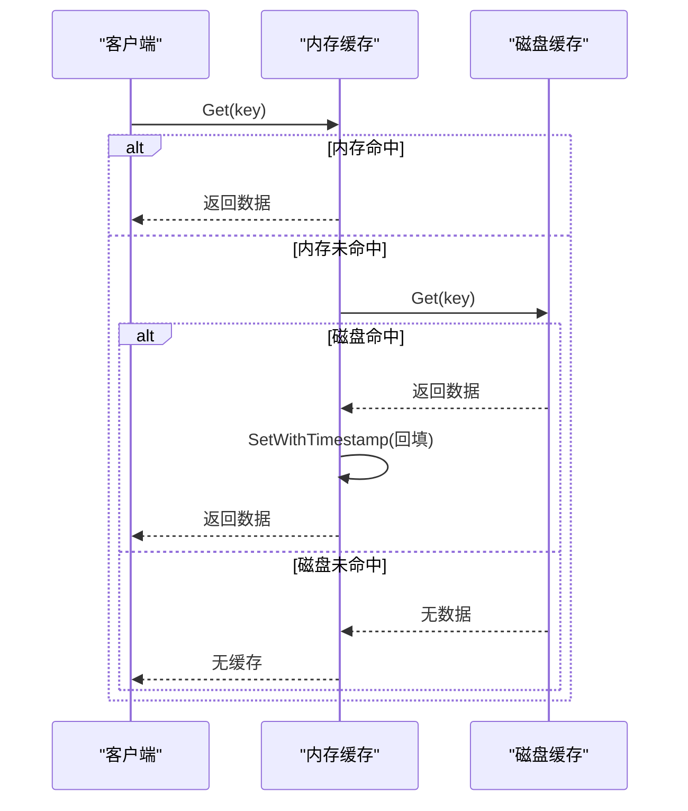
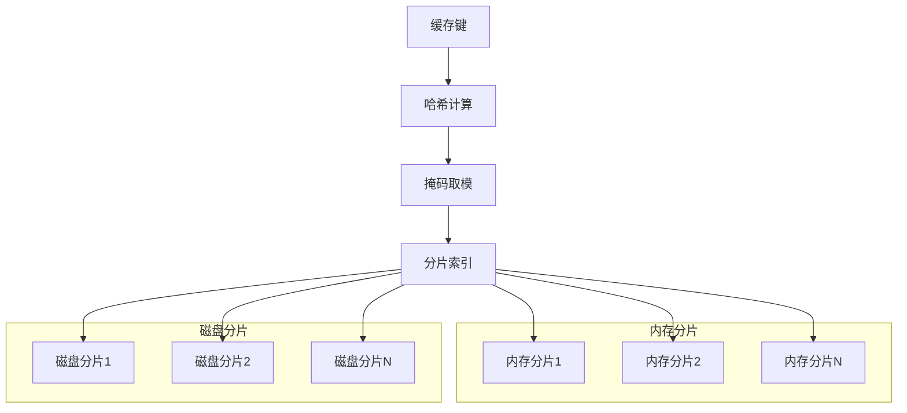

# 缓存机制

<cite>
**本文档引用文件**   
- [enhanced_two_level_cache.go](file://util/cache/enhanced_two_level_cache.go)
- [sharded_memory_cache.go](file://util/cache/sharded_memory_cache.go)
- [sharded_disk_cache.go](file://util/cache/sharded_disk_cache.go)
- [cache_key.go](file://util/cache/cache_key.go)
- [serializer.go](file://util/cache/serializer.go)
- [config.go](file://config/config.go)
</cite>

## 目录
1. [两级缓存架构概述](#两级缓存架构概述)
2. [读写流程与缓存策略](#读写流程与缓存策略)
3. [分片设计与并发性能](#分片设计与并发性能)
4. [缓存键生成与序列化机制](#缓存键生成与序列化机制)
5. [配置参数调整](#配置参数调整)
6. [缓存异常应对措施](#缓存异常应对措施)
7. [监控与性能优化](#监控与性能优化)

## 两级缓存架构概述

系统采用内存缓存与磁盘缓存协同工作的两级缓存架构，通过`EnhancedTwoLevelCache`结构体实现。该架构在`NewEnhancedTwoLevelCache`函数中初始化，内存缓存大小为磁盘缓存的60%，采用分片设计提升并发性能。内存缓存使用`ShardedMemoryCache`，磁盘缓存使用`ShardedDiskCache`，两者通过分片机制分散热点数据，避免单点竞争。内存缓存淘汰时会自动将未过期数据异步写入磁盘，实现数据保护。全局清理任务通过单例模式统一管理，每5分钟执行一次过期项清理。

```mermaid
graph TB
subgraph "两级缓存架构"
subgraph "内存缓存"
ShardedMemoryCache[分片内存缓存]
MemoryShard1[内存分片1]
MemoryShardN[内存分片N]
end
subgraph "磁盘缓存"
ShardedDiskCache[分片磁盘缓存]
DiskShard1[磁盘分片1]
DiskShardN[磁盘分片N]
end
Serializer[序列化器]
end
ShardedMemoryCache --> ShardedDiskCache : "淘汰时备份"
ShardedMemoryCache --> Serializer : "序列化/反序列化"
ShardedDiskCache --> Serializer : "序列化/反序列化"
```

**图示来源**
- [enhanced_two_level_cache.go](file://util/cache/enhanced_two_level_cache.go#L19-L44)
- [sharded_memory_cache.go](file://util/cache/sharded_memory_cache.go#L52-L84)
- [sharded_disk_cache.go](file://util/cache/sharded_disk_cache.go#L27-L41)

**本节来源**
- [enhanced_two_level_cache.go](file://util/cache/enhanced_two_level_cache.go#L1-L164)
- [sharded_memory_cache.go](file://util/cache/sharded_memory_cache.go#L1-L390)
- [sharded_disk_cache.go](file://util/cache/sharded_disk_cache.go#L1-L178)

## 读写流程与缓存策略

两级缓存的读写流程设计兼顾性能与数据一致性。读取操作优先检查内存缓存，命中则直接返回；未命中时尝试从磁盘缓存读取，若磁盘命中则将数据回填至内存缓存，实现缓存预热。写入操作提供多种策略：`Set`方法同步更新内存并异步写入磁盘，保证写入性能；`SetBothLevels`方法同步更新两级缓存，确保数据强一致性；`SetMemoryOnly`方法仅更新内存，适用于中间结果缓存。`SetWithFinalFlag`方法根据结果状态自动选择更新策略，最终结果写入两级缓存，中间结果仅写入内存。



**图示来源**
- [enhanced_two_level_cache.go](file://util/cache/enhanced_two_level_cache.go#L94-L113)
- [sharded_memory_cache.go](file://util/cache/sharded_memory_cache.go#L171-L194)
- [sharded_disk_cache.go](file://util/cache/sharded_disk_cache.go#L102-L105)

**本节来源**
- [enhanced_two_level_cache.go](file://util/cache/enhanced_two_level_cache.go#L47-L91)
- [sharded_memory_cache.go](file://util/cache/sharded_memory_cache.go#L114-L142)
- [sharded_disk_cache.go](file://util/cache/sharded_disk_cache.go#L96-L99)

## 分片设计与并发性能

内存缓存和磁盘缓存均采用分片设计提升并发性能。`ShardedMemoryCache`根据CPU核心数动态确定分片数量（4-64个），确保分片数为2的幂，使用掩码进行快速取模定位分片。每个分片独立的读写锁避免全局锁竞争，`Get`和`Set`操作通过原子操作更新最后使用时间，减少锁开销。`CleanExpired`清理过期项时并行处理所有分片，提升清理效率。磁盘缓存`ShardedDiskCache`分片数量为CPU核心数的2倍（4-32个），每个分片对应独立文件夹，避免文件系统单目录性能瓶颈。分片通过FNV哈希算法均匀分布键值，防止数据倾斜。



**图示来源**
- [sharded_memory_cache.go](file://util/cache/sharded_memory_cache.go#L40-L49)
- [sharded_disk_cache.go](file://util/cache/sharded_disk_cache.go#L12-L19)
- [sharded_memory_cache.go](file://util/cache/sharded_memory_cache.go#L90-L95)

**本节来源**
- [sharded_memory_cache.go](file://util/cache/sharded_memory_cache.go#L52-L84)
- [sharded_disk_cache.go](file://util/cache/sharded_disk_cache.go#L27-L41)
- [sharded_memory_cache.go](file://util/cache/sharded_memory_cache.go#L251-L272)

## 缓存键生成与序列化机制

缓存键生成通过`GenerateCacheKey`函数实现，综合关键词、频道列表、源类型和插件列表等参数。关键词标准化处理（转小写、去空格），频道和插件列表通过`getChannelsHash`和`getPluginsHash`函数计算哈希值。小型列表（少于5个元素）直接排序连接，大型列表计算MD5哈希，结果缓存于`sync.Map`避免重复计算。序列化机制采用Gob格式，`GobSerializer`通过`sync.Pool`管理缓冲区，减少内存分配开销。`init`函数预注册`model`包中的`SearchResult`、`SearchResponse`等类型，确保序列化正常工作。

```mermaid
flowchart TD
Start([生成缓存键]) --> Normalize["标准化关键词"]
Normalize --> HashChannels["计算频道列表哈希"]
HashChannels --> HashPlugins["计算插件列表哈希"]
HashPlugins --> BuildKey["构建键字符串"]
BuildKey --> MD5["计算MD5哈希"]
MD5 --> ReturnKey["返回缓存键"]
HashChannels --> |小型列表| SortJoin["排序并连接"]
HashChannels --> |大型列表| CalculateMD5["计算MD5哈希"]
HashChannels --> |缓存命中| ReturnFromCache["返回缓存结果"]
HashPlugins --> |小型列表| SortJoinP["排序并连接"]
HashPlugins --> |大型列表| CalculateMD5P["计算MD5哈希"]
HashPlugins --> |缓存命中| ReturnFromCacheP["返回缓存结果"]
```



**图示来源**
- [cache_key.go](file://util/cache/cache_key.go#L77-L103)
- [cache_key.go](file://util/cache/cache_key.go#L106-L142)
- [cache_key.go](file://util/cache/cache_key.go#L145-L207)

**本节来源**
- [cache_key.go](file://util/cache/cache_key.go#L1-L286)
- [serializer.go](file://util/cache/serializer.go#L1-L103)
- [cache_key.go](file://util/cache/cache_key.go#L261-L285)

## 配置参数调整

缓存参数通过`config.go`中的`Config`结构体配置，支持环境变量覆盖。`CacheEnabled`控制缓存开关，`CachePath`指定磁盘缓存路径（默认./cache），`CacheMaxSizeMB`设置总缓存大小（默认100MB），`CacheTTLMinutes`设置过期时间（默认60分钟）。内存缓存大小为总大小的60%，通过`NewEnhancedTwoLevelCache`函数计算。HTTP连接数`HTTPMaxConns`根据CPU核心数自动计算（核心数×200，最小1000），防止资源耗尽。GC百分比`GCPercent`默认50%，优化内存管理。配置通过`Init`函数初始化，环境变量未设置时使用默认值。

**本节来源**
- [config.go](file://config/config.go#L1-L516)
- [enhanced_two_level_cache.go](file://util/cache/enhanced_two_level_cache.go#L19-L44)
- [docs/系统开发设计文档.md](file://docs/系统开发设计文档.md#L450-L467)

## 缓存异常应对措施

系统通过多种机制应对缓存穿透、击穿和雪崩。缓存穿透通过业务层校验和布隆过滤器（未实现）预防，无效请求不进入缓存。缓存击穿通过`SetBothLevels`方法确保热点数据在两级缓存中同时存在，避免重建时的并发压力。缓存雪崩通过随机化过期时间（未显式实现）和分片设计分散风险。内存缓存淘汰时，`evictFromShard`方法检查数据是否过期，未过期则异步写入磁盘，防止有价值数据丢失。全局清理任务每5分钟清理过期项，避免内存泄漏。`FlushMemoryToDisk`方法可强制将内存缓存同步到磁盘，用于服务停止前的数据持久化。

**本节来源**
- [sharded_memory_cache.go](file://util/cache/sharded_memory_cache.go#L216-L248)
- [enhanced_two_level_cache.go](file://util/cache/enhanced_two_level_cache.go#L148-L164)
- [sharded_memory_cache.go](file://util/cache/sharded_memory_cache.go#L251-L272)

## 监控与性能优化

缓存命中率可通过`Get`方法的返回值统计，内存命中直接返回，磁盘命中需回填内存。性能优化建议：合理设置`CacheMaxSizeMB`避免内存溢出，调整`CacheTTLMinutes`平衡数据新鲜度与缓存效率。分片数量自动适配CPU核心数，无需手动调整。序列化使用Gob格式，性能优于JSON。异步写入磁盘避免阻塞主线程。监控`FlushMemoryToDisk`的执行情况，确保内存数据及时持久化。定期检查磁盘空间，避免缓存路径满导致写入失败。通过`GetAllItems`方法获取内存缓存全量数据，用于分析缓存使用情况。

**本节来源**
- [enhanced_two_level_cache.go](file://util/cache/enhanced_two_level_cache.go#L148-L164)
- [sharded_memory_cache.go](file://util/cache/sharded_memory_cache.go#L352-L389)
- [config.go](file://config/config.go#L1-L516)