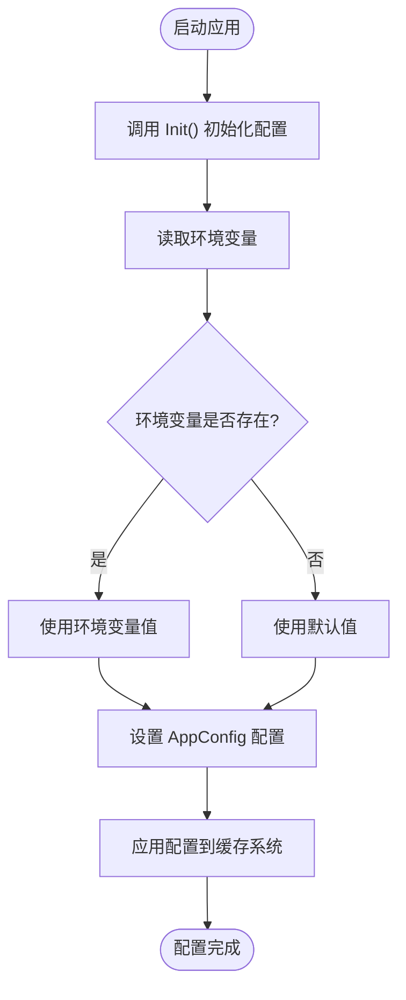
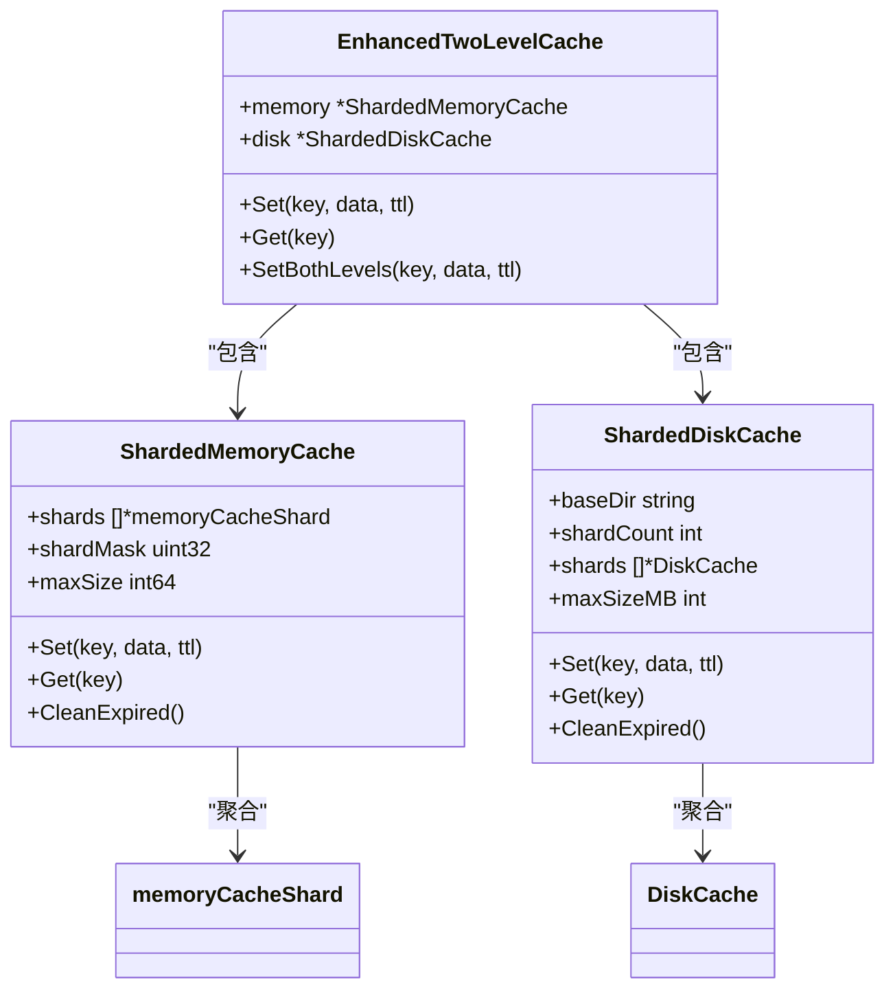

# 缓存配置管理

<cite>
**本文档引用文件**   
- [config.go](file://config/config.go)
- [sharded_memory_cache.go](file://util/cache/sharded_memory_cache.go)
- [sharded_disk_cache.go](file://util/cache/sharded_disk_cache.go)
- [enhanced_two_level_cache.go](file://util/cache/enhanced_two_level_cache.go)
</cite>

## 目录
1. [缓存配置项说明](#缓存配置项说明)
2. [配置方式](#配置方式)
3. [配置参数详解](#配置参数详解)
4. [分片机制](#分片机制)
5. [配置示例](#配置示例)
6. [不同环境推荐配置](#不同环境推荐配置)
7. [配置热加载能力](#配置热加载能力)

## 缓存配置项说明

本系统通过 `config.go` 文件中的 `Config` 结构体定义了缓存系统的核心配置参数。缓存系统采用两级缓存架构，包含内存缓存和磁盘缓存，通过配置文件或环境变量可灵活调整其行为。

**Section sources**
- [config.go](file://config/config.go#L20-L23)

## 配置方式

系统支持通过环境变量或默认值两种方式配置缓存参数。当环境变量未设置时，系统将使用默认值。所有配置在应用启动时通过 `Init()` 函数初始化，并存储在全局变量 `AppConfig` 中。



**Diagram sources**
- [config.go](file://config/config.go#L54-L98)
- [config.go](file://config/config.go#L51)

## 配置参数详解

### 缓存启用状态
- **配置项**: `CACHE_ENABLED`
- **类型**: 布尔值
- **默认值**: `true`
- **说明**: 控制是否启用缓存功能。设置为 `false` 或 `0` 表示禁用。

### 缓存路径
- **配置项**: `CACHE_PATH`
- **类型**: 字符串
- **默认值**: `./cache`
- **说明**: 指定磁盘缓存的存储路径。若未设置，将在当前目录下创建 `cache` 文件夹。

### 内存缓存大小
- **配置项**: `CACHE_MAX_SIZE`
- **类型**: 整数（MB）
- **默认值**: `100`
- **说明**: 设置缓存总大小（MB）。内存缓存大小为总大小的 60%，磁盘缓存使用剩余 40%。

### 过期时间（TTL）
- **配置项**: `CACHE_TTL`
- **类型**: 整数（分钟）
- **默认值**: `60`
- **说明**: 设置缓存项的过期时间（分钟）。超过此时间后，缓存项将被视为过期。

### 异步缓存有效期
- **配置项**: `ASYNC_CACHE_TTL_HOURS`
- **类型**: 整数（小时）
- **默认值**: `1`
- **说明**: 专门用于异步插件的缓存有效期（小时）。

**Section sources**
- [config.go](file://config/config.go#L197-L249)
- [config.go](file://config/config.go#L386-L430)

## 分片机制

缓存系统采用分片技术提升并发性能和数据分布均衡性。

### 内存缓存分片
- **分片数量**: 基于 CPU 核心数动态计算（`CPU核心数 * 2`），最小 4 个，最大 64 个。
- **实现**: `NewShardedMemoryCache` 函数创建分片内存缓存。
- **哈希算法**: 使用 FNV-1a 哈希算法计算键值，通过掩码快速定位分片。

### 磁盘缓存分片
- **分片数量**: 基于 CPU 核心数动态计算（`CPU核心数 * 2`），最小 4 个，最大 32 个。
- **实现**: `NewOptimizedShardedDiskCache` 函数创建优化的分片磁盘缓存。
- **目录结构**: 每个分片对应一个独立的子目录（如 `shard_0`, `shard_1`）。



**Diagram sources**
- [sharded_memory_cache.go](file://util/cache/sharded_memory_cache.go#L52-L84)
- [sharded_disk_cache.go](file://util/cache/sharded_disk_cache.go#L27-L41)
- [enhanced_two_level_cache.go](file://util/cache/enhanced_two_level_cache.go#L19-L44)

## 配置示例

### 基础配置示例
```bash
# 启用缓存，设置总大小为500MB，路径为/data/cache，TTL为120分钟
CACHE_ENABLED=true
CACHE_MAX_SIZE=500
CACHE_PATH=/data/cache
CACHE_TTL=120
```

### 高性能配置示例
```bash
# 大容量缓存配置
CACHE_ENABLED=true
CACHE_MAX_SIZE=2048
CACHE_PATH=/ssd/cache
CACHE_TTL=180
ASYNC_CACHE_TTL_HOURS=2
```

### 开发环境轻量配置
```bash
# 小容量缓存，便于测试
CACHE_ENABLED=true
CACHE_MAX_SIZE=50
CACHE_PATH=./tmp/cache
CACHE_TTL=30
```

**Section sources**
- [config.go](file://config/config.go#L197-L249)

## 不同环境推荐配置

### 开发环境
- **目标**: 快速迭代，节省资源
- **推荐配置**:
  - `CACHE_MAX_SIZE=50` (50MB)
  - `CACHE_TTL=30` (30分钟)
  - `CACHE_PATH=./tmp/cache`
  - `ASYNC_CACHE_TTL_HOURS=1`

### 测试环境
- **目标**: 模拟生产，稳定可靠
- **推荐配置**:
  - `CACHE_MAX_SIZE=500` (500MB)
  - `CACHE_TTL=60` (60分钟)
  - `CACHE_PATH=/test/cache`
  - `ASYNC_CACHE_TTL_HOURS=2`

### 生产环境
- **目标**: 高性能，高可用
- **推荐配置**:
  - `CACHE_MAX_SIZE=2048` (2GB) 或更高
  - `CACHE_TTL=120` (120分钟)
  - `CACHE_PATH=/data/cache` (SSD路径)
  - `ASYNC_CACHE_TTL_HOURS=4`
  - 确保有足够的磁盘空间和内存资源

## 配置热加载能力

根据代码分析，当前系统**不支持**配置热加载。

- **初始化时机**: 所有配置在应用启动时通过 `Init()` 函数一次性加载。
- **运行时行为**: 配置值存储在全局变量 `AppConfig` 中，运行时不会重新读取环境变量。
- **变更要求**: 修改配置后必须重启应用才能生效。

**限制说明**:
1. 缓存大小和路径变更需要重启，否则可能导致数据不一致。
2. TTL 变更需要重启，现有缓存项仍使用旧的过期时间。
3. 无动态重载机制，缺乏配置监听和重新初始化逻辑。

**Section sources**
- [config.go](file://config/config.go#L54-L98)
- [config.go](file://config/config.go#L51)