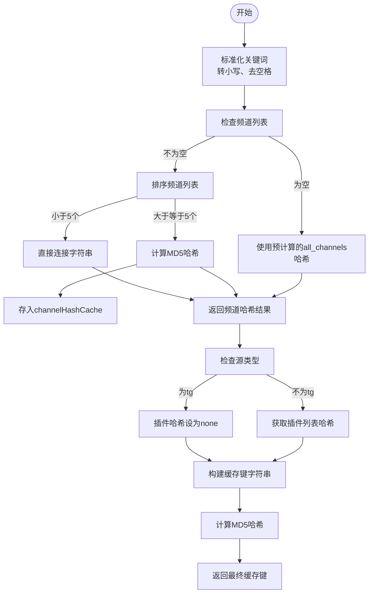
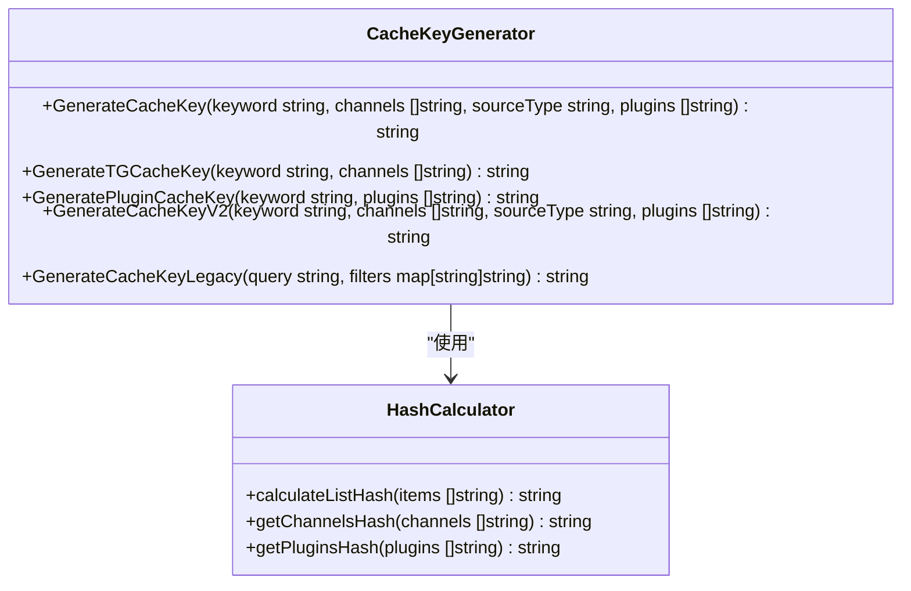
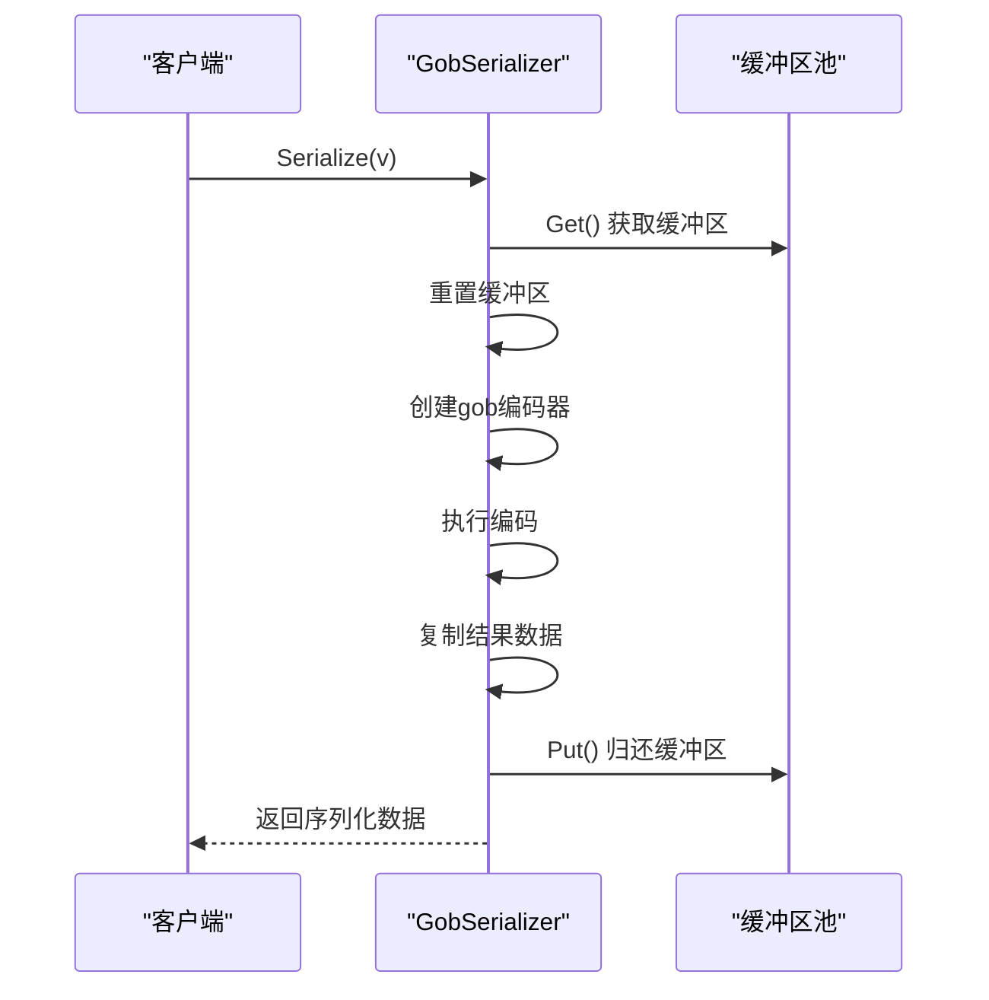
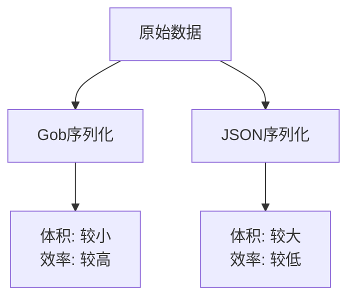
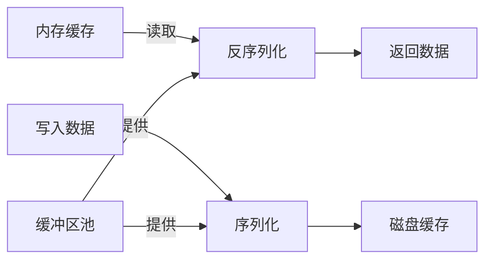
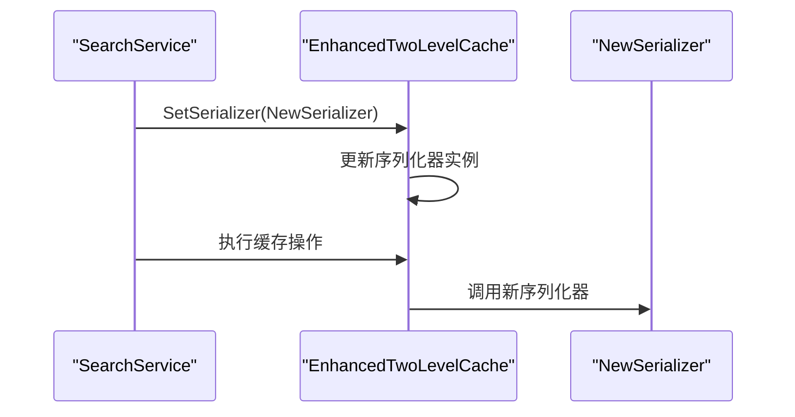

# 缓存键与序列化

<cite>
**本文档引用的文件**
- [cache_key.go](file://util/cache/cache_key.go)
- [serializer.go](file://util/cache/serializer.go)
- [enhanced_two_level_cache.go](file://util/cache/enhanced_two_level_cache.go)
- [delayed_batch_write_manager.go](file://util/cache/delayed_batch_write_manager.go)
- [response.go](file://model/response.go)
</cite>

## 目录
1. [引言](#引言)
2. [缓存键生成规则](#缓存键生成规则)
3. [序列化机制实现](#序列化机制实现)
4. [性能影响分析](#性能影响分析)
5. [自定义扩展指导](#自定义扩展指导)
6. [结论](#结论)

## 引言
本文档详细阐述了项目中缓存键的生成规则和序列化机制的实现。系统通过精心设计的缓存键生成策略，确保了缓存键的唯一性和可预测性，有效避免了键冲突。同时，采用高效的序列化机制，优化了缓存数据的存储和传输性能。这些设计共同构成了系统高性能缓存体系的核心。

## 缓存键生成规则

### 缓存键生成策略
系统采用多参数组合的缓存键生成策略，通过`GenerateCacheKey`函数将搜索关键词、频道列表、源类型和插件列表等参数组合生成唯一的缓存键。该策略确保了不同搜索条件产生不同的缓存键，避免了缓存冲突。



**Diagram sources**
- [cache_key.go](file://util/cache/cache_key.go#L77-L103)

**Section sources**
- [cache_key.go](file://util/cache/cache_key.go#L77-L103)

### 参数处理机制
系统对各个参数进行标准化处理，确保相同语义的参数生成相同的缓存键。关键词经过小写化和去除首尾空格处理；频道和插件列表经过排序处理，消除参数顺序对缓存键的影响；源类型为空时默认为"all"。



**Diagram sources**
- [cache_key.go](file://util/cache/cache_key.go#L77-L103)

**Section sources**
- [cache_key.go](file://util/cache/cache_key.go#L106-L207)

### 哈希优化策略
为了提高性能，系统实现了哈希值缓存机制。对于常用的频道列表和插件列表，系统预先计算其哈希值并缓存，避免重复计算。同时，对于小型列表（少于5个元素），直接使用排序后的字符串连接作为哈希，减少计算开销。

**Section sources**
- [cache_key.go](file://util/cache/cache_key.go#L1-L285)

## 序列化机制实现

### 序列化器设计
系统采用接口驱动的序列化器设计，定义了`Serializer`接口，支持多种序列化实现。当前主要使用`GobSerializer`，同时也保留了`JSONSerializer`以保持向后兼容性。

```mermaid
classDiagram
class Serializer {
<<interface>>
+Serialize(v interface{}) []byte
+Deserialize(data []byte, v interface{})
}
class GobSerializer {
-bufferPool sync.Pool
+Serialize(v interface{}) []byte
+Deserialize(data []byte, v interface{})
}
class JSONSerializer {
-bufferPool *sync.Pool
+Serialize(v interface{}) []byte
+Deserialize(data []byte, v interface{})
}
Serializer <|-- GobSerializer
Serializer <|-- JSONSerializer
```

**Diagram sources**
- [serializer.go](file://util/cache/serializer.go#L33-L36)

**Section sources**
- [serializer.go](file://util/cache/serializer.go#L33-L86)

### Gob序列化实现
`GobSerializer`使用Go语言内置的gob包进行序列化，具有较高的性能和紧凑的二进制格式。通过`sync.Pool`实现缓冲区对象池，减少了内存分配开销，提高了序列化性能。



**Diagram sources**
- [serializer.go](file://util/cache/serializer.go#L55-L68)

**Section sources**
- [serializer.go](file://util/cache/serializer.go#L55-L79)

### 类型注册机制
在初始化阶段，系统通过`init`函数注册了所有需要序列化的类型，包括`SearchResult`、`SearchResponse`、`MergedLinks`等模型类型，确保这些类型能够正确地进行序列化和反序列化。

**Section sources**
- [serializer.go](file://util/cache/serializer.go#L12-L31)

## 性能影响分析

### 缓存体积优化
Gob序列化格式相比JSON等文本格式更加紧凑，显著减少了缓存数据的存储空间。对于包含大量搜索结果的响应，这种体积优化效果尤为明显，有助于提高缓存命中率和降低存储成本。



**Diagram sources**
- [serializer.go](file://util/cache/serializer.go#L39-L41)

**Section sources**
- [serializer.go](file://util/cache/serializer.go#L55-L79)

### 读写性能评估
序列化和反序列化操作对缓存的读写性能有直接影响。`GobSerializer`通过缓冲区池减少了内存分配，提高了处理速度。在高并发场景下，这种优化能够显著降低GC压力，保持系统稳定。



**Diagram sources**
- [enhanced_two_level_cache.go](file://util/cache/enhanced_two_level_cache.go#L11-L16)

**Section sources**
- [enhanced_two_level_cache.go](file://util/cache/enhanced_two_level_cache.go#L55-L103)

### 缓存键生成开销
缓存键生成涉及字符串处理、排序和哈希计算等操作。系统通过预计算常用列表的哈希值、缓存已计算的哈希结果以及对小型列表采用轻量级处理策略，有效控制了键生成的开销。

**Section sources**
- [cache_key.go](file://util/cache/cache_key.go#L1-L285)

## 自定义扩展指导

### 自定义序列化器
开发者可以实现`Serializer`接口创建自定义序列化器。建议在实现时考虑使用对象池减少内存分配，并确保线程安全。

```mermaid
classDiagram
class CustomSerializer {
-customBufferPool sync.Pool
+Serialize(v interface{}) []byte
+Deserialize(data []byte, v interface{})
}
Serializer <|-- CustomSerializer
```

**Section sources**
- [serializer.go](file://util/cache/serializer.go#L33-L36)

### 序列化器替换
通过`EnhancedTwoLevelCache`的`SetSerializer`方法可以替换默认的序列化器，实现序列化策略的动态切换，便于性能测试和功能扩展。



**Diagram sources**
- [enhanced_two_level_cache.go](file://util/cache/enhanced_two_level_cache.go#L134-L138)

**Section sources**
- [enhanced_two_level_cache.go](file://util/cache/enhanced_two_level_cache.go#L134-L138)

## 结论
本文档详细分析了系统的缓存键生成规则和序列化机制。通过精心设计的缓存键策略，系统实现了高效、无冲突的缓存管理；通过优化的序列化实现，确保了缓存数据的高性能读写。这些设计共同支撑了系统的高并发、低延迟特性，为用户提供快速的搜索响应。未来可进一步优化序列化算法，探索更高效的二进制格式，持续提升系统性能。