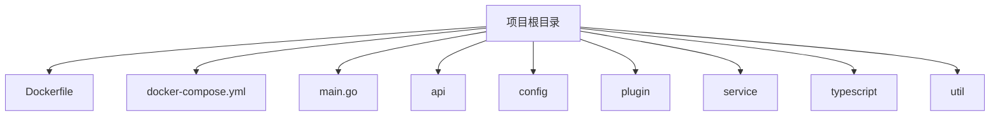
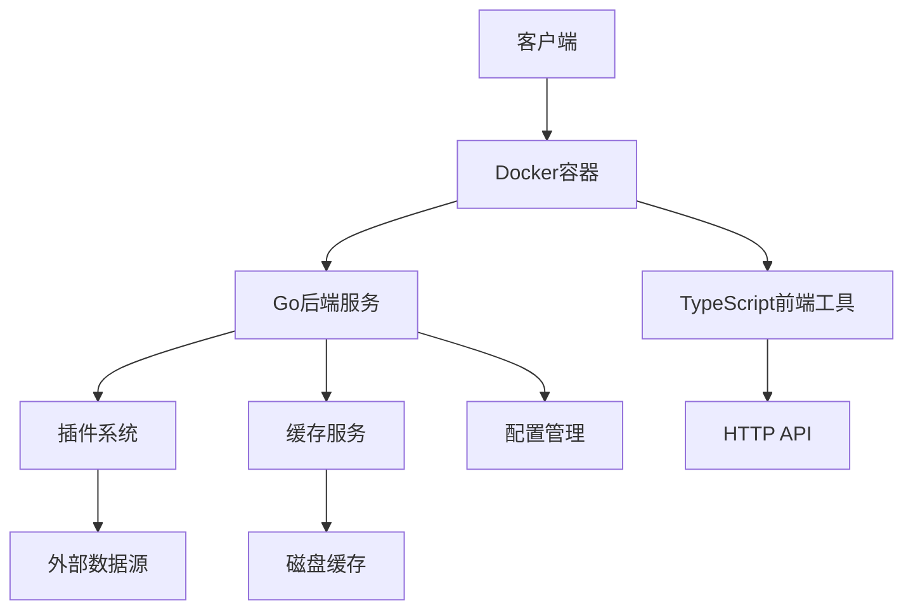
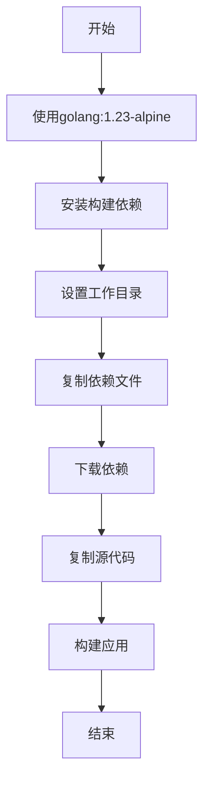
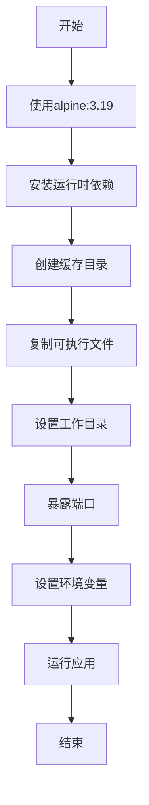
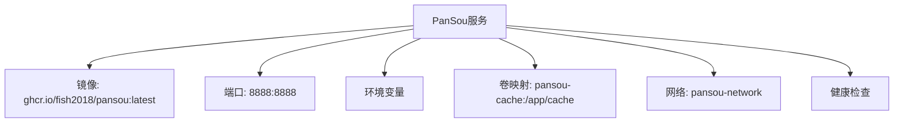
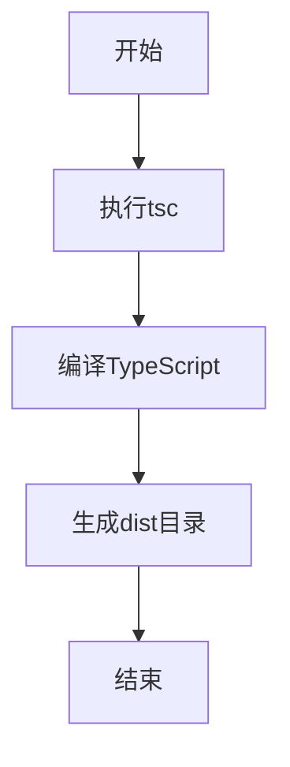
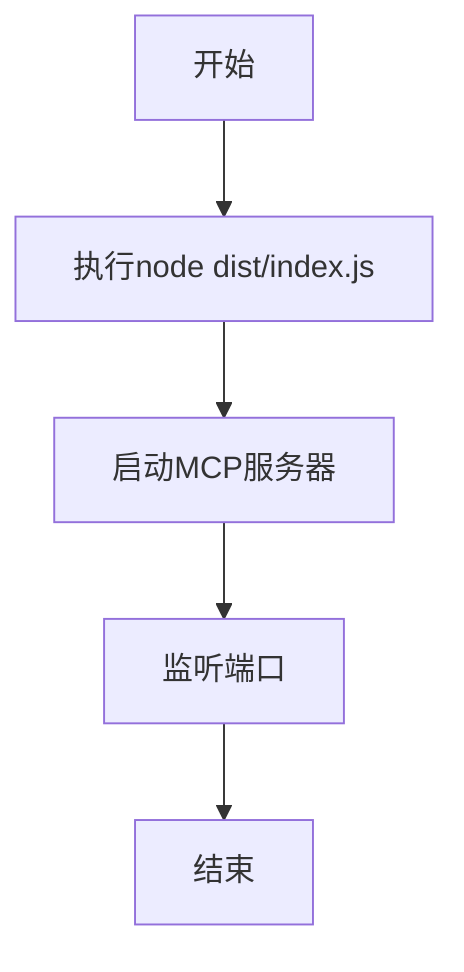
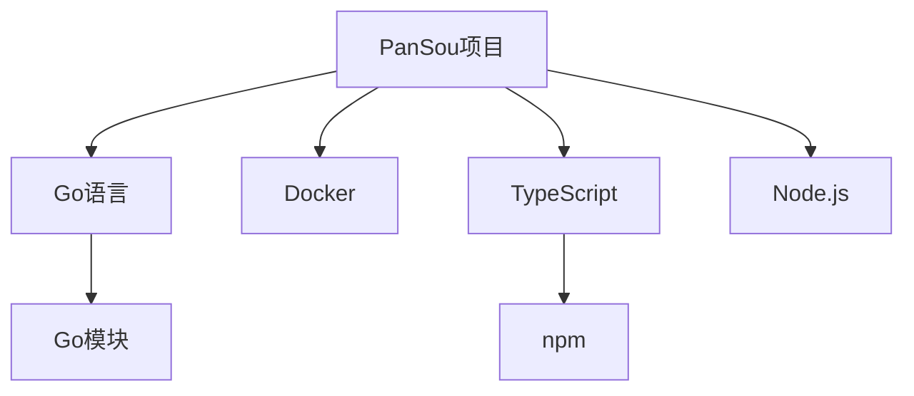

# 部署配置

<cite>
**本文档引用的文件**
- [Dockerfile](file://Dockerfile)
- [docker-compose.yml](file://docker-compose.yml)
- [package.json](file://typescript/package.json)
- [main.go](file://main.go)
- [config.go](file://config/config.go)
</cite>

## 目录
1. [简介](#简介)
2. [项目结构](#项目结构)
3. [核心组件](#核心组件)
4. [架构概述](#架构概述)
5. [详细组件分析](#详细组件分析)
6. [依赖分析](#依赖分析)
7. [性能考虑](#性能考虑)
8. [故障排除指南](#故障排除指南)
9. [结论](#结论)
10. [附录](#附录)（如需要）

## 简介
本文档旨在为PanSou项目提供全面的部署指南，涵盖Docker和Docker Compose两种主流部署方式。文档将深入解析Dockerfile中的每一层指令，说明镜像构建过程与优化策略（如多阶段构建）。同时，将解释docker-compose.yml中定义的服务编排，包括网络配置、卷映射和环境变量注入。此外，文档还将提供生产环境部署建议，如资源限制、日志收集、健康检查配置，并说明前端TypeScript工具的构建与集成方式（通过package.json脚本）。最后，将包含Kubernetes部署的初步建议。

## 项目结构
PanSou项目采用模块化设计，主要分为API、配置、模型、插件、服务、工具和TypeScript前端工具等模块。项目根目录下包含Dockerfile、docker-compose.yml、main.go等核心文件，支持Docker和Docker Compose部署。

**图示来源**
- [Dockerfile](file://Dockerfile#L1-L81)
- [docker-compose.yml](file://docker-compose.yml#L1-L51)
- [main.go](file://main.go#L1-L355)

**本节来源**
- [Dockerfile](file://Dockerfile#L1-L81)
- [docker-compose.yml](file://docker-compose.yml#L1-L51)
- [main.go](file://main.go#L1-L355)

## 核心组件
PanSou的核心组件包括API路由、插件管理、缓存服务和配置管理。API路由负责处理HTTP请求，插件管理负责加载和执行搜索插件，缓存服务负责数据缓存，配置管理负责加载和解析环境变量。

**本节来源**
- [main.go](file://main.go#L25-L100)
- [config.go](file://config/config.go#L15-L80)

## 架构概述
PanSou采用微服务架构，通过Docker容器化部署。后端服务由Go语言编写，前端工具由TypeScript编写。服务间通过HTTP API通信，数据通过缓存层进行优化。

**图示来源**
- [Dockerfile](file://Dockerfile#L1-L81)
- [docker-compose.yml](file://docker-compose.yml#L1-L51)
- [main.go](file://main.go#L1-L355)

## 详细组件分析
### Dockerfile分析
Dockerfile采用多阶段构建策略，分为构建阶段和运行阶段。构建阶段使用golang:1.23-alpine镜像，安装依赖并编译应用。运行阶段使用alpine:3.19镜像，复制编译后的可执行文件并设置环境变量。

#### 构建阶段

**图示来源**
- [Dockerfile](file://Dockerfile#L1-L42)

#### 运行阶段

**图示来源**
- [Dockerfile](file://Dockerfile#L43-L80)

**本节来源**
- [Dockerfile](file://Dockerfile#L1-L81)

### docker-compose.yml分析
docker-compose.yml定义了PanSou服务的编排，包括镜像、端口映射、环境变量、卷映射和健康检查。

#### 服务编排

**图示来源**
- [docker-compose.yml](file://docker-compose.yml#L1-L51)

#### 环境变量
| 环境变量 | 描述 | 默认值 |
|----------|------|--------|
| PORT | 服务端口 | 8888 |
| CHANNELS | 频道列表 | tgsearchers3 |
| ENABLED_PLUGINS | 启用的插件 | labi,zhizhen,shandian,duoduo,muou,wanou |
| CACHE_ENABLED | 缓存是否启用 | true |
| CACHE_PATH | 缓存路径 | /app/cache |
| CACHE_MAX_SIZE | 最大缓存大小(MB) | 100 |
| CACHE_TTL | 缓存有效期(分钟) | 60 |
| ASYNC_PLUGIN_ENABLED | 异步插件是否启用 | true |
| ASYNC_RESPONSE_TIMEOUT | 异步响应超时(秒) | 4 |
| ASYNC_MAX_BACKGROUND_WORKERS | 最大后台工作者数量 | CPU核心数×5 |
| ASYNC_MAX_BACKGROUND_TASKS | 最大后台任务数量 | 工作者数×5 |
| ASYNC_CACHE_TTL_HOURS | 异步缓存有效期(小时) | 1 |

**本节来源**
- [docker-compose.yml](file://docker-compose.yml#L1-L51)
- [config.go](file://config/config.go#L15-L80)

### TypeScript工具分析
TypeScript工具通过package.json脚本进行构建和启动，支持开发、测试和生产环境。

#### 构建脚本

**图示来源**
- [package.json](file://typescript/package.json#L1-L50)

#### 启动脚本

**图示来源**
- [package.json](file://typescript/package.json#L1-L50)

**本节来源**
- [package.json](file://typescript/package.json#L1-L50)
- [tsconfig.json](file://typescript/tsconfig.json#L1-L40)

## 依赖分析
PanSou项目依赖Go语言运行时、Docker容器化工具、TypeScript编译器和Node.js运行时。项目通过Go模块管理Go依赖，通过npm管理TypeScript依赖。

**图示来源**
- [go.mod](file://go.mod#L1-L10)
- [package-lock.json](file://typescript/package-lock.json#L1-L42)

**本节来源**
- [go.mod](file://go.mod#L1-L10)
- [package-lock.json](file://typescript/package-lock.json#L1-L42)

## 性能考虑
PanSou项目通过多阶段Docker构建、缓存优化、并发控制和资源限制来提升性能。建议在生产环境中根据实际负载调整并发数、缓存大小和连接数。

### 生产环境建议
- **资源限制**：根据服务器配置设置CPU和内存限制。
- **日志收集**：配置日志轮转和集中收集。
- **健康检查**：定期检查服务健康状态。
- **监控告警**：设置性能监控和告警规则。

[无来源，本节提供通用指导]

## 故障排除指南
### 常见问题
- **服务无法启动**：检查端口是否被占用，环境变量是否正确。
- **插件加载失败**：检查ENABLED_PLUGINS环境变量是否正确。
- **缓存写入失败**：检查CACHE_PATH目录权限。

**本节来源**
- [main.go](file://main.go#L25-L100)
- [config.go](file://config/config.go#L15-L80)

## 结论
PanSou项目通过Docker和Docker Compose提供了灵活的部署方式，支持多阶段构建和环境变量配置。项目结构清晰，组件职责明确，适合在生产环境中部署和维护。

[无来源，本节总结而不分析具体文件]

## 附录
### Kubernetes部署建议
- 使用Deployment管理Pod。
- 使用Service暴露服务。
- 使用ConfigMap管理配置。
- 使用PersistentVolume管理缓存数据。

[无来源，本节提供初步建议]