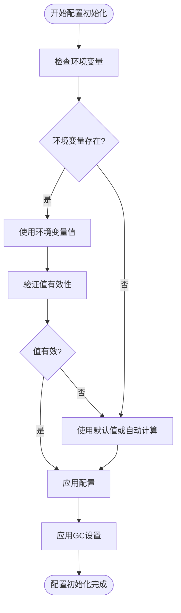

# 配置管理

<cite>
**本文档中引用的文件**  
- [config.go](file://config/config.go)
- [mcp-config.json](file://mcp-config.json)
</cite>

## 目录
1. [简介](#简介)
2. [配置结构与可配置项](#配置结构与可配置项)
3. [配置加载机制与优先级](#配置加载机制与优先级)
4. [MCP集成配置：mcp-config.json详解](#mcp集成配置：mcp-config.json详解)
5. [环境变量与默认值](#环境变量与默认值)
6. [生产与开发环境最佳实践](#生产与开发环境最佳实践)
7. [动态配置更新支持](#动态配置更新支持)

## 简介
本项目通过 `config.go` 中的 `Config` 结构体统一管理所有运行时参数，支持通过环境变量灵活调整系统行为。配置系统涵盖服务器端口、超时设置、并发控制、缓存策略、代理配置等多个维度，并在启动时自动初始化。此外，`mcp-config.json` 文件用于支持 MCP（Model Control Protocol）集成场景下的外部配置管理。

**Section sources**
- [config.go](file://config/config.go#L14-L98)

## 配置结构与可配置项
`Config` 结构体定义了系统所有可配置参数，涵盖以下核心类别：

### 服务器与网络配置
| 配置项 | 类型 | 说明 | 合理取值范围 |
|-------|------|------|-------------|
| Port | string | HTTP服务监听端口 | 1024-65535（避免特权端口） |
| HTTPReadTimeout | time.Duration | HTTP读取超时时间 | 10-120秒 |
| HTTPWriteTimeout | time.Duration | HTTP写入超时时间 | 30-180秒 |
| HTTPIdleTimeout | time.Duration | HTTP空闲连接超时 | 60-300秒 |
| HTTPMaxConns | int | 最大HTTP连接数 | 1000+（根据CPU核心数自动计算） |

### 并发与异步处理
| 配置项 | 类型 | 说明 | 合理取值范围 |
|-------|------|------|-------------|
| DefaultConcurrency | int | 默认并发请求数 | ≥1（自动基于频道和插件数计算） |
| AsyncPluginEnabled | bool | 是否启用异步插件系统 | true/false |
| AsyncMaxBackgroundWorkers | int | 异步后台工作者最大数量 | ≥20（默认按CPU核心×5计算） |
| AsyncMaxBackgroundTasks | int | 异步任务队列最大长度 | ≥100（默认为工作者数×5） |

### 缓存策略
| 配置项 | 类型 | 说明 | 合理取值范围 |
|-------|------|------|-------------|
| CacheEnabled | bool | 是否启用磁盘缓存 | true/false |
| CachePath | string | 缓存文件存储路径 | 有效文件系统路径 |
| CacheMaxSizeMB | int | 缓存最大大小（MB） | 50-1024（建议100-500） |
| CacheTTLMinutes | int | 缓存有效期（分钟） | 10-1440（1天） |
| AsyncCacheTTLHours | int | 异步结果缓存有效期（小时） | 1-24 |

### 插件与代理配置
| 配置项 | 类型 | 说明 | 合理取值范围 |
|-------|------|------|-------------|
| PluginTimeoutSeconds | int | 插件执行超时时间（秒） | 10-60 |
| ProxyURL | string | SOCKS5代理地址 | 有效URL格式（如 socks5://host:port） |
| UseProxy | bool | 是否使用代理 | true/false |
| EnabledPlugins | []string | 启用的插件列表 | 插件名称逗号分隔 |

### 性能与内存优化
| 配置项 | 类型 | 说明 | 合理取值范围 |
|-------|------|------|-------------|
| GCPercent | int | Go GC触发百分比 | 25-100（默认50） |
| OptimizeMemory | bool | 是否启用内存优化（主动释放） | true/false |
| EnableCompression | bool | 是否启用响应压缩 | true/false（通常由反向代理处理） |
| MinSizeToCompress | int | 启用压缩的最小响应大小（字节） | 512-4096 |

**Section sources**
- [config.go](file://config/config.go#L14-L98)

## 配置加载机制与优先级
系统采用“环境变量覆盖默认值”的原则进行配置加载：

1. **初始化流程**：在 `Init()` 函数中，逐项调用 `getXXX()` 方法获取配置。
2. **优先级规则**：
   - 若环境变量存在且有效，则使用环境变量值。
   - 若环境变量未设置或无效，则使用内置默认值。
   - 部分配置（如 `HTTPMaxConns`、`AsyncMaxBackgroundWorkers`）支持自动计算，基于CPU核心数动态调整。
3. **依赖计算**：`DefaultConcurrency` 的默认值依赖于 `CHANNELS` 和 `PLUGIN_COUNT` 环境变量，计算公式为：`频道数 + 插件数 + 10`。



**Diagram sources**
- [config.go](file://config/config.go#L54-L98)
- [config.go](file://config/config.go#L110-L145)

**Section sources**
- [config.go](file://config/config.go#L54-L98)
- [config.go](file://config/config.go#L110-L145)

## MCP集成配置：mcp-config.json详解
`mcp-config.json` 是专为 MCP 集成设计的配置文件，用于在外部系统（如AI模型平台）中声明服务启动参数和环境变量。

### 文件结构
```json
{
  "mcpServers": {
    "pansou": {
      "command": "node",
      "args": ["path/to/index.js"],
      "env": {
        "PANSOU_SERVER_URL": "http://localhost:8888",
        "REQUEST_TIMEOUT": "60",
        "MAX_RESULTS": "50",
        "DEFAULT_CLOUD_TYPES": "baidu,aliyun,...",
        "AUTO_START_BACKEND": "true",
        "DOCKER_MODE": "true",
        "ENABLED_PLUGINS": "labi,zhizhen,..."
      }
    }
  },
  "_comments": { ... }
}
```

### 关键字段说明
| 字段 | 说明 |
|------|------|
| PANSOU_SERVER_URL | 后端服务地址，前端或MCP客户端通过此地址通信 |
| REQUEST_TIMEOUT | HTTP请求超时时间（秒） |
| MAX_RESULTS | 单次搜索返回的最大结果数 |
| DEFAULT_CLOUD_TYPES | 默认搜索的网盘类型列表 |
| AUTO_START_BACKEND | 是否自动启动后端服务 |
| DOCKER_MODE | 是否以Docker模式运行 |
| ENABLED_PLUGINS | 指定启用的插件列表（必须显式声明） |

该文件允许在不修改代码的情况下，通过外部配置控制服务行为，特别适用于容器化部署和AI集成场景。

**Section sources**
- [mcp-config.json](file://mcp-config.json#L1-L57)

## 环境变量与默认值
以下是主要环境变量及其默认值的完整映射表：

| 环境变量 | 默认值 | 说明 |
|---------|--------|------|
| PORT | 8888 | 服务监听端口 |
| CHANNELS | tgsearchers3 | 默认搜索频道 |
| CONCURRENCY | 动态计算 | 并发请求数 |
| PROXY | 无 | SOCKS5代理地址 |
| CACHE_ENABLED | true | 是否启用缓存 |
| CACHE_PATH | ./cache | 缓存目录路径 |
| CACHE_MAX_SIZE | 100 | 缓存最大大小（MB） |
| CACHE_TTL | 60 | 缓存有效期（分钟） |
| ENABLE_COMPRESSION | false | 是否启用响应压缩 |
| MIN_SIZE_TO_COMPRESS | 1024 | 最小压缩大小（字节） |
| GC_PERCENT | 50 | GC触发阈值 |
| OPTIMIZE_MEMORY | true | 是否启用内存优化 |
| PLUGIN_TIMEOUT | 30 | 插件超时时间（秒） |
| ASYNC_PLUGIN_ENABLED | true | 是否启用异步插件 |
| ASYNC_RESPONSE_TIMEOUT | 4 | 异步响应超时（秒） |
| ASYNC_CACHE_TTL_HOURS | 1 | 异步缓存有效期（小时） |
| ASYNC_LOG_ENABLED | true | 是否启用异步日志 |
| HTTP_READ_TIMEOUT | 自动计算 | HTTP读取超时 |
| HTTP_WRITE_TIMEOUT | 自动计算 | HTTP写入超时 |
| HTTP_IDLE_TIMEOUT | 120 | HTTP空闲超时（秒） |
| HTTP_MAX_CONNS | 自动计算 | 最大HTTP连接数 |

**Section sources**
- [config.go](file://config/config.go#L174-L488)

## 生产与开发环境最佳实践

### 开发环境建议
- **启用详细日志**：设置 `ASYNC_LOG_ENABLED=true` 便于调试。
- **缩短缓存时间**：将 `CACHE_TTL=10`，`ASYNC_CACHE_TTL_HOURS=1`，确保快速看到变更效果。
- **禁用压缩**：保持 `ENABLE_COMPRESSION=false`，由本地开发服务器处理。
- **使用默认端口**：保持 `PORT=8888`，便于前后端联调。

### 生产环境建议
- **合理设置并发**：根据服务器CPU核心数调整 `ASYNC_MAX_BACKGROUND_WORKERS`（建议 CPU核心×5）。
- **增大缓存容量**：设置 `CACHE_MAX_SIZE=500` 或更高，提升响应性能。
- **延长缓存有效期**：`CACHE_TTL=1440`（24小时），减少重复请求。
- **启用GC优化**：保持 `GC_PERCENT=50`，平衡内存使用与性能。
- **限制最大连接数**：设置 `HTTP_MAX_CONNS` 防止单机过载。
- **使用反向代理压缩**：保持 `ENABLE_COMPRESSION=false`，由Nginx等处理GZIP。

### 安全建议
- **避免硬编码代理**：生产环境慎用 `PROXY`，防止流量泄露。
- **限制插件范围**：通过 `ENABLED_PLUGINS` 显式声明所需插件，减少攻击面。
- **关闭调试日志**：生产环境设置 `ASYNC_LOG_ENABLED=false` 减少日志输出。

**Section sources**
- [config.go](file://config/config.go#L344-L364)
- [config.go](file://config/config.go#L211-L221)
- [config.go](file://config/config.go#L224-L234)

## 动态配置更新支持
当前系统**不支持运行时动态配置更新**。所有配置在应用启动时通过 `Init()` 函数一次性加载并固化到 `AppConfig` 全局变量中。

若需变更配置，必须重启服务以重新读取环境变量。对于需要动态调整的场景（如灰度发布、A/B测试），建议通过以下方式实现：
1. **外部配置中心**：结合Consul、etcd等工具，在应用层实现配置监听与热更新。
2. **信号触发重载**：捕获 `SIGHUP` 等信号，重新加载配置（需自行扩展）。
3. **健康检查与滚动更新**：在Kubernetes等编排系统中，通过滚动更新实现配置变更。

未来可通过引入配置监听机制（如 `fsnotify` 监听配置文件变化）来增强动态更新能力。

**Section sources**
- [config.go](file://config/config.go#L51)
- [config.go](file://config/config.go#L54-L98)