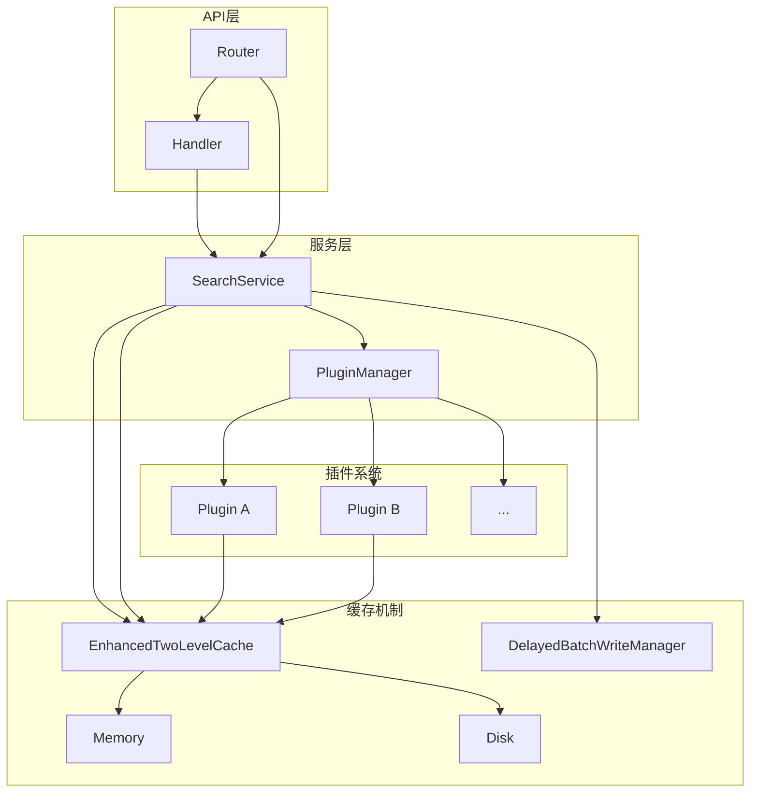
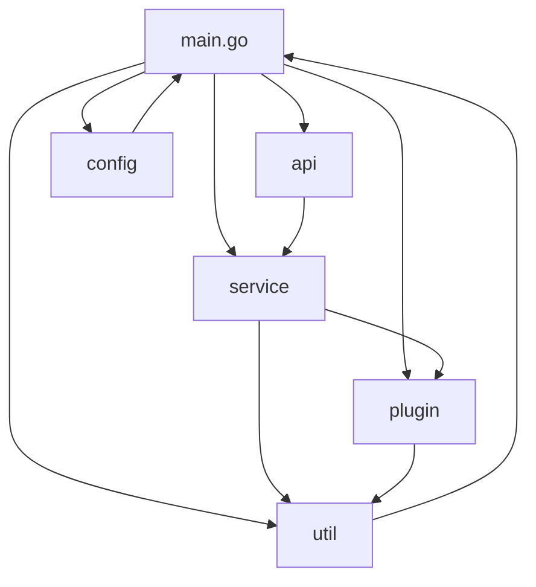

# 项目概述

<cite>
**本文档引用文件**   
- [main.go](file://main.go)
- [README.md](file://README.md)
- [api/router.go](file://api/router.go)
- [api/handler.go](file://api/handler.go)
- [service/search_service.go](file://service/search_service.go)
- [plugin/plugin.go](file://plugin/plugin.go)
- [config/config.go](file://config/config.go)
- [util/cache/enhanced_two_level_cache.go](file://util/cache/enhanced_two_level_cache.go)
- [util/cache/delayed_batch_write_manager.go](file://util/cache/delayed_batch_write_manager.go)
- [util/cache/global_buffer_manager.go](file://util/cache/global_buffer_manager.go)
- [model/request.go](file://model/request.go)
- [model/response.go](file://model/response.go)
</cite>

## 目录
1. [引言](#引言)
2. [核心定位与目标](#核心定位与目标)
3. [系统架构风格](#系统架构风格)
4. [主要组件与协作](#主要组件与协作)
5. [分层架构设计](#分层架构设计)
6. [典型使用场景](#典型使用场景)
7. [学习路径指引](#学习路径指引)

## 引言

PanSou 是一个高性能的聚合网盘搜索API服务，旨在为用户提供高效、智能的资源发现能力。该项目通过统一的API接口，聚合来自Telegram频道及多个第三方网站的搜索结果，解决了用户在不同平台间切换搜索的痛点。系统设计以性能和可扩展性为核心，支持并发搜索、结果智能排序和网盘类型分类。本概述文档将深入解析其微内核+插件扩展的架构风格，阐述各主要组件的协作方式，并为不同层次的开发者提供清晰的学习路径。

**Section sources**
- [README.md](file://README.md#L1-L20)

## 核心定位与目标

PanSou的核心定位是成为一个高性能、可扩展的聚合搜索网关。其主要目标是整合分散在Telegram频道和众多第三方网站中的网盘资源，为用户提供一个统一、高效的搜索入口。通过一个API调用，用户即可获取来自多个来源的结构化搜索结果，极大地提升了资源发现的效率。

项目的关键目标包括：
- **聚合搜索**：将TG频道和自定义插件的搜索结果进行统一聚合。
- **性能优化**：通过并发执行和二级缓存机制，显著提升搜索速度和响应性能。
- **智能排序**：基于插件等级、时间新鲜度和优先关键词对结果进行多维度综合排序。
- **可扩展性**：通过异步插件系统，允许开发者轻松添加新的搜索来源，而无需修改核心代码。

**Section sources**
- [README.md](file://README.md#L1-L30)

## 系统架构风格

PanSou采用了“微内核+插件扩展”的架构风格。在这种模式下，系统被划分为一个精简的核心内核和一系列可插拔的扩展模块。

- **微内核（Microkernel）**：核心内核负责处理最基础、最通用的功能，如API路由、请求处理、配置管理、缓存协调和搜索调度。它不直接处理具体的搜索逻辑，而是作为调度中心，协调各个插件的工作。`main.go` 和 `service` 包构成了这个微内核。
- **插件扩展（Plugin Extension）**：所有具体的搜索功能都被实现为独立的插件。每个插件（如 `plugin/labi`、`plugin/zhizhen`）都实现了统一的 `AsyncSearchPlugin` 接口，负责与特定的第三方网站进行交互。这种设计使得系统功能的扩展变得非常简单，只需添加一个新的插件即可，完全解耦了核心逻辑与业务逻辑。

这种架构风格带来了极高的灵活性和可维护性，是PanSou能够支持数十个不同搜索源的关键。

**Section sources**
- [main.go](file://main.go#L1-L50)
- [plugin/plugin.go](file://plugin/plugin.go#L1-L20)

## 主要组件与协作

PanSou的系统由多个核心组件构成，它们协同工作以完成搜索任务。



**Diagram sources**
- [api/router.go](file://api/router.go#L1-L20)
- [api/handler.go](file://api/handler.go#L1-L30)
- [service/search_service.go](file://service/search_service.go#L1-L50)
- [plugin/plugin.go](file://plugin/plugin.go#L1-L20)
- [util/cache/enhanced_two_level_cache.go](file://util/cache/enhanced_two_level_cache.go#L1-L20)
- [util/cache/delayed_batch_write_manager.go](file://util/cache/delayed_batch_write_manager.go#L1-L20)

### API层
API层是系统的入口，由 `api/router.go` 和 `api/handler.go` 组成。`Router` 负责定义 `/api/search` 和 `/api/health` 等路由。`Handler` 负责解析HTTP请求，无论是GET还是POST，都将参数统一转换为 `model.SearchRequest` 结构体，然后调用 `SearchService` 进行搜索。

### 服务层
`service/search_service.go` 中的 `SearchService` 是系统的核心调度器。它接收来自API层的请求，根据请求中的 `channels` 和 `plugins` 参数，决定是搜索TG频道还是调用插件。它通过 `PluginManager` 来管理和调用所有已注册的插件。

### 插件系统
`plugin/plugin.go` 定义了 `AsyncSearchPlugin` 接口，所有插件都必须实现此接口。`main.go` 文件通过空导入（blank import）的方式，触发每个插件包的 `init` 函数，从而将插件自动注册到全局注册表中。`PluginManager` 负责根据配置（`ENABLED_PLUGINS`）筛选并管理这些插件。

### 缓存机制
系统采用了分片的两级缓存机制。`EnhancedTwoLevelCache` 提供了内存和磁盘的双重缓存。`DelayedBatchWriteManager` 负责智能地将内存中的缓存更新异步、批量地写入磁盘，以平衡性能和数据持久性。`GlobalBufferManager` 进一步优化了写入过程，通过按插件或关键词分组，实现了操作合并，减少了磁盘I/O。

**Section sources**
- [api/router.go](file://api/router.go#L1-L70)
- [api/handler.go](file://api/handler.go#L1-L207)
- [service/search_service.go](file://service/search_service.go#L1-L799)
- [plugin/plugin.go](file://plugin/plugin.go#L1-L176)
- [util/cache/enhanced_two_level_cache.go](file://util/cache/enhanced_two_level_cache.go#L1-L165)
- [util/cache/delayed_batch_write_manager.go](file://util/cache/delayed_batch_write_manager.go#L1-L799)
- [util/cache/global_buffer_manager.go](file://util/cache/global_buffer_manager.go#L1-L505)

## 分层架构设计

PanSou的代码结构清晰地体现了分层架构的设计原则，各层职责分明，依赖关系清晰。



**Diagram sources**
- [main.go](file://main.go#L1-L356)
- [config/config.go](file://config/config.go#L1-L516)

- **main.go**：应用的入口点，负责初始化配置、HTTP客户端、缓存和插件系统，并启动HTTP服务器。
- **api**：处理HTTP请求和响应，将外部请求转换为内部数据结构，并调用服务层。
- **service**：包含核心业务逻辑，如搜索调度、结果合并和排序。它依赖于 `plugin` 和 `util` 包。
- **plugin**：存放所有具体的搜索插件，每个插件独立实现搜索逻辑。
- **config**：集中管理所有环境变量和配置项，为整个应用提供配置服务。
- **util**：提供通用的工具函数，如HTTP工具、JSON处理、缓存工具等，被其他所有层所依赖。

这种分层设计确保了代码的高内聚、低耦合，使得系统易于理解和维护。

**Section sources**
- [main.go](file://main.go#L1-L356)
- [config/config.go](file://config/config.go#L1-L516)

## 典型使用场景

一个典型的使用场景是用户发起一次跨平台搜索请求。

1.  **发起请求**：用户通过HTTP客户端向 `/api/search` 发起一个POST请求，请求体为 `{ "kw": "速度与激情" }`。
2.  **API处理**：`Handler` 解析请求，创建 `SearchRequest` 对象，并调用 `SearchService.Search` 方法。
3.  **并发搜索**：`SearchService` 同时启动对TG频道（如 `tgsearchers3`）的搜索和对所有启用插件（如 `labi`, `zhizhen`）的异步搜索。
4.  **结果聚合**：当各个搜索源返回结果后，`SearchService` 将它们合并，并根据时间、关键词和插件等级进行智能排序。
5.  **结果分组**：系统将合并后的结果按网盘类型（百度、阿里云等）进行分组，形成 `merged_by_type` 结构。
6.  **返回响应**：最终，一个包含 `total`、`results` 和 `merged_by_type` 的JSON响应被返回给用户。

```json
{
  "total": 15,
  "merged_by_type": {
    "baidu": [
      {
        "url": "https://pan.baidu.com/s/1abcdef",
        "password": "1234",
        "note": "速度与激情全集1-10",
        "datetime": "2023-06-10T14:23:45Z",
        "source": "tg:tgsearchers3"
      }
    ],
    "quark": [
      {
        "url": "https://pan.quark.cn/s/xxxx",
        "password": "",
        "note": "凡人修仙传",
        "datetime": "2023-06-10T15:30:22Z",
        "source": "plugin:labi"
      }
    ]
  }
}
```

**Section sources**
- [README.md](file://README.md#L200-L300)
- [model/response.go](file://model/response.go#L1-L67)

## 学习路径指引

对于不同层次的开发者，PanSou提供了清晰的学习路径。

- **初学者**：建议从 `README.md` 开始，了解项目的快速部署方法和API文档。然后阅读 `api/handler.go`，理解请求是如何被接收和处理的。最后，查看一个简单的插件（如 `plugin/ouge/ouge.go`），了解插件的基本结构。
- **高级开发者**：应深入研究 `service/search_service.go` 中的搜索调度和结果合并逻辑。分析 `util/cache` 包下的缓存机制，理解其如何实现高性能。最后，探索 `baseasyncplugin.go`，掌握异步插件的高级特性，如工作池和缓存更新策略，以开发更复杂的插件。

**Section sources**
- [README.md](file://README.md#L1-L407)
- [api/handler.go](file://api/handler.go#L1-L207)
- [service/search_service.go](file://service/search_service.go#L1-L799)
- [util/cache/enhanced_two_level_cache.go](file://util/cache/enhanced_two_level_cache.go#L1-L165)
- [plugin/baseasyncplugin.go](file://plugin/baseasyncplugin.go#L1-L799)